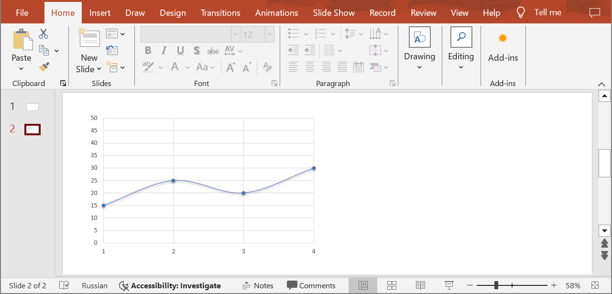
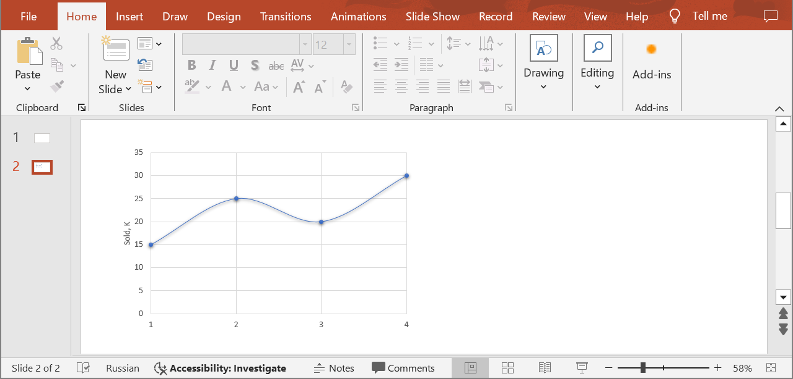

## **Introduction**

You can create various types of charts such as column charts, line charts, waterfall charts, etc. Each of them has its axes that help interpret the data. The horizontal axis typically displays categories or time periods. The Vertical axis displays data values or numerical indicators. Some charts may have a third axis, for instance, to display additional information or compare data. Use the following method to customize the axes, add labels, adjust scales, and apply other settings.

## **SetChartAxis**

### **API Information**

|**API**|**Type**|**Description**|**Resource**|
| :- | :- | :- | :- |
|/slides/{name}/slides/{slideIndex}/shapes/{shapeIndex}/{axisType}|PUT|Updates the chart axis properties in a presentation saved in a storage.|[SetChartAxis](https://reference.aspose.cloud/slides/#/Chart/SetChartAxis)|

**Request Parameters**

|**Name**|**Type**|**Location**|**Required**|**Description**|
| :- | :- | :- | :- | :- |
|name|string|path|true|The name of a presentation file.|
|slideIndex|integer|path|true|The 1-based index of a slide.|
|shapeIndex|integer|path|true|The 1-based index of a shape (must be a chart).|
|axisType|`AxisType`|path|true|The type of an axis.|
|axis|`Axis`|body|true|The data transfer object with the axis parameters.|
|password|string|header|false|The password to open the presentation.|
|folder|string|query|false|The path to the folder containing the presentation file.|
|storage|string|query|false|The name of the storage contaning the folder.|

### **Examples**

The document **MyPresentation.pptx** saved in the **default** storage contains a chart (the **first** shape) on the **second** slide that displays the number of items sold for quarters 1 through 4. Apply the following settings for the vertical axis:
- show the axis title
- set the maximum value to 35



**cURL Solution**





**Get an Access Token**

```sh
curl POST "https://api.aspose.cloud/connect/token" \
     -d "grant_type=client_credentials&client_id=MyClientId&client_secret=MyClientSecret" \
     -H "Content-Type: application/x-www-form-urlencoded"
```

**Update the Vertical Axis**

```sh
curl -X PUT "https://api.aspose.cloud/v3.0/slides/MyPresentation.pptx/slides/2/shapes/1/VerticalAxis" \
     -H "authorization: Bearer MyAccessToken" \
     -H "Content-Type: application/json" \
     -d @VerticalAxis.json
```

VerticalAxis.json
```json
{
  "HasTitle": true,
  "IsAutomaticMaxValue": false,
  "MaxValue": 35
}
```





**Response Example**

```json
{
  "hasTitle": true,
  "position": "Left",
  "majorTickMark": "None",
  "isAutomaticMaxValue": false,
  "maxValue": 35,
  "axisBetweenCategories": false,
  "tickLabelRotationAngle": -1000,
  "fillFormat": {
    "type": "NoFill"
  },
  "lineFormat": {
    "fillFormat": {
      "type": "NoFill"
    }
  },
  "majorGridLinesFormat": {
    "lineFormat": {
      "alignment": "Center",
      "capStyle": "Flat",
      "joinStyle": "Round",
      "style": "Single",
      "fillFormat": {
        "type": "Solid",
        "color": "#FFD9D9D9"
      },
      "width": 0.75
    }
  },
  "minorGridLinesFormat": {
    "lineFormat": {
      "fillFormat": {
        "type": "NoFill"
      }
    }
  }
}
```





**SDK Solutions**





```cs
using System;

using Aspose.Slides.Cloud.Sdk;
using Aspose.Slides.Cloud.Sdk.Model;

class Application
{
    static void Main(string[] args)
    {
        SlidesApi slidesApi = new SlidesApi("MyClientId", "MyClientSecret");

        string fileName = "MyPresentation.pptx";
        int slideIndex = 2;
        int shapeIndex = 1;
        AxisType axisType = AxisType.VerticalAxis;

        Axis axis = new Axis
        {
            HasTitle = true,
            IsAutomaticMaxValue = false,
            MaxValue = 35
        };

        Axis updatedAxis = slidesApi.SetChartAxis(fileName, slideIndex, shapeIndex, axisType, axis);

        Console.WriteLine("Axis has the title: " + updatedAxis.HasTitle);   // True
        Console.WriteLine("Maximum value: " + updatedAxis.MaxValue);        // 35
    }
}
```





```java
import com.aspose.slides.ApiException;
import com.aspose.slides.api.SlidesApi;
import com.aspose.slides.model.Axis;
import com.aspose.slides.model.AxisType;

public class Application {
    public static void main(String[] args) throws ApiException {
        SlidesApi slidesApi = new SlidesApi("MyClientId", "MyClientSecret");

        String fileName = "MyPresentation.pptx";
        int slideIndex = 2;
        int shapeIndex = 1;
        AxisType axisType = AxisType.VERTICALAXIS;

        Axis axis = new Axis();
        axis.setHasTitle(true);
        axis.setIsAutomaticMaxValue(false);
        axis.setMaxValue(35d);

        Axis updatedAxis = slidesApi.setChartAxis(fileName, slideIndex, shapeIndex, axisType, axis, null, null, null);

        System.out.println("Axis has the title: " + updatedAxis.isHasTitle());  // true
        System.out.println("Maximum value: " + updatedAxis.getMaxValue());      // 35
    }
}
```





```php
use Aspose\Slides\Cloud\Sdk\Api\Configuration;
use Aspose\Slides\Cloud\Sdk\Api\SlidesApi;
use Aspose\Slides\Cloud\Sdk\Model\AxisType;
use Aspose\Slides\Cloud\Sdk\Model\Axis;

$configuration = new Configuration();
$configuration->setAppSid("MyClientId");
$configuration->setAppKey("MyClientSecret");

$slidesApi = new SlidesApi(null, $configuration);

$fileName = "MyPresentation.pptx";
$slideIndex = 2;
$shapeIndex = 1;
$axisType = AxisType::VERTICAL_AXIS;

$axis = new Axis();
$axis->setHasTitle(true);
$axis->setIsAutomaticMaxValue(false);
$axis->setMaxValue(35);

$updatedAxis = $slidesApi->setChartAxis($fileName, $slideIndex, $shapeIndex, $axisType, $axis);

echo "Axis has the title: ", $updatedAxis->getHasTitle(), "\n";  // 1
echo "Maximum value: ", $updatedAxis->getMaxValue();             // 35
```





```rb
require "aspose_slides_cloud"

include AsposeSlidesCloud

configuration = Configuration.new
configuration.app_sid = "MyClientId"
configuration.app_key = "MyClientSecret"

slides_api = SlidesApi.new(configuration)

file_name = "MyPresentation.pptx"
slide_index = 2
shape_index = 1
axis_type = AxisType::VERTICAL_AXIS

axis = Axis.new
axis.has_title = true
axis.is_automatic_max_value = false
axis.max_value = 35

updated_axis = slides_api.set_chart_axis(file_name, slide_index, shape_index, axis_type, axis)

puts "Axis has the title: #{updated_axis.has_title}"  # true
puts "Maximum value: #{updated_axis.max_value}"       # 35
```





```py
from asposeslidescloud.apis import SlidesApi
from asposeslidescloud.models import AxisType
from asposeslidescloud.models import Axis

slides_api = SlidesApi(None, "MyClientId", "MyClientSecret")

file_name = "MyPresentation.pptx"
slide_index = 2
shape_index = 1
axis_type = AxisType.VERTICALAXIS

axis = Axis()
axis.has_title = True
axis.is_automatic_max_value = False
axis.max_value = 35

updated_axis = slides_api.set_chart_axis(file_name, slide_index, shape_index, axis_type, axis)

print("Axis has the title:", updated_axis.has_title)  # True
print("Maximum value:", updated_axis.max_value)       # 35
```





```js
const cloudSdk = require("asposeslidescloud");

const slidesApi = new cloudSdk.SlidesApi("MyClientId", "MyClientSecret");

fileName = "MyPresentation.pptx";
slideIndex = 2;
shapeIndex = 1;
axisType = cloudSdk.AxisType.VerticalAxis;

axis = new cloudSdk.Axis();
axis.hasTitle = true;
axis.isAutomaticMaxValue = false;
axis.maxValue = 35;

slidesApi.setChartAxis(fileName, slideIndex, shapeIndex, axisType, axis).then(updatedAxis => {
    console.log("Axis has the title:", updatedAxis.body.hasTitle);  // true
    console.log("Maximum value:", updatedAxis.body.maxValue);       // 35
});
```





```cpp
#include "asposeslidescloud/api/SlidesApi.h"

using namespace asposeslidescloud::api;

int main()
{
    std::shared_ptr<SlidesApi> slidesApi = std::make_shared<SlidesApi>(L"MyClientId", L"MyClientSecret");

    const wchar_t* fileName = L"MyPresentation.pptx";
    int slideIndex = 2;
    int shapeIndex = 1;
    const wchar_t* axisType = L"VerticalAxis";

    std::shared_ptr<Axis> axis = std::make_shared<Axis>();
    axis->setHasTitle(true);
    axis->setIsAutomaticMaxValue(false);
    axis->setMaxValue(35);

    std::shared_ptr<Axis> updatedAxis = slidesApi->setChartAxis(fileName, slideIndex, shapeIndex, axisType, axis).get();

    std::wcout << L"Axis has the title: " << updatedAxis->isHasTitle() << "\r\n";  // 1
    std::wcout << L"Maximum value: " << updatedAxis->getMaxValue();                // 35
}
```





```pl
use AsposeSlidesCloud::Configuration;
use AsposeSlidesCloud::SlidesApi;
use AsposeSlidesCloud::Object::Axis;

my $configuration = AsposeSlidesCloud::Configuration->new();
$configuration->{app_sid} = "MyClientId";
$configuration->{app_key} = "MyClientSecret";

my $slides_api = AsposeSlidesCloud::SlidesApi->new(config => $configuration);

my $file_name = "MyPresentation.pptx";
my $slide_index = 2;
my $shape_index = 1;
my $axis_type = "VerticalAxis";

my $axis = AsposeSlidesCloud::Object::Axis->new();
$axis->{has_title} = "True";
$axis->{is_automatic_max_value} = "False";
$axis->{max_value} = 35;

my $updated_axis = $slides_api->set_chart_axis(
    name => $file_name, slide_index => $slide_index, shape_index => $shape_index, axis_type => $axis_type, axis => $axis);

print("Axis has the title: ", $updated_axis->{has_title}, "\n");  # 1
print("Maximum value: ", $updated_axis->{max_value});             # 35
```









```go
import (
	"fmt"

	asposeslidescloud "github.com/aspose-slides-cloud/aspose-slides-cloud-go/v24"
)

func main() {
	configuration := asposeslidescloud.NewConfiguration()
	configuration.AppSid = "MyClientId"
	configuration.AppKey = "MyClientSecret"

	slidesApi := asposeslidescloud.NewAPIClient(configuration).SlidesApi

	fileName := "MyPresentation.pptx"
	var slideIndex int32 = 2
	var shapeIndex int32 = 1
	axisType := string(asposeslidescloud.AxisType_VerticalAxis)

	axis := asposeslidescloud.NewAxis()
	axis.HasTitle = true
	axis.IsAutomaticMaxValue = false
	axis.MaxValue = 35

	updatedAxis, _, _ := slidesApi.SetChartAxis(fileName, slideIndex, shapeIndex, axisType, axis, "", "", "")

	fmt.Println("Axis has the title:", updatedAxis.GetHasTitle()) // true
	fmt.Println("Maximum value:", updatedAxis.GetMaxValue())      // 35
}
```





The result:



## **SDKs**

Check [Available SDKs](/slides/available-sdks/) to learn how to add an SDK to your project.
