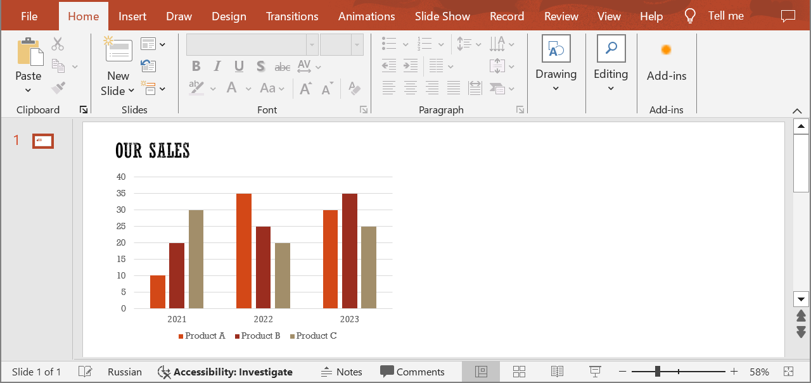
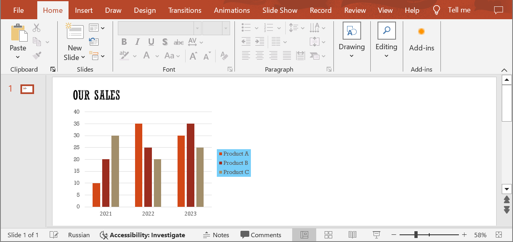

## **Introduction**

The primary function of a legend is to identify the different data series or categories represented in the chart. Legends often use colors to represent different data series. Each color in the legend corresponds to a specific element in the chart. In addition to color, some charts may use symbols or markers to distinguish between data series, especially in line charts or scatter plots. The legend explains the meaning of these symbols, ensuring clarity for the audience. Alongside the color or symbol, the legend typically includes a textual description of each data series. This description may include the name of the series or any relevant information that helps viewers understand what each element represents. The legend is usually positioned adjacent to or within the chart area for easy reference. However, its exact location can vary depending on the design of the slide and the space available. Use the following method to customize a chart legend.

## **SetChartLegend**

### **API Information**

|**API**|**Type**|**Description**|**Resource**|
| :- | :- | :- | :- |
|/slides/{name}/slides/{slideIndex}/shapes/{shapeIndex}/legend|PUT|Updates the properties of a chart legend in a presentation saved in a storage.|[SetChartLegend](https://reference.aspose.cloud/slides/#/Chart/SetChartLegend)|

**Request Parameters**

|**Name**|**Type**|**Location**|**Required**|**Description**|
| :- | :- | :- | :- | :- |
|name|string|path|true|The name of a presentation file.|
|slideIndex|integer|path|true|The 1-based index of a slide.|
|shapeIndex|integer|path|true|The 1-based index of a shape (must be a chart).|
|legend|`Legend`|body|true|The data transfer object with the legend parameters.|
|password|string|header|false|The password to open the presentation.|
|folder|string|query|false|The path to the folder containing the presentation file.|
|storage|string|query|false|The name of the storage contaning the folder.|

### **Examples**

In the **default** storage, the document **MyPresentation.pptx** contains a chart (the **second** shape) on the **first** slide with a legend located at the bottom of the chart. Move the legend to the **right** and fill it with the color **#77CEF9**.



**cURL Solution**





**Get an Access Token**

```sh
curl POST "https://api.aspose.cloud/connect/token" \
     -d "grant_type=client_credentials&client_id=MyClientId&client_secret=MyClientSecret" \
     -H "Content-Type: application/x-www-form-urlencoded"
```

**Update the Chart Legend**

```sh
curl -X PUT "https://api.aspose.cloud/v3.0/slides/MyPresentation.pptx/slides/1/shapes/2/legend" \
     -H "authorization: Bearer MyAccessToken" \
     -H "Content-Type: application/json" \
     -d @Legend.json
```

Legend.json content:
```json
{
  "Position": "Right",
  "FillFormat":{
    "Type": "Solid",
    "Color": "#77CEF9"
    }
}
```





**Response Example**

```json
{
  "position": "Right",
  "x": "NaN",
  "y": "NaN",
  "width": "NaN",
  "height": "NaN",
  "fillFormat": {
    "type": "Solid",
    "color": "#FF77CEF9"
  },
  "lineFormat": {
    "fillFormat": {
      "type": "NoFill"
    }
  }
}
```





**SDK Solutions**





```cs
using System;
using Aspose.Slides.Cloud.Sdk;
using Aspose.Slides.Cloud.Sdk.Model;

class Application
{
    static void Main(string[] args)
    {
        SlidesApi slidesApi = new SlidesApi("MyClientId", "MyClientSecret");

        string fileName = "MyPresentation.pptx";
        int slideIndex = 1;
        int shapeIndex = 2;

        Legend chartLegend = new Legend
        {
            Position = Legend.PositionEnum.Right,
            FillFormat = new SolidFill
            {
                Color = "#77CEF9"
            }
        };

        Legend updatedLegend = slidesApi.SetChartLegend(fileName, slideIndex, shapeIndex, chartLegend);
        Console.WriteLine("The chart legend has been updated.");
    }
}
```





```java
import com.aspose.slides.ApiException;
import com.aspose.slides.api.SlidesApi;
import com.aspose.slides.model.SolidFill;
import com.aspose.slides.model.Legend;

public class Application {
    public static void main(String[] args) throws ApiException {
        SlidesApi slidesApi = new SlidesApi("MyClientId", "MyClientSecret");

        String fileName = "MyPresentation.pptx";
        int slideIndex = 1;
        int shapeIndex = 2;

        SolidFill fillFormat = new SolidFill();
        fillFormat.setColor("#77CEF9");

        Legend chartLegend = new Legend();
        chartLegend.setPosition(Legend.PositionEnum.RIGHT);
        chartLegend.setFillFormat(fillFormat);

        Legend updatedLegend = slidesApi.setChartLegend(fileName, slideIndex, shapeIndex, chartLegend, null, null, null);
        System.out.println("The chart legend has been updated.");
    }
}
```





```php
use Aspose\Slides\Cloud\Sdk\Api\Configuration;
use Aspose\Slides\Cloud\Sdk\Api\SlidesApi;
use Aspose\Slides\Cloud\Sdk\Model\SolidFill;
use Aspose\Slides\Cloud\Sdk\Model\Legend;

$configuration = new Configuration();
$configuration->setAppSid("MyClientId");
$configuration->setAppKey("MyClientSecret");

$slidesApi = new SlidesApi(null, $configuration);

$fileName = "MyPresentation.pptx";
$slideIndex = 1;
$shapeIndex = 2;

$chartLegend = new Legend();
$chartLegend->setPosition("Right");
$chartLegend->setFillFormat(new SolidFill());
$chartLegend->getFillFormat()->setColor("#77CEF9");

$updatedLegend = $slidesApi->setChartLegend($fileName, $slideIndex, $shapeIndex, $chartLegend);
echo "The chart legend has been updated.";
```





```rb
require "aspose_slides_cloud"

include AsposeSlidesCloud

configuration = Configuration.new
configuration.app_sid = "MyClientId"
configuration.app_key = "MyClientSecret"

slides_api = SlidesApi.new(configuration)

file_name = "MyPresentation.pptx"
slide_index = 1
shape_index = 2

chart_legend = Legend.new
chart_legend.position = "Right"
chart_legend.fill_format = SolidFill.new
chart_legend.fill_format.color = "#77CEF9"

updated_legend = slides_api.set_chart_legend(file_name, slide_index, shape_index, chart_legend)
puts "The chart legend has been updated."
```





```py
from asposeslidescloud.apis import SlidesApi
from asposeslidescloud.models import Legend
from asposeslidescloud.models import SolidFill

slides_api = SlidesApi(None, "MyClientId", "MyClientSecret")

file_name = "MyPresentation.pptx"
slide_index = 1
shape_index = 2

chart_legend = Legend()
chart_legend.position = "Right"
chart_legend.fill_format = SolidFill()
chart_legend.fill_format.color = "#77CEF9"

updated_legend = slides_api.set_chart_legend(file_name, slide_index, shape_index, chart_legend)
print("The chart legend has been updated.")
```





```js
const cloudSdk = require("asposeslidescloud");

const slidesApi = new cloudSdk.SlidesApi("MyClientId", "MyClientSecret");

fileName = "MyPresentation.pptx";
slideIndex = 1;
shapeIndex = 2;

chartLegend = new cloudSdk.Legend();
chartLegend.position = cloudSdk.Legend.PositionEnum.Right;
chartLegend.fillFormat = new cloudSdk.SolidFill();
chartLegend.fillFormat.color = "#77CEF9";

slidesApi.setChartLegend(fileName, slideIndex, shapeIndex, chartLegend).then(updatedLegend => {
    console.log("The chart legend has been updated.");
});
```





```cpp
#include "asposeslidescloud/api/SlidesApi.h"
#include "asposeslidescloud/model/SolidFill.h"

using namespace asposeslidescloud::api;

int main()
{
    std::shared_ptr<SlidesApi> slidesApi = std::make_shared<SlidesApi>(L"MyClientId", L"MyClientSecret");

    const wchar_t* fileName = L"MyPresentation.pptx";
    int slideIndex = 1;
    int shapeIndex = 2;

    std::shared_ptr<SolidFill> fillFormat = std::make_shared<SolidFill>();
    fillFormat->setColor(L"#77CEF9");

    std::shared_ptr<Legend> chartLegend = std::make_shared<Legend>();
    chartLegend->setPosition(L"Right");
    chartLegend->setFillFormat(fillFormat);

    std::shared_ptr<Legend> updatedLegend = slidesApi->setChartLegend(fileName, slideIndex, shapeIndex, chartLegend).get();
    std::wcout << L"The chart legend has been updated.";
}
```





```pl
use AsposeSlidesCloud::Configuration;
use AsposeSlidesCloud::SlidesApi;
use AsposeSlidesCloud::Object::Legend;
use AsposeSlidesCloud::Object::SolidFill;

my $configuration = AsposeSlidesCloud::Configuration->new();
$configuration->{app_sid} = "MyClientId";
$configuration->{app_key} = "MyClientSecret";

my $slides_api = AsposeSlidesCloud::SlidesApi->new(config => $configuration);

my $file_name = "MyPresentation.pptx";
my $slide_index = 1;
my $shape_index = 2;

my $chart_legend = AsposeSlidesCloud::Object::Legend->new();
$chart_legend->{position} = "Right";
$chart_legend->{fill_format} = AsposeSlidesCloud::Object::SolidFill->new();
$chart_legend->{fill_format}->{color} = "#77CEF9";

my $updated_legend = $slides_api->set_chart_legend(
    name => $file_name, slide_index => $slide_index, shape_index => $shape_index, legend => $chart_legend);

print("The chart legend has been updated.");
```









```go
import (
	"fmt"

	asposeslidescloud "github.com/aspose-slides-cloud/aspose-slides-cloud-go/v24"
)

func main() {
	configuration := asposeslidescloud.NewConfiguration()
	configuration.AppSid = "MyClientId"
	configuration.AppKey = "MyClientSecret"

	slidesApi := asposeslidescloud.NewAPIClient(configuration).SlidesApi

	fileName := "MyPresentation.pptx"
	var slideIndex int32 = 1
	var shapeIndex int32 = 2

	fillFormat := asposeslidescloud.NewSolidFill()
	fillFormat.Color = "#77CEF9"

	chartLegend := asposeslidescloud.NewLegend()
	chartLegend.Position = "Right"
	chartLegend.FillFormat = fillFormat

	slidesApi.SetChartLegend(fileName, slideIndex, shapeIndex, chartLegend, "", "", "")
	fmt.Printf("The chart legend has been updated.")
}
```





The result:



## **SDKs**

Check [Available SDKs](/slides/available-sdks/) to learn how to add an SDK to your project.
