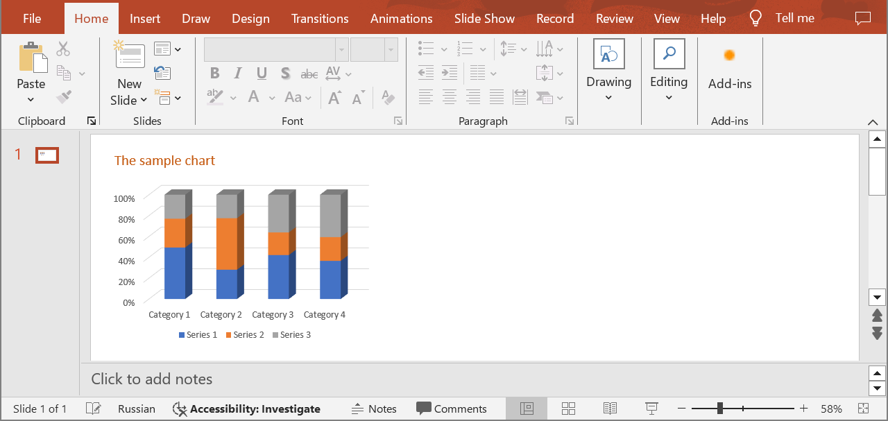

## **Introduction**

In the context of 3D charts in PowerPoint presentations, the "wall" is an important element that helps viewers understand the data context and navigate the three-dimensional space. The chart walls typically serve as a background or side surface that helps visually demarcate data and create the illusion of depth. The walls serve as a reference point, helping viewers understand where the data is positioned relative to the chart's axis. It provides a visual context, making it easier to interpret the three-dimensional data. Use the following method to change the appearance of the chart walls to enhance readability. This can be done through the chart wall formatting options. You can modify the color, texture, and transparency of the walls to better fit the presentation's style and not distract from the main data.

## **SetChartWall**

### **API Information**

|**API**|**Type**|**Description**|**Resource**|
| :- | :- | :- | :- |
|/slides/{name}/slides/{slideIndex}/shapes/{shapeIndex}/{chartWallType}|PUT|Updates the properties of a chart wall in a presentation saved in a storage.|[SetChartWall](https://reference.aspose.cloud/slides/#/Chart/SetChartWall)|

**Request Parameters**

|**Name**|**Type**|**Location**|**Required**|**Description**|
| :- | :- | :- | :- | :- |
|name|string|path|true|The name of a presentation file.|
|slideIndex|integer|path|true|The 1-based index of a slide.|
|shapeIndex|integer|path|true|The 1-based index of a shape (must be a 3D chart).|
|chartWallType|`ChartWallType`|path|true|The type of a chart wall.|
|chartWall|`ChartWall`|body|true|The data transfer object with the chart wall properties.|
|password|string|header|false|The password to open the presentation.|
|folder|string|query|false|The path to the folder containing the presentation file.|
|storage|string|query|false|The name of the storage contaning the folder.|

### **Examples**

In the **default** storage, the document **MyPresentation.pptx** contains a 3D chart (the **second** shape) on the **first** slide. Fill the **back** wall of the chart with the color **#70AD46**.



**cURL Solution**





**Get an Access Token**

```sh
curl POST "https://api.aspose.cloud/connect/token" \
     -d "grant_type=client_credentials&client_id=MyClientId&client_secret=MyClientSecret" \
     -H "Content-Type: application/x-www-form-urlencoded"
```

**Update the Chart Wall**
```sh
curl -X PUT "https://api.aspose.cloud/v3.0/slides/MyPresentation.pptx/slides/1/shapes/2/BackWall" \
     -H "authorization: Bearer MyAccessToken" \
     -H "Content-Type: application/json" \
     -d @Wall.json
```

Wall.json content:
```json
{
  "FillFormat": {
    "Type": "Solid",
    "Color": "#70AD46"
  }
}
```





**Response Example**

```json
{
  "fillFormat": {
    "type": "Solid",
    "color": "#FF70AD46"
  },
  "lineFormat": {
    "fillFormat": {
      "type": "NoFill"
    }
  }
}
```






**SDK Solutions**





```cs
using System;
using Aspose.Slides.Cloud.Sdk;
using Aspose.Slides.Cloud.Sdk.Model;

class Application
{
    static void Main(string[] args)
    {
        SlidesApi slidesApi = new SlidesApi("MyClientId", "MyClientSecret");

        string fileName = "MyPresentation.pptx";
        int slideIndex = 1;
        int shapeIndex = 2;
        ChartWallType wallType = ChartWallType.BackWall;

        ChartWall chartWall = new ChartWall
        {
            FillFormat = new SolidFill 
            {
                Color = "#70AD46" 
            }
        };

        ChartWall updatedChartWall = slidesApi.SetChartWall(fileName, slideIndex, shapeIndex, wallType, chartWall);

        Console.WriteLine("The chart wall has been updated.");
    }
}
```





```java
import com.aspose.slides.ApiException;
import com.aspose.slides.api.SlidesApi;
import com.aspose.slides.model.SolidFill;
import com.aspose.slides.model.ChartWallType;
import com.aspose.slides.model.ChartWall;

public class Application {
    public static void main(String[] args) throws ApiException {
        SlidesApi slidesApi = new SlidesApi("MyClientId", "MyClientSecret");

        String fileName = "MyPresentation.pptx";
        int slideIndex = 1;
        int shapeIndex = 2;
        ChartWallType wallType = ChartWallType.BACKWALL;

        SolidFill fillFormat = new SolidFill();
        fillFormat.setColor("#70AD46");

        ChartWall chartWall = new ChartWall();
        chartWall.setFillFormat(fillFormat);

        ChartWall updatedChartWall = slidesApi.setChartWall(fileName, slideIndex, shapeIndex, wallType, chartWall, null, null, null);

        System.out.println("The chart wall has been updated.");
    }
}
```





```php
use Aspose\Slides\Cloud\Sdk\Api\Configuration;
use Aspose\Slides\Cloud\Sdk\Api\SlidesApi;
use Aspose\Slides\Cloud\Sdk\Model\ChartWallType;
use Aspose\Slides\Cloud\Sdk\Model\SolidFill;
use Aspose\Slides\Cloud\Sdk\Model\ChartWall;

$configuration = new Configuration();
$configuration->setAppSid("MyClientId");
$configuration->setAppKey("MyClientSecret");

$slidesApi = new SlidesApi(null, $configuration);

$fileName = "MyPresentation.pptx";
$slideIndex = 1;
$shapeIndex = 2;
$wallType = ChartWallType::BACK_WALL;

$fillFormat = new SolidFill();
$fillFormat->setColor("#70AD46");

$chartWall = new ChartWall();
$chartWall->setFillFormat($fillFormat);

$updatedChartWall = $slidesApi->setChartWall($fileName, $slideIndex, $shapeIndex, $wallType, $chartWall);

echo "The chart wall has been updated.";
```





```rb
require "aspose_slides_cloud"

include AsposeSlidesCloud

configuration = Configuration.new
configuration.app_sid = "MyClientId"
configuration.app_key = "MyClientSecret"

slides_api = SlidesApi.new(configuration)

file_name = "MyPresentation.pptx"
slide_index = 1
shape_index = 2
wall_type = ChartWallType::BACK_WALL

chart_wall = ChartWall.new
chart_wall.fill_format = SolidFill.new
chart_wall.fill_format.color = "#70AD46"

updated_chart_wall = slides_api.set_chart_wall(file_name, slide_index, shape_index, wall_type, chart_wall)

puts "The chart wall has been updated."
```





```py
from asposeslidescloud.apis import SlidesApi
from asposeslidescloud.models import ChartWallType
from asposeslidescloud.models import SolidFill
from asposeslidescloud.models import ChartWall

slides_api = SlidesApi(None, "MyClientId", "MyClientSecret")

file_name = "MyPresentation.pptx"
slide_index = 1
shape_index = 2
wall_type = ChartWallType.BACKWALL

chart_wall = ChartWall()
chart_wall.fill_format = SolidFill()
chart_wall.fill_format.color = "#70AD46"

updated_chart_wall = slides_api.set_chart_wall(file_name, slide_index, shape_index, wall_type, chart_wall)

print("The chart wall has been updated.")
```





```js
const cloudSdk = require("asposeslidescloud");

const slidesApi = new cloudSdk.SlidesApi("MyClientId", "MyClientSecret");

fileName = "MyPresentation.pptx";
slideIndex = 1;
shapeIndex = 2;
wallType = cloudSdk.ChartWallType.BackWall;

chartWall = new cloudSdk.ChartWall();
chartWall.fillFormat = new cloudSdk.SolidFill();
chartWall.fillFormat.color = "#70AD46";

slidesApi.setChartWall(fileName, slideIndex, shapeIndex, wallType, chartWall).then(updatedChartWall => {
    console.log("The chart wall has been updated.");
});
```





```cpp
#include "asposeslidescloud/api/SlidesApi.h"
#include "asposeslidescloud/model/SolidFill.h"

using namespace asposeslidescloud::api;

int main()
{
    std::shared_ptr<SlidesApi> slidesApi = std::make_shared<SlidesApi>(L"MyClientId", L"MyClientSecret");

    const wchar_t* fileName = L"MyPresentation.pptx";
    int slideIndex = 1;
    int shapeIndex = 2;
    const wchar_t* wallType = L"BackWall";

    std::shared_ptr<SolidFill> fillFormat = std::make_shared<SolidFill>();
    fillFormat->setColor(L"#70AD46");

    std::shared_ptr<ChartWall> chartWall = std::make_shared<ChartWall>();
    chartWall->setFillFormat(fillFormat);

    std::shared_ptr<ChartWall> updatedChartWall = slidesApi->setChartWall(fileName, slideIndex, shapeIndex, wallType, chartWall).get();

    std::wcout << L"The chart wall has been updated.";
}
```





```pl
use AsposeSlidesCloud::Configuration;
use AsposeSlidesCloud::SlidesApi;
use AsposeSlidesCloud::Object::SolidFill;
use AsposeSlidesCloud::Object::ChartWall;

my $configuration = AsposeSlidesCloud::Configuration->new();
$configuration->{app_sid} = "MyClientId";
$configuration->{app_key} = "MyClientSecret";

my $slides_api = AsposeSlidesCloud::SlidesApi->new(config => $configuration);

my $file_name = "MyPresentation.pptx";
my $slide_index = 1;
my $shape_index = 2;
my $wall_type = "BackWall";

my $chart_wall = AsposeSlidesCloud::Object::ChartWall->new();
$chart_wall->{fill_format} = AsposeSlidesCloud::Object::SolidFill->new();
$chart_wall->{fill_format}->{color} = "#70AD46";

my $updated_chart_wall = $slides_api->set_chart_wall(
    name => $file_name, slide_index => $slide_index, shape_index => $shape_index, chart_wall_type => $wall_type, chart_wall => $chart_wall);

print("The chart wall has been updated.");
```









```go
import (
	"fmt"

	asposeslidescloud "github.com/aspose-slides-cloud/aspose-slides-cloud-go/v24"
)

func main() {
	configuration := asposeslidescloud.NewConfiguration()
	configuration.AppSid = "MyClientId"
	configuration.AppKey = "MyClientSecret"

	slidesApi := asposeslidescloud.NewAPIClient(configuration).SlidesApi

	fileName := "MyPresentation.pptx"
	var slideIndex int32 = 1
	var shapeIndex int32 = 2
	wallType := string(asposeslidescloud.ChartWallType_BackWall)

	fillFormat := asposeslidescloud.NewSolidFill()
	fillFormat.Color = "#70AD46"

	chartWall := asposeslidescloud.NewChartWall()
	chartWall.FillFormat = fillFormat

	slidesApi.SetChartWall(fileName, slideIndex, shapeIndex, wallType, chartWall, "", "", "")
	fmt.Printf("The chart legend has been updated.")
}
```





The result:


## **SDKs**

Check [Available SDKs](/slides/available-sdks/) to learn how to add an SDK to your project.
