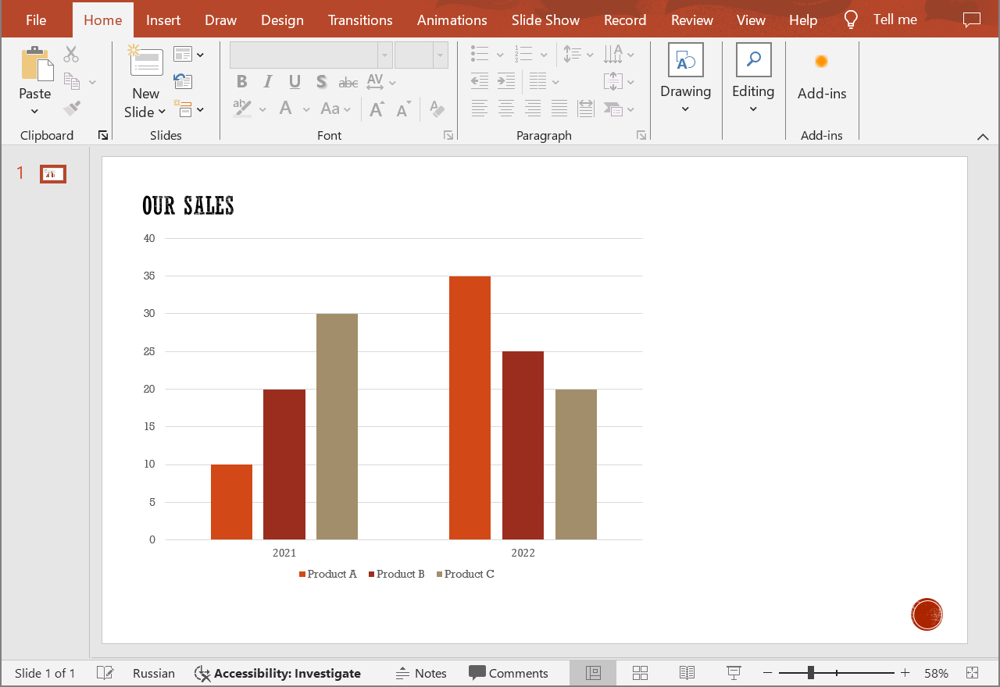

## **Introduction**

For PowerPoint presentations, creating charts involves using data organized in the form of a table. Charts in PowerPoint documents typically represent a combination of data series and categories. Use the following method to delete data categories from the charts. 

## **DeleteChartCategory**

### **API Information**

|**API**|**Type**|**Description**|**Resource**|
| :- | :- | :- | :- |
|/slides/{name}/slides/{slideIndex}/shapes/{shapeIndex}/categories/{categoryIndex}|DELETE|Deletes a data category from a chart in a presentation saved in a storage.|[DeleteChartCategory](https://apireference.aspose.cloud/slides/#/Chart/DeleteChartCategory)|

**Request Parameters**

|**Name**|**Type**|**Location**|**Required**|**Description**|
| :- | :- | :- | :- | :- |
|name|string|path|true|The name of a presentation file.|
|slideIndex|integer|path|true|The 1-based index of a presentation slide.|
|shapeIndex|integer|path|true|The 1-based index of a shape (must be a chart).|
|categoryIndex|integer|path|true|The 1-based index of a data category.|
|password|string|header|false|The password to open the presentation.|
|folder|string|query|false|The path to the folder containing the presentation file.|
|storage|string|query|false|The name of the storage contaning the folder.|

### **Examples**

The document **MyPresentation.pptx**, saved in the **default** storage, contains a column chart (the **second** shape) on the **first** slide - sales volumes of products "Product A", "Product B", and "Product C" for 2021 to 2023. Delete data for 2023.

{}
The referenced shape must be a chart that supports data categories (e.g. column or pie chart), otherwise the operation will fail.
{}


**cURL Solution**





**Get an Access Token**

```sh
curl POST "https://api.aspose.cloud/connect/token" \
     -d "grant_type=client_credentials&client_id=MyClientId&client_secret=MyClientSecret" \
     -H "Content-Type: application/x-www-form-urlencoded"
```

**Delete the Data Category**

```sh
curl -X DELETE "https://api.aspose.cloud/v3.0/slides/MyPresentation.pptx/slides/1/shapes/2/categories/3" \
     -H "authorization: Bearer MyAccessToken"
```





```text
Code: 200
Body: Chart JSON
```





**SDK Solutions**





```csharp
using System;

using Aspose.Slides.Cloud.Sdk;
using Aspose.Slides.Cloud.Sdk.Model;

class Application
{
    static void Main(string[] args)
    {
        SlidesApi slidesApi = new SlidesApi("MyClientId", "MyClientSecret");

        string fileName = "MyPresentation.pptx";
        int slideIndex = 1;
        int shapeIndex = 2;
        int categoryIndex = 3;

        Chart chart = slidesApi.DeleteChartCategory(fileName, slideIndex, shapeIndex, categoryIndex);

        int categoryCount = chart.Categories.Count;
        Console.WriteLine($"Number of data categories: {categoryCount}");
    }
}
```





```java
import com.aspose.slides.ApiException;
import com.aspose.slides.api.SlidesApi;
import com.aspose.slides.model.Chart;

public class Application {
    public static void main(String[] args) throws ApiException {
        SlidesApi slidesApi = new SlidesApi("MyClientId", "MyClientSecret");

        String fileName = "MyPresentation.pptx";
        int slideIndex = 1;
        int shapeIndex = 2;
        int categoryIndex = 3;

        Chart chart = slidesApi.deleteChartCategory(fileName, slideIndex, shapeIndex, categoryIndex, null, null, null);

        int categoryCount = chart.getCategories().size();
        System.out.printf("Number of data categories: %d", categoryCount);
    }
}
```





```php
use Aspose\Slides\Cloud\Sdk\Api\Configuration;
use Aspose\Slides\Cloud\Sdk\Api\SlidesApi;

$configuration = new Configuration();
$configuration->setAppSid("MyClientId");
$configuration->setAppKey("MyClientSecret");

$slidesApi = new SlidesApi(null, $configuration);

$fileName = "MyPresentation.pptx";
$slideIndex = 1;
$shapeIndex = 2;
$categoryIndex = 3;

$chart = $slidesApi->deleteChartCategory($fileName, $slideIndex, $shapeIndex, $categoryIndex);

$categoryCount = count($chart->getCategories());
echo "Number of data categories: ", $categoryCount;
```





```ruby
require "aspose_slides_cloud"

include AsposeSlidesCloud

configuration = Configuration.new
configuration.app_sid = "MyClientId"
configuration.app_key = "MyClientSecret"

slides_api = SlidesApi.new(configuration)

file_name = "MyPresentation.pptx"
slide_index = 1
shape_index = 2
category_index = 3

chart = slides_api.delete_chart_category(file_name, slide_index, shape_index, category_index)

category_count = chart.categories.length()
puts "Number of data categories: #{category_count}"
```





```python
from asposeslidescloud.apis.slides_api import SlidesApi

slides_api = SlidesApi(None, "MyClientId", "MyClientSecret")

file_name = "MyPresentation.pptx"
slide_index = 1
shape_index = 2
category_index = 3

chart = slides_api.delete_chart_category(file_name, slide_index, shape_index, category_index)

category_count = len(chart.categories)
print(f"Number of data categories: {category_count}")
```





```js
const cloudSdk = require("asposeslidescloud");

const slidesApi = new cloudSdk.SlidesApi("MyClientId", "MyClientSecret");

fileName = "MyPresentation.pptx";
slideIndex = 1;
shapeIndex = 2;
categoryIndex = 3;

slidesApi.deleteChartCategory(fileName, slideIndex, shapeIndex, categoryIndex).then(chart => {
    categoryCount = chart.body.categories.length;
    console.log("Number of data categories:", categoryCount);
});
```





```cpp
#include "asposeslidescloud/api/SlidesApi.h"

using namespace asposeslidescloud::api;

int main()
{
    std::shared_ptr<SlidesApi> slidesApi = std::make_shared<SlidesApi>(L"MyClientId", L"MyClientSecret");

    const wchar_t* fileName = L"MyPresentation.pptx";
    int slideIndex = 1;
    int shapeIndex = 2;
    int categoryIndex = 3;

    std::shared_ptr<Chart> chart = slidesApi->deleteChartCategory(fileName, slideIndex, shapeIndex, categoryIndex).get();

    int categoryCount = chart->getCategories().size();
    std::wcout << L"Number of data categories: " << categoryCount;
}
```





```perl
use AsposeSlidesCloud::Configuration;
use AsposeSlidesCloud::SlidesApi;

my $config = AsposeSlidesCloud::Configuration->new();
$config->{app_sid} = "MyClientId";
$config->{app_key} = "MyClientSecret";

my $slides_api = AsposeSlidesCloud::SlidesApi->new(config => $config);

my $file_name = "MyPresentation.pptx";
my $slide_index = 1;
my $shape_index = 2;
my $category_index = 3;

my $chart = $slides_api->delete_chart_category(
    name => $file_name, slide_index => $slide_index, shape_index => $shape_index, category_index => $category_index);

$category_count = @{$chart->{categories}};
print("Number of data categories: ", $category_count);
```









```go
cfg := asposeslidescloud.NewConfiguration()
cfg.AppSid = "MyClientId"
cfg.AppKey = "MyClientSecret"

api := asposeslidescloud.NewAPIClient(cfg)

fileName := "MyPresentation.pptx"
slideIndex := 1
shapeIndex := 2
categoryIndex := 3

result, _, e := api.SlidesApi.DeleteChartCategory(fileName, slideIndex, shapeIndex, categoryIndex, "", "", "")

if e != nil {
    fmt.Printf("Error: %v.", e)
} else {
    fmt.Printf("Number of data categories: %v", len(result.(asposeslidescloud.IChart).GetCategories()))
}
```





The result:



## **SDKs**

Check [Available SDKs](/slides/available-sdks/) to learn how to add an SDK to your project.
