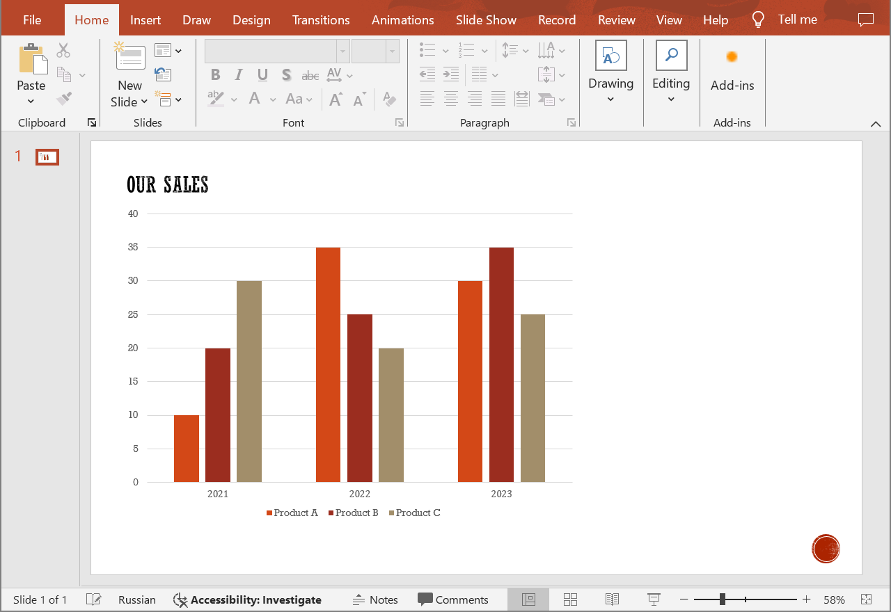
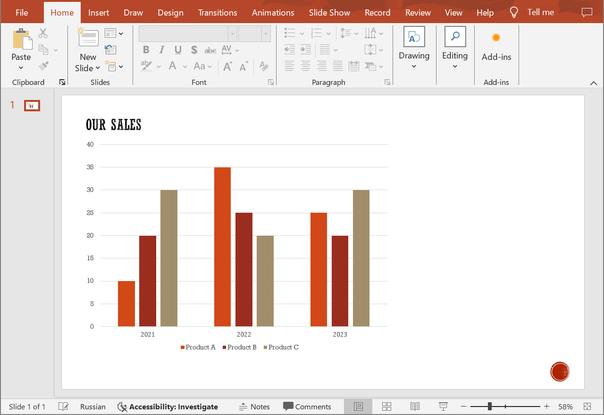

## **Introduction**

In PowerPoint documents, to create a chart, data categories define various groups or segments of data within each series. They represent the axis along which the values of the series are displayed. Use the following method to update data categories in charts. 

## **UpdateChartCategory**

### **API Information**

|**API**|**Type**|**Description**|**Resource**|
| :- | :- | :- | :- |
|/slides/{name}/slides/{slideIndex}/shapes/{shapeIndex}/categories/{categoryIndex}|PUT|Updates a data category in a chart in a presentation saved in a storage.|[UpdateChartCategory](https://apireference.aspose.cloud/slides/#/Chart/UpdateChartCategory)|

**Request Parameters**

|**Name**|**Type**|**Location**|**Required**|**Description**|
| :- | :- | :- | :- | :- |
|name|string|path|true|The name of a presentation file.|
|slideIndex|integer|path|true|The 1-based index of a presentation slide.|
|shapeIndex|integer|path|true|The 1-based index of a shape (must be a chart).|
|categoryIndex|integer|path|true|The 1-based index of a data category.|
|category|`ChartCategory`|body|true|The data transfer object with category data.|
|password|string|header|false|The password to open the presentation.|
|folder|string|query|false|The path to the folder containing the presentation file.|
|storage|string|query|false|The name of the storage contaning the folder.|

### **Examples**

The document **MyPresentation.pptx**, saved in the **default** storage, contains a column chart (the **second** shape) on the **first** slide - sales volumes of products "Product A", "Product B", and "Product C" for 2021 to 2023. Update sales data (**25**, **20**, **30**) for 2023.

{}
The referenced shape must be a chart that supports data categories (e.g. column or pie chart), otherwise the operation will fail.
{}







**Get an Access Token**

```sh
curl POST "https://api.aspose.cloud/connect/token" \
     -d "grant_type=client_credentials&client_id=MyClientId&client_secret=MyClientSecret" \
     -H "Content-Type: application/x-www-form-urlencoded"
```

```sh
curl -X PUT "https://api.aspose.cloud/v3.0/slides/MyPresentation.pptx/slides/1/shapes/2/categories/3" \
     -H "authorization: Bearer MyAccessToken" \
     -H "Content-Type: application/json" \
     -d @DataCategory.json
```

DataCategory.json content:
```json
{
  "dataPoints": [
    { "value": 25 },
    { "value": 20 },
    { "value": 30 }
  ]
}
```





```text
Code: 200
Body: Chart JSON
```





**SDK Solutions**





```csharp
using System;
using System.Collections.Generic;

using Aspose.Slides.Cloud.Sdk;
using Aspose.Slides.Cloud.Sdk.Model;

class Application
{
    static void Main(string[] args)
    {
        SlidesApi slidesApi = new SlidesApi("MyClientId", "MyClientSecret");

        string fileName = "MyPresentation.pptx";
        int slideIndex = 1;
        int shapeIndex = 2;
        int categoryIndex = 3;

        ChartCategory dataCategory = new ChartCategory
        {
            DataPoints = new List<OneValueChartDataPoint>
            {
                new OneValueChartDataPoint { Value = 25 },
                new OneValueChartDataPoint { Value = 20 },
                new OneValueChartDataPoint { Value = 30 }
            }
        };

        Chart chart = slidesApi.UpdateChartCategory(fileName, slideIndex, shapeIndex, categoryIndex, dataCategory);
    }
}
```





```java
import com.aspose.slides.ApiException;
import com.aspose.slides.api.SlidesApi;
import com.aspose.slides.model.OneValueChartDataPoint;
import com.aspose.slides.model.ChartCategory;
import com.aspose.slides.model.Chart;

import java.util.Arrays;

public class Application {
    public static void main(String[] args) throws ApiException {
        SlidesApi slidesApi = new SlidesApi("MyClientId", "MyClientSecret");

        String fileName = "MyPresentation.pptx";
        int slideIndex = 1;
        int shapeIndex = 2;
        int categoryIndex = 3;

        OneValueChartDataPoint dataPoint1 = new OneValueChartDataPoint();
        dataPoint1.setValue(25d);

        OneValueChartDataPoint dataPoint2 = new OneValueChartDataPoint();
        dataPoint2.setValue(20d);

        OneValueChartDataPoint dataPoint3 = new OneValueChartDataPoint();
        dataPoint3.setValue(30d);

        ChartCategory dataCategory = new ChartCategory();
        dataCategory.setDataPoints(Arrays.asList(dataPoint1, dataPoint2, dataPoint3));

        Chart chart = slidesApi.updateChartCategory(fileName, slideIndex, shapeIndex, categoryIndex, dataCategory, null, null, null);
    }
}
```





```php
use Aspose\Slides\Cloud\Sdk\Api\Configuration;
use Aspose\Slides\Cloud\Sdk\Api\SlidesApi;
use Aspose\Slides\Cloud\Sdk\Model\OneValueChartDataPoint;
use Aspose\Slides\Cloud\Sdk\Model\ChartCategory;

$configuration = new Configuration();
$configuration->setAppSid("MyClientId");
$configuration->setAppKey("MyClientSecret");

$slidesApi = new SlidesApi(null, $configuration);

$fileName = "MyPresentation.pptx";
$slideIndex = 1;
$shapeIndex = 2;
$categoryIndex = 3;

$dataPoint1 = new OneValueChartDataPoint();
$dataPoint1->setValue(25);

$dataPoint2 = new OneValueChartDataPoint();
$dataPoint2->setValue(20);

$dataPoint3 = new OneValueChartDataPoint();
$dataPoint3->setValue(30);

$dataCategory = new ChartCategory();
$dataCategory->setDataPoints([$dataPoint1, $dataPoint2, $dataPoint3]);

$chart = $slidesApi->updateChartCategory($fileName, $slideIndex, $shapeIndex, $categoryIndex, $dataCategory);
```





```ruby
require "aspose_slides_cloud"

include AsposeSlidesCloud

configuration = Configuration.new
configuration.app_sid = "MyClientId"
configuration.app_key = "MyClientSecret"

slides_api = SlidesApi.new(configuration)

file_name = "MyPresentation.pptx"
slide_index = 1
shape_index = 2
category_index = 3

data_point1 = OneValueChartDataPoint.new
data_point1.value = 25

data_point2 = OneValueChartDataPoint.new
data_point2.value = 20

data_point3 = OneValueChartDataPoint.new
data_point3.value = 30

data_category = ChartCategory.new
data_category.data_points = [data_point1, data_point2, data_point3]

chart = slides_api.update_chart_category(file_name, slide_index, shape_index, category_index, data_category)
```





```python
from asposeslidescloud.apis.slides_api import SlidesApi
from asposeslidescloud.models.one_value_chart_data_point import OneValueChartDataPoint
from asposeslidescloud.models.chart_category import ChartCategory

slides_api = SlidesApi(None, "MyClientId", "MyClientSecret")

file_name = "MyPresentation.pptx"
slide_index = 1
shape_index = 2
category_index = 3

data_point1 = OneValueChartDataPoint()
data_point1.value = 25

data_point2 = OneValueChartDataPoint()
data_point2.value = 20

data_point3 = OneValueChartDataPoint()
data_point3.value = 30

data_category = ChartCategory()
data_category.data_points = [data_point1, data_point2, data_point3]

chart = slides_api.update_chart_category(file_name, slide_index, shape_index, category_index, data_category)
```





```js
const cloudSdk = require("asposeslidescloud");

const slidesApi = new cloudSdk.SlidesApi("MyClientId", "MyClientSecret");

fileName = "MyPresentation.pptx";
slideIndex = 1;
shapeIndex = 2;
categoryIndex = 3;

dataCategory = new cloudSdk.ChartCategory();
dataCategory.dataPoints = [{ value: 25 }, { value: 20 }, { value: 30 }];

slidesApi.updateChartCategory(fileName, slideIndex, shapeIndex, categoryIndex, dataCategory).then(chart => {
});
```





```cpp
#include "asposeslidescloud/api/SlidesApi.h"

using namespace asposeslidescloud::api;

int main()
{
    std::shared_ptr<SlidesApi> slidesApi = std::make_shared<SlidesApi>(L"MyClientId", L"MyClientSecret");

    const wchar_t* fileName = L"MyPresentation.pptx";
    int slideIndex = 1;
    int shapeIndex = 2;
    int categoryIndex = 3;

    std::shared_ptr<OneValueChartDataPoint> dataPoint1 = std::make_shared<OneValueChartDataPoint>();
    dataPoint1->setValue(25);

    std::shared_ptr<OneValueChartDataPoint> dataPoint2 = std::make_shared<OneValueChartDataPoint>();
    dataPoint2->setValue(20);

    std::shared_ptr<OneValueChartDataPoint> dataPoint3 = std::make_shared<OneValueChartDataPoint>();
    dataPoint3->setValue(30);

    std::shared_ptr<ChartCategory> dataCategory = std::make_shared<ChartCategory>();
    dataCategory->setDataPoints({ dataPoint1, dataPoint2, dataPoint3 });

    std::shared_ptr<Chart> chart = slidesApi->updateChartCategory(fileName, slideIndex, shapeIndex, categoryIndex, dataCategory).get();
}
```





```perl
use AsposeSlidesCloud::Configuration;
use AsposeSlidesCloud::SlidesApi;
use AsposeSlidesCloud::Object::OneValueChartDataPoint;
use AsposeSlidesCloud::Object::ChartCategory;

my $config = AsposeSlidesCloud::Configuration->new();
$config->{app_sid} = "MyClientId";
$config->{app_key} = "MyClientSecret";

my $slides_api = AsposeSlidesCloud::SlidesApi->new(config => $config);

my $file_name = "MyPresentation.pptx";
my $slide_index = 1;
my $shape_index = 2;
my $category_index = 3;

my $data_point1 = AsposeSlidesCloud::Object::OneValueChartDataPoint->new();
$data_point1->{value} = 25;

my $data_point2 = AsposeSlidesCloud::Object::OneValueChartDataPoint->new();
$data_point2->{value} = 20;

my $data_point3 = AsposeSlidesCloud::Object::OneValueChartDataPoint->new();
$data_point3->{value} = 30;

my $data_category = AsposeSlidesCloud::Object::ChartCategory->new();
$data_category->{data_points} = [$data_point1, $data_point2, $data_point3];

$chart = $slides_api->update_chart_category(
    name => $file_name, slide_index => $slide_index, shape_index => $shape_index, category_index => $category_index, category => $data_category);
```









```go
cfg := asposeslidescloud.NewConfiguration()
cfg.AppSid = "MyClientId"
cfg.AppKey = "MyClientSecret"

api := asposeslidescloud.NewAPIClient(cfg)

fileName := "MyPresentation.pptx"
slideIndex := 1
shapeIndex := 2
categoryIndex := 3

dataPoint1 := asposeslidescloud.NewOneValueChartDataPoint()
dataPoint1.Value = 25

dataPoint2 := asposeslidescloud.NewOneValueChartDataPoint()
dataPoint2.Value = 20

dataPoint3 := asposeslidescloud.NewOneValueChartDataPoint()
dataPoint3.Value = 30

dataCategory := asposeslidescloud.NewChartCategory()
dataCategory.DataPoints = []asposeslidescloud.IOneValueChartDataPoint { dataPoint1, dataPoint2, dataPoint3 }

result, _, e := api.SlidesApi.UpdateChartCategory(fileName, slideIndex, shapeIndex, categoryIndex, dataCategory, "", "", "")

if e != nil {
    fmt.Printf("Error: %v.", e)
}
```





The result:



## **SDKs**

Check [Available SDKs](/slides/available-sdks/) to learn how to add an SDK to your project.
