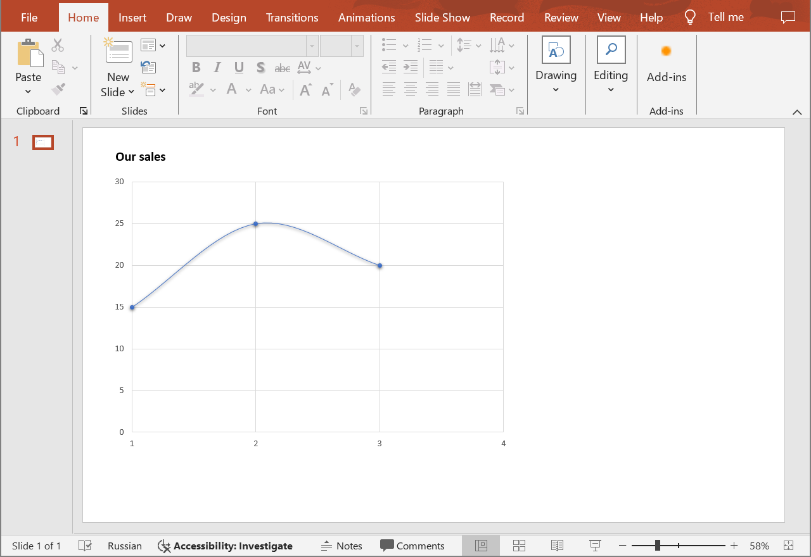
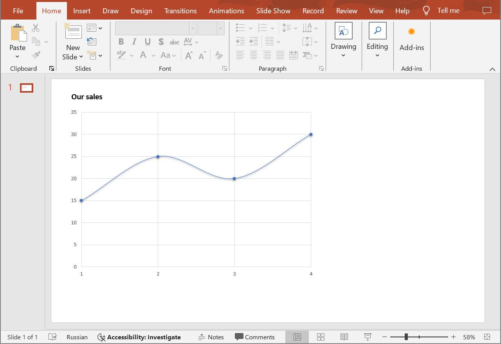

## **Introduction**

In PowerPoint presentations, data points in charts play a crucial role in conveying information effectively to the audience. Data points represent individual values or observations within a dataset and are visualized through various chart types such as bar charts, line charts, scatter plots, etc. Use the following method to add data points to charts in PowerPoint presentations.

## **CreateChartDataPoint**

### **API Information**

|**API**|**Type**|**Description**|**Resource**|
| :- | :- | :- | :- |
|/slides/{name}/slides/{slideIndex}/shapes/{shapeIndex}/series/{seriesIndex}/dataPoints|POST|Adds a data point to a chart in a presentation saved in a storage.|[CreateChartDataPoint](https://apireference.aspose.cloud/slides/#/Chart/CreateChartDataPoint)|

**Request Parameters**

|**Name**|**Type**|**Location**|**Required**|**Description**|
| :- | :- | :- | :- | :- |
|name|string|path|true|The name of a presentation file.|
|slideIndex|integer|path|true|The 1-based index of a presentation slide.|
|shapeIndex|integer|path|true|The 1-based index of a shape (must be a chart).|
|seriesIndex|integer|path|true|The 1-based index of a data series.|
|dataPoint|`DataPoint`|body|true|The data transfer object of a data point.|
|password|string|header|false|The password to open the presentation.|
|folder|string|query|false|The path to the folder containing the presentation file.|
|storage|string|query|false|The name of the storage contaning the folder.|

### **Examples**

In the **default** storage, the document **MyPresentation.pptx** contains a scatter chart (the **second** shape) that displays the number of items sold for quarters 1 through 3 (**one** data series). Add to the chart the number of items sold for the **4th** quarter (**30** items).

{}
The referenced shape must be a chart that supports adding individual data points (e.g. scatter or bubble chart), otherwise the operation will fail.
{}



**cURL Solution**





**Get an Access Token**

```sh
curl POST "https://api.aspose.cloud/connect/token" \
     -d "grant_type=client_credentials&client_id=MyClientId&client_secret=MyClientSecret" \
     -H "Content-Type: application/x-www-form-urlencoded"
```

```sh
curl -X POST "https://api.aspose.cloud/v3.0/slides/MyPresentation.pptx/slides/1/shapes/2/series/1/dataPoints" \
     -H "authorization: Bearer MyAccessToken" \
     -H "Content-Type: application/json" \
     -d @DataPoint.json
```

DataPoint.json content:
```json
{
    "xValue": 4,
    "yValue": 30
}
```





```text
Code: 201
Body: Chart JSON
```





**SDK Solutions**





```csharp
using System;
using Aspose.Slides.Cloud.Sdk;
using Aspose.Slides.Cloud.Sdk.Model;

class Application
{
    static void Main(string[] args)
    {
        SlidesApi slidesApi = new SlidesApi("MyClientId", "MyClientSecret");

        string fileName = "MyPresentation.pptx";
        int slideIndex = 1;
        int shapeIndex = 2;
        int seriesIndex = 1;

        ScatterChartDataPoint dataPoint = new ScatterChartDataPoint
        {
            XValue = 4,
            YValue = 30,
        };

        Chart chart = slidesApi.CreateChartDataPoint(fileName, slideIndex, shapeIndex, seriesIndex, dataPoint);

        ScatterSeries series = (ScatterSeries)chart.Series[0];
        int dataPointCount = series.DataPoints.Count;
        Console.WriteLine("Number of data points: " + dataPointCount);
    }
}
```





```java
import com.aspose.slides.ApiException;
import com.aspose.slides.api.SlidesApi;
import com.aspose.slides.model.ScatterChartDataPoint;
import com.aspose.slides.model.Chart;
import com.aspose.slides.model.ScatterSeries;

public class Application {
    public static void main(String[] args) throws ApiException {
        SlidesApi slidesApi = new SlidesApi("MyClientId", "MyClientSecret");

        String fileName = "MyPresentation.pptx";
        int slideIndex = 1;
        int shapeIndex = 2;
        int seriesIndex = 1;

        ScatterChartDataPoint dataPoint = new ScatterChartDataPoint();
        dataPoint.setXvalue(4d);
        dataPoint.setYvalue(30d);

        Chart chart = slidesApi.createChartDataPoint(fileName, slideIndex, shapeIndex, seriesIndex, dataPoint, null, null, null);

        ScatterSeries series = (ScatterSeries)chart.getSeries().get(0);
        int dataPointCount = series.getDataPoints().size();
        System.out.println("Number of data points: " + dataPointCount);
    }
}
```





```php
use Aspose\Slides\Cloud\Sdk\Api\Configuration;
use Aspose\Slides\Cloud\Sdk\Api\SlidesApi;
use Aspose\Slides\Cloud\Sdk\Model\ScatterChartDataPoint;

$configuration = new Configuration();
$configuration->setAppSid("MyClientId");
$configuration->setAppKey("MyClientSecret");

$slidesApi = new SlidesApi(null, $configuration);

$fileName = "MyPresentation.pptx";
$slideIndex = 1;
$shapeIndex = 2;
$seriesIndex = 1;

$dataPoint = new ScatterChartDataPoint();
$dataPoint->setXvalue(4);
$dataPoint->setYvalue(30);

$chart = $slidesApi->createChartDataPoint($fileName, $slideIndex, $shapeIndex, $seriesIndex, $dataPoint);

$dataPointCount = count($chart->getSeries()[0]->getDataPoints());
echo "Number of data points: ", $dataPointCount;
```





```ruby
require "aspose_slides_cloud"

include AsposeSlidesCloud

configuration = Configuration.new
configuration.app_sid = "MyClientId"
configuration.app_key = "MyClientSecret"

slides_api = SlidesApi.new(configuration)

file_name = "MyPresentation.pptx"
slide_index = 1
shape_index = 2
series_index = 1

data_point = ScatterChartDataPoint.new
data_point.x_value = 4
data_point.y_value = 30

chart = slides_api.create_chart_data_point(file_name, slide_index, shape_index, series_index, data_point)

data_point_count = chart.series[0].data_points.length()
print "Number of data points: ", data_point_count
```





```python
from asposeslidescloud.apis.slides_api import SlidesApi
from asposeslidescloud.models.scatter_chart_data_point import ScatterChartDataPoint

slides_api = SlidesApi(None, "MyClientId", "MyClientSecret")

file_name = "MyPresentation.pptx"
slide_index = 1
shape_index = 2
series_index = 1

data_point = ScatterChartDataPoint()
data_point.x_value = 4
data_point.y_value = 30

chart = slides_api.create_chart_data_point(file_name, slide_index, shape_index, series_index, data_point)

data_point_count = len(chart.series[0].data_points)
print("Number of data points:", data_point_count)
```





```js
const cloudSdk = require("asposeslidescloud");

const slidesApi = new cloudSdk.SlidesApi("MyClientId", "MyClientSecret");

fileName = "MyPresentation.pptx";
slideIndex = 1;
shapeIndex = 2;
seriesIndex = 1;

dataPoint = new cloudSdk.ScatterChartDataPoint();
dataPoint.xValue = 4;
dataPoint.yValue = 30;

slidesApi.createChartDataPoint(fileName, slideIndex, shapeIndex, seriesIndex, dataPoint).then(chart => {
    dataPointCount = chart.body.series[0].dataPoints.length;
    console.log("Number of data points:", dataPointCount);
});
```





```cpp
#include "asposeslidescloud/api/SlidesApi.h"
#include "asposeslidescloud/model/ScatterChartDataPoint.h"
#include "asposeslidescloud/model/ScatterSeries.h"

using namespace asposeslidescloud::api;

int main()
{
    std::shared_ptr<SlidesApi> slidesApi = std::make_shared<SlidesApi>(L"MyClientId", L"MyClientSecret");

    const wchar_t* fileName = L"MyPresentation.pptx";
    int slideIndex = 1;
    int shapeIndex = 2;
    int seriesIndex = 1;

    std::shared_ptr<ScatterChartDataPoint> dataPoint = std::make_shared<ScatterChartDataPoint>();
    dataPoint->setXValue(4);
    dataPoint->setYValue(30);

    std::shared_ptr<Chart> chart = slidesApi->createChartDataPoint(fileName, slideIndex, shapeIndex, seriesIndex, dataPoint).get();

    std::shared_ptr<ScatterSeries> series = std::static_pointer_cast<ScatterSeries>(chart->getSeries()[0]);
    int dataPointCount = series->getDataPoints().size();
    std::wcout << L"Number of data points: " << dataPointCount;
}
```





```perl
use AsposeSlidesCloud::Configuration;
use AsposeSlidesCloud::SlidesApi;
use AsposeSlidesCloud::Object::ScatterChartDataPoint;

my $configuration = AsposeSlidesCloud::Configuration->new();
$configuration->{app_sid} = "MyClientId";
$configuration->{app_key} = "MyClientSecret";

my $slides_api = AsposeSlidesCloud::SlidesApi->new(config => $configuration);

my $file_name = "MyPresentation.pptx";
my $slide_index = 1;
my $shape_index = 2;
my $series_index = 1;

my $data_point = AsposeSlidesCloud::Object::ScatterChartDataPoint->new();
$data_point->{x_value} = 4;
$data_point->{y_value} = 30;

my $chart = $slides_api->create_chart_data_point(
    name => $file_name, slide_index => $slide_index, shape_index => $shape_index, series_index => $series_index, data_point => $data_point);

my $data_point_count = @{$chart->{series}[0]->{data_points}};
print("Number of data points: ", $data_point_count);
```









```go
import (
	"fmt"

	asposeslidescloud "github.com/aspose-slides-cloud/aspose-slides-cloud-go/v24"
)

func main() {
	configuration := asposeslidescloud.NewConfiguration()
	configuration.AppSid = "MyClientId"
	configuration.AppKey = "MyClientSecret"

	slidesApi := asposeslidescloud.NewAPIClient(configuration).SlidesApi

	var fileName = "MyPresentation.pptx"
	var slideIndex int32 = 1
	var shapeIndex int32 = 2
	var seriesIndex int32 = 1

	dataPoint := asposeslidescloud.NewScatterChartDataPoint()
	dataPoint.XValue = 4
	dataPoint.YValue = 30

	chart, _, _ := slidesApi.CreateChartDataPoint(fileName, slideIndex, shapeIndex, seriesIndex, dataPoint, "", "", "")

	series := chart.GetSeries()[0].(asposeslidescloud.IScatterSeries)
	dataPointCount := len(series.GetDataPoints())
	fmt.Print("Number of data points: ", dataPointCount)
}
```





The result:



## **SDKs**

Check [Available SDKs](/slides/available-sdks/) to learn how to add an SDK to your project.
