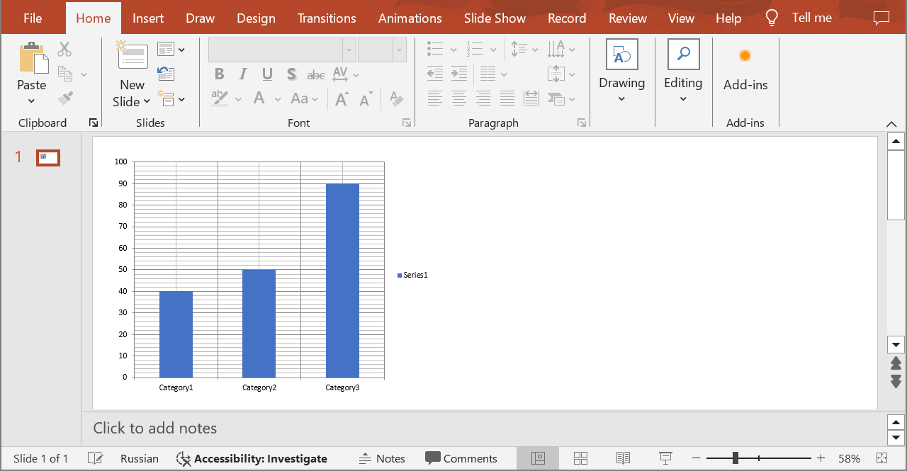

## **Introduction**

The value of a chart data point can be calculated based on a formula. Formulas can be specified for values, x-values, y-values, and bubble sizes. You can use formulas in the case when an Excel workbook is used as the data source.

The code examples below use the `CreateShape` method described in [Add a Shape to a Slide](/slides/add-a-shape-to-a-slide/).

## **Examples**

The code examples below show how to use the formula for calculating the value of the **third** data point in the **first** data series when creating a chart. The formula looks like **SUM(B2:B3)**. It means that the third data point value is the sum of the first two data point values.

**cURL Example**





**Get an Access Token**

```sh
curl POST "https://api.aspose.cloud/connect/token" \
     -d "grant_type=client_credentials&client_id=MyClientId&client_secret=MyClientSecret" \
     -H "Content-Type: application/x-www-form-urlencoded"
```

**Create the Chart**

```sh
curl POST "https://api.aspose.cloud/v3.0/slides/MyPresentation.pptx/slides/1/shapes" \
     -H "authorization: Bearer MyAccessToken" \
	 -H "Content-Type: text/json" \
     -d @Chart.json 

```

Chart.json content:
```json
{
    "type": "Chart",
    "chartType": "ClusteredColumn",
    "x": 20,
    "y": 20,
    "width": 400,
    "height": 300,
	"dataSourceForCategories" : {
		"type": "workbook",
		"woksheetIndex": 1,
		"columnIndex": 1,
		"rowIndex": 2
	},
    "categories": [
        { "Value": "Category1" },
        { "Value": "Category2" },
        { "Value": "Category3" }
    ],
    "series": [
        {
            "dataPointType": "OneValue",
			"dataSourecForSeriesName" : {
				"type": "workbook",
				"woksheetIndex": 1,
				"columnIndex": 2,
				"rowIndex": 1
			},
			"name": "Series1",
			"dataSourceForValues" : {
				"type": "workbook",
				"woksheetIndex": 1,
				"columnIndex": 2,
				"rowIndex": 2
			},
            "dataPoints": [
                { "value": 40 },
                { "value": 50 },
                { "valueFormula": "SUM(B2:B3)" }
            ]
		}
    ]              
}
```





```text
Code: 200
Returns shape info.
```





**SDK Examples**

**SDK Solutions**





```cs
using System;
using System.Collections.Generic;
using Aspose.Slides.Cloud.Sdk;
using Aspose.Slides.Cloud.Sdk.Model;

class Application
{
    static void Main(string[] args)
    {
        SlidesApi slidesApi = new SlidesApi("MyClientId", "MyClientSecret");

        string fileName = "MyPresentation.pptx";
        int slideIndex = 1;

        Chart chartData = new Chart
        {
            ChartType = Chart.ChartTypeEnum.ClusteredColumn,
            X = 20,
            Y = 20,
            Width = 400,
            Height = 300,
            DataSourceForCategories = new Workbook
            {
                WorksheetIndex = 1,
                ColumnIndex = 1,
                RowIndex = 2
            },
            Categories = new List<ChartCategory>
            {
                new ChartCategory { Value = "Category1" },
                new ChartCategory { Value = "Category2" },
                new ChartCategory { Value = "Category3" }
            },
            Series = new List<Series>
            {
                new OneValueSeries
                {
                    Name = "Series1",
                    DataSourceForSeriesName = new Workbook
                    {
                        WorksheetIndex = 1,
                        ColumnIndex = 2,
                        RowIndex = 1
                    },
                    DataSourceForValues = new Workbook
                    {
                        WorksheetIndex = 1,
                        ColumnIndex = 2,
                        RowIndex = 2
                    },
                    DataPoints = new List<OneValueChartDataPoint>
                    {
                        new OneValueChartDataPoint { Value = 40 },
                        new OneValueChartDataPoint { Value = 50 },
                        new OneValueChartDataPoint { ValueFormula = "SUM(B2:B3)" }
                    }
                }
            }
        };

        Chart chart = (Chart)slidesApi.CreateShape(fileName, slideIndex, chartData);

        OneValueSeries series = (OneValueSeries)chart.Series[0];
        double? pointValue = series.DataPoints[2].Value;
        Console.WriteLine("The third data point value: " + pointValue); // 90
    }
}
```





```java
import com.aspose.slides.ApiException;
import com.aspose.slides.api.SlidesApi;
import com.aspose.slides.model.Chart;
import com.aspose.slides.model.Workbook;
import com.aspose.slides.model.ChartCategory;
import com.aspose.slides.model.OneValueSeries;
import com.aspose.slides.model.OneValueChartDataPoint;

import java.util.Arrays;

public class Application {
    public static void main(String[] args) throws ApiException {
        SlidesApi slidesApi = new SlidesApi("MyClientId", "MyClientSecret");

        String fileName = "MyPresentation.pptx";
        int slideIndex = 1;

        Chart chartData = new Chart();
        chartData.setChartType(Chart.ChartTypeEnum.CLUSTEREDCOLUMN);
        chartData.setX(20.0);
        chartData.setY(20.0);
        chartData.setWidth(400.0);
        chartData.setHeight(300.0);

        Workbook dataSourceForCategories = new Workbook();
        dataSourceForCategories.setWorksheetIndex(1);
        dataSourceForCategories.setColumnIndex(1);
        dataSourceForCategories.setRowIndex(2);

        chartData.setDataSourceForCategories(dataSourceForCategories);

        ChartCategory category1 = new ChartCategory();
        category1.setValue("Category1");
        ChartCategory category2 = new ChartCategory();
        category2.setValue("Category2");
        ChartCategory category3 = new ChartCategory();
        category3.setValue("Category3");

        chartData.setCategories(Arrays.asList(category1, category2, category3));

        OneValueSeries series1 = new OneValueSeries();
        series1.setName("Series1");

        Workbook dataSourceForSeries1Name = new Workbook();
        dataSourceForSeries1Name.setWorksheetIndex(1);
        dataSourceForSeries1Name.setColumnIndex(2);
        dataSourceForSeries1Name.setRowIndex(1);

        series1.setDataSourceForSeriesName(dataSourceForSeries1Name);

        Workbook dataSourceForSeries1Values = new Workbook();
        dataSourceForSeries1Values.setWorksheetIndex(1);
        dataSourceForSeries1Values.setColumnIndex(2);
        dataSourceForSeries1Values.setRowIndex(2);

        series1.setDataSourceForSeriesName(dataSourceForSeries1Values);

        OneValueChartDataPoint dataPoint11 = new OneValueChartDataPoint();
        dataPoint11.setValue(40.0);
        OneValueChartDataPoint dataPoint12 = new OneValueChartDataPoint();
        dataPoint12.setValue(50.0);
        OneValueChartDataPoint dataPoint13 = new OneValueChartDataPoint();
        dataPoint13.setValueFormula("SUM(B2:B3)");

        series1.setDataPoints(Arrays.asList(dataPoint11, dataPoint12, dataPoint13));

        chartData.setSeries(Arrays.asList(series1));

        Chart chart = (Chart)slidesApi.createShape(fileName, slideIndex, chartData, null, null, null, null, null, null);

        OneValueSeries series = (OneValueSeries)chart.getSeries().get(0);
        double pointValue = series.getDataPoints().get(2).getValue();
        System.out.println("The third data point value: " + pointValue); // 90.0
    }
}
```





```php
use Aspose\Slides\Cloud\Sdk\Api\Configuration;
use Aspose\Slides\Cloud\Sdk\Api\SlidesApi;
use Aspose\Slides\Cloud\Sdk\Model\Chart;
use Aspose\Slides\Cloud\Sdk\Model\Workbook;
use Aspose\Slides\Cloud\Sdk\Model\ChartCategory;
use Aspose\Slides\Cloud\Sdk\Model\OneValueSeries;
use Aspose\Slides\Cloud\Sdk\Model\OneValueChartDataPoint;

$configuration = new Configuration();
$configuration->setAppSid("MyClientId");
$configuration->setAppKey("MyClientSecret");

$slidesApi = new SlidesApi(null, $configuration);

$fileName = "MyPresentation.pptx";
$slideIndex = 1;

$chartData = new Chart();
$chartData->setChartType("ClusteredColumn");
$chartData->setX(20);
$chartData->setY(20);
$chartData->setWidth(400);
$chartData->setHeight(300);

$categoryDataSource = new Workbook();
$categoryDataSource->setWorksheetIndex(1);
$categoryDataSource->setColumnIndex(1);
$categoryDataSource->setRowIndex(2);

$chartData->setDataSourceForCategories($categoryDataSource);

$category1 = new ChartCategory();
$category1->setValue("Category1");
$category2 = new ChartCategory();
$category2->setValue("Category2");
$category3 = new ChartCategory();
$category3->setValue("Category3");

$chartData->setCategories([ $category1, $category2, $category3 ]);

$series1 = new OneValueSeries();
$series1->setName("Series1");

$series1NameDataSource = new Workbook();
$series1NameDataSource->setWorksheetIndex(1);
$series1NameDataSource->setColumnIndex(2);
$series1NameDataSource->setRowIndex(1);

$series1->setDataSourceForSeriesName($series1NameDataSource);

$values1DataSource = new Workbook();
$values1DataSource->setWorksheetIndex(1);
$values1DataSource->setColumnIndex(2);
$values1DataSource->setRowIndex(2);

$series1->setDataSourceForValues($values1DataSource);

$dataPoint11 = new OneValueChartDataPoint();
$dataPoint11->setValue(40);
$dataPoint12 = new OneValueChartDataPoint();
$dataPoint12->setValue(50);
$dataPoint13 = new OneValueChartDataPoint();
$dataPoint13->setValueFormula("SUM(B2:B3)");

$series1->setDataPoints([ $dataPoint11, $dataPoint12, $dataPoint13 ]);

$chartData->setSeries([ $series1 ]);

$chart = $slidesApi->createShape($fileName, $slideIndex, $chartData);

$pointValue = $chart->getSeries()[0]->getDataPoints()[2]->getValue();
print("The third data point value: " . $pointValue); // 90
```





```rb
require "aspose_slides_cloud"

include AsposeSlidesCloud

configuration = Configuration.new
configuration.app_sid = "MyClientId"
configuration.app_key = "MyClientSecret"

slides_api = SlidesApi.new(configuration)

file_name = "MyPresentation.pptx"
slide_index = 1

chart_data = AsposeSlidesCloud::Chart.new
chart_data.chart_type = "ClusteredColumn"
chart_data.x = 20
chart_data.y = 20
chart_data.width = 400
chart_data.height = 300

data_source_for_categories = AsposeSlidesCloud::Workbook.new
data_source_for_categories.worksheet_index = 1
data_source_for_categories.column_index = 1
data_source_for_categories.row_index = 2

chart_data.data_source_for_categories = data_source_for_categories

category1 = AsposeSlidesCloud::ChartCategory.new
category1.value = "Category1"
category2 = AsposeSlidesCloud::ChartCategory.new
category2.value = "Category2"
category3 = AsposeSlidesCloud::ChartCategory.new
category3.value = "Category3"

chart_data.categories = [category1, category2, category3]

series1 = AsposeSlidesCloud::OneValueSeries.new
series1.name = "Series1"

data_source_for_series1_name = AsposeSlidesCloud::Workbook.new
data_source_for_series1_name.worksheet_index = 1
data_source_for_series1_name.column_index = 2
data_source_for_series1_name.row_index = 1

series1.data_source_for_series_name = data_source_for_series1_name    

data_source_for_series1_values =  AsposeSlidesCloud::Workbook.new
data_source_for_series1_values.worksheet_index = 1
data_source_for_series1_values.column_index = 2
data_source_for_series1_values.row_index = 2

series1.data_source_for_values = data_source_for_series1_values

point11 = AsposeSlidesCloud::OneValueChartDataPoint.new
point11.value = 40
point12 = AsposeSlidesCloud::OneValueChartDataPoint.new
point12.value = 50
point13 = AsposeSlidesCloud::OneValueChartDataPoint.new
point13.value_formula = "SUM(B2:B3)"

series1.data_points = [point11, point12, point13]

chart_data.series = [series1]

chart = slides_api.create_shape(file_name, slide_index, chart_data)

point_value = chart.series[0].data_points[2].value
puts "The third data point value: #{point_value}" # 90
```





```py
from asposeslidescloud.apis import SlidesApi
from asposeslidescloud.models import Chart
from asposeslidescloud.models import Workbook
from asposeslidescloud.models import ChartCategory
from asposeslidescloud.models import OneValueSeries
from asposeslidescloud.models import OneValueChartDataPoint

slides_api = SlidesApi(None, "MyClientId", "MyClientSecret")

file_name = "MyPresentation.pptx"
slide_index = 1

chart_data = Chart()
chart_data.chart_type = "ClusteredColumn"
chart_data.x = 20
chart_data.y = 20
chart_data.width = 400
chart_data.height = 300

categories_data_source = Workbook()
categories_data_source.worksheet_index = 1
categories_data_source.row_index = 2
categories_data_source.column_index = 1

chart_data.data_source_for_categories = categories_data_source

category1 = ChartCategory()
category1.value = "Category1"
category2 = ChartCategory()
category2.value = "Category2"
category3 = ChartCategory()
category3.value = "Category3"

chart_data.categories = [category1, category2, category3]

series1 = OneValueSeries()
series1.name = "Series1"

series1_name_data_source = Workbook()
series1_name_data_source.worksheet_index = 1
series1_name_data_source.column_index = 2
series1_name_data_source.row_index = 1

series1.data_source_for_series_name = series1_name_data_source

series1_values_data_source = Workbook()
series1_values_data_source.worksheet_index = 1
series1_values_data_source.column_index = 2
series1_values_data_source.row_index = 2

series1.data_source_for_values = series1_values_data_source

point11 = OneValueChartDataPoint()
point11.value = 40
point12 = OneValueChartDataPoint()
point12.value = 50
point13 = OneValueChartDataPoint()
point13.value_formula = "SUM(B2:B3)"

series1.data_points = [point11, point12, point13]

chart_data.series = [series1]

chart = slides_api.create_shape(file_name, slide_index, chart_data)

point_value = chart.series[0].data_points[2].value
print("The third data point value: ", point_value)  # 90
```





```js
const cloudSdk = require("asposeslidescloud");

const slidesApi = new cloudSdk.SlidesApi("MyClientId", "MyClientSecret");

fileName = "MyPresentation.pptx";
slideIndex = 1;

chartData = new cloudSdk.Chart();
chartData.chartType = cloudSdk.Chart.ChartTypeEnum.ClusteredColumn;
chartData.x = 20;
chartData.y = 20;
chartData.width = 400;
chartData.height = 300;

dataSourceForCategories = new cloudSdk.Workbook();
dataSourceForCategories.worksheetIndex = 1;
dataSourceForCategories.columnIndex = 1;
dataSourceForCategories.rowIndex = 2;

chartData.dataSourceForCategories = dataSourceForCategories;

chartData.categories = [{value: "Category1"}, {value: "Category2"}, {value: "Category3"}];

series1 = new cloudSdk.OneValueSeries();
series1.name = "Series1";

dataSourceForSeriesName1 = new cloudSdk.Workbook();
dataSourceForSeriesName1.worksheetIndex = 1;
dataSourceForSeriesName1.columnIndex = 2;
dataSourceForSeriesName1.rowIndex = 1;

series1.dataSourceForSeriesName = dataSourceForSeriesName1;

dataSourceForValues1 = new cloudSdk.Workbook();
dataSourceForValues1.worksheetIndex = 1;
dataSourceForValues1.columnIndex = 2;
dataSourceForValues1.rowIndex = 2;

series1.dataSourceForValues = dataSourceForValues1;

series1.dataPoints = [{value: 40}, {value: 50}, {type: "OneValue", valueFormula: "SUM(B2:B3)"}];  

chartData.series = [series1];
                
slidesApi.createShape(fileName, slideIndex, chartData).then(chart => {
    pointValue = chart.body.series[0].dataPoints[2].value;
    console.log("The third data point value:", pointValue); // 90
});
```





```cpp
#include "asposeslidescloud/api/SlidesApi.h"
#include "asposeslidescloud/model/Workbook.h"
#include "asposeslidescloud/model/OneValueSeries.h"

using namespace asposeslidescloud::api;

int main()
{
    std::shared_ptr<SlidesApi> slidesApi = std::make_shared<SlidesApi>(L"MyClientId", L"MyClientSecret");

    const wchar_t* fileName = L"MyPresentation.pptx";
    int slideIndex = 1;

    std::shared_ptr<Chart> chartData = std::make_shared<Chart>();
    chartData->setChartType(L"ClusteredColumn");
    chartData->setX(20);
    chartData->setY(20);
    chartData->setWidth(400);
    chartData->setHeight(300);

    std::shared_ptr<Workbook> dataSourceForCategories = std::make_shared<Workbook>();
    dataSourceForCategories->setWorksheetIndex(1);
    dataSourceForCategories->setColumnIndex(1);
    dataSourceForCategories->setRowIndex(2);

    chartData->setDataSourceForCategories(dataSourceForCategories);

    std::shared_ptr<ChartCategory> category1 = std::make_shared<ChartCategory>();
    category1->setValue(L"Category1");
    std::shared_ptr<ChartCategory> category2 = std::make_shared<ChartCategory>();
    category2->setValue(L"Category2");
    std::shared_ptr<ChartCategory> category3 = std::make_shared<ChartCategory>();
    category3->setValue(L"Category3");

    chartData->setCategories({ category1, category2, category3 });

    std::shared_ptr<OneValueSeries> series1 = std::make_shared<OneValueSeries>();
    series1->setName(L"Series1");

    std::shared_ptr<Workbook> dataSourceForSeries1Name = std::make_shared<Workbook>();
    dataSourceForSeries1Name->setWorksheetIndex(1);
    dataSourceForSeries1Name->setColumnIndex(2);
    dataSourceForSeries1Name->setRowIndex(1);

    series1->setDataSourceForSeriesName(dataSourceForSeries1Name);

    std::shared_ptr<Workbook> dataSourceForSeries1Values = std::make_shared<Workbook>();
    dataSourceForSeries1Values->setWorksheetIndex(1);
    dataSourceForSeries1Values->setColumnIndex(2);
    dataSourceForSeries1Values->setRowIndex(2);

    series1->setDataSourceForSeriesName(dataSourceForSeries1Values);

    std::shared_ptr<OneValueChartDataPoint> dataPoint11 = std::make_shared<OneValueChartDataPoint>();
    dataPoint11->setValue(40);
    std::shared_ptr<OneValueChartDataPoint> dataPoint12 = std::make_shared<OneValueChartDataPoint>();
    dataPoint12->setValue(50);
    std::shared_ptr<OneValueChartDataPoint> dataPoint13 = std::make_shared<OneValueChartDataPoint>();
    dataPoint13->setValueFormula(L"SUM(B2:B3)");

    series1->setDataPoints({ dataPoint11, dataPoint12, dataPoint13 });

    chartData->setSeries({ series1 });

    std::shared_ptr<Chart> chart = std::static_pointer_cast<Chart>(slidesApi->createShape(fileName, slideIndex, chartData).get());

    std::shared_ptr<OneValueSeries> series = std::static_pointer_cast<OneValueSeries>(chart->getSeries()[0]);
    double pointValue = series->getDataPoints()[2]->getValue();
    std::wcout << L"The third data point value: " << pointValue; // 90
}
```





```pl
use AsposeSlidesCloud::Configuration;
use AsposeSlidesCloud::SlidesApi;
use AsposeSlidesCloud::Object::Chart;
use AsposeSlidesCloud::Object::Workbook;
use AsposeSlidesCloud::Object::ChartCategory;
use AsposeSlidesCloud::Object::OneValueSeries;
use AsposeSlidesCloud::Object::OneValueChartDataPoint;

my $configuration = AsposeSlidesCloud::Configuration->new();
$configuration->{app_sid} = "MyClientId";
$configuration->{app_key} = "MyClientSecret";

my $slides_api = AsposeSlidesCloud::SlidesApi->new(config => $configuration);

my $file_name = "MyPresentation.pptx";
my $slide_index = 1;

my $chart_data = AsposeSlidesCloud::Object::Chart->new();
$chart_data->{chart_type} = "ClusteredColumn";
$chart_data->{x} = 20;
$chart_data->{y} = 20;
$chart_data->{width} = 400;
$chart_data->{height} = 300;

my $data_source_for_categories = AsposeSlidesCloud::Object::Workbook->new();
$data_source_for_categories->{worksheet_index} = 1;
$data_source_for_categories->{column_index} = 1;
$data_source_for_categories->{row_index} = 2;

$chart_data->{data_source_for_categories} = $data_source_for_categories;

my $category1 = AsposeSlidesCloud::Object::ChartCategory->new();
$category1->{value} = "Category1";
my $category2 = AsposeSlidesCloud::Object::ChartCategory->new();
$category2->{value} = "Category2";
my $category3 = AsposeSlidesCloud::Object::ChartCategory->new();
$category3->{value} = "Category3";

$chart_data->{categories} = [$category1, $category2, $category3];

my $series1 = AsposeSlidesCloud::Object::OneValueSeries->new();
$series1->{name} = "Series1";

my $data_source_for_series1_name = AsposeSlidesCloud::Object::Workbook->new();
$data_source_for_series1_name->{worksheet_index} = 1;
$data_source_for_series1_name->{column_index} = 2;
$data_source_for_series1_name->{row_index} = 1;

$series1->{data_source_for_series_name} = $data_source_for_series1_name;

my $data_source_for_series1_values = AsposeSlidesCloud::Object::Workbook->new();
$data_source_for_series1_values->{worksheet_index} = 1;
$data_source_for_series1_values->{column_index} = 2;
$data_source_for_series1_values->{row_index} = 2;

$series1->{data_source_for_values} = $data_source_for_series1_values;

my $point11 = AsposeSlidesCloud::Object::OneValueChartDataPoint->new();
$point11->{value} = 40;
my $point12 = AsposeSlidesCloud::Object::OneValueChartDataPoint->new();
$point12->{value} = 50;
my $point13 = AsposeSlidesCloud::Object::OneValueChartDataPoint->new();
$point13->{value_formula} = "SUM(B2:B3)";

$series1->{data_points} = [$point11, $point12, $point13];

$chart_data->{series} = [$series1];

my $chart = $slides_api->create_shape(
    name => $file_name, slide_index => $slide_index, dto => $chart_data);

my $point_value = $chart->{series}[0]{data_points}[2]->{value};
print "The third data point value: ", $point_value; # 90
```









```go
import (
	"fmt"

	asposeslidescloud "github.com/aspose-slides-cloud/aspose-slides-cloud-go/v24"
)

func main() {
	configuration := asposeslidescloud.NewConfiguration()
	configuration.AppSid = "MyClientId"
	configuration.AppKey = "MyClientSecret"

	slidesApi := asposeslidescloud.NewAPIClient(configuration).SlidesApi

	fileName := "MyPresentation.pptx"
	var slideIndex int32 = 1

	chartData := asposeslidescloud.NewChart()
	chartData.ChartType = "ClusteredColumn"
	chartData.X = 20
	chartData.Y = 20
	chartData.Width = 400
	chartData.Height = 300

	dataSourceForCategories := asposeslidescloud.NewWorkbook()
	dataSourceForCategories.WorksheetIndex = 1
	dataSourceForCategories.ColumnIndex = 1
	dataSourceForCategories.RowIndex = 2

	chartData.DataSourceForCategories = dataSourceForCategories

	category1 := asposeslidescloud.NewChartCategory()
	category1.Value = "Category1"
	category2 := asposeslidescloud.NewChartCategory()
	category2.Value = "Category2"
	category3 := asposeslidescloud.NewChartCategory()
	category3.Value = "Category3"

	chartData.Categories = []asposeslidescloud.IChartCategory{category1, category2, category3}

	series1 := asposeslidescloud.NewOneValueSeries()
	series1.Name = "Series1"

	dataSourceForSeries1Name := asposeslidescloud.NewWorkbook()
	dataSourceForSeries1Name.WorksheetIndex = 1
	dataSourceForSeries1Name.ColumnIndex = 2
	dataSourceForSeries1Name.RowIndex = 1

	series1.DataSourceForSeriesName = dataSourceForSeries1Name

	dataSourceForSeries1Values := asposeslidescloud.NewWorkbook()
	dataSourceForSeries1Values.WorksheetIndex = 1
	dataSourceForSeries1Values.ColumnIndex = 2
	dataSourceForSeries1Values.RowIndex = 2

	series1.DataSourceForValues = dataSourceForSeries1Values

	point11 := asposeslidescloud.NewOneValueChartDataPoint()
	point11.Value = 40
	point12 := asposeslidescloud.NewOneValueChartDataPoint()
	point12.Value = 50
	point13 := asposeslidescloud.NewOneValueChartDataPoint()
	point13.ValueFormula = "SUM(B2:B3)"

	series1.DataPoints = []asposeslidescloud.IOneValueChartDataPoint{point11, point12, point13}

	chartData.Series = []asposeslidescloud.ISeries{series1}

	chart, _, _ := slidesApi.CreateShape(fileName, slideIndex, chartData, nil, nil, "", "", "", "")

	series := chart.(asposeslidescloud.IChart).GetSeries()[0].(asposeslidescloud.IOneValueSeries)
	pointValue := series.GetDataPoints()[2].GetValue()
	fmt.Println("The third data point value:", pointValue) // 90
}
```





The result:



## **SDKs**

Check [Available SDKs](/slides/available-sdks/) to learn how to add an SDK to your project.
