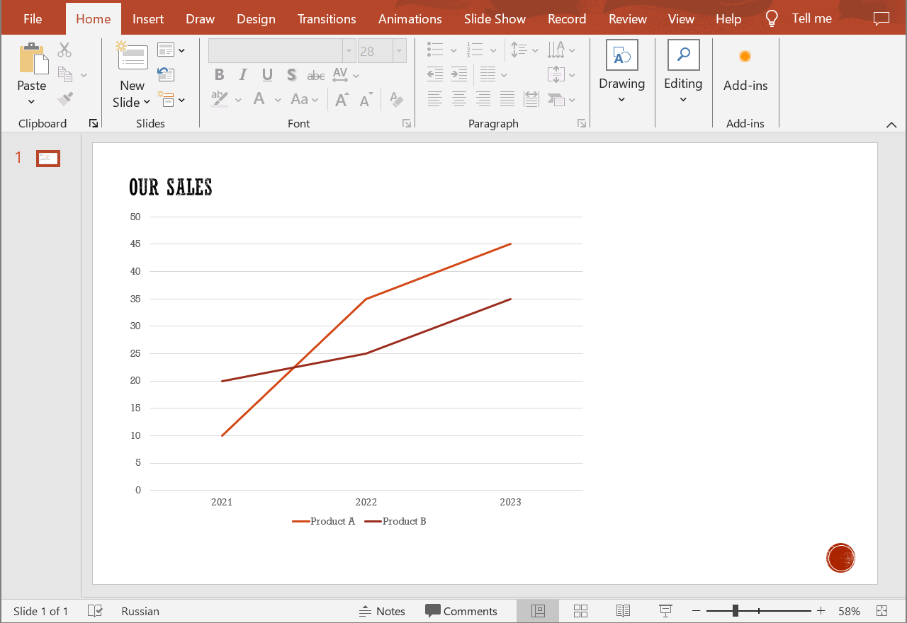

## **Introduction**

In Microsoft PowerPoint, chart series refer to the data sets or collections of data points that are represented on a chart. When you create a chart in PowerPoint, you typically have multiple sets of data that you want to visualize, and each of these sets is known as a chart series. Chart series are essential for conveying information effectively and comparing different data categories. Use the following method to add a chart series to a presentation chart.

## **CreateChartSeries**

### **API Information**

|**API**|**Type**|**Description**|**Resource**|
| :- | :- | :- | :- |
|/slides/{name}/slides/{slideIndex}/shapes/{shapeIndex}/series|POST|Adds a data series to a chart in a presentation saved in a storage.|[CreateChartSeries](https://apireference.aspose.cloud/slides/#/Chart/CreateChartSeries)|

**Request Parameters**

|**Name**|**Type**|**Location**|**Required**|**Description**|
| :- | :- | :- | :- | :- |
|name|string|path|true|The name of a presentation file saved in a storage.|
|slideIndex|integer|path|true|The 1-based index of a presentation slide.|
|shapeIndex|integer|path|true|The 1-based index of a shape (must be a chart).|
|series|`Series`|body|true|The data transfer object with a series of data.|
|password|string|header|false|The password to open the presentation.|
|folder|string|query|false|The path to a folder containing the presentation.|
|storage|string|query|false|The name of the storage contaning the folder.|

### **Examples**

The document **MyPresentation.pptx**, saved in the **default** storage, contains a chart (the **first** shape) with two lines on the **first** slide - sales volumes of products "Product A" and "Product B" for 2021 to 2023. Add series data (**30**, **20**, **25**) on the sales of **Product C** for the same years.

{}
The referenced shape must be a chart, otherwise the operation will fail.
{}



**cURL Solution**





**Get an Access Token**

```sh
curl POST "https://api.aspose.cloud/connect/token" \
     -d "grant_type=client_credentials&client_id=MyClientId&client_secret=MyClientSecret" \
     -H "Content-Type: application/x-www-form-urlencoded"
```

**Add the Data Series**

```sh
curl -X POST "https://api.aspose.cloud/v3.0/slides/MyPresentation.pptx/slides/1/shapes/1/series" \
     -H "authorization: Bearer MyAccessToken" \
     -H "Content-Type: application/json" \
     -d @DataSeries.json
```

DataSeries.json content:
```json
{
  "DataPointType": "OneValue",
  "Name": "Product C",
  "DataPoints": [
    { "Value": 30 },
    { "Value": 20 },
    { "Value": 25 }
  ]
}
```





```text
Code: 201
Body: Chart JSON
```





**SDK Solutions**





```csharp
using System;
using System.Collections.Generic;

using Aspose.Slides.Cloud.Sdk;
using Aspose.Slides.Cloud.Sdk.Model;

class Application
{
    static void Main(string[] args)
    {
        SlidesApi slidesApi = new SlidesApi("MyClientId", "MyClientSecret");

        string fileName = "MyPresentation.pptx";
        int slideIndex = 1;
        int shapeIndex = 1;

        OneValueSeries dataSeries = new OneValueSeries
        {
            Name = "Product C",
            DataPoints = new List<OneValueChartDataPoint>
            {
                new OneValueChartDataPoint { Value = 30 },
                new OneValueChartDataPoint { Value = 20 },
                new OneValueChartDataPoint { Value = 25 }
            }
        };

        Chart chart = slidesApi.CreateChartSeries(fileName, slideIndex, shapeIndex, dataSeries);

        int seriesCount = chart.Series.Count;
        Console.WriteLine($"Number of data series: {seriesCount}");
    }
}
```





```java
import com.aspose.slides.ApiException;
import com.aspose.slides.api.SlidesApi;
import com.aspose.slides.model.Chart;
import com.aspose.slides.model.OneValueChartDataPoint;
import com.aspose.slides.model.OneValueSeries;

import java.util.Arrays;

public class Application {
    public static void main(String[] args) throws ApiException {
        SlidesApi slidesApi = new SlidesApi("MyClientId", "MyClientSecret");

        String fileName = "MyPresentation.pptx";
        int slideIndex = 1;
        int shapeIndex = 1;

        OneValueChartDataPoint dataPoint1 = new OneValueChartDataPoint();
        dataPoint1.setValue(30d);

        OneValueChartDataPoint dataPoint2 = new OneValueChartDataPoint();
        dataPoint2.setValue(20d);

        OneValueChartDataPoint dataPoint3 = new OneValueChartDataPoint();
        dataPoint3.setValue(25d);

        OneValueSeries dataSeries = new OneValueSeries();
        dataSeries.setName("Product C");
        dataSeries.setDataPoints(Arrays.asList(dataPoint1, dataPoint2, dataPoint3));

        Chart chart = slidesApi.createChartSeries(fileName, slideIndex, shapeIndex, dataSeries, null, null, null);

        int seriesCount = chart.getSeries().size();
        System.out.println("Number of data series: " + seriesCount);
    }
}
```





```php
use Aspose\Slides\Cloud\Sdk\Api\Configuration;
use Aspose\Slides\Cloud\Sdk\Api\SlidesApi;
use Aspose\Slides\Cloud\Sdk\Model\OneValueChartDataPoint;
use Aspose\Slides\Cloud\Sdk\Model\OneValueSeries;

$configuration = new Configuration();
$configuration->setAppSid("MyClientId");
$configuration->setAppKey("MyClientSecret");

$slidesApi = new SlidesApi(null, $configuration);

$fileName = "MyPresentation.pptx";
$slideIndex = 1;
$shapeIndex = 1;

$dataPoint1 = new OneValueChartDataPoint();
$dataPoint1->setValue(30);

$dataPoint2 = new OneValueChartDataPoint();
$dataPoint2->setValue(20);

$dataPoint3 = new OneValueChartDataPoint();
$dataPoint3->setValue(25);

$dataSeries = new OneValueSeries();
$dataSeries->setName("Product C");
$dataSeries->setDataPoints([$dataPoint1, $dataPoint2, $dataPoint3]);

$chart = $slidesApi->createChartSeries($fileName, $slideIndex, $shapeIndex, $dataSeries);

$seriesCount = count($chart->getSeries());
echo "Number of data series: ", $seriesCount;
```





```ruby
require "aspose_slides_cloud"

include AsposeSlidesCloud

configuration = Configuration.new
configuration.app_sid = "MyClientId"
configuration.app_key = "MyClientSecret"

slides_api = SlidesApi.new(configuration)

file_name = "MyPresentation.pptx"
slide_index = 1
shape_index = 1

data_point1 = OneValueChartDataPoint.new
data_point1.value = 30

data_point2 = OneValueChartDataPoint.new
data_point2.value = 20

data_point3 = OneValueChartDataPoint.new
data_point3.value = 25

data_series = OneValueSeries.new
data_series.name = "Product C"
data_series.data_points = [data_point1, data_point2, data_point3]

chart = slides_api.create_chart_series(file_name, slide_index, shape_index, data_series)

series_count = chart.series.length()
puts "Number of data series: #{series_count}"
```





```python
from asposeslidescloud.apis.slides_api import SlidesApi
from asposeslidescloud.models.one_value_chart_data_point import OneValueChartDataPoint
from asposeslidescloud.models.one_value_series import OneValueSeries

slides_api = SlidesApi(None, "MyClientId", "MyClientSecret")

file_name = "MyPresentation.pptx"
slide_index = 1
shape_index = 1

data_point1 = OneValueChartDataPoint()
data_point1.value = 30

data_point2 = OneValueChartDataPoint()
data_point2.value = 20

data_point3 = OneValueChartDataPoint()
data_point3.value = 25

data_series = OneValueSeries()
data_series.name = "Product C"
data_series.data_points = [data_point1, data_point2, data_point3]

chart = slides_api.create_chart_series(file_name, slide_index, shape_index, data_series)

series_count = len(chart.series)
print("Number of data series:", series_count)
```





```js
const cloudSdk = require("asposeslidescloud");

const slidesApi = new cloudSdk.SlidesApi("MyClientId", "MyClientSecret");

fileName = "MyPresentation.pptx";
slideIndex = 1;
shapeIndex = 1;

dataSeries = new cloudSdk.OneValueSeries();
dataSeries.name = "Product C";
dataSeries.dataPoints = [{ value: 30 }, { value: 20 }, { value: 25 }];

slidesApi.createChartSeries(fileName, slideIndex, shapeIndex, dataSeries).then(chart => {
    seriesCount = chart.body.series.length;
    console.log("Number of data series:", seriesCount);
});
```





```cpp
#include "asposeslidescloud/api/SlidesApi.h"
#include "asposeslidescloud/model/OneValueSeries.h"

using namespace asposeslidescloud::api;

int main()
{
    std::shared_ptr<SlidesApi> slidesApi = std::make_shared<SlidesApi>(L"MyClientId", L"MyClientSecret");

    const wchar_t* fileName = L"MyPresentation.pptx";
    int slideIndex = 1;
    int shapeIndex = 1;

    std::shared_ptr<OneValueChartDataPoint> dataPoint1 = std::make_shared<OneValueChartDataPoint>();
    dataPoint1->setValue(30);

    std::shared_ptr<OneValueChartDataPoint> dataPoint2 = std::make_shared<OneValueChartDataPoint>();
    dataPoint2->setValue(20);

    std::shared_ptr<OneValueChartDataPoint> dataPoint3 = std::make_shared<OneValueChartDataPoint>();
    dataPoint3->setValue(25);

    std::shared_ptr<OneValueSeries> dataSeries = std::make_shared<OneValueSeries>();
    dataSeries->setName(L"Product C");
    dataSeries->setDataPoints({ dataPoint1, dataPoint2, dataPoint3 });

    std::shared_ptr<Chart> chart = slidesApi->createChartSeries(fileName, slideIndex, shapeIndex, dataSeries).get();

    int seriesCount = chart->getSeries().size();
    std::wcout << L"Number of data series: " << seriesCount;
}
```





```perl
use AsposeSlidesCloud::Configuration;
use AsposeSlidesCloud::SlidesApi;
use AsposeSlidesCloud::Object::OneValueChartDataPoint;
use AsposeSlidesCloud::Object::OneValueSeries;

my $config = AsposeSlidesCloud::Configuration->new();
$config->{app_sid} = "MyClientId";
$config->{app_key} = "MyClientSecret";

my $slides_api = AsposeSlidesCloud::SlidesApi->new(config => $config);

my $file_name = "MyPresentation.pptx";
my $slide_index = 1;
my $shape_index = 1;

my $data_point1 = AsposeSlidesCloud::Object::OneValueChartDataPoint->new();
$data_point1->{value} = 30;

my $data_point2 = AsposeSlidesCloud::Object::OneValueChartDataPoint->new();
$data_point2->{value} = 20;

my $data_point3 = AsposeSlidesCloud::Object::OneValueChartDataPoint->new();
$data_point3->{value} = 25;

my $data_series = AsposeSlidesCloud::Object::OneValueSeries->new();
$data_series->{name} = "Product C";
$data_series->{data_points} = [$data_point1, $data_point2, $data_point3];

my $chart = $slides_api->create_chart_series(
    name => $file_name, slide_index => $slide_index, shape_index => $shape_index, series => $data_series);

my $series_count = @{$chart->{series}};
print("Number of data series: ", $series_count);
```









```go
cfg := asposeslidescloud.NewConfiguration()
cfg.AppSid = "MyClientId"
cfg.AppKey = "MyClientSecret"

api := asposeslidescloud.NewAPIClient(cfg)

fileName := "MyPresentation.pptx"
slideIndex := 1
shapeIndex := 1

dataPoint1 := asposeslidescloud.NewOneValueChartDataPoint()
dataPoint1.Value = 30

dataPoint2 := asposeslidescloud.NewOneValueChartDataPoint()
dataPoint2.Value = 20

dataPoint3 := asposeslidescloud.NewOneValueChartDataPoint()
dataPoint3.Value = 25

dataSeries := asposeslidescloud.NewOneValueSeries()
dataSeries.DataPoints = []asposeslidescloud.IOneValueChartDataPoint { dataPoint1, dataPoint2, dataPoint3 }

result, _, e := api.SlidesApi.CreateChartSeries(fileName, slideIndex, shapeIndex, dataSeries, "", "", "")
if e != nil {
    fmt.Printf("Error: %v.", e)
} else {
    fmt.Printf("Number of data series: %v", len(result.(asposeslidescloud.IChart).GetSeries()))
}
```





The result:


## **SDKs**

Check [Available SDKs](/slides/available-sdks/) to learn how to add an SDK to your project.
                   2