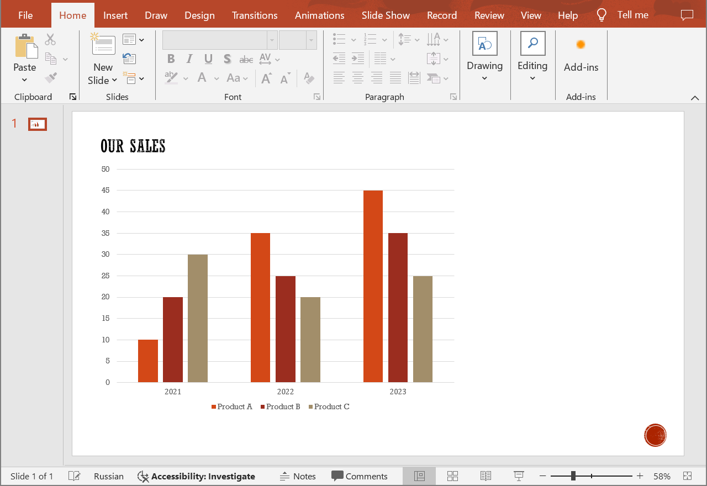

## **Introduction**

A group of chart data series contains series properties that are common for each series in the group. Series groups are generated automatically based on types of series contained in the chart object. Aspose.Slide Cloud allows you to retrieve such groups and update their properties.

## **SetChartSeriesGroup**

### **API Information**

|**API**|**Type**|**Description**|**Resource**|
| :- | :- | :- | :- |
|/slides/{name}/slides/{slideIndex}/shapes/{shapeIndex}/seriesGroup/{seriesGroupIndex}|PUT|Updates properties of a chart data series group in a presentation saved in a storage.|[SetChartSeriesGroup](https://reference.aspose.cloud/slides/#/Chart/SetChartSeriesGroup)|

**Request Parameters**

|**Name**|**Type**|**Location**|**Required**|**Description**|
| :- | :- | :- | :- | :- |
|name|string|path|true|The name of a presentation file.|
|slideIndex|integer|path|true|The 1-based index of a presentation slide.|
|shapeIndex|integer|path|true|The 1-based index of a shape (must be a chart).|
|seriesGroupIndex|integer|path|true|The 1-based index of a series group.|
|seriesGroup|`ChartSeriesGroup`|body|true|The data transfer object with the group properties.|
|password|string|header|false|The password to open the presentation.|
|folder|string|query|false|The path to the folder containing the presentation file.|
|storage|string|query|false|The name of the storage contaning the folder.|

### **Examples**

The document **MyPresentation.pptx**, saved in the **default** storage, contains a column chart (the **second** shape) on the **first** slide. Set the chart column **overlap** to **50%** of the column width.



**cURL Solution**





**Get an Access Token**

```sh
curl POST "https://api.aspose.cloud/connect/token" \
     -d "grant_type=client_credentials&client_id=MyClientId&client_secret=MyClientSecret" \
     -H "Content-Type: application/x-www-form-urlencoded"
```

**Set the Group Properties**

```sh
curl -X PUT "https://api.aspose.cloud/v3.0/slides/MyPresentation.pptx/slides/1/shapes/2/seriesGroup/1" \
     -H "authorization: Bearer MyAccessToken" \
     -H "Content-Type: application/json" \
     -d @SeriesGroup.json
```

SeriesGroup.json content:
```json
{
  "Overlap": 50
}
```




```text
Code: 200
Body: Chart JSON
```





**SDK Solutions**





```csharp
using System;

using Aspose.Slides.Cloud.Sdk;
using Aspose.Slides.Cloud.Sdk.Model;

class Application
{
    static void Main(string[] args)
    {
        SlidesApi slidesApi = new SlidesApi("MyClientId", "MyClientSecret");

        string fileName = "MyPresentation.pptx";
        int slideIndex = 1;
        int shapeIndex = 2;
        int seriesGroupIndex = 1;

        ChartSeriesGroup seriesGroup = new ChartSeriesGroup
        {
            Overlap = 50
        };
       
        Chart chart = slidesApi.SetChartSeriesGroup(fileName, slideIndex, shapeIndex, seriesGroupIndex, seriesGroup);

        int groupCount = chart.SeriesGroups.Count;
        Console.WriteLine($"The chart has {groupCount} series group(s).");
    }
}
```





```java
import com.aspose.slides.ApiException;
import com.aspose.slides.api.SlidesApi;
import com.aspose.slides.model.ChartSeriesGroup;
import com.aspose.slides.model.Chart;

public class Application {
    public static void main(String[] args) throws ApiException {
        SlidesApi slidesApi = new SlidesApi("MyClientId", "MyClientSecret");

        String fileName = "MyPresentation.pptx";
        int slideIndex = 1;
        int shapeIndex = 2;
        int seriesGroupIndex = 1;

        ChartSeriesGroup seriesGroup = new ChartSeriesGroup();
        seriesGroup.setOverlap(50);

        Chart chart = slidesApi.setChartSeriesGroup(fileName, slideIndex, shapeIndex, seriesGroupIndex, seriesGroup, null, null, null);

        int groupCount = chart.getSeriesGroups().size();
        System.out.printf("The chart has %d series group(s).", groupCount);
    }
}
```





```php
use Aspose\Slides\Cloud\Sdk\Api\Configuration;
use Aspose\Slides\Cloud\Sdk\Api\SlidesApi;
use Aspose\Slides\Cloud\Sdk\Model\ChartSeriesGroup;

$configuration = new Configuration();
$configuration->setAppSid("MyClientId");
$configuration->setAppKey("MyClientSecret");

$slidesApi = new SlidesApi(null, $configuration);

$fileName = "MyPresentation.pptx";
$slideIndex = 1;
$shapeIndex = 2;
$seriesGroupIndex = 1;

$seriesGroup = new ChartSeriesGroup();
$seriesGroup->setOverlap(50);

$chart = $slidesApi->setChartSeriesGroup($fileName, $slideIndex, $shapeIndex, $seriesGroupIndex, $seriesGroup);

$groupCount = count($chart->getSeriesGroups());
echo "The chart has ", $groupCount, " series group(s).";
```





```ruby
require "aspose_slides_cloud"

include AsposeSlidesCloud

configuration = Configuration.new
configuration.app_sid = "MyClientId"
configuration.app_key = "MyClientSecret"

slides_api = SlidesApi.new(configuration)

file_name = "MyPresentation.pptx"
slide_index = 1
shape_index = 2
series_group_index = 1

series_group = ChartSeriesGroup.new
series_group.overlap = 50

chart = slides_api.set_chart_series_group(file_name, slide_index, shape_index, series_group_index, series_group)

group_count = chart.series_groups.length()
puts "The chart has #{group_count} series group(s)."
```





```python
from asposeslidescloud.apis.slides_api import SlidesApi
from asposeslidescloud.models.chart_series_group import ChartSeriesGroup

slides_api = SlidesApi(None, "MyClientId", "MyClientSecret")

file_name = "MyPresentation.pptx"
slide_index = 1
shape_index = 2
series_group_index = 1

series_group = ChartSeriesGroup()
series_group.overlap = 50

chart = slides_api.set_chart_series_group(file_name, slide_index, shape_index, series_group_index, series_group)

group_count = len(chart.series_groups)
print(f"The chart has {group_count} series group(s).")
```





```js
const cloudSdk = require("asposeslidescloud");

const slidesApi = new cloudSdk.SlidesApi("MyClientId", "MyClientId");

fileName = "MyPresentation.pptx";
slideIndex = 1;
shapeIndex = 2;
seriesGroupIndex = 1;

seriesGroup = new cloudSdk.ChartSeriesGroup();
seriesGroup.overlap = 50;

slidesApi.setChartSeriesGroup(fileName, slideIndex, shapeIndex, seriesGroupIndex, seriesGroup).then(chart => {
    groupCount = chart.body.seriesGroups.length;
    console.log("The chart has", groupCount, "series group(s).");
});
```





```cpp
#include "asposeslidescloud/api/SlidesApi.h"

using namespace asposeslidescloud::api;

int main()
{
    std::shared_ptr<SlidesApi> slidesApi = std::make_shared<SlidesApi>(L"MyClientId", L"MyClientId");

    const wchar_t* fileName = L"MyPresentation.pptx";
    int slideIndex = 1;
    int shapeIndex = 2;
    int seriesGroupIndex = 1;

    std::shared_ptr<ChartSeriesGroup> seriesGroup = std::make_shared<ChartSeriesGroup>();
    seriesGroup->setOverlap(50);

    std::shared_ptr<Chart> chart = slidesApi->setChartSeriesGroup(fileName, slideIndex, shapeIndex, seriesGroupIndex, seriesGroup).get();

    int groupCount = chart->getSeriesGroups().size();
    std::wcout << L"The chart has " << groupCount << " series group(s).";
}
```





```perl
use AsposeSlidesCloud::Configuration;
use AsposeSlidesCloud::SlidesApi;
use AsposeSlidesCloud::Object::ChartSeriesGroup;

my $config = AsposeSlidesCloud::Configuration->new();
$config->{app_sid} = "MyClientId";
$config->{app_key} = "MyClientId";

my $slides_api = AsposeSlidesCloud::SlidesApi->new(config => $config);

my $file_name = "MyPresentation.pptx";
my $slide_index = 1;
my $shape_index = 2;
my $series_group_index = 1;

my $series_group = AsposeSlidesCloud::Object::ChartSeriesGroup->new();
$series_group->{overlap} = 50;

my $chart = $slides_api->set_chart_series_group(
    name => $file_name, slide_index => $slide_index, shape_index => $shape_index, series_group_index => $series_group_index, series_group => $series_group);

my $group_count = @{$chart->{series_groups}};
print("The chart has ", $group_count, " series group(s).");
```









```go
cfg := asposeslidescloud.NewConfiguration()
cfg.AppSid = "MyClientId"
cfg.AppKey = "MyClientSecret"

api := asposeslidescloud.NewAPIClient(cfg)

var fileName = "MyPresentation.pptx"
var slideIndex int32 = 1
var shapeIndex int32 = 2
var seriesGroupIndex int32 = 1

seriesGroup := asposeslidescloud.NewChartSeriesGroup()
seriesGroup.Overlap = 50

result, _, e := api.SlidesApi.SetChartSeriesGroup(fileName, slideIndex, shapeIndex, seriesGroupIndex, seriesGroup, "", "", "")
if e != nil {
    fmt.Printf("Error: %v.", e)
    return
}           

var groupCount int32 = len(result.GetSeriesGroups())
fmt.Printf("The chart contains \"%v\" series groups.", groupCount)
```





The result:


## **SDKs**

Check [Available SDKs](/slides/available-sdks/) to learn how to add an SDK to your project.
