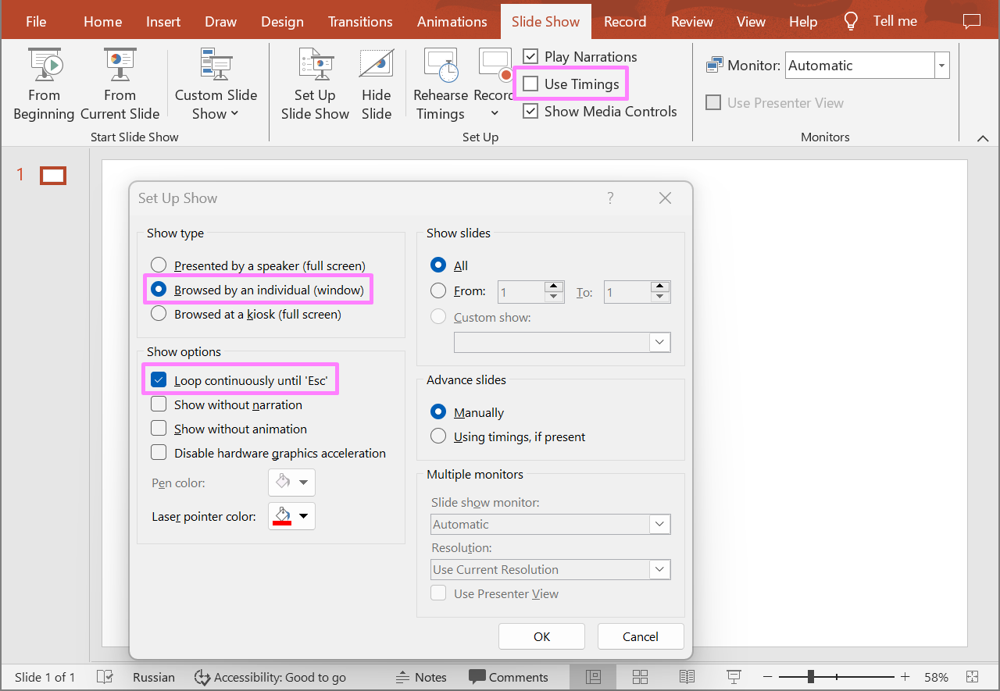

## **Introduction**

In PowerPoint presentations, Slide Show settings allow you to manage various aspects of your presentation, from automation to audience interaction. The main options and features are slide show type, start and end of slides, show animation, play narrations, show media controls, use timings, and others. Use the following methods to get and update the slide show properties of a presentation. 

## **GetSlideShowProperties**

### **API Information**

|**API**|**Type**|**Description**|**Resource**|
| :- | :- | :- | :- |
|/slides/{name}/slideShowProperties|GET|Returns the slide show properties from a presentation saved in a storage.|[GetSlideShowProperties](https://reference.aspose.cloud/slides/#/Document/GetSlideShowProperties)|

**Request Parameters**

|**Name**|**Type**|**Location**|**Required**|**Description**|
| :- | :- | :- | :- | :- |
|name|string|path|true|The name of a presentation file.|
|password|string|header|false|The password to open the presentation.|
|folder|string|query|false|The path to the folder containing the presentation file.|
|storage|string|query|false|The name of the storage contaning the folder.|

### **Examples**

Retrieve the slide show properties from the document **MyPresentation.pptx** saved in the **default** storage.

**cURL Solution**





**Get an Access Token**

```sh
curl -X POST "https://api.aspose.cloud/connect/token" \
     -d "grant_type=client_credentials&client_id=MyClientId&client_secret=MyClientSecret" \
     -H "Content-Type: application/x-www-form-urlencoded"
```

**Get the Show Properties**

```sh
curl -X GET "https://api.aspose.cloud/v3.0/slides/MyPresentation.pptx/slideShowProperties" \
     -H "authorization: Bearer MyAccessToken"
```





**Response Example**

```json
{
  "loop": false,
  "showAnimation": true,
  "showNarration": false,
  "showMediaControls": false,
  "useTimings": false,
  "slideShowType": "PresentedBySpeaker",
  "selfUri": {
    "href": "https://api.aspose.cloud/v3.0/slides/MyPresentation.pptx/slideShowProperties",
    "relation": "self"
  }
}
```




**SDK Solutions**





```cs
using System;
using Aspose.Slides.Cloud.Sdk;
using Aspose.Slides.Cloud.Sdk.Model;

class Application
{
    static void Main(string[] args)
    {
        SlidesApi slidesApi = new SlidesApi("MyClientId", "MyClientSecret");

        SlideShowProperties properties = slidesApi.GetSlideShowProperties("MyPresentation.pptx");

        Console.WriteLine("Loop Slide Show: " + properties.Loop);
        Console.WriteLine("Show Animation: " + properties.ShowAnimation);
        Console.WriteLine("Show Media Controls: " + properties.ShowMediaControls);
        Console.WriteLine("Play Narrations: " + properties.ShowNarration);
        Console.WriteLine("Slide Show Type: " + properties.SlideShowType);
        Console.WriteLine("Use Timings: " + properties.UseTimings);
    }
}

// Example output:
// 
// Loop Slide Show: False
// Show Animation: True
// Show Media Controls: True
// Play Narrations: True
// Slide Show Type: PresentedBySpeaker
// Use Timings: True
```





```java
import com.aspose.slides.ApiException;
import com.aspose.slides.api.SlidesApi;
import com.aspose.slides.model.SlideShowProperties;

public class Application {
    public static void main(String[] args) throws ApiException {
        SlidesApi slidesApi = new SlidesApi("MyClientId", "MyClientSecret");

        SlideShowProperties properties = slidesApi.getSlideShowProperties("MyPresentation.pptx", null, null, null);

        System.out.println("Loop Slide Show: " + properties.isLoop());
        System.out.println("Show Animation: " + properties.isShowAnimation());
        System.out.println("Show Media Controls: " + properties.isShowMediaControls());
        System.out.println("Play Narrations: " + properties.isShowNarration());
        System.out.println("Slide Show Type: " + properties.getSlideShowType());
        System.out.println("Use Timings: " + properties.isUseTimings());
    }
}

// Example output:
// 
// Loop Slide Show: False
// Show Animation: True
// Show Media Controls: True
// Play Narrations: True
// Slide Show Type: PresentedBySpeaker
// Use Timings: True
```





```php
use Aspose\Slides\Cloud\Sdk\Api\Configuration;
use Aspose\Slides\Cloud\Sdk\Api\SlidesApi;

$configuration = new Configuration();
$configuration->setAppSid("MyClientId");
$configuration->setAppKey("MyClientSecret");

$slidesApi = new SlidesApi(null, $configuration);

$properties = $slidesApi->getSlideShowProperties("MyPresentation.pptx");

print("Loop Slide Show: " . $properties->getLoop() . "\r\n");
print("Show Animation: " . $properties->getShowAnimation() . "\r\n");
print("Show Media Controls: " . $properties->getShowMediaControls() . "\r\n");
print("Play Narrations: " . $properties->getShowNarration() . "\r\n");
print("Slide Show Type: " . $properties->getSlideShowType() . "\r\n");
print("Use Timings: " . $properties->getUseTimings());

// Example output:
//
// Loop Slide Show: 
// Show Animation: 1
// Show Media Controls: 1
// Play Narrations: 1
// Slide Show Type: PresentedBySpeaker
// Use Timings: 1
```





```rb
require "aspose_slides_cloud"

include AsposeSlidesCloud

configuration = Configuration.new
configuration.app_sid = "MyClientId"
configuration.app_key = "MyClientSecret"

slides_api = SlidesApi.new(configuration)

properties = slides_api.get_slide_show_properties("MyPresentation.pptx")

puts "Loop Slide Show: #{properties.loop}"
puts "Show Animation: #{properties.show_animation}"
puts "Show Media Controls: #{properties.show_media_controls}"
puts "Play Narrations: #{properties.show_narration}"
puts "Slide Show Type: #{properties.slide_show_type}"
puts "Use Timings: #{properties.use_timings}"

# Example output:
#
# Loop Slide Show: false
# Show Animation: true
# Show Media Controls: true
# Play Narrations: true
# Slide Show Type: PresentedBySpeaker
# Use Timings: true
```





```py
from asposeslidescloud.apis import SlidesApi

slides_api = SlidesApi(None, "MyClientId", "MyClientSecret")

properties = slides_api.get_slide_show_properties("MyPresentation.pptx")

print("Loop Slide Show:", properties.loop)
print("Show Animation:", properties.show_animation)
print("Show Media Controls:", properties.show_media_controls)
print("Play Narrations:", properties.show_narration)
print("Slide Show Type:", properties.slide_show_type)
print("Use Timings:", properties.use_timings)

# Example output:
#
# Loop Slide Show: False
# Show Animation: True
# Show Media Controls: True
# Play Narrations: True
# Slide Show Type: PresentedBySpeaker
# Use Timings: True
```





```js
const cloudSdk = require("asposeslidescloud");

const slidesApi = new cloudSdk.SlidesApi("MyClientId", "MyClientSecret");

slidesApi.getSlideShowProperties("MyPresentation.pptx").then(properties => {
    console.log("Loop Slide Show:", properties.body.loop);
    console.log("Show Animation:", properties.body.showAnimation);
    console.log("Show Media Controls:", properties.body.showMediaControls);
    console.log("Play Narrations:", properties.body.showNarration);
    console.log("Slide Show Type:", properties.body.slideShowType);
    console.log("Use Timings:", properties.body.useTimings);
});

// Example output:
//
// Loop Slide Show: false
// Show Animation: true
// Show Media Controls: true
// Play Narrations: true
// Slide Show Type: PresentedBySpeaker
// Use Timings: true
```





```cpp
#include "asposeslidescloud/api/SlidesApi.h"

using namespace asposeslidescloud::api;

int main()
{
    std::shared_ptr<SlidesApi> slidesApi = std::make_shared<SlidesApi>(L"MyClientId", L"MyClientSecret");

    std::shared_ptr<SlideShowProperties> properties = slidesApi->getSlideShowProperties(L"MyPresentation.pptx").get();

    std::wcout << L"Loop Slide Show: " << properties->isLoop() << "\r\n";
    std::wcout << L"Show Animation: " << properties->isShowAnimation() << "\r\n";
    std::wcout << L"Show Media Controls: " << properties->isShowMediaControls() << "\r\n";
    std::wcout << L"Play Narrations: " << properties->isShowNarration() << "\r\n";
    std::wcout << L"Slide Show Type: " << properties->getSlideShowType() << "\r\n";
    std::wcout << L"Use Timings: " << properties->isUseTimings();
}

// Example output:
//
// Loop Slide Show: 0
// Show Animation: 1
// Show Media Controls: 1
// Play Narrations: 1
// Slide Show Type: PresentedBySpeaker
// Use Timings: 1
```





```pl
use AsposeSlidesCloud::Configuration;
use AsposeSlidesCloud::SlidesApi;

my $configuration = AsposeSlidesCloud::Configuration->new();
$configuration->{app_sid} = "MyClientId";
$configuration->{app_key} = "MyClientSecret";

my $slides_api = AsposeSlidesCloud::SlidesApi->new(config => $configuration);

my $properties = $slides_api->get_slide_show_properties(name => "MyPresentation.pptx");

print("Loop Slide Show: ", $properties->{loop}, "\n");
print("Show Animation: ", $properties->{show_animation}, "\n");
print("Show Media Controls: ", $properties->{show_media_controls}, "\n");
print("Play Narrations: ", $properties->{show_narration}, "\n");
print("Slide Show Type: ", $properties->{slide_show_type}, "\n");
print("Use Timings: ", $properties->{use_timings});

# Example output:
#
# Loop Slide Show: 0
# Show Animation: 1
# Show Media Controls: 1
# Play Narrations: 1
# Slide Show Type: PresentedBySpeaker
# Use Timings: 1
```





```go
import (
	"fmt"

	asposeslidescloud "github.com/aspose-slides-cloud/aspose-slides-cloud-go/v24"
)

func main() {
	configuration := asposeslidescloud.NewConfiguration()
	configuration.AppSid = "MyClientId"
	configuration.AppKey = "MyClientSecret"

	slidesApi := asposeslidescloud.NewAPIClient(configuration).SlidesApi

	properties, _, _ := slidesApi.GetSlideShowProperties("MyPresentation.pptx", "", "", "")

	fmt.Println("Loop Slide Show:", properties.GetLoop())
	fmt.Println("Show Animation:", properties.GetShowAnimation())
	fmt.Println("Show Media Controls:", properties.GetShowMediaControls())
	fmt.Println("Play Narrations:", properties.GetShowNarration())
	fmt.Println("Slide Show Type:", properties.GetSlideShowType())
	fmt.Println("Use Timings:", properties.GetUseTimings())
}

// Example output:
//
// Loop Slide Show: false
// Show Animation: true
// Show Media Controls: true
// Play Narrations: true
// Slide Show Type: PresentedBySpeaker
// Use Timings: true
```





## **SetSlideShowProperties**

### **API Information**

|**API**|**Type**|**Description**|**Resource**|
| :- | :- | :- | :- |
|/slides/{name}/slideShowProperties|PUT|Updates the slide show properties in a presentation saved in a storage.|[SetSlideShowProperties](https://reference.aspose.cloud/slides/#/Document/SetSlideShowProperties)|

**Request Parameters**

|**Name**|**Type**|**Location**|**Required**|**Description**|
| :- | :- | :- | :- | :- |
|name|string|path|true|The name of a presentation file.|
|dto|`SlideShowProperties`|body|true|The data transfer object with the slide show properties.|
|password|string|header|false|The password to open the presentation.|
|folder|string|query|false|The path to the folder containing the presentation file.|
|storage|string|query|false|The name of the storage contaning the folder.|

### **Examples**

The **default** storage contains the document **MyPresentation.pptx**. Change the following slide show properties:
- set **Loop continuously until 'Esc'**
- reset **Use Timings**
- set **Show type** to **Browsed by an individual**

**cURL Solution**





**Get an Access Token**

```sh
curl -X POST "https://api.aspose.cloud/connect/token" \
     -d "grant_type=client_credentials&client_id=MyClientId&client_secret=MyClientSecret" \
     -H "Content-Type: application/x-www-form-urlencoded"
```

**Set the Show Properties**

```sh
curl -X PUT "https://api.aspose.cloud/v3.0/slides/MyPresentation.pptx/slideShowProperties" \
     -H "authorization: Bearer MyAccessToken" \
	 -H "Content-Type: application/json" \
	 -d @ShowProperties.json
```

ShowProperties.json content:

```json
{
  "Loop": true,
  "useTimings": false,
  "slideShowType": "BrowsedByIndividual"
}
```





**Response Example**

```json
{
  "loop": true,
  "showAnimation": true,
  "showNarration": true,
  "showMediaControls": true,
  "useTimings": false,
  "slideShowType": "BrowsedByIndividual",
  "showScrollbar": true,
  "selfUri": {
    "href": "https://api.aspose.cloud/v3.0/slides/MyPresentation.pptx/slideShowProperties",
    "relation": "self"
  }
}
```




**SDK Solutions**





```cs
using System;
using Aspose.Slides.Cloud.Sdk;
using Aspose.Slides.Cloud.Sdk.Model;

class Application
{
    static void Main(string[] args)
    {
        SlidesApi slidesApi = new SlidesApi("MyClientId", "MyClientSecret");

        string fileName = "MyPresentation.pptx";

        SlideShowProperties properties = new SlideShowProperties
        {
            Loop = true,
            UseTimings = false,
            SlideShowType = SlideShowProperties.SlideShowTypeEnum.BrowsedByIndividual
        };

        SlideShowProperties updatedProperties = slidesApi.SetSlideShowProperties(fileName, properties);

        Console.WriteLine("Loop Slide Show: " + updatedProperties.Loop);            // true
        Console.WriteLine("Use Timings: " + updatedProperties.UseTimings);          // false
        Console.WriteLine("Slide Show Type: " + updatedProperties.SlideShowType);   // BrowsedByIndividual
    }
}
```





```java
import com.aspose.slides.ApiException;
import com.aspose.slides.api.SlidesApi;
import com.aspose.slides.model.SlideShowProperties;

public class Application {
    public static void main(String[] args) throws ApiException {
        SlidesApi slidesApi = new SlidesApi("MyClientId", "MyClientSecret");

        String fileName = "MyPresentation.pptx";

        SlideShowProperties properties = new SlideShowProperties();
        properties.setLoop(true);
        properties.setUseTimings(false);
        properties.setSlideShowType(SlideShowProperties.SlideShowTypeEnum.BROWSEDBYINDIVIDUAL);

        SlideShowProperties updatedProperties = slidesApi.setSlideShowProperties(fileName, properties, null, null, null);

        System.out.println("Loop Slide Show: " + updatedProperties.isLoop());            // true
        System.out.println("Use Timings: " + updatedProperties.isUseTimings());          // false
        System.out.println("Slide Show Type: " + updatedProperties.getSlideShowType());  // BrowsedByIndividual
    }
}
```





```php
use Aspose\Slides\Cloud\Sdk\Api\Configuration;
use Aspose\Slides\Cloud\Sdk\Api\SlidesApi;
use Aspose\Slides\Cloud\Sdk\Model\SlideShowProperties;

$configuration = new Configuration();
$configuration->setAppSid("MyClientId");
$configuration->setAppKey("MyClientSecret");

$slidesApi = new SlidesApi(null, $configuration);

$fileName = "MyPresentation.pptx";

$properties = new SlideShowProperties();
$properties->setLoop(true);
$properties->setUseTimings(false);
$properties->setSlideShowType("BrowsedByIndividual");

$updatedProperties = $slidesApi->setSlideShowProperties($fileName, $properties);

print("Loop Slide Show: " . $updatedProperties->getLoop() . "\r\n");    // 1
print("Use Timings: " . $updatedProperties->getUseTimings() . "\r\n");  //
print("Slide Show Type: " . $updatedProperties->getSlideShowType());    // BrowsedByIndividual
```





```rb
require "aspose_slides_cloud"

include AsposeSlidesCloud

configuration = Configuration.new
configuration.app_sid = "MyClientId"
configuration.app_key = "MyClientSecret"

slides_api = SlidesApi.new(configuration)

file_name = "MyPresentation.pptx"

properties = SlideShowProperties.new
properties.loop = true
properties.use_timings = false
properties.slide_show_type = "BrowsedByIndividual"

updated_properties = slides_api.set_slide_show_properties(file_name, properties)

puts "Loop Slide Show: #{updated_properties.loop}"              # true
puts "Use Timings: #{updated_properties.use_timings}"           # false
puts "Slide Show Type: #{updated_properties.slide_show_type}"   # BrowsedByIndividual
```





```py
from asposeslidescloud.apis import SlidesApi
from asposeslidescloud.models import SlideShowProperties

slides_api = SlidesApi(None, "MyClientId", "MyClientSecret")

file_name = "MyPresentation.pptx"

properties = SlideShowProperties()
properties.loop = True
properties.use_timings = False
properties.slide_show_type = "BrowsedByIndividual"

updated_properties = slides_api.set_slide_show_properties(file_name, properties)

print("Loop Slide Show:", updated_properties.loop)              # True
print("Use Timings:", updated_properties.use_timings)           # False
print("Slide Show Type:", updated_properties.slide_show_type)   # BrowsedByIndividual
```





```js
const cloudSdk = require("asposeslidescloud");

const slidesApi = new cloudSdk.SlidesApi("MyClientId", "MyClientSecret");

fileName = "MyPresentation.pptx";

properties = new cloudSdk.SlideShowProperties();
properties.loop = true;
properties.useTimings = false;
properties.slideShowType = cloudSdk.SlideShowProperties.SlideShowTypeEnum.BrowsedByIndividual;

slidesApi.setSlideShowProperties(fileName, properties).then(updatedProperties => {
    console.log("Loop Slide Show:", updatedProperties.body.loop);           // true
    console.log("Use Timings:", updatedProperties.body.useTimings);         // false
    console.log("Slide Show Type:", updatedProperties.body.slideShowType);  // BrowsedByIndividual
});
```





```cpp
#include "asposeslidescloud/api/SlidesApi.h"

using namespace asposeslidescloud::api;

int main()
{
    std::shared_ptr<SlidesApi> slidesApi = std::make_shared<SlidesApi>(L"MyClientId", L"MyClientSecret");

    const wchar_t* fileName = L"MyPresentation.pptx";

    std::shared_ptr<SlideShowProperties> properties = std::make_shared<SlideShowProperties>();
    properties->setLoop(true);
    properties->setUseTimings(false);
    properties->setSlideShowType(L"BrowsedByIndividual");

    std::shared_ptr<SlideShowProperties> updatedProperties = slidesApi->setSlideShowProperties(fileName, properties).get();

    std::wcout << L"Loop Slide Show: " << updatedProperties->isLoop() << "\r\n";    // 1
    std::wcout << L"Use Timings: " << updatedProperties->isUseTimings() << "\r\n";  // 0
    std::wcout << L"Slide Show Type: " << updatedProperties->getSlideShowType();    // BrowsedByIndividual
}
```





```pl
use AsposeSlidesCloud::Configuration;
use AsposeSlidesCloud::SlidesApi;
use AsposeSlidesCloud::Object::SlideShowProperties;

my $configuration = AsposeSlidesCloud::Configuration->new();
$configuration->{app_sid} = "MyClientId";
$configuration->{app_key} = "MyClientSecret";

my $slides_api = AsposeSlidesCloud::SlidesApi->new(config => $configuration);

my $file_name = "MyPresentation.pptx";

$properties = AsposeSlidesCloud::Object::SlideShowProperties->new();
$properties->{loop} = True;
$properties->{use_timings} = False;
$properties->{slide_show_type} = "BrowsedByIndividual";

my $updated_properties = $slides_api->set_slide_show_properties(name => $file_name, dto => $properties);

print("Loop Slide Show: ", $updated_properties->{loop}, "\n");      # 1
print("Use Timings: ", $updated_properties->{use_timings}, "\n");   # 0
print("Slide Show Type: ", $updated_properties->{slide_show_type}); # BrowsedByIndividual
```





```go
import (
	"fmt"

	asposeslidescloud "github.com/aspose-slides-cloud/aspose-slides-cloud-go/v24"
)

func main() {
	configuration := asposeslidescloud.NewConfiguration()
	configuration.AppSid = "MyClientId"
	configuration.AppKey = "MyClientSecret"

	slidesApi := asposeslidescloud.NewAPIClient(configuration).SlidesApi

	fileName := "MyPresentation.pptx"

	properties := asposeslidescloud.NewSlideShowProperties()
	properties.Loop = true
	properties.UseTimings = false
	properties.SlideShowType = "BrowsedByIndividual"

	updatedProperties, _, _ := slidesApi.SetSlideShowProperties(fileName, properties, "", "", "")

	fmt.Println("Loop Slide Show:", updatedProperties.GetLoop())          // true
	fmt.Println("Use Timings:", updatedProperties.GetUseTimings())        // false
	fmt.Println("Slide Show Type:", updatedProperties.GetSlideShowType()) // BrowsedByIndividual
}
```





The result:



## **SDKs**

Check [Available SDKs](/slides/available-sdks/) to learn how to add an SDK to your project.
