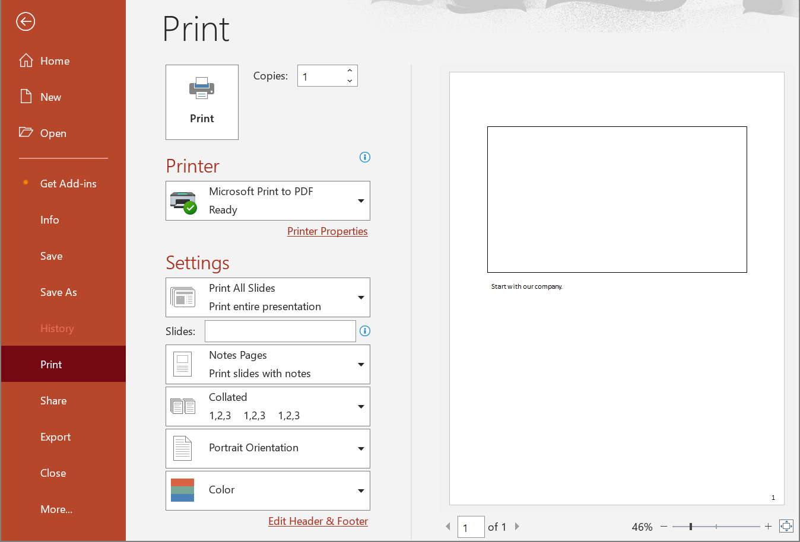

## **Introduction**

When you add speaker notes to a slide, a Notes slide is created in your PowerPoint presentation. The Notes slide can contain text, shapes, etc. The following methods allow you to check whether a Notes slide associated with a regular slide exists.



## **NotesSlideExists**

### **API Information**

|**API**|**Type**|**Description**|**Resource**|
| :- | :- | :- | :- |
|/slides/{name}/slides/{slideIndex}/notesSlide/exist|GET|Checks whether a Notes slide exists in a presentation saved in a storage.|[NotesSlideExists](https://reference.aspose.cloud/slides/#/NotesSlide/NotesSlideExists)|

**Request Parameters**

|**Name**|**Type**|**Location**|**Required**|**Description**|
| :- | :- | :- | :- | :- |
|name|string|path|true|The name of a presentation file saved in the storage.|
|slideIndex|integer|query|true|The 1-based index of a regular slide.|
|password|string|header|false|The password to open the presentation.|
|folder|string|query|false|The folder where the presentation file is located.|
|storage|string|query|false|The storage where the folder is located.|

*In case of Amazon S3 storage folder path starts with Amazon S3 bucket name.*

### **Examples**

Check to see if there is a **Notes slide** associated with the **first** regular slide in the document **MyPresentation.pptx**.

**cURL Solution**





**Get an Access Token**

```sh
curl POST "https://api.aspose.cloud/connect/token" \
     -d "grant_type=client_credentials&client_id=MyClientId&client_secret=MyClientSecret" \
     -H "Content-Type: application/x-www-form-urlencoded"
```

**Check the Notes Slide**

```sh
curl -X GET "https://api.aspose.cloud/v3.0/slides/MyPresentation.pptx/slides/1/notesSlide/exist" \
     -H "authorization: Bearer MyAccessToken"
```





**Response Example**

```json
{
  "exists": true
}
```





**SDK Solutions**





```csharp
using System;
using Aspose.Slides.Cloud.Sdk;
using Aspose.Slides.Cloud.Sdk.Model;

class Application
{
    static void Main(string[] args)
    {
        SlidesApi slidesApi = new SlidesApi("MyClientId", "MyClientSecret");

        String documentName = "MyPresentation.pptx";
        int slideIndex = 1;

        EntityExists response = slidesApi.NotesSlideExists(documentName, slideIndex);

        Console.WriteLine("Notes slide exists: " + response.Exists);
    }
}

// Example output:
// Notes slide exists: True
```





```java
import com.aspose.slides.ApiException;
import com.aspose.slides.api.SlidesApi;
import com.aspose.slides.model.EntityExists;

public class Application {
    public static void main(String[] args) throws ApiException {
        SlidesApi slidesApi = new SlidesApi("MyClientId", "MyClientSecret");

        String documentName = "MyPresentation.pptx";
        int slideIndex = 1;

        EntityExists response = slidesApi.notesSlideExists(documentName, slideIndex, null, null, null);

        System.out.println("Notes slide exists: " + response.isExists());
    }
}

// Example output:
// Notes slide exists: true
```





```php
use Aspose\Slides\Cloud\Sdk\Api\Configuration;
use Aspose\Slides\Cloud\Sdk\Api\SlidesApi;

$configuration = new Configuration();
$configuration->setAppSid("MyClientId");
$configuration->setAppKey("MyClientSecret");

$slidesApi = new SlidesApi(null, $configuration);

$documentName = "MyPresentation.pptx";
$slideIndex = 1;

$response = $slidesApi->notesSlideExists($documentName, $slideIndex);

echo "Notes slide exists: ", $response->getExists();

// Example output:
// Notes slide exists: 1
```





```ruby
require "aspose_slides_cloud"

include AsposeSlidesCloud

configuration = Configuration.new
configuration.app_sid = "MyClientId"
configuration.app_key = "MyClientSecret"

slides_api = SlidesApi.new(configuration)

document_name = "MyPresentation.pptx"
slide_index = 1

response = slides_api.notes_slide_exists(document_name, slide_index)

print "Notes slide exists: ", response.exists

# Example output:
# Notes slide exists: true
```





```python
from asposeslidescloud.apis.slides_api import SlidesApi

slides_api = SlidesApi(None, "MyClientId", "MyClientSecret")

document_name = "MyPresentation.pptx"
slide_index = 1

response = slides_api.notes_slide_exists(document_name, slide_index)

print("Notes slide exists:", response.exists)

# Example output:
# Notes slide exists: True
```





```js
const cloud = require("asposeslidescloud");

const slidesApi = new cloud.SlidesApi("MyClientId", "MyClientSecret");

documentName = "MyPresentation.pptx";
slideIndex = 1;

response = slidesApi.notesSlideExists(documentName, slideIndex).then(response => {
    console.log("Notes slide exists:", response.body.exists);
});

// Example output:
// Notes slide exists: true
```





```cpp
#include "asposeslidescloud/api/SlidesApi.h"

using namespace asposeslidescloud::api;

int main()
{
    std::shared_ptr<SlidesApi> slidesApi = std::make_shared<SlidesApi>(L"MyClientId", L"MyClientSecret");

    const wchar_t* documentName = L"MyPresentation.pptx";
    const int slideIndex = 1;

    std::shared_ptr<EntityExists> response = slidesApi->notesSlideExists(documentName, slideIndex).get();

    std::cout << "Notes slide exists: " << response->isExists();
}

// Example output:
// Notes slide exists: 1
```





```perl
use AsposeSlidesCloud::Configuration;
use AsposeSlidesCloud::SlidesApi;

my $config = AsposeSlidesCloud::Configuration->new();
$config->{app_sid} = "MyClientId";
$config->{app_key} = "MyClientSecret";

my $slides_api = AsposeSlidesCloud::SlidesApi->new(config => $config);

my %parameters = (name => "MyPresentation.pptx", slide_index => 1);

my $response = $slides_api->notes_slide_exists(%parameters);

print("Notes slide exists: ", $response->{exists});

# Example output:
# Notes slide exists: 1
```













## **NotesSlideExistsOnline**

### **API Information**

|**API**|**Type**|**Description**|**Resource**|
| :- | :- | :- | :- |
|/slides/slides/{slideIndex}/notesSlide/exist|POST|Checks whether a Notes slide exists in a presentation saved in a local file.|[NotesSlideExistsOnline](https://reference.aspose.cloud/slides/#/NotesSlide/NotesSlideExistsOnline)|

**Request Parameters**

|**Name**|**Type**|**Location**|**Required**|**Description**|
| :- | :- | :- | :- | :- |
|document|file|formData|true|The presentation file.|
|slideIndex|integer|query|true|The 1-based index of a regular slide.|
|password|string|header|false|The password to open the presentation.|

## **SDKs**

Check [Available SDKs](/slides/available-sdks/) to learn how to add an SDK to your project.
