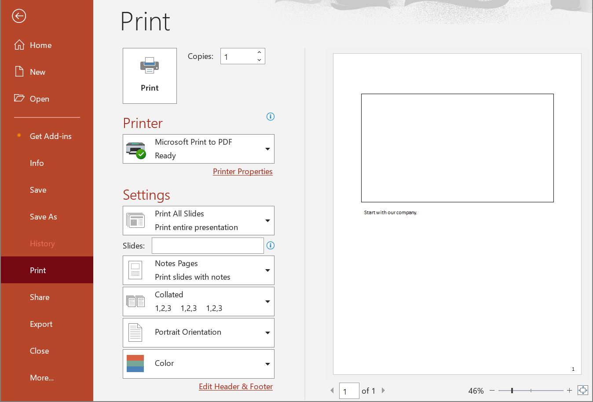

## **Introduction**

When you add speaker notes to a slide, a Notes slide is created in your PowerPoint presentation. The Notes slide can contain text, shapes, etc. The following method allows you to delete the Notes slide associated with a regular slide.



{} 
When you delete a non-existent Notes slide, you will receive an error message: "Object reference not set to an instance of an object.". You can use the [NotesSlideExists](https://reference.aspose.cloud/slides/#/NotesSlide/NotesSlideExists) or [NotesSlideExistsOnline](https://reference.aspose.cloud/slides/#/NotesSlide/NotesSlideExistsOnline) methods to check if a Notes slide exists.
{} 

## **DeleteNotesSlide**

### **API Information**

|**API**|**Type**|**Description**|**Resource**|
| :- | :- | :- | :- |
|/slides/{name}/slides/{slideIndex}/notesSlide|DELETE|Deletes a Notes slide from a presentation saved in a storage.|[DeleteNotesSlide](https://reference.aspose.cloud/slides/#/NotesSlide/DeleteNotesSlide)|

**Request Parameters**

|**Name**|**Type**|**Location**|**Required**|**Description**|
| :- | :- | :- | :- | :- |
|name|string|path|true|The name of a presentation file saved in the storage.|
|slideIndex|integer|path|true|The 1-based index of the regular slide.|
|password|string|header|false|The password to open the presentation.|
|folder|string|query|false|The folder where the presentation file is located.|
|storage|string|query|false|The storage where the folder is located.|

*In case of Amazon S3 storage folder path starts with Amazon S3 bucket name.*

### **Examples**

Delete a **Notes slide** associated with the **second** slide from the document **MyPresentation.pptx**.

**cURL Solution**





**Get an Access Token**

```sh
curl POST "https://api.aspose.cloud/connect/token" \
     -d "grant_type=client_credentials&client_id=MyClientId&client_secret=MyClientSecret" \
     -H "Content-Type: application/x-www-form-urlencoded"
```

**Delete the Notes Slide**

```sh
curl -X DELETE "https://api.aspose.cloud/v3.0/slides/MyPresentation.pptx/slides/2/notesSlide" \
     -H "authorization: Bearer MyAccessToken"
```





**Response Example**

Information about the associated regular slide:
```json
{
  "width": 960.0,
  "height": 540.0,
  "showMasterShapes": true,
  "layoutSlide": {
    "href": "https://api.aspose.cloud/v3.0/slides/MyPresentation.pptx/layoutSlides/1",
    "relation": "self"
  },
  "shapes": {
    "href": "https://api.aspose.cloud/v3.0/slides/MyPresentation.pptx/slides/2/shapes",
    "relation": "self",
    "slideIndex": 2
  },
  "theme": {
    "href": "https://api.aspose.cloud/v3.0/slides/MyPresentation.pptx/slides/2/theme",
    "relation": "self",
    "slideIndex": 2
  },
  "placeholders": {
    "href": "https://api.aspose.cloud/v3.0/slides/MyPresentation.pptx/slides/2/placeholders",
    "relation": "self",
    "slideIndex": 2
  },
  "images": {
    "href": "https://api.aspose.cloud/v3.0/slides/MyPresentation.pptx/slides/2/images",
    "relation": "self",
    "slideIndex": 2
  },
  "comments": {
    "href": "https://api.aspose.cloud/v3.0/slides/MyPresentation.pptx/slides/2/comments",
    "relation": "self",
    "slideIndex": 2
  },
  "background": {
    "href": "https://api.aspose.cloud/v3.0/slides/MyPresentation.pptx/slides/2/background",
    "relation": "self",
    "slideIndex": 2
  },
  "selfUri": {
    "href": "https://api.aspose.cloud/v3.0/slides/MyPresentation.pptx/slides/2",
    "relation": "self",
    "slideIndex": 2
  },
  "alternateLinks": [
    {
      "href": "https://api.aspose.cloud/v3.0/slides/MyPresentation.pptx/slides/2/jpeg",
      "relation": "alternate",
      "linkType": "image/jpeg",
      "title": "Download as Jpeg",
      "slideIndex": 2
    },
    {
      "href": "https://api.aspose.cloud/v3.0/slides/MyPresentation.pptx/slides/2/gif",
      "relation": "alternate",
      "linkType": "image/gif",
      "title": "Download as Gif",
      "slideIndex": 2
    },
    {
      "href": "https://api.aspose.cloud/v3.0/slides/MyPresentation.pptx/slides/2/bmp",
      "relation": "alternate",
      "linkType": "image/bmp",
      "title": "Download as Bmp",
      "slideIndex": 2
    },
    {
      "href": "https://api.aspose.cloud/v3.0/slides/MyPresentation.pptx/slides/2/png",
      "relation": "alternate",
      "linkType": "image/png",
      "title": "Download as Png",
      "slideIndex": 2
    },
    {
      "href": "https://api.aspose.cloud/v3.0/slides/MyPresentation.pptx/slides/2/tiff",
      "relation": "alternate",
      "linkType": "image/tiff",
      "title": "Download as Tiff",
      "slideIndex": 2
    },
    {
      "href": "https://api.aspose.cloud/v3.0/slides/MyPresentation.pptx/slides/2/svg",
      "relation": "alternate",
      "linkType": "image/svg+xml",
      "title": "Download as Svg",
      "slideIndex": 2
    },
    {
      "href": "https://api.aspose.cloud/v3.0/slides/MyPresentation.pptx/slides/2/odp",
      "relation": "alternate",
      "linkType": "application/vnd.oasis.opendocument.presentation",
      "title": "Download as Odp",
      "slideIndex": 2
    },
    {
      "href": "https://api.aspose.cloud/v3.0/slides/MyPresentation.pptx/slides/2/fodp",
      "relation": "alternate",
      "linkType": "application/vnd.oasis.opendocument.presentation",
      "title": "Download as Fodp",
      "slideIndex": 2
    },
    {
      "href": "https://api.aspose.cloud/v3.0/slides/MyPresentation.pptx/slides/2/otp",
      "relation": "alternate",
      "linkType": "application/vnd.oasis.opendocument.presentation-template",
      "title": "Download as Otp",
      "slideIndex": 2
    },
    {
      "href": "https://api.aspose.cloud/v3.0/slides/MyPresentation.pptx/slides/2/ppt",
      "relation": "alternate",
      "linkType": "application/vnd.ms-powerpoint",
      "title": "Download as Ppt",
      "slideIndex": 2
    },
    {
      "href": "https://api.aspose.cloud/v3.0/slides/MyPresentation.pptx/slides/2/pptx",
      "relation": "alternate",
      "linkType": "application/vnd.openxmlformats-officedocument.presentationml.presentation",
      "title": "Download as Pptx",
      "slideIndex": 2
    },
    {
      "href": "https://api.aspose.cloud/v3.0/slides/MyPresentation.pptx/slides/2/pdf",
      "relation": "alternate",
      "linkType": "application/pdf",
      "title": "Download as Pdf",
      "slideIndex": 2
    },
    {
      "href": "https://api.aspose.cloud/v3.0/slides/MyPresentation.pptx/slides/2/xps",
      "relation": "alternate",
      "linkType": "application/vnd.ms-xpsdocument",
      "title": "Download as Xps",
      "slideIndex": 2
    },
    {
      "href": "https://api.aspose.cloud/v3.0/slides/MyPresentation.pptx/slides/2/pps",
      "relation": "alternate",
      "linkType": "application/vnd.ms-powerpoint",
      "title": "Download as Pps",
      "slideIndex": 2
    },
    {
      "href": "https://api.aspose.cloud/v3.0/slides/MyPresentation.pptx/slides/2/ppsx",
      "relation": "alternate",
      "linkType": "application/vnd.openxmlformats-officedocument.presentationml.slideshow",
      "title": "Download as Ppsx",
      "slideIndex": 2
    },
    {
      "href": "https://api.aspose.cloud/v3.0/slides/MyPresentation.pptx/slides/2/pptm",
      "relation": "alternate",
      "linkType": "application/vnd.ms-powerpoint.presentation.macroEnabled.12",
      "title": "Download as Pptm",
      "slideIndex": 2
    },
    {
      "href": "https://api.aspose.cloud/v3.0/slides/MyPresentation.pptx/slides/2/ppsm",
      "relation": "alternate",
      "linkType": "application/vnd.ms-powerpoint.slideshow.macroEnabled.12",
      "title": "Download as Ppsm",
      "slideIndex": 2
    },
    {
      "href": "https://api.aspose.cloud/v3.0/slides/MyPresentation.pptx/slides/2/pot",
      "relation": "alternate",
      "linkType": "application/vnd.ms-powerpoint",
      "title": "Download as Pot",
      "slideIndex": 2
    },
    {
      "href": "https://api.aspose.cloud/v3.0/slides/MyPresentation.pptx/slides/2/potx",
      "relation": "alternate",
      "linkType": "application/vnd.openxmlformats-officedocument.presentationml.template",
      "title": "Download as Potx",
      "slideIndex": 2
    },
    {
      "href": "https://api.aspose.cloud/v3.0/slides/MyPresentation.pptx/slides/2/potm",
      "relation": "alternate",
      "linkType": "application/vnd.ms-powerpoint.template.macroEnabled.12",
      "title": "Download as Potm",
      "slideIndex": 2
    },
    {
      "href": "https://api.aspose.cloud/v3.0/slides/MyPresentation.pptx/slides/2/html",
      "relation": "alternate",
      "linkType": "text/html",
      "title": "Download as Html",
      "slideIndex": 2
    }
  ]
}
```





**SDK Solutions**





```csharp
using Aspose.Slides.Cloud.Sdk;
using Aspose.Slides.Cloud.Sdk.Model;
using System;

class Application
{
    static void Main(string[] args)
    {
        SlidesApi slidesApi = new SlidesApi("MyClientId", "MyClientSecret");

        string documentName = "MyPresentation.pptx";
        int slideIndex = 2;

        Slide slide = slidesApi.DeleteNotesSlide(documentName, slideIndex);

        bool notesSlideExists = slide.NotesSlide != null;
        Console.WriteLine("Notes slide exists: " + notesSlideExists);
    }
}

// Example output:
// Notes slide exists: False
```





```java
import com.aspose.slides.ApiException;
import com.aspose.slides.api.SlidesApi;
import com.aspose.slides.model.Slide;

public class Application {
    public static void main(String[] args) throws ApiException {
        SlidesApi slidesApi = new SlidesApi("MyClientId", "MyClientSecret");

        String documentName = "MyPresentation.pptx";
        int slideIndex = 2;

        Slide slide = slidesApi.deleteNotesSlide(documentName, slideIndex, null, null, null);

        boolean notesSlideExists = slide.getNotesSlide() != null;
        System.out.println("Notes slide exists: " + notesSlideExists);
    }
}

// Example output:
// Notes slide exists: false
```





```php
use Aspose\Slides\Cloud\Sdk\Api\Configuration;
use Aspose\Slides\Cloud\Sdk\Api\SlidesApi;

$configuration = new Configuration();
$configuration->setAppSid("MyClientId");
$configuration->setAppKey("MyClientSecret");

$slidesApi = new SlidesApi(null, $configuration);

$documentName = "MyPresentation.pptx";
$slideIndex = 2;

$slide = $slidesApi->deleteNotesSlide($documentName, $slideIndex);

$notesSlideExists = $slide->getNotesSlide() != null ? "true" : "false";
echo "Notes slide exists: ", $notesSlideExists;

// Example output:
// Notes slide exists: false
```





```ruby
require "aspose_slides_cloud"

include AsposeSlidesCloud

configuration = Configuration.new
configuration.app_sid = "MyClientId"
configuration.app_key = "MyClientSecret"

slides_api = SlidesApi.new(configuration)

document_name = "MyPresentation.pptx"
slide_index = 2

slide = slides_api.delete_notes_slide(document_name, slide_index)

notes_slide_exists = slide.notes_slide != nil
print "Notes slide exists: ", notes_slide_exists

# Example output:
# Notes slide exists: false
```





```python
from asposeslidescloud.apis.slides_api import SlidesApi

slides_api = SlidesApi(None, "MyClientId", "MyClientSecret")

document_name = "MyPresentation.pptx"
slide_index = 2

slide = slides_api.delete_notes_slide(document_name, slide_index)

notes_slide_exists = slide.notes_slide is not None
print("Notes slide exists:", notes_slide_exists)

# Example output:
# Notes slide exists: False
```





```js
const cloud = require("asposeslidescloud");

const slidesApi = new cloud.SlidesApi("MyClientId", "MyClientSecret");

documentName = "MyPresentation.pptx";
slideIndex = 2;

slidesApi.deleteNotesSlide(documentName, slideIndex).then(slide => {
    notesSlideExists = slide.body.notesSlide != null;
    console.log("Notes slide exists:", notesSlideExists);
});

// Example output:
// Notes slide exists: false
```





```cpp
#include "asposeslidescloud/api/SlidesApi.h"

using namespace asposeslidescloud::api;

int main()
{
    std::shared_ptr<SlidesApi> slidesApi = std::make_shared<SlidesApi>(L"MyClientId", L"MyClientSecret");

    const wchar_t* documentName = L"MyPresentation.pptx";
    const int slideIndex = 2;

    std::shared_ptr<Slide> response = slidesApi->deleteNotesSlide(documentName, slideIndex).get();

    const wchar_t* notesSlideExists = response->getNotesSlide() != NULL ? L"true" : L"false";
    std::wcout << L"Notes slide exists: " << notesSlideExists;
}

// Example output:
// Notes slide exists: false
```





```perl
use AsposeSlidesCloud::Configuration;
use AsposeSlidesCloud::SlidesApi;

my $config = AsposeSlidesCloud::Configuration->new();
$config->{app_sid} = "MyClientId";
$config->{app_key} = "MyClientSecret";

my $slides_api = AsposeSlidesCloud::SlidesApi->new(config => $config);

my %parameters = (name => "MyPresentation.pptx", slide_index => 2);

my $slide = $slides_api->delete_notes_slide(%parameters);

my $notes_slide_exists = defined $slide->{notes_slide} ? "true" : "false";
print("Notes slide exists: ", $notes_slide_exists);

# Example output:
# Notes slide exists: false
```













## **SDKs**

Check [Available SDKs](/slides/available-sdks/) to learn how to add an SDK to your project.
