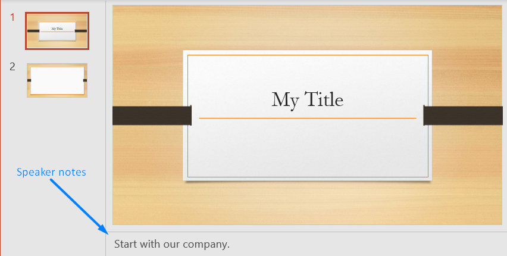
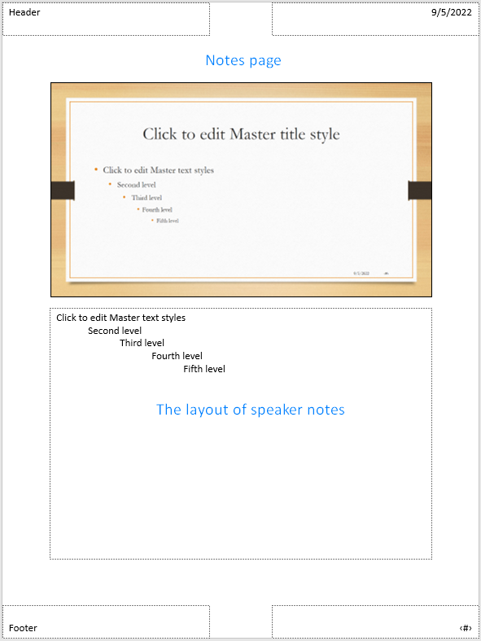

## **Introduction**

With Aspose.Slides Cloud, you can retrieve speaker notes added to a slide and information of shapes added to a notes page, including header and footer.

















The following methods allow you to read information of notes from presentations saved to a storage or local file.

## **GetNotesSlide**

### **API Information**

|**API**|**Type**|**Description**|**Resource**|
| :- | :- | :- | :- |
|/slides/{name}/slides/{slideIndex}/notesSlide|GET|Retrieves information of slide notes and notes page from a presentation.|[GetNotesSlide](https://apireference.aspose.cloud/slides/#/NotesSlide/GetNotesSlide)|

**Request Parameters**

|**Name**|**Type**|**Location**|**Required**|**Description**|
| :- | :- | :- | :- | :- |
|name|string|path|true|The name of a presentation file.|
|slideIndex|integer|path|true|The 1-based index of the slide.|
|password|string|header|false|The password to open the presentation.|
|folder|string|query|false|The path to the folder containing the presentation.|
|storage|string|query|false|The name of the storage contaning the `folder`.|

*In case of Amazon S3 storage folder path starts with Amazon S3 bucket name.*

### **Examples**

Read speaker notes added to the **first** slide in the document **MyFolder/MyPresentation.pptx** saved to the default storage.

**cURL Solution**





**Get an Access Token**

```sh
curl -X POST "https://api.aspose.cloud/connect/token" \
     -d "grant_type=client_credentials&client_id=MyClientId&client_secret=MyClientSecret" \
     -H "Content-Type: application/x-www-form-urlencoded"
```

**Read the Slide Notes**

```sh
curl -X GET "https://api.aspose.cloud/v3.0/slides/MyPresentation.pptx/slides/1/notesSlide?folder=MyFolder" \
     -H "authorization: Bearer MyAccessToken"
```





**Response Example**

```json
{
    "text": "Start with our company.",
    "shapes": {
        "href": "https://api.aspose.cloud/v3.0/slides/MyPresentation.pptx/slides/1/notesSlide/shapes?folder=MyFolder",
        "relation": "self",
        "slideIndex": 1
    },
    "selfUri": {
        "href": "https://api.aspose.cloud/v3.0/slides/MyPresentation.pptx/slides/1/notesSlide?folder=MyFolder",
        "relation": "self",
        "slideIndex": 1
    }
}
```





**SDK Solutions**





```csharp
// For complete examples and data files, please go to https://github.com/aspose-Slides-cloud/aspose-Slides-cloud-dotnet

using Aspose.Slides.Cloud.Sdk;
using System;

class Application
{
    static void Main()
    {
        var slidesApi = new SlidesApi("MyClientId", "MyClientSecret");

        // Read the notes slide for the first slide.
        var notesSlide = slidesApi.GetNotesSlide("MyPresentation.pptx", 1, null, "MyFolder");

        // Print the speaker notes.
        Console.WriteLine("Speaker notes: " + notesSlide.Text);
    }
}
```





```java
// For complete examples and data files, please go to https://github.com/aspose-Slides-cloud/aspose-Slides-cloud-java

import com.aspose.slides.ApiException;
import com.aspose.slides.api.SlidesApi;

public class Application {
    public static void main(String[] args) throws ApiException {
        SlidesApi slidesApi = new SlidesApi("MyClientId", "MyClientSecret");

        // Read the notes slide for the first slide.
        NotesSlide notesSlide = slidesApi.getNotesSlide("MyPresentation.pptx", 1, null, "MyFolder", null);

        // Print the speaker notes.
        System.out.println("Speaker notes: " + notesSlide.getText());
    }
}
```





```php
// For complete examples and data files, please go to https://github.com/aspose-Slides-cloud/aspose-Slides-cloud-php

use Aspose\Slides\Cloud\Sdk\Api\Configuration;
use Aspose\Slides\Cloud\Sdk\Api\SlidesApi;

$configuration = new Configuration();
$configuration->setAppSid("MyClientId");
$configuration->setAppKey("MyClientSecret");

$slidesApi = new SlidesApi(null, $configuration);

// Read the notes slide for the first slide.
$notesSlide = $slidesApi->getNotesSlide("MyPresentation.pptx", 1, null, "MyFolder");

// Print the speaker notes.
echo "Speaker notes: ", $notesSlide->getText();
```





```ruby
# For complete examples and data files, please go to https://github.com/aspose-Slides-cloud/aspose-Slides-cloud-ruby

require "aspose_slides_cloud"

include AsposeSlidesCloud

configuration = Configuration.new
configuration.app_sid = "MyClientId"
configuration.app_key = "MyClientSecret"

slides_api = SlidesApi.new(configuration)

# Read the notes slide for the first slide.
notes_slide = slides_api.get_notes_slide("MyPresentation.pptx", 1, nil, "MyFolder")

# Print the speaker notes.
print "Speaker notes: ", notes_slide.text
```





```python
# For complete examples and data files, please go to https://github.com/aspose-Slides-cloud/aspose-Slides-cloud-python

import asposeslidescloud

from asposeslidescloud.apis.slides_api import SlidesApi

slides_api = SlidesApi(None, "MyClientId", "MyClientSecret")

# Read the notes slide for the first slide.
notes_slide = slides_api.get_notes_slide("MyPresentation.pptx", 1, None, "MyFolder")

# Print the speaker notes.
print("Speaker notes:", notes_slide.text)
```





```js
// For complete examples and data files, please go to https://github.com/aspose-Slides-cloud/aspose-Slides-cloud-nodejs

const cloud = require("asposeslidescloud");

const slidesApi = new cloud.SlidesApi("MyClientId", "MyClientSecret");

// Read the notes slide for the first slide.
slidesApi.getNotesSlide("MyPresentation.pptx", 1, null, "MyFolder").then(notesSlide => {
    // Print the speaker notes.
    console.log("Speaker notes:", notesSlide.body.text);
});
```





```cpp
// For complete examples and data files, please go to https://github.com/aspose-Slides-cloud/aspose-Slides-cloud-cpp

#include "asposeslidescloud/api/SlidesApi.h"

using namespace asposeslidescloud::api;

int main()
{
    auto slidesApi = std::make_shared<SlidesApi>(L"MyClientId", L"MyClientSecret");

    // Read the notes slide for the first slide.
    auto notesSlide = slidesApi->getNotesSlide(L"MyPresentation.pptx", 1, L"", L"MyFolder").get();

    // Print the speaker notes.
    std::wcout << "Speaker notes: " << notesSlide->getText();

    return 0;
}
```





```perl
# For complete examples and data files, please go to https://github.com/aspose-Slides-cloud/aspose-Slides-cloud-perl

use AsposeSlidesCloud::Configuration;
use AsposeSlidesCloud::SlidesApi;

my $config = AsposeSlidesCloud::Configuration->new();
$config->{app_sid} = "MyClientId";
$config->{app_key} = "MyClientSecret";

my $slides_api = AsposeSlidesCloud::SlidesApi->new(config => $config);

# Read the notes slide for the first slide.
my %parameters = (name => "MyPresentation.pptx", slide_index => 1, folder => "MyFolder");
my $notes_slide = $slides_api->get_notes_slide(%parameters);

# Print the speaker notes.
print "Speaker notes: " . $notes_slide->{text};
```













## **GetNotesSlideOnline**

### **API Information**

|**API**|**Type**|**Description**|**Resource**|
| :- | :- | :- | :- |
|/slides/slides/{slideIndex}/notesSlide|POST|Retrieves information of slide notes and notes page from a presentation.|[GetNotesSlideOnline](https://apireference.aspose.cloud/slides/#/NotesSlide/GetNotesSlideOnline)|

**Request Parameters**

|**Name**|**Type**|**Location**|**Required**|**Description**|
| :- | :- | :- | :- | :- |
|document|file|form data|true|The data of the presentation.|
|slideIndex|integer|path|true|The 1-based index of the slide.|
|password|string|header|false|The password to open the presentation.|

### **Examples**

Read speaker notes added to the **first** slide in a presentation saved to the file **MyPresentation.pptx**.

**cURL Solution**





**Get an Access Token**

```sh
curl -X POST "https://api.aspose.cloud/connect/token" \
     -d "grant_type=client_credentials&client_id=MyClientId&client_secret=MyClientSecret" \
     -H "Content-Type: application/x-www-form-urlencoded"
```

**Read the Slide Notes**

```sh
curl -X POST "https://api.aspose.cloud/v3.0/slides/slides/1/notesSlide" \
     -H "authorization: Bearer MyAccessToken" \
     -H "Content-Type: application/octet-stream" \
     --data-binary @MyPresentation.pptx
```





**Response Example**

```json
{
    "text": "Start with our company.",
    "shapes": {
        "href": "https://api.aspose.cloud/v3.0/slides/presentation.pptx/slides/1/notesSlide/shapes",
        "relation": "self",
        "slideIndex": 1
    },
    "selfUri": {
        "href": "https://api.aspose.cloud/v3.0/slides/presentation.pptx/slides/1/notesSlide",
        "relation": "self",
        "slideIndex": 1
    }
}
```





**SDK Solutions**





```csharp
// For complete examples and data files, please go to https://github.com/aspose-Slides-cloud/aspose-Slides-cloud-dotnet

using Aspose.Slides.Cloud.Sdk;
using System;
using System.IO;

class Application
{
    static void Main()
    {
        var slidesApi = new SlidesApi("MyClientId", "MyClientSecret");

        // Read the notes slide for the first slide.
        using var documentStream = File.OpenRead("MyPresentation.pptx");
        var notesSlide = slidesApi.GetNotesSlideOnline(documentStream, 1);

        // Print the speaker notes.
        Console.WriteLine("Speaker notes: " + notesSlide.Text);
    }
}
```





```java
// For complete examples and data files, please go to https://github.com/aspose-Slides-cloud/aspose-Slides-cloud-java

import com.aspose.slides.ApiException;
import com.aspose.slides.api.SlidesApi;

import java.io.IOException;
import java.nio.file.Files;
import java.nio.file.Paths;

public class Application {
    public static void main(String[] args) throws ApiException, IOException {
        SlidesApi slidesApi = new SlidesApi("MyClientId", "MyClientSecret");

        // Read the notes slide for the first slide.
        byte[] documentData = Files.readAllBytes(Paths.get("MyPresentation.pptx"));
        NotesSlide notesSlide = slidesApi.getNotesSlideOnline(documentData, 1, null);

        // Print the speaker notes.
        System.out.println("Speaker notes: " + notesSlide.getText());
    }
}
```





```php
// For complete examples and data files, please go to https://github.com/aspose-Slides-cloud/aspose-Slides-cloud-php

use Aspose\Slides\Cloud\Sdk\Api\Configuration;
use Aspose\Slides\Cloud\Sdk\Api\SlidesApi;

$configuration = new Configuration();
$configuration->setAppSid("MyClientId");
$configuration->setAppKey("MyClientSecret");

$slidesApi = new SlidesApi(null, $configuration);

// Read the notes slide for the first slide.
$documentStream = fopen("MyPresentation.pptx", "r");
$notesSlide = $slidesApi->getNotesSlideOnline($documentStream, 1);

// Print the speaker notes.
echo "Speaker notes: ", $notesSlide->getText();
```





```ruby
# For complete examples and data files, please go to https://github.com/aspose-Slides-cloud/aspose-Slides-cloud-ruby

require "aspose_slides_cloud"

include AsposeSlidesCloud

configuration = Configuration.new
configuration.app_sid = "MyClientId"
configuration.app_key = "MyClientSecret"

slides_api = SlidesApi.new(configuration)

# Read the notes slide for the first slide.
document_data = File.binread("MyPresentation.pptx")
notes_slide = slides_api.get_notes_slide_online(document_data, 1)

# Print the speaker notes.
print "Speaker notes: ", notes_slide.text
```





```python
# For complete examples and data files, please go to https://github.com/aspose-Slides-cloud/aspose-Slides-cloud-python

import asposeslidescloud

from asposeslidescloud.apis.slides_api import SlidesApi

slides_api = SlidesApi(None, "MyClientId", "MyClientSecret")

# Read the notes slide for the first slide.
with open("MyPresentation.pptx", "rb") as document_stream:
    notes_slide = slides_api.get_notes_slide_online(document_stream, 1)

# Print the speaker notes.
print("Speaker notes:", notes_slide.text)
```





```js
// For complete examples and data files, please go to https://github.com/aspose-Slides-cloud/aspose-Slides-cloud-nodejs

const cloud = require("asposeslidescloud");
const fs = require("fs");

const slidesApi = new cloud.SlidesApi("MyClientId", "MyClientSecret");

// Read the notes slide for the first slide.
documentStream = fs.createReadStream("MyPresentation.pptx");
slidesApi.getNotesSlideOnline(documentStream, 1).then(notesSlide => {
    // Print the speaker notes.
    console.log("Speaker notes:", notesSlide.body.text);
});
```





```cpp
// For complete examples and data files, please go to https://github.com/aspose-Slides-cloud/aspose-Slides-cloud-cpp

#include "asposeslidescloud/api/SlidesApi.h"

using namespace asposeslidescloud::api;

int main()
{
    auto slidesApi = std::make_shared<SlidesApi>(L"MyClientId", L"MyClientSecret");

    // Prepare the presentation content for the request.
    auto documentStream = std::make_shared<std::ifstream>("MyPresentation.pptx", std::ios::binary);
    auto fileContent = std::make_shared<HttpContent>();
    fileContent->setData(documentStream);

    // Read the notes slide for the first slide.
    auto notesSlide = slidesApi->getNotesSlideOnline(fileContent, 1).get();

    // Print the speaker notes.
    std::wcout << "Speaker notes: " << notesSlide->getText();

    return 0;
}
```





```perl
# For complete examples and data files, please go to https://github.com/aspose-Slides-cloud/aspose-Slides-cloud-perl

use AsposeSlidesCloud::Configuration;
use AsposeSlidesCloud::SlidesApi;

use File::Slurp;

my $config = AsposeSlidesCloud::Configuration->new();
$config->{app_sid} = "MyClientId";
$config->{app_key} = "MyClientSecret";

my $slides_api = AsposeSlidesCloud::SlidesApi->new(config => $config);

# Read the notes slide for the first slide.
my $document_data = read_file("MyPresentation.pptx", { binmode => ":raw" });
my %parameters = (document => $document_data, slide_index => 1);
my $notes_slide = $slides_api->get_notes_slide_online(%parameters);

# Print the speaker notes.
print "Speaker notes: " . $notes_slide->{text};
```













## **SDKs**

Check [Available SDKs](/slides/available-sdks/) to learn how to add an SDK to your project.
