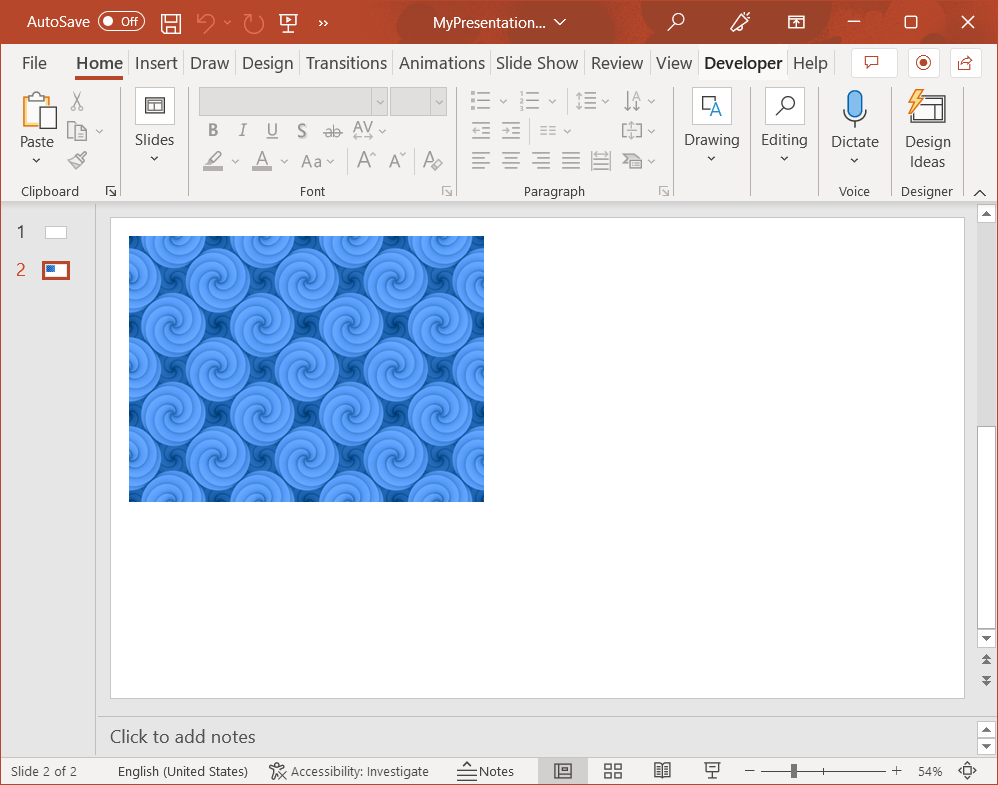

## **Introduction**

You can use Aspose.Slides Cloud API to add pictures to PowerPoint documents. To add a picture to a presentation slide, you can use a bitmap or vector image. You can crop the image, set some transformation effects (such as an Alpha Bi-Level effect, blur effect, duotone effect, luminance effect, etc.), use the stretch or tile fill mode. The code examples in this article use [CreateShape](/slides/adding-shapes-to-a-powerpoint-presentation/) method.

## **Example 1**

Use **MyImage.png** file to add a **400x300** picture at coordinates **(20, 20)** to the **second** slide in **MyFolder/MyPresentation.pptx** document saved to the default storage. Use the **tile** fill mode for the image.

MyImage.png:


**cURL Solution**





**Get an Access Token**

```sh
curl -X POST "https://api.aspose.cloud/connect/token" \
     -d "grant_type=client_credentials&client_id=MyClientId&client_secret=MyClientSecret" \
     -H "Content-Type: application/x-www-form-urlencoded"
```

**Add the Picture**

```sh
curl -X POST "https://api.aspose.cloud/v3.0/slides/MyPresentation.pptx/slides/2/shapes?folder=MyFolder" \
     -H "authorization: Bearer <access_token>" \
     -H "Content-Type: application/json" \
     -d @request_data.json
```




```json
{
    "Type": "PictureFrame",
    "X": 20,
    "Y": 20,
    "Width": 400,
    "Height": 300,
    "PictureFillFormat": {
        "PictureFillMode": "Tile",
        "Base64Data": "iVBORw0KGgoAAAANSUhEUgAAAGQAAABkCAIAAAD/gAIDAAAACXBIWXMAAAsSAAALEgHS3X78AAAgAElEQVR4nGy9WY+1SZImZGbu/i5njT2++JbMrNxry8qq1kz11HQjZiQ0NKI1reYSISFxAYg7kEAgYOqaCyR+AOIKafgFXCCBeqSemerq6qUqq2sqt6rM/JbYI876Lu5uxoW5v3Gy4GToy4gTEee8r7m52WOPPeaB+MP/GEwF1XExPq3K0lpHZI2xi5svTTGZTA+ccyKyv3/yne/8sOuaGKP3XfD9s7PHZB0zsEBgYOYYQ4whRt80jSV48uhRZGABFogMITJz8L7r+65tN5eXz588fmP/4Kxt113XrtfL9fr+9vYiRk9kjLFFUVXVuK4nZVnV9WQ+P7i/v/rii18fHZ2Nx7OyrK111hbGWEtICEhgDbTN9uXVdV2N9bvWWkQyRMYAAVgD6+3m/OqqrkbWOmudMfZv//bPN5slAITgu75b3b2oyno0fxx8E3znQ9+2Dbe32LywUD+hYsrbl7Hcl6IAAERAotH0aLW8juM9KwIg+ZE+0/cXAQEQAH0eQESYmUMMs/GEEIKAAADov8wcmWOMYbNZjseTw6OzrutEhDkyh67bxBhOT19fr+9EYG/v0LmqKMqiqJyzz59/enn5Yn//pKrGepNEFpEQEREQAQEMwP1qRWSIiIgQEQCJiBAQQG+t6zr9HUSEdOUMAIhIRM7a0fR4ff+CQ1tOj8mWBqgoyQOwv7dU7btyFPxCQisy0d8SjlU92a7vgm/LogBA5sDMahlmtoaIKERI1gJQgzIzM6NwVVWcnk8XpFZmZubQd+3TZ28A4M6T0rbNdLo/Hk9j9E2zub+/Go2mbetiDOv1QkSOjh6PxzPnSudKYywZY4gIgQAQwRJs22bbtFU1JjJElogICSGZEhFEoO06zFYmIhGOMSACABARkSmKcrz3ZLu8bC8/ddYBUgye/RqKfVsWlbWFWBtAkIxaXH/NFXXwvVo9xsjMoCskQmghPxjS4oiI+g8ZctaxulXyPrULi7D3vSuK8Xg/hKjLC4CIyMxlWRVFPRpNy7Ju2812u2GORDQez6fTvaqqnSudK4xxRIZQ/0u2AICr21tj1OkevGf4LiF477u+d64cnK5tW+89IokIIhpjAByA0N6jrtvzzYLZA9VmvE+2tK4oyFhhoaI0yXtJ38Taoved3kyMXldARFgYCCHvL5HsV6J+Fw0ZQ0Y9a3C74f8h+KqsrbVd5/VJIjTGWOtiDGVZxRhEuCzr6TQCQA5hpXOltZbIUX6ovwCItXh5fdP3cTSeGEOIDzsxLQcAEWyarQgkj0QkssF3HIOxFgBE1FGMtQUAGaRYVswszACAANa5imMXYqzLiTpUenkBfUURMAa9933flmUtIiK4awGE5EFDaDOGEAc76YvlmAfALEVVQrpPQCREY4wZjabr9T2RKctajS7CIoBI1jrnUpwissYgkTEIhIACrsC7xeJ+uazrMRERWf0JBEx7EIEAQGC93RrrCNUhyBi7XN740Btr1bOSkyOpe1K6BhEBRCRjq2Z5Yap5UZTZgQmRkIhBkpcBMceua/LLifAQkUCSvWT40hgC3LUUgCQXABBEMGSzpZCIjDHG2Mlkzsw3N68mk5kxVrdkWdZlWRdFaW2huc8YY8gYTFYoHNzdLy9vbqtqZG1hyBIZ1GiFSAQEgAJEsG2aruutsZg3KSHc3JwvFzfMERFzpCciMkavSxOus9YSGdrefemjjCbH1lpjjP6o3mKM0Rin1wQA2+0KkUBEAzMKIMJOEM9bTZLddhwrPVIMIQJhEMhhBY0xzpVFUR0dPXr58jfr9WIymRNZdSjnnHOFdc4Ya1KsAkRwBgzJ+eXVxfVVXY2cK4wxxlpDhESEOBgUEBBhsVoaY4Z7JDIhhBBDUdV3txd91yIavVVMi5iCHhGRscZY24U43ntcuMJap0kXABFBJHKM5WiksRAAV6t7kSiAABBiiCICD9bK4QMAgRVk5OfVLvojgGjI+uglO5ZeurWuKMrxeI85fvrpz99445tHR48VagCgmogQidAgGAOIsNlsrm6ufODRaOKcOp3bcSsYltkSbLfNpu3KosKEJcha2zTrtm1m0/223a7Wd7Zd1/XEuQLJKEAiAs3kfbfZLK/sdO9MfYpSKiQRITJdtxUA50pEQgRjzHa76vuOiIgghsiRgUwOSA/bDoEix7w3gQeTAQAgEbqiaJsNx0hEzEJkRMQYca4Ugdns0Jjiq68+vr+/Pj15OhrPrHXWoCUABBEI3q/X68Vq0XZ9UVaTyUSTA5HeBREZ0nCmoQoAAG7u76wx1qafAERjzN3dZYzBuaKqxs6V2+1qubwlRGOctQYRmWMMwfdb73tXjm1ZlsnYSLrW+upNsy7L2hirzxCR991qdT+bHYhA5BiiL4xhAA1DPLgXIccoURBRAAiAMe05TUHWOGZp2/VoNGfW582wa/XLqhptNosvv/rYuaIsK2cLa0gEAnOMEQCKop5M5tY6jXcJoBIRJkupsUTAObi5ve98qKsaNTGgUYR1c/NKXcQYQnTT6V4Ioe8779uua1hEE6Qtp/WkstZaawtMr5vMRERts4mRp9PJYDsRYZbb24vZbB8AmbnturKsUujeiU+GqOvZR1+4Qp8nAEbJr22MMda51Woxnsx1eyISkVW/JiJjrNooBO99H2PsfN97MtZaY8typAhezaR3boz5nTiVNqCFbdPeLRdlUelba8qy1q1Wt4vFnTFWRNTlRdA5stYJjDmyCA/Oo7HVAigUeKgAYgyb7XIynqlbDfYyhpbL277viFAAmrbZm88fAMDDgwSk77uiKIbIBdmzRAiRqrLebFZdu3HFOAQgYhESQQDS6MxsYnTWFmU5gpT+EZGGH1C0kbEOIZLClYwXdNkghHBxfW2sHRI9kQFAa/DVq9+G4IsiwVH9N9dAYsiIMLMMmAhAbF1PACSG4EMfI3vfLxc3VT0uq5ExNFQkmlO329X5+ZdPn76JANtmE6IoPB7eZjDYtmmnk+nX8iASoujlapq7ubl+/HisJYOACAoiMiOiYY5ErA6tK5/9DgEopyoiNFodEqLJkAoQ1Gog/OrqUgQLVxIZ/UBEa+x6s3jx4jfWOmbW3Zp9QrRW0dhjk5WTS9oPP/xDAGCOfd973y0WV3d3VyGGrt167xXjIQIzi4j33fX1y+Pjx8aYtm3btqnrUQyDRRJGs9a1XRciExILAAJqwFdkZ4jZlOVovV7e31/t7x/3HlBhrAgiiTARSQJz+jEsRsbtSJDL6Ietl/3cEAjz84tzH2JZVIoYcq4H6+i3v/713d3VdLpfljUiMnOMzCxFUUwm88lkbzSaVtWoLOvEWxgDgDYEr/45Go0RZ4eHjxAlhNhsV7e3F7e3F4vlXQjBOdd1jTE2BH9zc763dxxjWK+X49EIUIadQoREYIz1vttsN7PpVE2JCCgP+9QYI+JGo/Ht/a1z5WQ6C+HBnMIApLtjh7PQrAyICAiKDQBQKNso14BiDQYfXl1d+MBlWRFZNZPesHNutbp98eK38/lh2zZd1zhXVVU9mx3s75/MZgc5rYESByIiEmOMiGhjDJqSQtBF0yrHjMbz2Wz/tdfeXS5vX7767fPnn282y/n8AAAvL5+X5UiEb+6uDg9PEBSpEib/SZBvtV5NJ9Ps5JBjOSpWIGJri7oaX16dC8jebB4CMCAgCBoRQGREkYzHYMC0AEB5oyXbQaYNwBBuNs359TUilmWdkwAhahmHZPCTj3+hiKEoShE4Pj47O/tGVY2ISJi977zvEFKAye8uAGTe/if/ZeaqOOdvARCOHDiKwKienJw+OT5+bK1drxZK73XdZjKerdar8Wg0Go8jA+YoqKuBCG3XFM6VRcHDq+7UQDvOCMvlAkAm4xEiCAsOdk28Aip2MoiGgAh2wUFiFAicARC+ur29vrs11pVFmeqotAENANR18dvf/OoXH/1FUVREdHz89M03v3l4eAaAMfYh+BBC5KgsZggh05lBQ6d59o/+ixADS3I5eKh4E5Rg5hC4rsdnZ88OD8+a7eri8kXbbqtqDABd15wcP46sYUlBhr4UCHPXddPJFAQzmkd5SJ+QcBmSMWa9XjXNtiqrorDZpEKJSEEzmEb9KFFUora2BkBkuVqfX103XVeWtUvYQjeghmdwzrXN5q//+s/bbjud7j179s7e/BAE2r4JvvchcIwirNnWEDqtpQkQIHKM0eN/+L+u2q5vu7b3XgQ0T+XqScGqGaiIoigQ+PPPf/nxpx953x8fP/Z9/+1v/eD4+KzrOaeSyBy8V355szefH+wd+AggSjELM2eWMDDHECJziDH2fRMjTyeT2XSvLEtCYAElHAfcBEN4Qs134ENYbzfL9ar3wVnnXKHWUUih0QoREI0h/lf/+v+6vjk/PXk2mx/klbBlWdZVXdejqqwK68gYJCRNqpg8SElz/E//uWhY6ft+02w3223X98ZY58pdYojIIBlF6FVlV8v7n/3Vv1gsbmfzw7qq//7f+0eRSU0QI4uE/Oj7vn386KwoqhhBAKIkRhVEOeYgEll/L8YQgvetiJRFORqNq7J21pFJb5yoIxGO7H3f9t22abq+Z2ZrC+ecMWbAX0NZonu6qsxf/vTPvnr++cnJE2tLRJxMZgf7R/PpvK7HxlBmmYABYKd6g11f/k/+d8mYEwwCi2y3zf1q2bStdYWzhZrMGEJUtyQBKVzB3P/lT//s4vJFVY3efftbb7/znaaNABIji0TmEEKM0XddC8BPzp4gWma1l0YAzoRyzNSVqMkix+B9jAFAEMlQ4pIQMK0HCwsjIJFRsmHHOg+8AmZ4WpXm5z//yaef/XJ//xiR9uYHTx6/fnhw4pwV1vXbiaQ5AGVa4OEb5vt/+mM1nggwCwCWpZtNJoVzTdv0vtcYOiRyESAiZiayr7/x9mazur5+uVwtj45O69FEUyyivlTizELom7adTaYAyAK4cxkPoTyBTkQ0hoy1xtpSSwgRZNFuh4gAZuJUuVMtDHOE0kI57QZ95aoyH330019//PPRaFJXo7ff/vbbb31rMpmJUIgSBERwSG36icI72SGa9F/zwZ/8eLCeKNhnYIGqLGbTqUTeNFsAoCFRg1ZSBAAxyrNnb7RN8+rVF9vt6smTNxCtPCxTMq4xpu26tm1mkwlk7JTIm8RqQQbolMGaGerETGsVzhXOaf8qsXHGUC6kzRCqNGgAoDHGGvjoo5/+3a/+ajSavPnm+x989/f39g5CgMDA8mCgTIrL7zxYY4aAAAqA+e6f/DORvEkfKCi1K07HdVmUq82KWVH1g9VyISlPn73ettsvvvjUe//0yRshDKyMepbai9qu3TabyXhMRIrsdjgOzKWfLsNQAOJA1O2Yg5SNMYYy4Hywkf4iABQFxdD97Gf/4uNPPjo6evSD7//Db7zxbmQKQUlb4dxvGhpPkpPP8KFZXW0hIuY7//S/h9R9gSG0DZCIBerSjevRerMOIRAZtVf2BfUOPDt7uljcffnlp4RwdvbM+1wB7YQCY0zXdev1qqqqsrDMObc97Mf0xGDHHWNRNhPtJLuHci8nbhRAIiwLur569dO//LMXL7947bW3fvj3//F0dtB18WudAkkxM6fmyMwicddYzLtGFPOtP/7vUh8LBFAr54RdNQWwgLVmOsn2Mg9NML1IESayp6enV5cvn7/43BCdPnr69TZX+nljTIxhuVwg4KiuEJEfSNQH+iL/Fu26FQ7g9CGW4+7nAEiIVUEcw69//YuPfvmX9/c37733wQ9+8G8BOu8jEag3AcRkhmQgTcop1XB+CIuIJp9kMvP+v/ffZAiKOSvgw4pD3kdE0/FouV5zjERm17OIkFnqqqrr0eXlq/PzLwHg7OxZCHEwgW40jV+IuN6smmbrXFEUboCzDzXNQxQbAv9gHbNjKQOICCkpFAUSyMuXX/78Fz+5uHzZNut33/veBx/8A++1PTzkHK2Z49AejzGqvRS1hxh88MErlI8ZYwszm3f/yX8FiQaRzG2JBvu01AKKD62hUVktVitl0od700AToxzs73ftdts05+dftm1zdvY6ImrjZLCXVo7WmN73q9Wi6zpjTOEKhVJDWsiEwtCIwUxd7RoTDJE16CzGGG6uXn386UdfPf+chVer+2+8+e0PPvj9rut32prDdosZPMcQQu/7vu9j8CwREQyBUe4UIjOHELzvQ/DMbLfNmowtXclsicgaETFgABlE0FByOEIIAcqyOD48uLi+VmMhoggxCyIjkg/w7rvfvb27ruv6888/aprVh9/7w7Iadd1W71YNpi3LssQYY9tut9t1VVbj8bSqx9rdHNLpTmJNeFppdaQE32Pk9Xa1Wt7f3F2v1/cAUJbVxcXzJ0++8cEH/6Bt+50gpe6TglGMHIKP0SNRWRT1tK4KZ21hKLEJqOCBIXLofd803bZt8T/63zaL1XLbtNoZt9YSWTLGoCFjkMjm2kL9wxl4dXm1aZqqGmle15RkjAGAqqTf/vbjTz/7lXPF+fmXk8n8/fe+//TZO0oQDyusC5sRfwihDzESYlFURVGVZeWsM9aZh/2uhQcIS4jBh77rmqbZbptt17UxBkQUkeXy5vz8y6PDs3/wo3/3IdnlUK1uJcwh+N73hbPTyXQynjhrALU5N3SLvxa19YNZ8D//PwQA1tvt9e1tYK7Kkd6/ktzagzJa6FNOXxy+ePnSGFcUxdBWQe1WERGEv/qbP4+R23b7/KuPCemttz94590PJ5O59533HgD+P2lIOaMQglY/IMKGyFibeVDU+44xxRFF8JD6tbjdLl88//Tm5mK2d/SHf/Dvl+U4Rg+Q81l6xBhD37fG0N5sbzqZEqGCyq+l7d/peO5IJcz3//THLFCWbj6deO/Xmw2leuprZHFO6gAC1pIwb7Yba50GrJ1dCYUzIrBY3M1m+953SGa5unv54jdd10yn+3U9HvYXZkMMmHvQTBkygKibJ2YLKYJVFOpsUZRlWY6Y49XVixcvPm+7pvfdBx/86PT0tb5vAEATmdqIOXrf976dTaenx6d1VUXGyCACGqUfyKn8sWsp/Zb58E9/jAiRAQBn0zGILFbLDAgTk/sAfgSQQACqslytVyxgyBAS5HisP1VX9WJ5R0STyf5iceusizG8eP7p3d1l3/dVVavGKr8DZKYYH/CBMVrBWGPVgla/tM5apy1V7/vnX33y+W//brW6M2Qix2fP3vnWt37YdWopzrAgMse+75jj6fHp3nzOgpG/5k0aG1lSl/PBZJI+9GcsMwgmPNV7OTzYF5Hru7vxaDokbgBBMELICCQAAs7RZDJeLNfOORZGiSKpoRlZyrLc3zu8X9xNp/tHR48vL78Kwe/tHSPS8+cfX1x8MZ8fHhyczueHZTkqinpY/GHXqOxgx6mVP4AYQ993y+Xt3d3lcnnfdhvf9wCsvf733vtwkJPkQJ62njXm9PiJK5z3krmX7E0CLDlqfd2IDxcAQIQ2sgAmdg0Qew9HBwdd32+2GzI07BQWQQGTUVNkmI0ni+WKOTIbbS+IkBLBLDib7S9XS0R49OjpxcUXhqgoKiS0dgQAi8XN/f21MbauR0T24OB0Mpmr4yRiQzSmpljT99uu65pmtd0um2ajuYIIR/W0Ksddt12tbt9///dms8O23QwxMYTAHLqudc49Pj0DNCGCImEF3izCSaORtTJfy8C7q4WR0YYYEI0k9hYQwEc4PT7+zZdfqGxmYK8RLUmiL5ihKMrC2RC8MW4Q9okIETHDZDwrXBFjHI0mR0dny8UdGsoAjqx1IiASLy9fMPN2u9JIZG0x9EEzO6jp0vNQHyE4Vwy+g4hlWVt78sYb3/S+BwHOSZY5dF1njTk7PRM0+gKsxZ4WzaDWApE4FED6P42/iIJAkOkQG2MgUmxFwmgQIouz5ujg8NXlhbUFkWEmIhZgFkpNCRFErKv6frkqCt6p2NMFOWurqm67VkSePn3nk+ZvUj2CBAlAQNs2iHh6+nTgHkLwIXhEzCk/NTsoqQtUwJMgtEJcY6Dr+seP3xyP523bKKGWI3qHKKcnZwAPltJYnna6ACdgMSAMzrchw1VpYUtkrPedIUvGAhhUCQqgDzCdzq7vrruuNcYSRWaDJJJbNVpCVmUpskirMcTEnOnqetS02xhjXY/H43nTrJ0rckAVZt91zf7+SX5BdUrMFnnQCsavRWOVUOVcBSAi1haPHr2uZOGA0UPw3ofHjx5b62IUSLtPDQ071lE0nz4PwXvvIwdV+xGhMQ9Ute261lrnQBCZQCJYICIQRJxNZte3N1U1SuusPXattBFEoHAFIsTIxjy4VbpbgLqqARBEiMz+/nHTrHHobQFst5uqGhVFKcKIGqR22YAYgm/bNoSe83WruqwoCm3VIAoixhhns/3pdM97r1BM7eX7bm9vr6pGIQAgPjAxDx4UY0y5Uhnd3ncIoGmYrIkxeu83mxULV+VoNJra7XZZVSMAEHHWIqhKhyhGGI8ml9dXIXhjjDFqLxJCwUQnkrGENOzz7FmACMJgbYFIgCDCs9n+5eVzdWwR0W0ymcy1EhfRaAsKOEMI6/XC91tjy6qqnS2QiJm1DOi6jTFlVdXGGCIU4YODE0TcKWii951zbn9+FCJwZu7zvpZcHqbiue/azrdlURwfntT1xDo3oCsR6ft+tb6/unp5cXlvr65e7O2dTCYiUmegZDX4u6I0hN73RVEyM1GCHZg5akpajwHEybBHWMA6Z8goFCjLUVnWXdcgGgDxvlf6M6stE4SPMfi+Xy5vjMGDg7OyGpExqbwWZRNj33ebzXK9vq+qUVlWxpi9vWMFrVrTqAmODk8SQQwqA/ga5a9kQwh902ysNWenT+p6AggxQAgsoBSpICCSPTg43d87vrj8yj558tZXX33y9XYIiRALGiQkE6LP/dfESAzUoJo2DvLIlGAEEQSAkMgk8GWtG49nfa+qVAwhFEWRzZQiSAi+77vl/VVVT/cOjgEgBI/Ra07QOhwAnCv394/btlksbvu+Ozo6q6pxCF7NLRJ631fVqK4nIWaPze+izbcYU2xq2/VsOj88PBVAHznhiIcAz3pn3guROTl5Zo+Pn6zXi5ubcw1jmV1DALBCCMB50fRfg6DbUCQTXw/FVfZeEEW6hBQ56pN1Pb67QyKMEZgjkVGMDaARKoTgl4sbY8xsfuD7pL9HJCLWzZvblyICZVkdHT26vHyhxbz3ncJRDUHz2Z6i7iGoi7B2J3MU79t2e3R4Mpvt+yA70EEyXyoZrAggMscQertc3h0dPbm6erFeL43R1hsCIAgEQwNjuGNvYUl9CwV1uZ03GCwR00RKISYLql5ll7TKV5ZwdttuQ7een77R+16Yd7B7UjQP/qUgiIj29g4PDk6HfC/CIfRlWdbVJLLuBM65T6+ctV5v283RwfHefL/rH1DPsEl3KdOhMUFk7Ha7quvxaDTbbpeTyTQER2SJgiaa3vusjRsynQz/Y9aEb7TJjpktTLJzgYFfF+GyrKx1IgKqts60ido8cuy6jXUWkILvtdwReKgVRcQYATCIZmhQW+smkzlzgIQzOXI8mBwQQVSpsCAA52IgLUvbbuezvf39g95L6qs8WEp7wz4EH2MYvCyphNt2q5Bau+dDvxNAQuj7vplO93b7CcNeQwQfAjNbWwx7cPCdHOYZEzEt1pZERsc0ENH7vq51D2amJnhrbPC99x0LhxA4ehA2tijLcVmWIg4AjEEAo8hYKyTmVAwysyEzHk9EBgfP/QXRvca9b8qyOD46DQEGPib/egjBq07N+267XW236xA8ItX1qCxr27Zr55wOru3EHTHGLu6vYgzWFqQ9YfqawRDB950I54GFhM4zcZaIaySjalUNLjEG/bzvG36YnIrCLIAxphm7rtuIb5wrrTWx71fbRVvPptP9FMMYk9rRDsYSAIgxVGXlrNPu0oNSIFNhIYQYwqOzJ8lAmVwf2LS+7/q+3W7XNzcvY5TxeFoUVd+39/c3zhW2bduiaNp2OxpNKU0WkN7w5dVzVXZpmwAgs5YAAEKIbddiUnNi0poN1kQIITBHm7tBxhgiB9AiQlFW283S+y5vTAQQa123WZCt22YjYVNPT8qy1plB4bheXC7vL+f7jxDROVT2WUe/ciRmZi7LKhMqyMkeGYUy9307Ho2rqvYeBEHJ2iFoeu/7vluv76+vz09Onp2cPEHEvm/1ycvL59R1m9vbS0RSNZe+d1XVl5fPt9vNeDwbFCmIhMMWQ2SWpt0a4wbpIkBmwRAJIUbPeQAoE1WJrbXGuqJYLa8RSUtZRLS2ACqa1SU3F+LXXdt0XRdCH2M0tjg8/UZZFKvlda5OUl9jyDyKyquy0qaepNpMMgrlyFGE9+ZzpX8GeDiQqCF0TbO5u7t6++3vvf76eyK83a7X6+VyebvZLBGJmMUYOx7PdDwBgEajyc3NxZdf/no+P9TJldyJemAEDUHbbr33KkcYOneYUyMCBB8o99ZVLKxaCgFAxNFo1vfd8v7CJBYQiaioZmjHIAGEY7/su03kqPcbY9w7fIqITbMZcl9ihFLYE0JMhESyxlDfiAh73xVFUZajyA9cO0vMVWHwvr+/v3799fePjk6322UK9b5bre66rmVmKyLz+UFdT4uiLMsakb766pPz8y8PD0/rejLMjA7caXYhuF8ukIy1u8N9AkC5WQpt1+QG/AAuWJ8QMda66exocXfufT+eHhjjnEt7uPVzLKZlUXXbuxDGUgjk/T+bHy0WNzFOVfY5oBnR0T1jKI3uSU7HAyyQyHE6mRKCDtIMAHTACuv1cjKZnpw8bZo1IimIbZpNjHFv72i5vLWIcH7+5WSyVxRVjGGzWYjI8fHj0WhaFNrvURGPSaAJwRjYNttts63rcZa6DdNFqKYUlq7vMozUqKzDEQKpKqaiKGd7p+vV7c3lF9ZaRBNj77uWiklZjYqijmHLsR/yL4h+DKsAABupSURBVAtX1Wi9uve+UzmosuyIEKMws7OWCCOn2I6YCh0N4SBQVzVnYceAtCWRD9779unTt1gYkqA9MnPXbUejaVlWZVnbo6PHbbvpuqZtN8a42Wx/PJ4XReVc4VyaL3/QaADotM71TVLiG5MqpOGWAIAQur7zfe+KNPpDhH3faxpWmkFBJoAYOm77tmvWIXpEV04mxjpD5FxhjeWk5YdB6OCKWltEmZDhvNf4gd5JuXDQUWnNgNYW/LWA9YCwvO+dKyaTvRhi9ll9i+icc66s64mdTvfH45l+LytWrWp60pAdGc2Cuh7W4uXVZe/70Wiy20zPVLUuKW63GwEZ6gFE0/ddjD63URXmgTEOAGsyVVlFjmlmVPlZ44TZFPVOL5oQwVrb971ypEqHEplsLGTlQodmYS5cYowqlPg6aawPEYEQQlFU1jrvex2bQUxTQTHGup4AoB2Pp7o+Oe6gulLWSBpESvBcoHB4e393v1yMRhMip8qWDEEHsIossNmusqY61SvL5W2M0dpUaatNVJtOxMzGPFA9QEjMPsQ4KUc75aqI6GbXlUdFRnU9AWUVYCd0D2bIHkQIhBhVoSqYGUVRhZOAFNYZQyEYY0CErXUhuPF4ul4vyrIiDRx5WrTSj0EwlkZfMxZ1Fu8W99c3V3U9zlUkZdX0EP3BEGy3q67vrXWDpBMAr69fLha3uio58aPuR8qiNUXkxhjrivXyxpWTsqgGoDe8xVBPiHDft9l5iSPjjgT0684DhAYpfYsog8Y8fUBIxpAhSHJwoxq6YjrdFxEdx7BFMQqhV/ccnGvn5hGArEUEub65WCwXVTo+whpD5uEehpiFgLBc3htDO6PIxvuOORDRzc35bLZXljWnKW0E1B6Heo2+qV3cXfgY53snarscFkWrvMyUgog0zWZ//0RtpNlPXVtSV3i4nTTxolQ+ClAa4lCDURpLU6uTzoBY5oI5HB09evXqi+l0bpfL64ODE2YYUlWyGhAaMgQEsG02t7eXvfej0WQYX0szo5nPUVNZA9vtqmmbqqqRjH7TWrteL7qunU73uq5dLu+c2+SZURJR+iUF7L5rl4vrEONs7ySfSvCgwBKBELxzpe5XRNxulzEGvWRNjunqAWOuZNUGuTMFX9uoqaOOqRQTMYSBidAQibVRpBqP58z82We/tF9++cnd3eXJydPxaJbAS77zGMNmvV6tFk3bFEU5mcxJZ/7MoLpLGkCDlGtoubu90QniLCJGInt3d8XMxkBV1UVRtu12ubxDTLsPE2Hk+74Nvi/KejqfPixJVuAAgPd9jGE0Ug0AI4K2EdUlVV5l7EOJmj9BRBJODWVJYWvwO0Ii54rttgshGOtEMOYBIy0CptMDawt7cvJ0s1l+9dWnRVGURe2KkpBEJEbvg2cGVxTj8TwPk6m4SmWflG8DlYVxDm9ur33wVTVKo6VAREY43t1d5RsWIjOZzGKM3vfed12XKmpEKsvRZLJvrdP2hKrmcuUeAWi7XWuGGiKR9916fT+fHwHocFdvE7rN5CQCIhqi4ANHJmNAR/Yw7aHhVAkAbNr1bLZPLGJIolhj8yuQMdbW9bgoqhij922IITRbTdzWmqoa566nil8fhIrq9kQAQFktgk2zXSwXRVEN+k8ktNYtl7fr9b21VveOMSACClCqajRkwBy8QeFIeuUERxiRuq5r2+1ksjdkOn3c3V3N54eIwCJN24xGYx1QUHwnQin8C/ehr21NCAwPnoVoEKMx1hXFYrnYm+8jogEAMoxotPecBeWVorKyLHd7WVobD9z8DtKhVCk/JECwBCH4i6uL3ILPAA3RGPvy5W9D8MZY7YxyYkFJL2L3zlOuB4WiDGABAJHVa5bLGx0AzJgg9RqXq7u2a/XYmabZgBwBZDiT/1WM0vf9uK6jaP0EhChIRKwRvS5Hq81yu93U9ThEMAQgBAAMYC2p9xUSo4BLOBgEHjbzYJQ0/5LtNeQYAC1uIF5evQIAl2ZGyRgCAGvdanV3fv6FHp1CRCJojBERAI4RRIIC1N0Ah/k8CgDRxj1zXCyuAaiqxgPy0AsGxHazunj1m6fP3kWEpm0CMxIBa2zAh1swpmmavfkcEbUvTQQsenCDJYrWubIor26u33g2pmHuO0FuFkFrjWMyQ2MjswaSccOO3bKRclQEZjAEAvHV+Usfok5CKkpRl3Gu/Pzzn9zfX87nx5rCAMR7BhBjXFXV4/F8NBoXRV1VdT5YIqlVlWno+y6Efrm8U0VF33cx8jCTqhxp37cXl89PTl8jcl23bZt1PZrFnSsmQma0xjVdF0IgslofCiTnAhJjHLNU1WizWV7fXB8fH3mfjm9hQUIThaw1xEKMOgSXpEgaHIe5EfXYHFBS6BQRZzGEcH71yodQpPF2S1n1b215f395fv7FeDzfblfGNDpDMh7P9/ePp9P9qhoZMwTjVMeJhOzRYIwdjRwRHRycfuMb3/S+227Xd3dXd3eX6/Uixmit7ftGzXp19fLo6FGMfrFaTCazELPOIE1mRmNs33ebzWZvPg8MhElLQ4hCRELabajrye3yvqzK2WTqQ7plEUBBa5JklGAoxwGU6AfMs6kPtUxqAiCAtbhtmsurCwHQmdFhuhYT02B+/fHfxOidK61lANnfP378+Bt1PdY+WAi9992w/DsFUwqLD6AvRX0zne7N50fPnr2zXN68evXFq1dfLJe3k8keIl1cfDUaTQHw9vby5PgxgpHECCWcSUTW2uV6vTebI4FwgvLCiKITUlpTFnU1ubi6QsD5dNL7FAAJwfzgP/hxmgrdmRClgRjNz8DOYKQ1AMC3d7c3d9dk7DBdm5OgAYCyGn/+2c//za/+Qs8cefTo2Vtvfef4+DGRVU4tRh/zI8QQQwgxKTKGjgkkmUnOO1nziAjj8ezk5LWjozMAXK8X+nzXbifT+Xq9HNX1ZDKNMU0HDi+FiF3fOWurquAdYLpTHGFiOJDuVwsAmIzqhD0RrHqj7mBdy10111CWqqWMAWFZrdf3i/sQY569pjwtqn0EMabcrO8//vhvRaSuR0+evD2Z7AHIdrtiBgGdfqPkhmSsMQAiDCIQYwhBW8G4M7RLAzFNZGJk5hYAJ5O9H/zg3769u/j1r3/2/KtP2mY1nsyJ6MXLL46PHmNuL4oQgCHSwWx3u7ifjPWIBGAEZIVd9DVKogAkul0sm6Y9Pjgsy0IY8D/754KYRqQSOf2AH7KZEAAgBN40m9Vq2XufhTg0YAvl/yBZAf/lv/w/b24uTk+f7u0dIRKIIBlXFHVZj0bjqqxsPioIc3hMqCHGwNH7TlFV53thGPiinDeT+RQalGWFiJ98/DeffvbLGMPp6dO+7779zQ9PH73W9anJGqPXjrT3vm23+/Pp0f6BDxp8H05x1PmTLK0JMcaua5nDdDyeT2f4x//Lq1Fd11XlrFOGQfKACAto/67t+qbdtl0XYnTWWeu0bsz0ixmYZREoy/KnP/2/X7z47PT0mZ7FMx5P9/cO5rP90WhqtShXZg6AeWdddCBAPyGVMULXtevNerNde6/ztUUeV6Uhdeo1VFV9f3/z13/9Z6vV/d7eUVmUv//Df8zgsvYqaQGVa+/77umj06qqwv+/vR5+Xm3X952I4B/9zy+0hE6FTOp6CYCEGHRqQ9IhMtYYS1qip1KHBuCq91ZVxc9//q8+++yXBwcnADCb7T85e/3o6JErCmFgHg4IxB3v1TCAeY1kwLp6SBgQcJTNdrVcLvq+0TM1d6boHs78KlwVOfzsZ//P1dXLup689db77737Qdupc+2KZ4L3HUh89viMKM3XJnulwdbUH5Od6acYo/nun/yPzlhjHSJxPkYoRqVrtSPhlIzXIeRcIdudWb9UTldV8dFHP/n0k1+MxrOyrN5+61vvvv3d+d4+gwlRdOkyX5tlACLCkvsZu6RdysssEKMAYFWV08nMuqJtG62cIY/9qWmJMEYmotdff3e7XV1fv1yvVgcHJ+PJJAZGHFgw0TLIx9A07Wyc5kUVEg1H3+1gNIIhwn73n/4POdRaY4zLh6Htqs93Au1wettwAiFpJLbWfPTRX/z6139T1ZNvfOPd733w+4eHx4HRhyGjPWS3nTm+ockC+bvJ5yRrJTFVQAAMVVXNJnvMcdtsIAvos730xoRZnj59q2235+dfbrfrp2m+9oHOHTj0rtd55DF9/QyF9JOYMMwQkc0Hf/LPMgoZogDtjNAO07W/MzP6wGQVheXY/9XP/uyzT395dPjoB9//0ZtvvsdifMheJINpkmgtfxm17sl9fM7lYYYL8nCOmW5SZkDE6WRcumqzWUZm87V5vkQ6x8hPn7zZtpsvv/o0eP/0yesxDm6bflZEiEzfd03bjkcjQ5gNOozs6BeUwZqxqVLT/+BhaXcgSF6RTDnq+yVZdWGury/+9hf/+ury1Ruvv/P97/+oKOum5VSxZJdhZhVL/Y4rDfhkl5vF1LUdDtR7KOwRkQV8gPF47Nyz88uXfd8URZ3xETJrzSx9CB9++KO23X7y6S9Ho9G3vvV7Tau1wYBvBADLsuq69vn5q0dHJ3XpfMzAW1XSgIzAgiDIaRwFCCmfvkgD06BpTp80elTOLhFeFAQSP/nkFx999Bf399fffP/D7//gDwCd98qyD5qpuKN74iExfz2C8tCJGdxQ9bjD+mGqs9IGYRZn7XQyWW82IXg9vQrTSJQKBYSMOz09u7x6+eVXnxuis7MnPgy9EgBQikmBW1yslkQ4qks9AzI7V4Ll+tLm9/70x2ZwtGQOygkur3HavOnXCoeG4PLi+S8++stX51817fr99z784Hs/9D6dyDl0zHdgS9ixURhAvPd9iD6GEGMQHiTFu2J0ebBR+ldHhXUulibj8XqzVinhUDbrXTBLXVeT8eTy6uX5+XMAPHv8JMaUhXHHbPq76+1m2zTOuqpI+AYf+gq53EHcLXQejhbMn4tqbZ1Ba1Ek3t5effLZL7/86vMYw3p9/87b3/7ggx+2XUx5TAY30cSaLKVtq67vfPDCXuShtAJUcZT3vgs6UQqY55lzcT9cejYcIYqAtTSq6sV6oWdi5DVPmyNG2dvf93273W7Pz7/ou/7x49eUHcsFafYRImNM772e1GKNLZ3JktgU+K3ylruhKrk7fi3OqWZmuVre3l4ulvcCUhblxeXzZ8/e+uB7v980aTxSN91QxOkn3vc+eAQonZtNxlVZOqvHfCAAsKASU5FD13dN2zTtdrtdG2OKohSxaWrOSIyGCDTiAAILGoIYoSiLk8Oji+urTNjrUiGAQUTv4d13vnt7e13Xo88+/1XTbj783j+sqqptPWKa2UbU2WQsS4wcN2273m7qqpqOxnVdW2t0tSwH1bpgTtmQ5SUSmYMPbdu0XbvdbtquVSpuPJ4ul7cXl8+Pjh794Pt/0HV6EhxnVVjyKWb2ofe+t8YczGeT8bR0DnbhuwyfIyIY68bOTSYTZmma7WJ5t91u8ilXLJIb/gBEBhiAhAEJIEaYTKZN06y3jTGGmfPZW0IIzFxW9Ztvvv/Jp393cvL45csvVqvlN9//8MmTb/jIwXtEMgYRmQhjJEQyZGMMXR+2zY0hrMqqKsqyLPDf+Z++MEYjOWVGLQpL4KhqtMhJymqMBYCmWb94/unt3dV8fvSHf/BHrhiFECCrnHYKq9j3LSHszWfzydwYjJI0qA8BaNdkoOWOtqORDCDAerO5ur2KMdbViCh1YXdOkFQdfkaSEp+/ek7kiqLMR3I6Db6GiDD+zc9/4r33vn3+/DNEfO+9D995+4PReNz3MeTD2vPBOJKmQUWtEFkFi+/90X8NADFK5OiDDyHGyJG1AMqjWkVZVSNmvrm5OD//ou3bvm2+/+GPjo7P+l4tNdQEOmHk+76bTsZnJ6ejUc2MUWCYIMwilgf/YklHbEkCJVp5SFkWs8nM+369WSmJnh8wCHaG80itIwTQ+doBOSryEgBniRDvl3ez6Z73nSG3WN69fPXbGPxstldVFQBpHbZLB2iL2OZxNfPtP/5vrbHWWGNVD6LdZv2kcK4wpogxvHjx+Zdffrxa3SMCc3zttXfef/8HXZdmiwY9mAh3fcscHx0fH+zNBTBG2DXNQxWWJ0dVsKyilwc5ngDkOf3ZdAoiq/VymK7LITzRbJSLlaoo19u1iGhAfBAsIiJiXdWr1QKJZrOD1WrhnI2Rv/ji45ub88ixrkZVPbLWAqTW6ZAoBoRgjbE7+BAG4QJz7Pt2uby/vb1YLu/0rGDnHFHlXPneex/EVLIoSErIoOs7S3R29qgorJ55qK89WIo5axezAlZharpzGA4LRUkdB+i87B8cAcrt3d1w50TEjMagiGEESnN7OB1P75dL5/QNdDRLiEhYysId7B/e3t+Nx9Ojo7Orq+fe95PpniB8/vmvXrz4zcH+8cHho/2946KsjSFmCSENPOoqWz3iXYmHEELbbruu2WyWq9Vd02z6vhURIjsez+o6tu12sbz9zrf/3niy17b9EKr00XVdYc3jR6eI5AMgYCqeB29K05DDfGJKC7vVAqbje3bdB3yA/f3jvg+bZm3MjJmYCRFZyGhbHgEAmGEyntwvlzEGYwyzHmOl3owiMJvuLZZLRDg+Pru6es4cq2oGgGVZA8DV9fnl1Utni3o0KYpqf+9wOju0thjGue1HH/0EAPLhIiqWTwFL1V+QSBVBxKoaFUXx+mvv6FFGA+/BMXZ9W1hSS+mAYDrESyAmh2LmdMbSAD45kchDEZvaViJaPDw4mg90dHTaPN92XZtan2QgeagyoiACztmyLIIPbIt8LCwwgzEQGUb1uCzKGON4PNvfP769uUDUvpwgorWWWXzwdy9/07br+fxEz2JQUR8i2ru7y911JSJrTa7+RAvADHap65o3Xn93NJ42TZ//2gkzsw+eEM5OTwgpZI2U3kdkkCRUHBTnwzDkUE5z3oaoakKRKJJOjM79i2isOTo4Pr96pUfsMTMRCIuYROAhCAKOquq+X+3w7pB6LALWmrqqN82WmZ88eXu9XoqwYoDMh8S+b0Poj4+e6p8fiDGGsNYkbpXqSz8pwpF3z8zRDg+iHnkiRVE+OnstBNmxVGLTnpyeGrIhiRDTpmAYFHi8O2I/eHEIfQhRhbmqjM7yKGetIbIiiUETQR94NJ6V9zd931qrg9lRlJAWRATddWVRiCT9sjEqgNOIKQBYj0ZqrNFoPJ3urVb3Cs00YoYYN5vFZDxHIj1FR3Ou1vNWjzbxfRujF44AiETWFq4onausIU4tI4ox7u8fT8Z7eu4kc0Ilfd8ezOd1VSqlrbiJBXJZzMNMDHOIMbRtq+MVRGQMOmd19G+zWYlwWdaj0czawFxYq9yAHrGpIAwmk9n1zVVVjZijiIVURSZqRES74sTCNgPggdcAgKqsEDWT0P7+yWp1p3tKV7RtVtbYshqpuoIZRKI6U4zBLpc3vltb46yrh0P2Y/TbdQOIVTmu6rGOozDz0eEjSK8b8yiML4tif74XIuBgKU6WGqroEALH0HZN1zWFc8eHR6PRxLkSAKMAR2FhPW/+4uL5avXV3t5RXY8l/VEJyFEfIkM9msLNVQje2iIhjd0j1gWUeNNmdT7FT4RBD+rVVoOmptnsQEc8dJfFGLu+mU72tc6WNG8o+WhXtuI3s/lJUU5SNYGICAioupq22XRdM57MVZy6t3+iYDdvv8jRHx6eDtBDMhfMIpJ3XIw+xLDdrizR40dnk/EUESJDjPpnsQJzUjzs75/u7Z2cn//2xYvPDg5Ox+MZZBYUEQEsMzvrrKEQfD5FLe36h84fIRHF5FGIQ68PVL1jjLqrcFnWVTXabFbGGObYdy0KuKISZkgFnLBw8L33/XZ9Y2cHryGiSAwh7kA+JMKqGpfVqG02m/WiL7pHj16rqpH3YYjN3vfjuh7VlY9aTgIzRAZOg33KN3jvu6bZzCbT46MjRRUiElMGSMhDE673HSI9fvwNY+xvfvN3uayxWY8sAIJExlqt0jOAzTD2YcMR5NFKSQfOgfZKDeHwN4GsdePxfLW6JyIR8aEzNskJ8jAqh9D3vt/cv6rK0up5SvrQrES0S1FCXU/Lsr66elm4wpDppeedM17ms9nwx4hEIKZRqxSnYgze902zPT48Otib9z7BLgYcXkSJrQwgEIBXq8XR0ePV6u7m5lVZVtYGYywzaa0LAoTkJUA+uXCY/06QftiQg6/lrzTjEiFnlnkymUOmbmPoi6LKX6oyxfsQNstrZ3G8/5rlfAZ55vkIQIzJWkIkALG22Jsf7u0dRRkOxJEQfF2WdVWpFjWHUsnHSqRR5Kbdnhwe7u/Ney8iqAZljsySjj1L557FgZMjos1mdXr62vX1q6ZZF0XJXOSZAAEAjuF3++YCoMratN0Y8jwfqvCIBvshkZHgAVBEdAIHAJglMiPRwNaqsqDvW+nu65N3QuisDz2ACKTq3BCJsQCoWkhM52zFoqhm8yOOPo+xx8hhOpmBpG72oNbXqK4xrW22+7NZshQgQ9qku1Pdfd+G0MUYRfJfjSFjjB+NJuPxbLtdTaf7nMYvBQBZxAeP5CADwKHpqD6ma0Voh+/n1sog+RZ1Qw1b1toYI2pTnOMwcqBB17dL6xygCb6zXe85dBw6ACFbFOWkKCsRAbDGYMoiAMY554o8vSYxRkKsq1Eark1wQfJOjxy5911ZuJODQ50ZzdXgrqX6vm+6rlmt7ptmo5NKZTmqqnGGzkXTrHd0IoAIIfiuayfTethkCDsmQwghRhbnKG+7XO8kpxNmwTRTKXq6VAgeABFNDD7HkWG+tjfGhOiD72y/eglhbd2IrJV+2zQ3fbU/nh7t1NwoEp2trS04n0MZY6iKwjkT4kMGHCoYZhXG+Eenp3qhmWwY0mjf9977drNZXl29YObRaGqt896vVvdd10wmc2uLvu9yYZ8ijzFmsbgJMeR6DREJsrwH0p+a6zn9vbIhGKdNmbqsAlmRp5veaOwjY32/yR0AyJ06iMH3vfd9a6G/o+kbtpo4VxpjgLt2ebFenI/njxSL6syoXtzQiYgxVpMJZEMMXEKmALn33WQ0GlVVH3PsZ8gT3RqqmtXq/vb2/PDw7ODgRFvq3vdVVd/dXW23ayK73a729493KmoEkKurV2U5ymMX6W8MDvQ8IjRtiw+q19QtT7GfNDaFQUSXNVKCCEVZL7f3vm/IFiJR9yXZKmyu2a25vSUQz/3K903wDUdv7Gh28l5pqVldh8jCKakrXy654yIiVVkMrYQU2R8YGxaO8+k07iRKgTRvrwO2bbtdLG7eeOPbr732bgihaTabzWqxuF2t7nXK7//t6YxVAAZhIBqNKRbp/39eh0Ih1EnQWqixgzZT9sBdDt5BmA9E+mtyBsAQLTGepeQQNqW8uqsxusBdH4eksphW1WHQ+dZekfnJUe/JSBsOyZHP6VLxGuiWVrBe0g6VP7XveuyAj8veAAAAAElFTkSuQmCC"
    }
}
```







**Response Example**

```json
{
    "type": "PictureFrame",
    "pictureFillFormat": {
        "type": "Picture",
        "cropBottom": 0.0,
        "cropLeft": 0.0,
        "cropRight": 0.0,
        "cropTop": 0.0,
        "dpi": 0,
        "image": {
            "href": "https://api.aspose.cloud/v3.0/slides/MyPresentation.pptx/images/1?folder=MyFolder",
            "relation": "self"
        },
        "pictureFillMode": "Tile"
    },
    "shapeType": "Rectangle",
    "name": "New picture",
    "width": 400.0,
    "height": 300.0,
    "alternativeText": "",
    "alternativeTextTitle": "",
    "hidden": false,
    "x": 20.0,
    "y": 20.0,
    "zOrderPosition": 0,
    "fillFormat": {
        "type": "NoFill"
    },
    "threeDFormat": {
        "contourWidth": 0.0,
        "depth": 0.0,
        "extrusionHeight": 0.0
    },
    "lineFormat": {
        "alignment": "Center",
        "capStyle": "Flat",
        "dashStyle": "Solid",
        "joinStyle": "Round",
        "style": "Single",
        "beginArrowHead": {
            "length": "Medium",
            "style": "None",
            "width": "Medium"
        },
        "endArrowHead": {
            "length": "Medium",
            "style": "None",
            "width": "Medium"
        },
        "fillFormat": {
            "type": "NoFill"
        },
        "miterLimit": 10.0,
        "width": 0.75
    },
    "selfUri": {
        "href": "https://api.aspose.cloud/v3.0/slides/MyPresentation.pptx/slides/2/shapes/1?folder=MyFolder",
        "relation": "self",
        "slideIndex": 2
    }
}
```





The result:



{} 

To create pictures from SVG images, use `SvgData` option instead of `Base64Data`.

{} 

**SDK Solutions**





```csharp
// For complete examples and data files, please go to https://github.com/aspose-Slides-cloud/aspose-Slides-cloud-dotnet

using Aspose.Slides.Cloud.Sdk;
using Aspose.Slides.Cloud.Sdk.Model;

using System;
using System.Diagnostics;
using System.IO;

class Application
{
    static void Main()
    {
        var slidesApi = new SlidesApi("MyClientId", "MyClientSecret");

        // Prepare the image data.
        var imageData = File.ReadAllBytes("MyImage.png");
        var imageBase64String = Convert.ToBase64String(imageData);

        // Prepare the DTO for the new picture. 
        var pictureFrame = new PictureFrame
        {
            X = 20,
            Y = 20,
            Width = 400,
            Height = 300,
            PictureFillFormat = new PictureFill
            {
                Base64Data = imageBase64String,
                PictureFillMode = PictureFill.PictureFillModeEnum.Tile,
            }
        };

        // Add the picture to the second slide.
        var pictureInfo = slidesApi.CreateShape("MyPresentation.pptx", 2, pictureFrame, folder: "MyFolder");

        // Print a reference to the picture frame.
        Debug.WriteLine(pictureInfo.SelfUri.Href);
    }
}
```





```java
// For complete examples and data files, please go to https://github.com/aspose-Slides-cloud/aspose-Slides-cloud-java

import com.aspose.slides.ApiException;
import com.aspose.slides.api.SlidesApi;
import com.aspose.slides.model.*;

import java.io.IOException;
import java.nio.file.Files;
import java.nio.file.Paths;
import java.util.Base64;

public class Application {
    public static void main(String[] args) throws ApiException, IOException {
        var slidesApi = new SlidesApi("MyClientId", "MyClientSecret");

        // Prepare the image data.
        var imageData = Files.readAllBytes(Paths.get("MyImage.png"));
        var imageBase64String = Base64.getEncoder().encodeToString(imageData);

        // Prepare the DTO for the new picture.
        var pictureFrame = new PictureFrame();
        pictureFrame.setX(20.0);
        pictureFrame.setY(20.0);
        pictureFrame.setWidth(400.0);
        pictureFrame.setHeight(300.0);
        pictureFrame.setPictureFillFormat(new PictureFill());
        pictureFrame.getPictureFillFormat().setBase64Data(imageBase64String);
        pictureFrame.getPictureFillFormat().setPictureFillMode(PictureFill.PictureFillModeEnum.TILE);

        // Add the picture to the second slide.
        var pictureInfo = slidesApi.createShape("MyPresentation.pptx", 2, pictureFrame, null, null, null, "MyFolder", null);

        // Print a reference to the picture frame.
        System.out.println(pictureInfo.getSelfUri().getHref());
    }
}
```





```php
// For complete examples and data files, please go to https://github.com/aspose-Slides-cloud/aspose-Slides-cloud-php

use Aspose\Slides\Cloud\Sdk\Api\Configuration;
use Aspose\Slides\Cloud\Sdk\Api\SlidesApi;
use Aspose\Slides\Cloud\Sdk\Model\PictureFrame;
use Aspose\Slides\Cloud\Sdk\Model\PictureFill;

$configuration = new Configuration();
$configuration->setAppSid("MyClientId");
$configuration->setAppKey("MyClientSecret");

$slidesApi = new SlidesApi(null, $configuration);

// Prepare the image data.
$imageData = file_get_contents("MyImage.png");
$imageBase64String = base64_encode($imageData);

// Prepare the DTO for the new picture.
$pictureFrame = new PictureFrame();
$pictureFrame->setX(20);
$pictureFrame->setY(20);
$pictureFrame->setWidth(400);
$pictureFrame->setHeight(300);
$pictureFrame->setPictureFillFormat(new PictureFill());
$pictureFrame->getPictureFillFormat()->setBase64Data($imageBase64String);
$pictureFrame->getPictureFillFormat()->setPictureFillMode("Tile");

// Add the picture to the second slide.
$pictureInfo = $slidesApi->createShape("MyPresentation.pptx", 2, $pictureFrame, null, null, null, "MyFolder");

// Print a reference to the picture frame.
echo $pictureInfo->getSelfUri()->getHref();
```





```ruby
# For complete examples and data files, please go to https://github.com/aspose-Slides-cloud/aspose-Slides-cloud-ruby

require "aspose_slides_cloud"
require "base64"

include AsposeSlidesCloud

configuration = Configuration.new
configuration.app_sid = "MyClientId"
configuration.app_key = "MyClientSecret"

slides_api = SlidesApi.new(configuration)

# Prepare the image data.
image_data = File.binread("MyImage.png")
image_base64_string = Base64.encode64(image_data)

# Prepare the DTO for the new picture.
picture_frame = PictureFrame.new
picture_frame.x = 20
picture_frame.y = 20
picture_frame.width = 400
picture_frame.height = 300
picture_frame.picture_fill_format = PictureFill.new
picture_frame.picture_fill_format.base64_data = image_base64_string
picture_frame.picture_fill_format.picture_fill_mode = "Tile"

# Add the picture to the second slide.
picture_info = slides_api.create_shape("MyPresentation.pptx", 2, picture_frame, nil, nil, nil, "MyFolder")

# Print a reference to the picture frame.
print picture_info.self_uri.href
```





```python
# For complete examples and data files, please go to https://github.com/aspose-Slides-cloud/aspose-Slides-cloud-python

import asposeslidescloud
import base64

from asposeslidescloud.apis.slides_api import SlidesApi
from asposeslidescloud.models import *

slides_api = SlidesApi(None, "MyClientId", "MyClientSecret")

# Prepare the image data.
with open("MyImage.png", "rb") as image_stream:
    image_base64_string = str(base64.b64encode(image_stream.read()), "utf-8")

# Prepare the DTO for the new picture.
picture_frame = PictureFrame()
picture_frame.x = 20
picture_frame.y = 20
picture_frame.width = 400
picture_frame.height = 300
picture_frame.picture_fill_format = PictureFill()
picture_frame.picture_fill_format.base64_data = image_base64_string
picture_frame.picture_fill_format.picture_fill_mode = "Tile"

# Add the picture to the second slide.
picture_info = slides_api.create_shape("MyPresentation.pptx", 2, picture_frame, None, None, None, "MyFolder")

# Print a reference to the picture frame.
print(picture_info.self_uri.href)
```





```js
// For complete examples and data files, please go to https://github.com/aspose-Slides-cloud/aspose-Slides-cloud-nodejs

const cloud = require("asposeslidescloud")
const fs = require("fs")

const slidesApi = new cloud.SlidesApi("MyClientId", "MyClientSecret")

// Prepare the image data.
const imageBase64String = fs.readFileSync("MyImage.png", { encoding: "base64" })

// Prepare the DTO for the new picture.
const pictureFrame = new cloud.PictureFrame()
pictureFrame.x = 20
pictureFrame.y = 20
pictureFrame.width = 400
pictureFrame.height = 300
pictureFrame.pictureFillFormat = new cloud.PictureFill()
pictureFrame.pictureFillFormat.base64Data = imageBase64String
pictureFrame.pictureFillFormat.pictureFillMode = "Tile"

// Add the picture to the second slide.
slidesApi.createShape("MyPresentation.pptx", 2, pictureFrame, null, null, null, "MyFolder").then((pictureInfo) => {
    // Print a reference to the picture frame.
    console.log(pictureInfo.body.selfUri.href)
})
```









```perl
# For complete examples and data files, please go to https://github.com/aspose-Slides-cloud/aspose-Slides-cloud-perl

use AsposeSlidesCloud::Configuration;
use AsposeSlidesCloud::SlidesApi;
use AsposeSlidesCloud::Object::PictureFrame;
use AsposeSlidesCloud::Object::PictureFill;

use File::Slurp;
use MIME::Base64;

my $config = AsposeSlidesCloud::Configuration->new();
$config->{app_sid} = "MyClientId";
$config->{app_key} = "MyClientSecret";

my $slides_api = AsposeSlidesCloud::SlidesApi->new(config => $config);

# Prepare the image data.
my $image_data = read_file("MyImage.png", { binmode => ":raw" });
my $image_base64_string = encode_base64($image_data);

# Prepare the DTO for the new picture.
my $picture_frame = AsposeSlidesCloud::Object::PictureFrame->new();
$picture_frame->{x} = 20;
$picture_frame->{y} = 20;
$picture_frame->{width} = 400;
$picture_frame->{height} = 300;
$picture_frame->{picture_fill_format} = AsposeSlidesCloud::Object::PictureFill->new();
$picture_frame->{picture_fill_format}->{base64_data} = $image_base64_string;
$picture_frame->{picture_fill_format}->{picture_fill_mode} = "Tile";

# Add the picture to the second slide.
my %parameters = (name => "MyPresentation.pptx", slide_index => 2, dto => $picture_frame, folder => "MyFolder");
my $picture_info = $slides_api->create_shape(%parameters);

# Print a reference to the picture frame.
print $picture_info->{selfUri}->{href};
```













## **SDKs**

Using an SDK (API client) is the quickest way for a developer to speed up development. An SDK takes care of a lot of low-level details of making requests and handling responses and lets you focus on writing code specific to your particular project. Check out our [GitHub repository](https://github.com/aspose-slides-cloud) for a complete list of Aspose.Slides Cloud SDKs along with working examples, to get you started in no time. Please check [Available SDKs](/slides/available-sdks/) article to learn how to add an SDK to your project.
