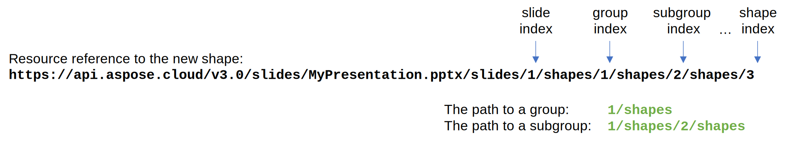

## **Introduction**

This article shows you how to create a shape and immediately add it to a shape group in a PowerPoint presentation using Aspose.Slides for Cloud API in your applications. The following method allows you to specify a path to the shape group where the new shape will be added. You should pass a data transfer object for the new shape to the method parameters or specify an index of the shape that you want to clone.

## **CreateSubshape**

### **API Information**

|**API**|**Type**|**Description**|**Resource**|
| :- | :- | :- | :- |
|/slides/{name}/slides/{slideIndex}/shapes/{path}|POST|Creates a new shape and adds it to a shape group.|[CreateSubshape](https://apireference.aspose.cloud/slides/#/Shapes/CreateSubshape)|

**Request Parameters**

|**Name**|**Type**|**Location**|**Required**|**Description**|
| :- | :- | :- | :- | :- |
|name|string|path|true|The name of a presentation file.|
|slideIndex|integer|path|true|The 1-based index of the slide with the shape group.|
|path|string|path|true|The path to the shape group, relative to the slide.|
|dto|object|body|false|The data transfer object for the new shape.|
|shapeToClone|integer|query|false|The 1-based index of the shape to be cloned.|
|position|integer|query|false|The 1-based index of the new shape in the group. By default, the shape is added to the end.|
|password|string|header|false|The password to open the presentation.|
|folder|string|query|false|The path to the folder containing the presentation.|
|storage|string|query|false|The name of the storage contaning the `folder`.|

*In case of Amazon S3 storage folder path starts with Amazon S3 bucket name.*

{} 

A shape group can consist of both shapes and other groups (subgroups). For example, a presentation contains a single shape representing a shape group containing a shape, and a shape subgroup containing two shapes, and so on. Therefore, you have to specify the `path` to a group of shapes in order to add a new shape to it.



{} 

### **Examples**

The **first** slide in **MyFolder/MyPresentation.pptx** document contains **three** shapes. The last shape is a shape group containing five shapes. Add a square with default style at coordinates (20, 20) and size 100x100 to the shape group.

**cURL Solution**





**Get an Access Token**

```sh
curl -X POST "https://api.aspose.cloud/connect/token" \
     -d "grant_type=client_credentials&client_id=MyClientId&client_secret=MyClientSecret" \
     -H "Content-Type: application/x-www-form-urlencoded"
```

**Add the Shape to the Group**

```sh
curl -X POST "https://api.aspose.cloud/v3.0/slides/MyPresentation.pptx/slides/1/shapes/3/shapes?folder=MyFolder" \
     -H "authorization: Bearer MyAccessToken" \
     -H "Content-Type: application/json" \
     -d @RequestData.json
```

RequestData.json content:

```json
{
    "ShapeType": "Rectangle",
    "X": 20,
    "Y": 20,
    "Width": 100,
    "Height": 100
}
```





**Response Example**

```json
{
    "type": "Shape",
    "text": "",
    "paragraphs": {
        "href": "https://api.aspose.cloud/v3.0/slides/MyPresentation.pptx/slides/1/shapes/3/shapes/6/paragraphs?folder=MyFolder",
        "relation": "self",
        "slideIndex": 1,
        "shapeIndex": 6
    },
    "textFrameFormat": {
        "threeDFormat": {
            "contourWidth": 0.0,
            "depth": 0.0,
            "extrusionHeight": 0.0
        },
        "transform": "NotDefined"
    },
    "shapeType": "Rectangle",
    "name": "New shape",
    "width": 100.0,
    "height": 100.0,
    "alternativeText": "",
    "alternativeTextTitle": "",
    "hidden": false,
    "x": 19.99997,
    "y": 20.0,
    "zOrderPosition": 5,
    "fillFormat": {
        "type": "Solid",
        "color": "#FF4472C4"
    },
    "threeDFormat": {
        "contourWidth": 0.0,
        "depth": 0.0,
        "extrusionHeight": 0.0
    },
    "lineFormat": {
        "alignment": "Center",
        "capStyle": "Flat",
        "dashStyle": "Solid",
        "joinStyle": "Miter",
        "style": "Single",
        "beginArrowHead": {
            "length": "Medium",
            "style": "None",
            "width": "Medium"
        },
        "endArrowHead": {
            "length": "Medium",
            "style": "None",
            "width": "Medium"
        },
        "fillFormat": {
            "type": "Solid",
            "color": "#FF2F528F"
        },
        "miterLimit": 8.0,
        "width": 1.0
    },
    "selfUri": {
        "href": "https://api.aspose.cloud/v3.0/slides/MyPresentation.pptx/slides/1/shapes/3/shapes/6?folder=MyFolder",
        "relation": "self",
        "slideIndex": 1
    }
}
```





**SDK Solutions**





```csharp
// For complete examples and data files, please go to https://github.com/aspose-Slides-cloud/aspose-Slides-cloud-dotnet

using Aspose.Slides.Cloud.Sdk;
using Aspose.Slides.Cloud.Sdk.Model;
using System;

class Application
{
    static void Main()
    {
        var slidesApi = new SlidesApi("MyClientId", "MyClientSecret");

        // Prepare data for the new shape.
        var square = new Shape
        {
            ShapeType = GeometryShape.ShapeTypeEnum.Rectangle,
            X = 20,
            Y = 20,
            Width = 100,
            Height = 100
        };

        // Create the shape and add it to the shape group that has an index of 3.
        var shape = slidesApi.CreateSubshape("MyPresentation.pptx", 1, "3/shapes", square, folder: "MyFolder");

        // Print the resource reference to the shape.
        Console.WriteLine(shape.SelfUri.Href);
    }
}
```





```java
// For complete examples and data files, please go to https://github.com/aspose-Slides-cloud/aspose-Slides-cloud-java

import com.aspose.slides.ApiException;
import com.aspose.slides.api.SlidesApi;
import com.aspose.slides.model.*;

public class Application {
    public static void main(String[] args) throws ApiException {
        var slidesApi = new SlidesApi("MyClientId", "MyClientSecret");

        // Prepare data for the new shape.
        var square = new Shape();
        square.setShapeType(GeometryShape.ShapeTypeEnum.RECTANGLE);
        square.setX(20.0);
        square.setY(20.0);
        square.setWidth(100.0);
        square.setHeight(100.0);

        // Create the shape and add it to the shape group that has an index of 3.
        var shape = slidesApi.createSubshape("MyPresentation.pptx", 1, "3/shapes", square, null, null, null, "MyFolder", null);

        // Print the resource reference to the shape.
        System.out.println(shape.getSelfUri().getHref());
    }
}
```





```php
// For complete examples and data files, please go to https://github.com/aspose-Slides-cloud/aspose-Slides-cloud-php

use Aspose\Slides\Cloud\Sdk\Api\Configuration;
use Aspose\Slides\Cloud\Sdk\Api\SlidesApi;
use Aspose\Slides\Cloud\Sdk\Model\Shape;

$configuration = new Configuration();
$configuration->setAppSid("MyClientId");
$configuration->setAppKey("MyClientSecret");

$slidesApi = new SlidesApi(null, $configuration);

// Prepare data for the new shape.
$square = new Shape();
$square->setShapeType("Rectangle");
$square->setX(20);
$square->setY(20);
$square->setWidth(100);
$square->setHeight(100);

// Create the shape and add it to the shape group that has an index of 3.
$shape = $slidesApi->createSubshape("MyPresentation.pptx", 1, "3/shapes", $square, null, null, null, "MyFolder");

// Print the resource reference to the shape.
print($shape->getSelfUri()->getHref());
```





```ruby
# For complete examples and data files, please go to https://github.com/aspose-Slides-cloud/aspose-Slides-cloud-ruby

require "aspose_slides_cloud"

include AsposeSlidesCloud

configuration = Configuration.new
configuration.app_sid = "MyClientId"
configuration.app_key = "MyClientSecret"

slides_api = SlidesApi.new(configuration)

# Prepare data for the new shape.
square = Shape.new
square.shape_type = "Rectangle"
square.x = 20
square.y = 20
square.width = 100
square.height = 100

# Create the shape and add it to the shape group that has an index of 3.
shape = slides_api.create_subshape("MyPresentation.pptx", 1, "3/shapes", square, nil, nil, nil, "MyFolder")

# Print the resource reference to the shape.
print shape.self_uri.href
```





```python
# For complete examples and data files, please go to https://github.com/aspose-Slides-cloud/aspose-Slides-cloud-python

import asposeslidescloud

from asposeslidescloud.apis.slides_api import SlidesApi
from asposeslidescloud.models import *

slides_api = SlidesApi(None, "MyClientId", "MyClientSecret")

# Prepare data for the new shape.
square = Shape()
square.shape_type = "Rectangle"
square.x = 20
square.y = 20
square.width = 100
square.height = 100

# Create the shape and add it to the shape group that has an index of 3.
shape = slides_api.create_subshape("MyPresentation.pptx", 1, "3/shapes", square, None, None, None, "MyFolder")

# Print the resource reference to the shape.
print(shape.self_uri.href)
```





```js
// For complete examples and data files, please go to https://github.com/aspose-Slides-cloud/aspose-Slides-cloud-nodejs

const cloud = require("asposeslidescloud")

const slidesApi = new cloud.SlidesApi("MyClientId", "MyClientSecret")

// Prepare data for the new shape.
const square = new cloud.Shape()
square.shapeType = "Rectangle"
square.x = 20
square.y = 20
square.width = 100
square.height = 100

// Create the shape and add it to the shape group that has an index of 3.
slidesApi.createSubshape("MyPresentation.pptx", 1, "3/shapes", square, null, null, null, "MyFolder").then((shape) => {
    // Print the resource reference to the shape.
    console.log(shape.body.selfUri.href)
})
```





```cpp
// For complete examples and data files, please go to https://github.com/aspose-Slides-cloud/aspose-Slides-cloud-cpp

#include "asposeslidescloud/api/SlidesApi.h"

using namespace asposeslidescloud::api;

int main()
{
    auto slidesApi = new SlidesApi(L"MyClientId", L"MyClientSecret");

    // Prepare data for the new shape.
    auto square = std::make_shared<Shape>();
    square->setShapeType(L"Rectangle");
    square->setX(20);
    square->setY(20);
    square->setWidth(100);
    square->setHeight(100);

    // Create the shape and add it to the shape group that has an index of 3.
    auto shape = slidesApi->createSubshape(L"MyPresentation.pptx", 1, L"3/shapes", square, boost::none, boost::none, L"", L"MyFolder").get();

    // Print the resource reference to the shape.
    std::wcout << shape->getSelfUri()->getHref();

    std::cin.get();

    return 0;
}
```





```perl
# For complete examples and data files, please go to https://github.com/aspose-Slides-cloud/aspose-Slides-cloud-perl

use AsposeSlidesCloud::Configuration;
use AsposeSlidesCloud::SlidesApi;
use AsposeSlidesCloud::Object::Shape;

my $config = AsposeSlidesCloud::Configuration->new();
$config->{app_sid} = "MyClientId";
$config->{app_key} = "MyClientSecret";

my $slides_api = AsposeSlidesCloud::SlidesApi->new(config => $config);

# Prepare data for the new shape.
my $square = AsposeSlidesCloud::Object::Shape->new();
$square->{shape_type} = "Rectangle";
$square->{x} = 20;
$square->{y} = 20;
$square->{width} = 100;
$square->{height} = 100;

# Create the shape and add it to the shape group that has an index of 3.
my %parameters = (name => "MyPresentation.pptx", slide_index => 1, path => "3/shapes", dto => $square, folder => "MyFolder");
my $shape = $slides_api->create_subshape(%parameters);

# Print the resource reference to the shape.
print($shape->{self_uri}->{href});
```













## **SDKs**

Using an SDK (API client) is the quickest way for a developer to speed up development. An SDK takes care of a lot of low-level details of making requests and handling responses and lets you focus on writing code specific to your particular project. Check out our [GitHub repository](https://github.com/aspose-slides-cloud) for a complete list of Aspose.Slides Cloud SDKs along with working examples, to get you started in no time. Please check [Available SDKs](/slides/available-sdks/) article to learn how to add an SDK to your project.
