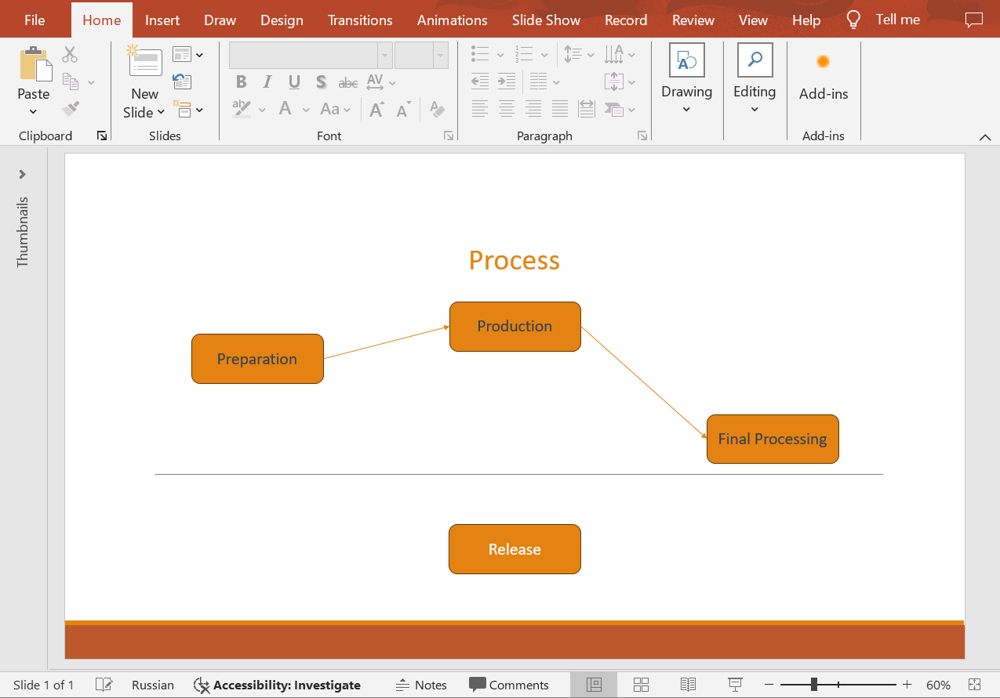
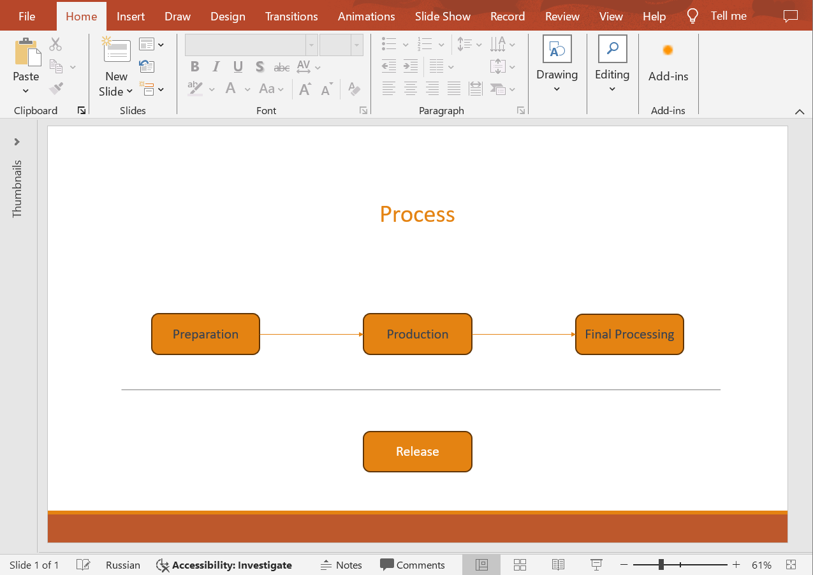

## **Introduction**

Aligning shapes in PowerPoint presentations is an essential feature that allows you to create professionally polished slides and documents. This feature ensures precise arrangement, alignment, and distribution of space between shapes, making the presentation look more organized and easily comprehensible. Use the following method to align shapes on slides and enhance the visual appeal of your presentations.

## **AlignShapes**

### **API Information**

|**API**|**Type**|**Description**|**Resource**|
| :- | :- | :- | :- |
|/slides/{name}/slides/{slideIndex}/shapes/align/{alignmentType}|POST|Aligns shapes to the edge of the slide or aligns them relative to each other.|[AlignShapes](https://reference.aspose.cloud/slides/#/Shapes/AlignShapes)|

**Request Parameters**

|**Name**|**Type**|**Location**|**Required**|**Description**|
| :- | :- | :- | :- | :- |
|name|string|path|true|The presentation file name.|
|slideIndex|integer|path|true|The 1-based index of the presentation slide.|
|alignmentType|`ShapesAlignmentType`|path|true|The type of alignment that will be applied to the shapes.|
|alignToSlide|boolean|query|false|If `true`, the shapes will be aligned to the slide edges; otherwise, they will be aligned to each other. The default is `false`.|
|shapes|string|query|false|The indices of the shapes to be aligned.|
|password|string|header|false|The password to open the presentation.|
|folder|string|query|false|The folder where the presentation file is located.|
|storage|string|query|false|The storage where the presentation file is located.|
|subShape|string|query|false|The sub-shape path (e.g. "3", "3/shapes/2").|

*In case of Amazon S3 storage folder path starts with Amazon S3 bucket name.*


|**Name**|**Value**|**Description**|
| :- | :- | :- |
|AlignLeft|0|Align shapes to the left.|
|AlignRight|1|Align shapes to the right.|
|AlignCenter|2|Align shapes to the center.|
|AlignTop|3|Align shapes to the top.|
|AlignMiddle|4|Align shapes to the middle.|
|AlignBottom|5|Align shapes to the bottom.|
|DistributeHorizontally|6|Distribute shapes horizontally.|
|DistributeVertically|7|Distribute shapes vertically.|


### **Examples**

The document **MyPresentation.pptx** contains **four** shapes with the text "Preparation", "Production", "Final Processing", and "Release". Align the first **three** shapes to the **middle** of the slide.



**cURL Solution**





**Get an Access Token**

```sh
curl POST "https://api.aspose.cloud/connect/token" \
     -d "grant_type=client_credentials&client_id=MyClientId&client_secret=MyClientSecret" \
     -H "Content-Type: application/x-www-form-urlencoded"
```

**Align the Shapes**

```sh
curl -X POST "https://api.aspose.cloud/v3.0/slides/MyPresentation.pptx/slides/1/shapes/align/AlignMiddle?alignToSlide=true&shapes=1,2,3" \
     -H "authorization: Bearer MyAccessToken" \
     -H "Content-Length: 0"
```





**Response Example**

```json
{
  "shapesLinks": [
    {
      "href": "https://api.aspose.cloud/v3.0/slides/MyPresentation.pptx/slides/1/shapes/1",
      "relation": "self",
      "slideIndex": 1,
      "shapeIndex": 1
    },
    {
      "href": "https://api.aspose.cloud/v3.0/slides/MyPresentation.pptx/slides/1/shapes/2",
      "relation": "self",
      "slideIndex": 1,
      "shapeIndex": 2
    },
    {
      "href": "https://api.aspose.cloud/v3.0/slides/MyPresentation.pptx/slides/1/shapes/3",
      "relation": "self",
      "slideIndex": 1,
      "shapeIndex": 3
    },
    {
      "href": "https://api.aspose.cloud/v3.0/slides/MyPresentation.pptx/slides/1/shapes/4",
      "relation": "self",
      "slideIndex": 1,
      "shapeIndex": 4
    },
    {
      "href": "https://api.aspose.cloud/v3.0/slides/MyPresentation.pptx/slides/1/shapes/5",
      "relation": "self",
      "slideIndex": 1,
      "shapeIndex": 5
    },
    {
      "href": "https://api.aspose.cloud/v3.0/slides/MyPresentation.pptx/slides/1/shapes/6",
      "relation": "self",
      "slideIndex": 1,
      "shapeIndex": 6
    },
    {
      "href": "https://api.aspose.cloud/v3.0/slides/MyPresentation.pptx/slides/1/shapes/7",
      "relation": "self",
      "slideIndex": 1,
      "shapeIndex": 7
    }
  ],
  "selfUri": {
    "href": "https://api.aspose.cloud/v3.0/slides/MyPresentation.pptx/slides/1/shapes",
    "relation": "self",
    "slideIndex": 1
  }
}
```





**SDK Solutions**





```csharp
using System.Collections.Generic;
using Aspose.Slides.Cloud.Sdk;
using Aspose.Slides.Cloud.Sdk.Model;

class Application
{
    static void Main(string[] args)
    {
        var slidesApi = new SlidesApi("MyClientId", "MyClientSecret");

        var documentName = "MyPresentation.pptx";
        var slideIndex = 1;
        var alignmentType = ShapesAlignmentType.AlignMiddle;
        var alignToSlide = true;
        var shapeIndices = new List<int> { 1, 2, 3 };

        slidesApi.AlignShapes(documentName, slideIndex, alignmentType, alignToSlide, shapeIndices);
    }
}
```





```java
import com.aspose.slides.ApiException;
import com.aspose.slides.api.SlidesApi;
import com.aspose.slides.model.ShapesAlignmentType;

import java.util.Arrays;

public class Application {
    public static void main(String[] args) throws ApiException {
        var slidesApi = new SlidesApi("MyClientId", "MyClientSecret");

        var documentName = "MyPresentation.pptx";
        var slideIndex = 1;
        var alignmentType = ShapesAlignmentType.ALIGNMIDDLE;
        var alignToSlide = true;
        var shapeIndices = Arrays.asList(1, 2, 3);

        slidesApi.alignShapes(documentName, slideIndex, alignmentType, alignToSlide, shapeIndices, null, null, null, null);
    }
}
```





```php
use Aspose\Slides\Cloud\Sdk\Api\Configuration;
use Aspose\Slides\Cloud\Sdk\Api\SlidesApi;
use Aspose\Slides\Cloud\Sdk\Model\ShapesAlignmentType;

$configuration = new Configuration();
$configuration->setAppSid("MyClientId");
$configuration->setAppKey("MyClientSecret");

$slidesApi = new SlidesApi(null, $configuration);

$documentName = "MyPresentation.pptx";
$slideIndex = 1;
$alignmentType = ShapesAlignmentType::ALIGN_MIDDLE;
$alignToSlide = true;
$shapeIndices = [1, 2, 3];

$slidesApi->alignShapes($documentName, $slideIndex, $alignmentType, $alignToSlide, $shapeIndices);
```





```ruby
require "aspose_slides_cloud"

include AsposeSlidesCloud

configuration = Configuration.new
configuration.app_sid = "MyClientId"
configuration.app_key = "MyClientSecret"

slides_api = SlidesApi.new(configuration)

document_name = "MyPresentation.pptx"
slide_index = 1
alignment_type = ShapesAlignmentType::ALIGN_MIDDLE
align_to_slide = true
shape_indices = [1, 2, 3]

slides_api.align_shapes(document_name, slide_index, alignment_type, align_to_slide, shape_indices)
```





```python
from asposeslidescloud.apis.slides_api import SlidesApi
from asposeslidescloud.models.shapes_alignment_type import ShapesAlignmentType

slides_api = SlidesApi(None, "MyClientId", "MyClientSecret")

document_name = "MyPresentation.pptx"
slide_index = 1
alignment_type = ShapesAlignmentType.ALIGNMIDDLE
align_to_slide = True
shape_indices = [1, 2, 3]

slides_api.align_shapes(document_name, slide_index, alignment_type, align_to_slide, shape_indices)
```





```js
const cloud = require("asposeslidescloud");

const slidesApi = new cloud.SlidesApi("MyClientId", "MyClientSecret");

const documentName = "MyPresentation.pptx";
const slideIndex = 1;
const alignmentType = "AlignMiddle";
const alignToSlide = true;
const shapeIndices = [1, 2, 3];

slidesApi.alignShapes(documentName, slideIndex, alignmentType, alignToSlide, shapeIndices).then(() => {
})
.catch(error => {
    console.error(error.message);
});
```





```cpp
#include "asposeslidescloud/api/SlidesApi.h"

using namespace asposeslidescloud::api;

int main()
{
    auto slidesApi = std::make_shared<SlidesApi>(L"MyClientId", L"MyClientSecret");

    auto documentName = L"MyPresentation.pptx";
    auto slideIndex = 1;
    auto alignmentType = L"AlignMiddle";
    auto alignToSlide = true;
    auto shapeIndices = { 1, 2, 3 };

    slidesApi->alignShapes(documentName, slideIndex, alignmentType, alignToSlide, shapeIndices).get();
}
```





```perl
use AsposeSlidesCloud::Configuration;
use AsposeSlidesCloud::SlidesApi;

my $config = AsposeSlidesCloud::Configuration->new();
$config->{app_sid} = "MyClientId";
$config->{app_key} = "MyClientSecret";

my $slides_api = AsposeSlidesCloud::SlidesApi->new(config => $config);

my %shape_indices = (1, 2, 3);
my %parameters = (name => "MyPresentation.pptx", slide_index => 1, alignment_type => "AlignMiddle", align_to_slide => true, shapes => \@shape_indices);

$slides_api->align_shapes(%parameters);
```













Result:



## **SDKs**

Check [Available SDKs](/slides/available-sdks/) to learn how to add an SDK to your project.
