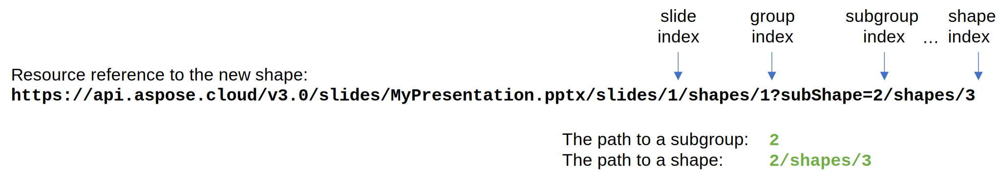

## **Introduction**

A group shape is a container for other shapes. This article shows you how to extract a shape from the group shape using Aspose.Slides Cloud API in your applications.

**GetShape** method has an optional **subShape** parameter that allows to specify path to the sub-shape to be retrieved. The sub-shape path is a string that contains shape index (e.g., "1") or a path in case of more than one level of grouping (e.g. "1/shapes/1"). The returned object and shape data depend on the shape type.

{} 

A shape group can consist of both shapes and other groups (subgroups). For example, a presentation contains a single shape representing a shape group containing a shape, and a shape subgroup containing two shapes, and so on. Therefore, you have to specify the `subShape` to a group of shapes in order to add a new shape to it.



{}

### **Examples**

**MyFolder/MyPresentation.pptx** document contains a **single** shape on the **second** slide. Extract the **third** shape from the group shape.

**cURL Solution**





**Get an Access Token**

```sh
curl -X POST "https://api.aspose.cloud/connect/token" \
     -d "grant_type=client_credentials&client_id=MyClientId&client_secret=MyClientSecret" \
     -H "Content-Type: application/x-www-form-urlencoded"
```

**Extract the Shape**

```sh
curl -X GET "https://api.aspose.cloud/v3.0/slides/MyPresentation.pptx/slides/2/shapes/1?subShape=3&folder=MyFolder" \
     -H "authorization: Bearer MyAccessToken"
```





**Response Example**

```json
{
    "type": "Shape",
    "text": "The third shape.",
    "paragraphs": {
        "href": "https://api.aspose.cloud/v3.0/slides/MyPresentation.pptx/slides/2/shapes/1/shapes/3/paragraphs?folder=MyFolder",
        "relation": "self",
        "slideIndex": 2,
        "shapeIndex": 3
    },
    "textFrameFormat": {
        "threeDFormat": {
            "contourWidth": 0.0,
            "depth": 0.0,
            "extrusionHeight": 0.0
        },
        "transform": "NotDefined"
    },
    "shapeType": "Rectangle",
    "name": "Rectangle 2",
    "width": 205.60826,
    "height": 171.64944,
    "alternativeText": "",
    "hidden": false,
    "x": 592.5773,
    "y": 174.24748,
    "zOrderPosition": 2,
    "fillFormat": {
        "type": "Solid",
        "color": "#FF4472C4"
    },
    "threeDFormat": {
        "contourWidth": 0.0,
        "depth": 0.0,
        "extrusionHeight": 0.0
    },
    "lineFormat": {
        "alignment": "Center",
        "capStyle": "Flat",
        "dashStyle": "Solid",
        "joinStyle": "Miter",
        "style": "Single",
        "beginArrowHead": {
            "length": "Medium",
            "style": "None",
            "width": "Medium"
        },
        "endArrowHead": {
            "length": "Medium",
            "style": "None",
            "width": "Medium"
        },
        "fillFormat": {
            "type": "Solid",
            "color": "#FF2F528F"
        },
        "miterLimit": 8.0,
        "width": 1.0
    },
    "selfUri": {
        "href": "https://api.aspose.cloud/v3.0/slides/MyPresentation.pptx/slides/2/shapes/1/shapes/3?folder=MyFolder",
        "relation": "self",
        "slideIndex": 2
    }
}
```





**SDK Solutions**





```csharp
// For complete examples and data files, please go to https://github.com/aspose-Slides-cloud/aspose-Slides-cloud-dotnet

using Aspose.Slides.Cloud.Sdk;
using System;

class Application
{
    static void Main()
    {
        var slidesApi = new SlidesApi("MyClientId", "MyClientSecret");

        // Extract the 2nd shape from the group shape at index 4 placed on the 1st slide.
        var shape = slidesApi.GetShape("MyPresentation.pptx", 1, 4, null, "MyFolder", null, "2");

        // Print a resource reference to the shape.
        Console.WriteLine(shape.SelfUri.Href);
    }
}
```





```java
// For complete examples and data files, please go to https://github.com/aspose-Slides-cloud/aspose-Slides-cloud-java

import com.aspose.slides.ApiException;
import com.aspose.slides.api.SlidesApi;

public class Application {
    public static void main(String[] args) throws ApiException {
        SlidesApi slidesApi = new SlidesApi("MyClientId", "MyClientSecret");

        // Extract the 2nd shape from the group shape at index 4 placed on the 1st slide.
        ShapeBase shape = slidesApi.getShape("MyPresentation.pptx", 1, 4, null, "MyFolder", null, "2");

        // Print a resource reference to the shape.
        System.out.println(shape.getSelfUri().getHref());
    }
}
```





```php
// For complete examples and data files, please go to https://github.com/aspose-Slides-cloud/aspose-Slides-cloud-php

use Aspose\Slides\Cloud\Sdk\Api\Configuration;
use Aspose\Slides\Cloud\Sdk\Api\SlidesApi;

$configuration = new Configuration();
$configuration->setAppSid("MyClientId");
$configuration->setAppKey("MyClientSecret");

$slidesApi = new SlidesApi(null, $configuration);

// Extract the 2nd shape from the group shape at index 4 placed on the 1st slide.
$shape = $slidesApi->getShape("MyPresentation.pptx", 1, 4, null, "MyFolder", null, "2");

// Print a resource reference to the shape.
echo $shape->getSelfUri()->getHref();
```





```ruby
# For complete examples and data files, please go to https://github.com/aspose-Slides-cloud/aspose-Slides-cloud-ruby

require "aspose_slides_cloud"

include AsposeSlidesCloud

configuration = Configuration.new
configuration.app_sid = "MyClientId"
configuration.app_key = "MyClientSecret"

slides_api = SlidesApi.new(configuration)

# Extract the 2nd shape from the group shape at index 4 placed on the 1st slide.
shape = slides_api.get_shape("MyPresentation.pptx", 1, 4, nil, "MyFolder", nil, "2")

# Print a resource reference to the shape.
print shape.self_uri.href
```





```python
# For complete examples and data files, please go to https://github.com/aspose-Slides-cloud/aspose-Slides-cloud-python
import asposeslidescloud

from asposeslidescloud.apis.slides_api import SlidesApi

slides_api = SlidesApi(None, "MyClientId", "MyClientSecret")

# Extract the 2nd shape from the group shape at index 4 placed on the 1st slide.
shape = slides_api.get_shape("MyPresentation.pptx", 1, 4, None, "MyFolder", None, "2")

# Print a resource reference to the shape.
print(shape.self_uri.href)
```





```js
// For complete examples and data files, please go to https://github.com/aspose-Slides-cloud/aspose-Slides-cloud-nodejs

const cloud = require("asposeslidescloud");

const slidesApi = new cloud.SlidesApi("MyClientId", "MyClientSecret");

// Extract the 2nd shape from the group shape at index 4 placed on the 1st slide.
slidesApi.getShape("MyPresentation.pptx", 1, 4, null, "MyFolder", null, "2").then(shape => {
    // Print a resource reference to the shape.
    console.log(shape.body.selfUri.href);
});
```





```cpp
// For complete examples and data files, please go to https://github.com/aspose-Slides-cloud/aspose-Slides-cloud-cpp

#include "asposeslidescloud/api/SlidesApi.h"

using namespace asposeslidescloud::api;

int main()
{
    auto slidesApi = new SlidesApi(L"MyClientId", L"MyClientSecret");

    // Extract the 2nd shape from the group shape at index 4 placed on the 1st slide.
    auto shape = slidesApi->getShape(L"MyPresentation.pptx", 1, 4, L"", L"MyFolder", L"", L"2").get();

    // Print a resource reference to the shape.
    std::wcout << shape->getSelfUri()->getHref();

    return 0;
}
```





```perl
# For complete examples and data files, please go to https://github.com/aspose-Slides-cloud/aspose-Slides-cloud-perl

use AsposeSlidesCloud::Configuration;
use AsposeSlidesCloud::SlidesApi;

my $config = AsposeSlidesCloud::Configuration->new();
$config->{app_sid} = "MyClientId";
$config->{app_key} = "MyClientSecret";

my $slides_api = AsposeSlidesCloud::SlidesApi->new(config => $config);

# Extract the 2nd shape from the group shape at index 4 placed on the 1st slide.
my %parameters = (name => "MyPresentation.pptx", slide_index => 1, shape_index => 4, folder => "MyFolder", sub_shape=>"2");
my $shape = $slides_api->get_shape(%parameters);

# Print a resource reference to the shape.
print $shape->{self_uri}->{href};
```













## **SDKs**

Using an SDK (API client) is the quickest way for a developer to speed up development. An SDK takes care of a lot of low-level details of making requests and handling responses and lets you focus on writing code specific to your particular project. Check out our [GitHub repository](https://github.com/aspose-slides-cloud) for a complete list of Aspose.Slides Cloud SDKs along with working examples, to get you started in no time. Please check [Available SDKs](/slides/available-sdks/) article to learn how to add an SDK to your project.
