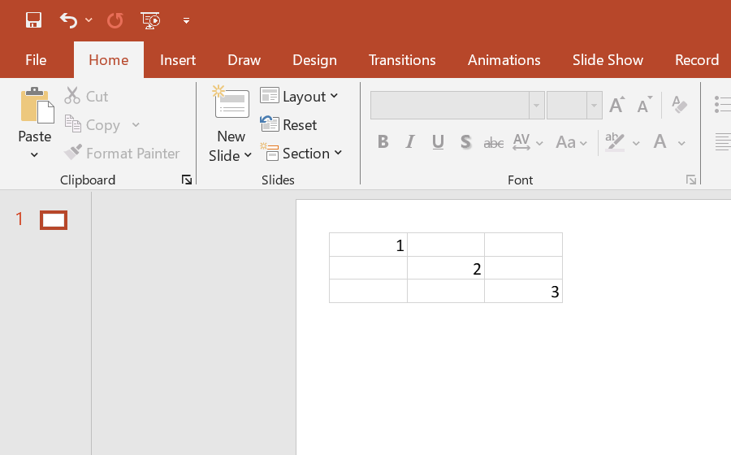

## **Introduction**

OLE (Object Linking and Embedding) objects in PowerPoint provide the capability to insert and interact with objects from other applications directly into the presentation. These objects can be either embedded or linked to the original file. In PowerPoint, OLE objects may encompass graphics, tables, charts, video, audio, and various other types of data. This article shows how to insert OLE objects into a presentation slide using Aspose.Slides Cloud API.

{} 
The examples below use the `CreateShape` method described in [Add a Shape to a Slide](/slides/add-a-shape-to-a-slide/).
{}

## **Example 1: Embed a File with an Icon**

The **default** storage contains the **MyPresentation.pptx** file. Add the **MyWorkbook.xlsx** file as an embedded object to the **first** presentation slide at position **(20, 20)**, with a width of **70**, and a height of **60**. Use the **MyExcelIcon.ico** file for the object icon and set the icon title to **My document**.

**cURL Solution**





**Get an Access Token**

```sh
curl POST "https://api.aspose.cloud/connect/token" \
     -d "grant_type=client_credentials&client_id=MyClientId&client_secret=MyClientSecret" \
     -H "Content-Type: application/x-www-form-urlencoded"
```

**Add the Embedded Object**

```sh
curl -X POST "https://api.aspose.cloud/v3.0/slides/MyPresentation.pptx/slides/1/shapes" \
     -H "authorization: Bearer MyAccessToken" \
     -H "Content-Type: application/json" \
     -d @OLEObject1.json
```

OLEObject1.json content:

```json
{
  "Type": "OleObjectFrame",
  "X": 20,
  "Y": 20,
  "Width": 70,
  "Height": 60,
  "EmbeddedFileBase64Data": "UEsDBBQABgAIAAAAIQCkU8XPTgE...AA=",
  "EmbeddedFileExtension": "xlsx",
  "IsObjectIcon": "True",
  "SubstitutePictureFormat": {
    "Type": "Picture",
    "Base64Data": "AAABAAEAQEAAAAEAIAAoQgAAFgA...AA=",
    "PictureFillMode": "Stretch"
  },
  "SubstitutePictureTitle": "My document"
}
```





**Response Example**

```json
{
  "type": "OleObjectFrame",
  "isObjectIcon": true,
  "substitutePictureTitle": "My document",
  "substitutePictureFormat": {
    "type": "Picture",
    "cropBottom": 0.0,
    "cropLeft": 0.0,
    "cropRight": 0.0,
    "cropTop": 0.0,
    "dpi": 0,
    "image": {
      "href": "https://api.aspose.cloud/v3.0/slides/MyPresentation.pptx/images/3",
      "relation": "self"
    },
    "pictureFillMode": "Stretch"
  },
  "objectName": "",
  "embeddedFileBase64Data": "UEsDBBQABgAIAAAAIQCkU8XPTgE...AA=",
  "embeddedFileExtension": "xlsx",
  "objectProgId": "excel.sheet.12",
  "linkPath": "",
  "name": "OleObject",
  "width": 70.0,
  "height": 60.0,
  "alternativeText": "",
  "alternativeTextTitle": "",
  "hidden": false,
  "x": 20.0,
  "y": 20.0,
  "zOrderPosition": 0,
  "fillFormat": { "type": "NoFill" },
  "threeDFormat": {
    "contourWidth": 0.0,
    "depth": 0.0,
    "extrusionHeight": 0.0
  },
  "lineFormat": {
    "alignment": "Center",
    "capStyle": "Flat",
    "dashStyle": "Solid",
    "joinStyle": "Round",
    "style": "Single",
    "beginArrowHead": {
      "length": "Medium",
      "style": "None",
      "width": "Medium"
    },
    "endArrowHead": {
      "length": "Medium",
      "style": "None",
      "width": "Medium"
    },
    "fillFormat": { "type": "NoFill" },
    "miterLimit": 10.0,
    "width": 0.75
  },
  "selfUri": {
    "href": "https://api.aspose.cloud/v3.0/slides/MyPresentation.pptx/slides/1/shapes/1",
    "relation": "self",
    "slideIndex": 1,
    "shapeIndex": 1
  }
}
```





**SDK Solutions**





```csharp
using System;
using System.IO;

using Aspose.Slides.Cloud.Sdk;
using Aspose.Slides.Cloud.Sdk.Model;

class Application
{
    static void Main(string[] args)
    {
        SlidesApi slidesApi = new SlidesApi("MyClientId", "MyClientSecret");

        string documentName = "MyPresentation.pptx";
        int slideIndex = 1;
        string oleFilePath = "MyWorkbook.xlsx";  // a local file
        string oleFileExtension = "xlsx";
        string iconFilePath = "MyExcelIcon.ico"; // a local file
        string iconTitle = "My document";

        byte[] oleData = File.ReadAllBytes(oleFilePath);
        byte[] iconData = File.ReadAllBytes(iconFilePath);

        OleObjectFrame oleFrame = new OleObjectFrame
        {
            X = 20,
            Y = 20,
            Width = 70,
            Height = 60,
            EmbeddedFileBase64Data = Convert.ToBase64String(oleData),
            EmbeddedFileExtension = oleFileExtension,
            IsObjectIcon = true,
            SubstitutePictureFormat = new PictureFill
            {
                Base64Data = Convert.ToBase64String(iconData),
                PictureFillMode = PictureFill.PictureFillModeEnum.Stretch
            },
            SubstitutePictureTitle = iconTitle
        };

        ShapeBase shape = slidesApi.CreateShape(documentName, slideIndex, oleFrame);

        Console.WriteLine("Shape reference: " + shape.SelfUri.Href);
    }
}
```





```java
import java.io.IOException;
import java.nio.file.Files;
import java.nio.file.Paths;
import java.util.Base64;

import com.aspose.slides.ApiException;
import com.aspose.slides.api.SlidesApi;
import com.aspose.slides.model.OleObjectFrame;
import com.aspose.slides.model.PictureFill;
import com.aspose.slides.model.ShapeBase;

public class Application {
    public static void main(String[] args) throws ApiException, IOException {
        SlidesApi slidesApi = new SlidesApi("MyClientId", "MyClientSecret");

        String documentName = "MyPresentation.pptx";
        int slideIndex = 1;
        String oleFilePath = "MyWorkbook.xlsx";  // a local file
        String oleFileExtension = "xlsx";
        String iconFilePath = "MyExcelIcon.ico"; // a local file
        String iconTitle = "My document";

        byte[] oleData = Files.readAllBytes(Paths.get(oleFilePath));
        byte[] iconData = Files.readAllBytes(Paths.get(iconFilePath));

        OleObjectFrame oleFrame = new OleObjectFrame();
        oleFrame.setX(20d);
        oleFrame.setY(20d);
        oleFrame.setWidth(70d);
        oleFrame.setHeight(60d);
        oleFrame.setEmbeddedFileBase64Data(Base64.getEncoder().encodeToString(oleData));
        oleFrame.setEmbeddedFileExtension(oleFileExtension);
        oleFrame.setIsObjectIcon(true);
        oleFrame.setSubstitutePictureFormat(new PictureFill());
        oleFrame.getSubstitutePictureFormat().setBase64Data(Base64.getEncoder().encodeToString(iconData));
        oleFrame.getSubstitutePictureFormat().setPictureFillMode(PictureFill.PictureFillModeEnum.STRETCH);
        oleFrame.setSubstitutePictureTitle(iconTitle);

        ShapeBase shape = slidesApi.createShape(documentName, slideIndex, oleFrame, null, null, null, null, null, null);

        System.out.println("Shape reference: " + shape.getSelfUri().getHref());
    }
}
```





```php
use Aspose\Slides\Cloud\Sdk\Api\Configuration;
use Aspose\Slides\Cloud\Sdk\Api\SlidesApi;
use Aspose\Slides\Cloud\Sdk\Model\OleObjectFrame;
use Aspose\Slides\Cloud\Sdk\Model\PictureFill;

$configuration = new Configuration();
$configuration->setAppSid("MyClientId");
$configuration->setAppKey("MyClientSecret");

$slidesApi = new SlidesApi(null, $configuration);

$documentName = "MyPresentation.pptx";
$slideIndex = 1;
$oleFilePath = "MyWorkbook.xlsx";  // a local file
$oleFileExtension = "xlsx";
$iconFilePath = "MyExcelIcon.ico"; // a local file
$iconTitle = "My document";

$oleData = file_get_contents($oleFilePath);
$iconData = file_get_contents($iconFilePath);

$oleFrame = new OleObjectFrame();
$oleFrame->setX(20);
$oleFrame->setY(20);
$oleFrame->setWidth(70);
$oleFrame->setHeight(60);
$oleFrame->setEmbeddedFileBase64Data(base64_encode($oleData));
$oleFrame->setEmbeddedFileExtension($oleFileExtension);
$oleFrame->setIsObjectIcon(true);
$oleFrame->setSubstitutePictureFormat(new PictureFill());
$oleFrame->getSubstitutePictureFormat()->setBase64Data(base64_encode($iconData));
$oleFrame->getSubstitutePictureFormat()->setPictureFillMode("Stretch");
$oleFrame->setSubstitutePictureTitle($iconTitle);

$shape = $slidesApi->createShape($documentName, $slideIndex, $oleFrame);

echo "Shape reference: ", $shape->getSelfUri()->getHref();
```





```ruby
require "base64"
require "aspose_slides_cloud"

include AsposeSlidesCloud

configuration = Configuration.new
configuration.app_sid = "MyClientId"
configuration.app_key = "MyClientSecret"

slides_api = SlidesApi.new(configuration)

document_name = "MyPresentation.pptx"
slide_index = 1
ole_file_path = "MyWorkbook.xlsx"  # a local file
ole_file_extension = "xlsx"
icon_file_path = "MyExcelIcon.ico" # a local file
icon_title = "My document"

ole_data = File.binread(ole_file_path)
icon_data = File.binread(icon_file_path)

ole_frame = OleObjectFrame.new
ole_frame.x = 20
ole_frame.y = 20
ole_frame.width = 70
ole_frame.height = 60
ole_frame.embedded_file_base64_data = Base64.encode64(ole_data)
ole_frame.embedded_file_extension = ole_file_extension
ole_frame.is_object_icon = true
ole_frame.substitute_picture_format = PictureFill.new
ole_frame.substitute_picture_format.base64_data = Base64.encode64(icon_data)
ole_frame.substitute_picture_format.picture_fill_mode = "Stretch"
ole_frame.substitute_picture_title = icon_title

shape = slides_api.create_shape(document_name, slide_index, ole_frame)

puts "Shape reference: #{shape.self_uri.href}"
```





```python
import base64

from asposeslidescloud.apis.slides_api import SlidesApi
from asposeslidescloud.models.ole_ole_frame import OleObjectFrame
from asposeslidescloud.models.picture_fill import PictureFill

slides_api = SlidesApi(None, "MyClientId", "MyClientSecret")

document_name = "MyPresentation.pptx"
slide_index = 1
ole_file_path = "MyWorkbook.xlsx"   # a local file
ole_file_extension = "xlsx"
icon_file_path = "MyExcelIcon.ico"  # a local file
icon_title = "My document"

with open(ole_file_path, "rb") as ole_stream:
    ole_base64_data = str(base64.b64encode(ole_stream.read()), "utf-8")

with open(icon_file_path, "rb") as icon_stream:
    icon_base64_data = str(base64.b64encode(icon_stream.read()), "utf-8")

ole_frame = OleObjectFrame()
ole_frame.x = 20
ole_frame.y = 20
ole_frame.width = 70
ole_frame.height = 60
ole_frame.embedded_file_base64_data = ole_base64_data
ole_frame.embedded_file_extension = ole_file_extension
ole_frame.is_object_icon = True
ole_frame.substitute_picture_format = PictureFill()
ole_frame.substitute_picture_format.base64_data = icon_base64_data
ole_frame.substitute_picture_format.picture_fill_mode = "Stretch"
ole_frame.substitute_picture_title = icon_title

shape = slides_api.create_shape(document_name, slide_index, ole_frame)

print("Shape reference:", shape.self_uri.href)
```





```js
const fs = require("fs");
const cloudSdk = require("asposeslidescloud");

const slidesApi = new cloudSdk.SlidesApi("MyClientId", "MyClientSecret");

documentName = "MyPresentation.pptx";
slideIndex = 1;
oleFilePath = "MyWorkbook.xlsx";  // a local file
oleFileExtension = "xlsx";
iconFilePath = "MyExcelIcon.ico"; // a local file
iconTitle = "My document";

oleBase64Data = fs.readFileSync(oleFilePath, { encoding: "base64" });
iconBase64Data = fs.readFileSync(iconFilePath, { encoding: "base64" });

oleFrame = new cloudSdk.OleObjectFrame();
oleFrame.x = 20;
oleFrame.y = 20;
oleFrame.width = 70;
oleFrame.height = 60;
oleFrame.embeddedFileBase64Data = oleBase64Data;
oleFrame.embeddedFileExtension = oleFileExtension;
oleFrame.isObjectIcon = true;
oleFrame.substitutePictureFormat = new cloudSdk.PictureFill();
oleFrame.substitutePictureFormat.base64Data = iconBase64Data;
oleFrame.substitutePictureFormat.pictureFillMode = cloudSdk.PictureFill.PictureFillModeEnum.Stretch;
oleFrame.substitutePictureTitle = iconTitle;

slidesApi.createShape(documentName, slideIndex, oleFrame).then(shape => {
    console.log("Shape reference:", shape.body.selfUri.href);
});
```









```perl
use File::Slurp;
use MIME::Base64;

use AsposeSlidesCloud::Configuration;
use AsposeSlidesCloud::SlidesApi;
use AsposeSlidesCloud::Object::OleObjectFrame;
use AsposeSlidesCloud::Object::PictureFill;

my $config = AsposeSlidesCloud::Configuration->new();
$config->{app_sid} = "MyClientId";
$config->{app_key} = "MyClientSecret";

my $slides_api = AsposeSlidesCloud::SlidesApi->new(config => $config);

my $document_name = "MyPresentation.pptx";
my $slide_index = 1;
my $ole_file_path = "MyWorkbook.xlsx";  # a local file
my $ole_file_extension = "xlsx";
my $icon_file_path = "MyExcelIcon.ico"; # a local file
my $icon_title = "My document";

my $ole_data = read_file($ole_file_path, { binmode => ":raw" });
my $icon_data = read_file($icon_file_path, { binmode => ":raw" });

my $ole_frame = AsposeSlidesCloud::Object::OleObjectFrame->new();
$ole_frame->{x} = 20;
$ole_frame->{y} = 20;
$ole_frame->{width} = 70;
$ole_frame->{height} = 60;
$ole_frame->{embedded_file_base64_data} = encode_base64($ole_data);
$ole_frame->{embedded_file_extension} = $ole_file_extension;
$ole_frame->{is_object_icon} = "True";
$ole_frame->{substitute_picture_format} = AsposeSlidesCloud::Object::PictureFill->new();
$ole_frame->{substitute_picture_format}->{base64_data} = encode_base64($icon_data);
$ole_frame->{substitute_picture_format}->{picture_fill_mode} = "Stretch";
$ole_frame->{substitute_picture_title} = $icon_title;

my $shape = $slides_api->create_shape(name => $document_name, slide_index => $slide_index, dto => $ole_frame);

print("Shape reference: ", $shape->{self_uri}->{href});
```













The result:


## **Example 2: Add a Linked File**

The **default** storage contains the **MyPresentation.pptx** and **"MyWorkbook.xlsx"** files. Add the Excel file as a linked object to the **first** presentation slide at position **(20, 20)**, with a width of **145**, and a height of **44**.

**cURL Solution**





**Get an Access Token**

```sh
curl POST "https://api.aspose.cloud/connect/token" \
     -d "grant_type=client_credentials&client_id=MyClientId&client_secret=MyClientSecret" \
     -H "Content-Type: application/x-www-form-urlencoded"
```

**Add the Linked Object**

```sh
curl -X POST "https://api.aspose.cloud/v3.0/slides/MyPresentation.pptx/slides/1/shapes" \
     -H "authorization: Bearer MyAccessToken" \
     -H "Content-Type: application/json" \
     -d @OLEObject2.json
```

OLEObject2.json content:

```json
{
  "Type": "OleObjectFrame",
  "X": 20,
  "Y": 20,
  "Width": 145,
  "Height": 44,
  "ObjectProgId": "Excel.Sheet.12",
  "LinkPath": "MyWorkbook.xlsx"
}
```





**Response Example**

```json
{
  "type": "OleObjectFrame",
  "isObjectIcon": false,
  "substitutePictureFormat": {
    "type": "Picture",
    "cropBottom": 0.0,
    "cropLeft": 0.0,
    "cropRight": 0.0,
    "cropTop": 0.0,
    "dpi": 96,
    "image": {
      "href": "https://api.aspose.cloud/v3.0/slides/MyPresentation.pptx/images/2",
      "relation": "self"
    },
    "pictureFillMode": "Stretch"
  },
  "objectName": "",
  "objectProgId": "Excel.Sheet.12",
  "linkPath": "MyWorkbook.xlsx",
  "name": "OleObject",
  "width": 145.0,
  "height": 44.0,
  "alternativeText": "",
  "alternativeTextTitle": "",
  "hidden": false,
  "x": 20.0,
  "y": 20.0,
  "zOrderPosition": 0,
  "fillFormat": { "type": "NoFill" },
  "threeDFormat": {
    "contourWidth": 0.0,
    "depth": 0.0,
    "extrusionHeight": 0.0
  },
  "lineFormat": {
    "alignment": "Center",
    "capStyle": "Flat",
    "dashStyle": "Solid",
    "joinStyle": "Round",
    "style": "Single",
    "beginArrowHead": {
      "length": "Medium",
      "style": "None",
      "width": "Medium"
    },
    "endArrowHead": {
      "length": "Medium",
      "style": "None",
      "width": "Medium"
    },
    "fillFormat": { "type": "NoFill" },
    "miterLimit": 10.0,
    "width": 0.75
  },
  "selfUri": {
    "href": "https://api.aspose.cloud/v3.0/slides/MyPresentation.pptx/slides/1/shapes/1",
    "relation": "self",
    "slideIndex": 1,
    "shapeIndex": 1
  }
}
```





**SDK Solutions**





```csharp
using System;

using Aspose.Slides.Cloud.Sdk;
using Aspose.Slides.Cloud.Sdk.Model;

class Application
{
    static void Main(string[] args)
    {
        SlidesApi slidesApi = new SlidesApi("MyClientId", "MyClientSecret");

        string documentName = "MyPresentation.pptx";
        int slideIndex = 1;

        OleObjectFrame oleFrame = new OleObjectFrame
        {
            X = 20,
            Y = 20,
            Width = 145,
            Height = 44,
            ObjectProgId = "Excel.Sheet.12",
            LinkPath = "MyWorkbook.xlsx"
        };

        ShapeBase shape = slidesApi.CreateShape(documentName, slideIndex, oleFrame);

        Console.WriteLine("Shape reference: " + shape.SelfUri.Href);
    }
}
```





```java
import com.aspose.slides.ApiException;
import com.aspose.slides.api.SlidesApi;
import com.aspose.slides.model.OleObjectFrame;
import com.aspose.slides.model.ShapeBase;

public class Application {
    public static void main(String[] args) throws ApiException {
        SlidesApi slidesApi = new SlidesApi("MyClientId", "MyClientSecret");

        String documentName = "MyPresentation.pptx";
        int slideIndex = 1;

        OleObjectFrame oleFrame = new OleObjectFrame();
        oleFrame.setX(20d);
        oleFrame.setY(20d);
        oleFrame.setWidth(145d);
        oleFrame.setHeight(44d);
        oleFrame.setObjectProgId("Excel.Sheet.12");
        oleFrame.setLinkPath("MyWorkbook.xlsx");

        ShapeBase shape = slidesApi.createShape(documentName, slideIndex, oleFrame, null, null, null, null, null, null);

        System.out.println("Shape reference: " + shape.getSelfUri().getHref());
    }
}
```





```php
use Aspose\Slides\Cloud\Sdk\Api\Configuration;
use Aspose\Slides\Cloud\Sdk\Api\SlidesApi;
use Aspose\Slides\Cloud\Sdk\Model\OleObjectFrame;

$configuration = new Configuration();
$configuration->setAppSid("MyClientId");
$configuration->setAppKey("MyClientSecret");

$slidesApi = new SlidesApi(null, $configuration);

$documentName = "MyPresentation.pptx";
$slideIndex = 1;

$oleFrame = new OleObjectFrame();
$oleFrame->setX(20);
$oleFrame->setY(20);
$oleFrame->setWidth(145);
$oleFrame->setHeight(44);
$oleFrame->setObjectProgId("Excel.Sheet.12");
$oleFrame->setLinkPath("MyWorkbook.xlsx");

$shape = $slidesApi->createShape($documentName, $slideIndex, $oleFrame);

echo "Shape reference: ", $shape->getSelfUri()->getHref();
```





```ruby
require "aspose_slides_cloud"

include AsposeSlidesCloud

configuration = Configuration.new
configuration.app_sid = "MyClientId"
configuration.app_key = "MyClientSecret"

slides_api = SlidesApi.new(configuration)

document_name = "MyPresentation.pptx"
slide_index = 1

ole_frame = OleObjectFrame.new
ole_frame.x = 20
ole_frame.y = 20
ole_frame.width = 145
ole_frame.height = 44
ole_frame.object_prog_id = "Excel.Sheet.12"
ole_frame.link_path = "MyWorkbook.xlsx"

shape = slides_api.create_shape(document_name, slide_index, ole_frame)

puts "Shape reference: #{shape.self_uri.href}"
```





```python
from asposeslidescloud.apis.slides_api import SlidesApi
from asposeslidescloud.models.ole_object_frame import OleObjectFrame

slides_api = SlidesApi(None, "MyClientId", "MyClientSecret")

document_name = "MyPresentation.pptx"
slide_index = 1

ole_frame = OleObjectFrame()
ole_frame.x = 20
ole_frame.y = 20
ole_frame.width = 145
ole_frame.height = 44
ole_frame.object_prog_id = "Excel.Sheet.12"
ole_frame.link_path = "MyWorkbook.xlsx"

shape = slides_api.create_shape(document_name, slide_index, ole_frame)

print("Shape reference:", shape.self_uri.href)
```





```js
const cloudSdk = require("asposeslidescloud");

const slidesApi = new cloudSdk.SlidesApi("MyClientId", "MyClientSecret");

documentName = "MyPresentation.pptx";
slideIndex = 1;

oleFrame = new cloudSdk.OleObjectFrame();
oleFrame.x = 20;
oleFrame.y = 20;
oleFrame.width = 145;
oleFrame.height = 44;
oleFrame.objectProgId = "Excel.Sheet.12";
oleFrame.linkPath = "MyWorkbook.xlsx";

slidesApi.createShape(documentName, slideIndex, oleFrame).then(shape => {
    console.log("Shape reference:", shape.body.selfUri.href);
});
```





```cpp
#include "asposeslidescloud/api/SlidesApi.h"
#include "asposeslidescloud/model/OleObjectFrame.h"

using namespace asposeslidescloud::api;

int main()
{
    std::shared_ptr<SlidesApi> slidesApi = std::make_shared<SlidesApi>(L"MyClientId", L"MyClientSecret");

    const wchar_t* documentName = L"MyPresentation.pptx";
    int slideIndex = 1;

    std::shared_ptr<OleObjectFrame> oleFrame = std::make_shared<OleObjectFrame>();
    oleFrame->setX(20);
    oleFrame->setY(20);
    oleFrame->setWidth(145);
    oleFrame->setHeight(44);
    oleFrame->setObjectProgId(L"Excel.Sheet.12");
    oleFrame->setLinkPath(L"MyWorkbook.xlsx");

    std::shared_ptr<ShapeBase> shape = slidesApi->createShape(documentName, slideIndex, oleFrame).get();

    std::wcout << L"Shape reference: " << shape->getSelfUri()->getHref();
}
```





```perl
use AsposeSlidesCloud::Configuration;
use AsposeSlidesCloud::SlidesApi;
use AsposeSlidesCloud::Object::OleObjectFrame;

my $config = AsposeSlidesCloud::Configuration->new();
$config->{app_sid} = "MyClientId";
$config->{app_key} = "MyClientSecret";

my $slides_api = AsposeSlidesCloud::SlidesApi->new(config => $config);

my $document_name = "MyPresentation.pptx";
my $slide_index = 1;

my $ole_frame = AsposeSlidesCloud::Object::OleObjectFrame->new();
$ole_frame->{x} = 20;
$ole_frame->{y} = 20;
$ole_frame->{width} = 145;
$ole_frame->{height} = 44;
$ole_frame->{object_prog_id} = "Excel.Sheet.12";
$ole_frame->{link_path} = "MyWorkbook.xlsx";

my $shape = $slides_api->create_shape(name => $document_name, slide_index => $slide_index, dto => $ole_frame);

print("Shape reference: ", $shape->{self_uri}->{href});
```













The result:



## **SDKs**

Check [Available SDKs](/slides/available-sdks/) to learn how to add an SDK to your project.
