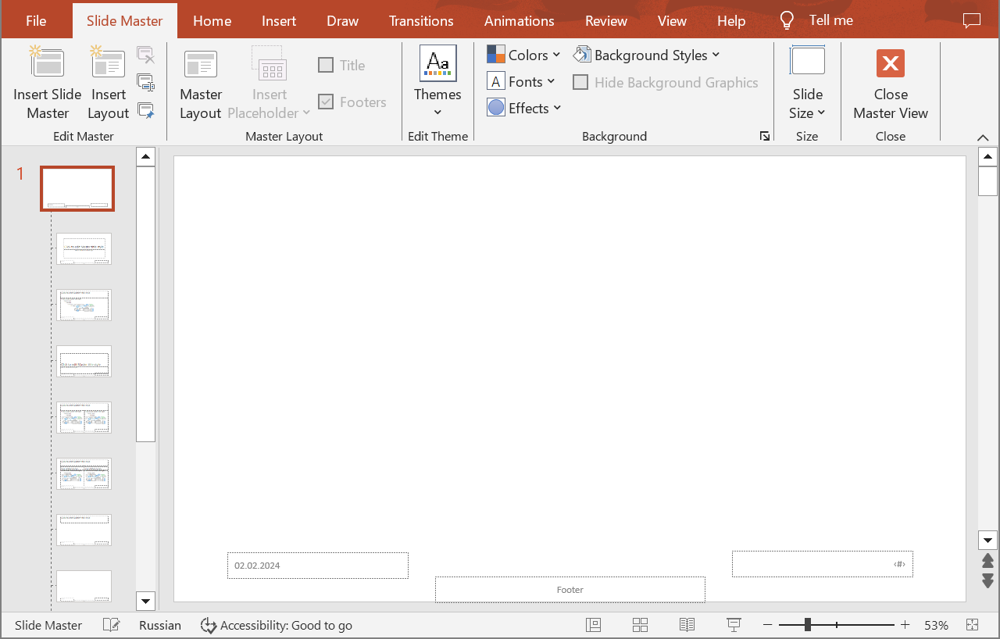
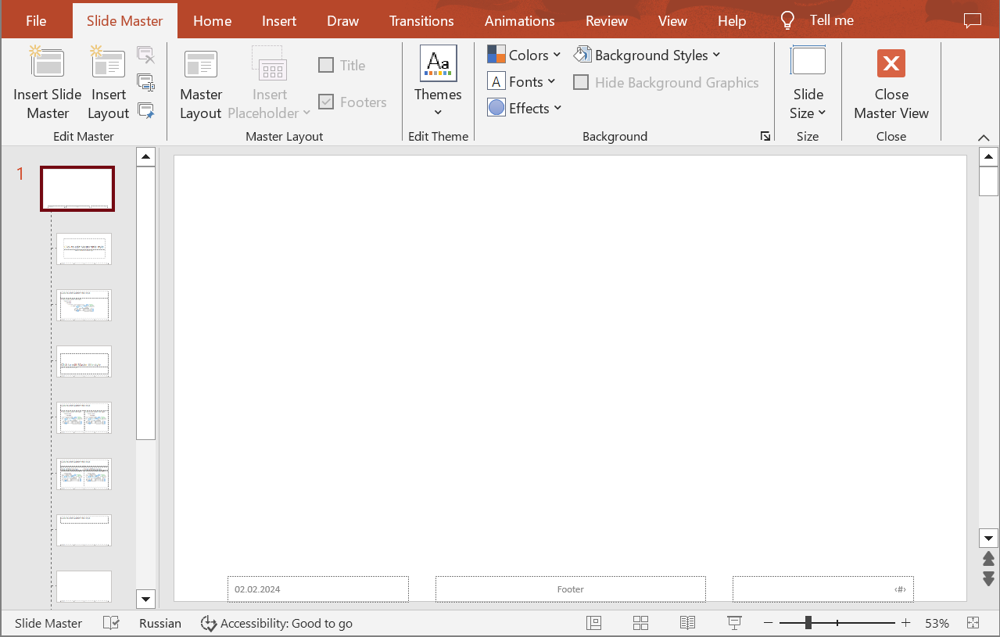

## **Introduction**

Aligning shapes in PowerPoint presentations is an essential feature that allows you to create professionally polished slides and documents. This feature ensures precise arrangement, alignment, and distribution of space between shapes, making the presentation look more organized and easily comprehensible. Use the following method to align shapes on special slides (Master, Layout, or Notes) and enhance the visual appeal of your presentations.

## **AlignSpecialSlideShapes**

### **API Information**

|**API**|**Type**|**Description**|**Resource**|
| :- | :- | :- | :- |
|/slides/{name}/slides/{slideIndex}/{slideType}/shapes/align/{alignmentType}|POST|Aligns shapes to the edge of the slide or aligns them relative to each other on a special slide.|[AlignSpecialSlideShapes](https://reference.aspose.cloud/slides/#/SpecialSlideShapes/AlignSpecialSlideShapes)|

**Request Parameters**

|**Name**|**Type**|**Location**|**Required**|**Description**|
| :- | :- | :- | :- | :- |
|name|string|path|true|The name of a presentation file saved in a storage.|
|slideIndex|integer|path|true|The 1-based index of a presentation slide.|
|slideType|`MasterSlide` or `LayoutSlide` or `NotesSlide`|path|true|The type of a special slide.|
|alignmentType|`ShapesAlignmentType`|path|true|The type of alignment that will be applied to the shapes.|
|alignToSlide|boolean|query|false|If `true`, the shapes will be aligned to the slide edges; otherwise, they will be aligned to each other. The default is `false`.|
|shapes|string|query|false|The indices of the shapes to be aligned.|
|password|string|header|false|The password to open the presentation.|
|folder|string|query|false|The folder where the presentation file is located.|
|storage|string|query|false|The storage where the folder is located.|
|subShape|string|query|false|The sub-shape path (e.g. "3", "3/shapes/2").|

*In case of Amazon S3 storage folder path starts with Amazon S3 bucket name.*


|**Name**|**Value**|**Description**|
| :- | :- | :- |
|AlignLeft|0|Align shapes to the left.|
|AlignRight|1|Align shapes to the right.|
|AlignCenter|2|Align shapes to the center.|
|AlignTop|3|Align shapes to the top.|
|AlignMiddle|4|Align shapes to the middle.|
|AlignBottom|5|Align shapes to the bottom.|
|DistributeHorizontally|6|Distribute shapes horizontally.|
|DistributeVertically|7|Distribute shapes vertically.|


### **Examples**

The document **MyPresentation.pptx** contains "Date and time", "Footer", and "Slide number" placeholders on the **Master** slide of the **first** presentation slide. Align the **"Date and time"** and **"Slide number"** to the **bottom** of the Master slide.



**cURL Solution**





**Get an Access Token**

```sh
curl POST "https://api.aspose.cloud/connect/token" \
     -d "grant_type=client_credentials&client_id=MyClientId&client_secret=MyClientSecret" \
     -H "Content-Type: application/x-www-form-urlencoded"
```

**Align the Placeholders**

```sh
curl -X POST "https://api.aspose.cloud/v3.0/slides/MyPresentation.pptx/slides/1/MasterSlide/shapes/align/AlignBottom?alignToSlide=true&shapes=1,3" \
     -H "authorization: Bearer MyAccessToken" \
     -H "Content-Length: 0"
```





**Response Example**

```json
{
  "shapesLinks": [
    {
      "href": "https://api.aspose.cloud/v3.0/slides/MyPresentation.pptx/masterSlides/1/shapes/1",
      "relation": "self",
      "shapeIndex": 1
    },
    {
      "href": "https://api.aspose.cloud/v3.0/slides/MyPresentation.pptx/masterSlides/1/shapes/2",
      "relation": "self",
      "shapeIndex": 2
    },
    {
      "href": "https://api.aspose.cloud/v3.0/slides/MyPresentation.pptx/masterSlides/1/shapes/3",
      "relation": "self",
      "shapeIndex": 3
    }
  ],
  "selfUri": {
    "href": "https://api.aspose.cloud/v3.0/slides/MyPresentation.pptx/masterSlides/1/shapes",
    "relation": "self"
  }
}
```





**SDK Solutions**





```csharp
using Aspose.Slides.Cloud.Sdk;
using Aspose.Slides.Cloud.Sdk.Model;
using System.Collections.Generic;

class Application
{
    static void Main(string[] args)
    {
        SlidesApi slidesApi = new SlidesApi("MyClientId", "MyClientSecret");

        string fileName = "MyPresentation.pptx";
        int slideIndex = 1;
        SpecialSlideType slideType = SpecialSlideType.MasterSlide;
        ShapesAlignmentType alignmentType = ShapesAlignmentType.AlignBottom;
        bool alignToSlide = true;
        List<int> shapeIndices = new List<int> { 1, 3 };

        slidesApi.AlignSpecialSlideShapes(fileName, slideIndex, slideType, alignmentType, alignToSlide, shapeIndices);
    }
}
```





```java
import com.aspose.slides.ApiException;
import com.aspose.slides.api.SlidesApi;
import com.aspose.slides.model.SpecialSlideType;
import com.aspose.slides.model.ShapesAlignmentType;

import java.util.Arrays;
import java.util.List;

public class Application {
    public static void main(String[] args) throws ApiException {
        SlidesApi slidesApi = new SlidesApi("MyClientId", "MyClientSecret";

        String fileName = "MyPresentation.pptx";
        int slideIndex = 1;
        SpecialSlideType slideType = SpecialSlideType.MASTERSLIDE;
        ShapesAlignmentType alignmentType = ShapesAlignmentType.ALIGNBOTTOM;
        boolean alignToSlide = true;
        List<Integer> shapeIndices = Arrays.asList(1, 3);

        slidesApi.alignSpecialSlideShapes(fileName, slideIndex, slideType, alignmentType, alignToSlide, shapeIndices, null, null, null, null);
    }
}
```





```php
use Aspose\Slides\Cloud\Sdk\Api\Configuration;
use Aspose\Slides\Cloud\Sdk\Api\SlidesApi;
use Aspose\Slides\Cloud\Sdk\Model\SpecialSlideType;
use Aspose\Slides\Cloud\Sdk\Model\ShapesAlignmentType;

$configuration = new Configuration();
$configuration->setAppSid("MyClientId");
$configuration->setAppKey("MyClientSecret");

$slidesApi = new SlidesApi(null, $configuration);

$fileName = "MyPresentation.pptx";
$slideIndex = 1;
$slideType = SpecialSlideType::MASTER_SLIDE;
$alignmentType = ShapesAlignmentType::ALIGN_BOTTOM;
$alignToSlide = true;
$shapeIndices = [1, 3];

$slidesApi->alignSpecialSlideShapes($fileName, $slideIndex, $slideType, $alignmentType, $alignToSlide, $shapeIndices);
```





```ruby
require "aspose_slides_cloud"

include AsposeSlidesCloud

configuration = Configuration.new
configuration.app_sid = "MyClientId"
configuration.app_key = "MyClientSecret"

slides_api = SlidesApi.new(configuration)

file_name = "MyPresentation.pptx"
slide_index = 1
slide_type = SpecialSlideType::MASTER_SLIDE
alignment_type = ShapesAlignmentType::ALIGN_BOTTOM
align_to_slide = true
shape_indices = [1, 3]

slides_api.align_special_slide_shapes(file_name, slide_index, slide_type, alignment_type, align_to_slide, shape_indices)
```





```python
from asposeslidescloud.apis.slides_api import SlidesApi
from asposeslidescloud.models.special_slide_type import SpecialSlideType
from asposeslidescloud.models.shapes_alignment_type import ShapesAlignmentType

slides_api = SlidesApi(None, "MyClientId", "MyClientSecret")

file_name = "MyPresentation.pptx"
slide_index = 1
slide_type = SpecialSlideType.MASTERSLIDE
alignment_type = ShapesAlignmentType.ALIGNBOTTOM
align_to_slide = True
shape_indices = [1, 3]

slides_api.align_special_slide_shapes(file_name, slide_index, slide_type, alignment_type, align_to_slide, shape_indices)
```





```js
const cloudSdk = require("asposeslidescloud");

const slidesApi = new cloudSdk.SlidesApi("MyClientId", "MyClientSecret");

fileName = "MyPresentation.pptx";
slideIndex = 1;
slideType = cloudSdk.SpecialSlideType.MasterSlide;
alignmentType = cloudSdk.ShapesAlignmentType.AlignBottom;
alignToSlide = true;
shapeIndices = [1, 3];

slidesApi.alignSpecialSlideShapes(fileName, slideIndex, slideType, alignmentType, alignToSlide, shapeIndices).then(shapes => {
    console.log("The shapes have been aligned.");
});
```





```cpp
#include "asposeslidescloud/api/SlidesApi.h"

using namespace asposeslidescloud::api;

int main()
{
    std::shared_ptr<SlidesApi> slidesApi = std::make_shared<SlidesApi>(L"MyClientId", L"MyClientSecret");

    const wchar_t* fileName = L"MyPresentation.pptx";
    const int slideIndex = 1;
    const wchar_t* slideType = L"MasterSlide";
    const wchar_t* alignmentType = L"AlignBottom";
    const bool alignToSlide = true;
    const std::vector<int> shapeIndices = { 1, 3 };

    slidesApi->alignSpecialSlideShapes(fileName, slideIndex, slideType, alignmentType, alignToSlide, shapeIndices).get();
}
```





```perl
use AsposeSlidesCloud::Configuration;
use AsposeSlidesCloud::SlidesApi;

my $config = AsposeSlidesCloud::Configuration->new();
$config->{app_sid} = "MyClientId";
$config->{app_key} = "MyClientSecret";

my $slides_api = AsposeSlidesCloud::SlidesApi->new(config => $config);

my $file_name = "MyPresentation.pptx";
my $slide_index = 1;
my $slide_type = "MasterSlide";
my $alignment_type = "AlignBottom";
my $align_to_slide = "True";
my $shape_indices = [1, 3];

my %parameters = (name => $file_name, slide_index => $slide_index, slide_type => $slide_type, alignment_type => $alignment_type, align_to_slide => $align_to_slide, shapes => $shape_indices);
$slides_api->align_special_slide_shapes(%parameters);
```













The result:



## **SDKs**

Check [Available SDKs](/slides/available-sdks/) to learn how to add an SDK to your project.
