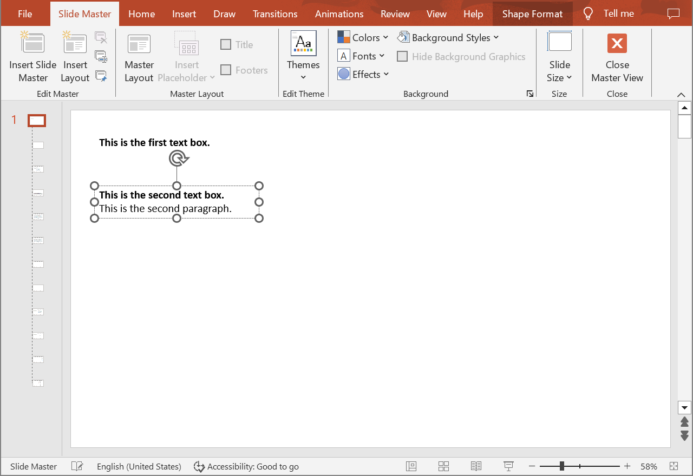

## **Introduction**

Aspose.Slides Cloud API allows you to read, add, modify and delete text paragraphs from shapes located on special slides (Master, Layout, Notes) in PowerPoint presentations. Use the following method to add a new text paragraph to a presentation shape.

## **CreateSpecialSlideParagraph**

### **API Information**

|**API**|**Type**|**Description**|**Resource**|
| :- | :- | :- | :- |
|/slides/{name}/slides/{slideIndex}/{slideType}/shapes/{shapeIndex}/paragraphs|POST|Adds a new paragraph to a shape located on a special slide in a presentation saved in a storage.|[CreateSpecialSlideParagraph](https://reference.aspose.cloud/slides/#/SpecialSlideShapes/CreateSpecialSlideParagraph)|

**Request Parameters**

|**Name**|**Type**|**Location**|**Required**|**Description**|
| :- | :- | :- | :- | :- |
|name|string|path|true|The name of a presentation file.|
|slideIndex|integer|path|true|The 1-based index of a regular slide.|
|slideType|`SpecialSlideType`|path|true|The type of a special slide.|
|shapeIndex|integer|path|true|The 1-based index of a shape.|
|dto|`Paragraph`|body|true|The data transfer object with parameters for a new paragraph.|
|position|integer|query|false|The position of the new paragraph in the list of paragraphs. By default, the paragraph is added to the end of the list.|
|password|string|header|false|The password to open the presentation.|
|folder|string|query|false|The path to the folder containing the presentation file.|
|storage|string|query|false|The name of the storage contaning the folder.|
|subShape|string|query|false|The path to a child shape (e.g. "3", "3/shapes/2").|

### **Examples**

The document **MyPresentation.pptx** saved in the **default** storage contains two text boxes on the **Master** of the **first** slide. The second text box contains two paragraphs. Add a new paragraph to the **second** text box with the following parameters:
- text: "This is the third paragraph."
- right alignment
- italic font



**cURL Solution**





**Get an Access Token**

```sh
curl POST "https://api.aspose.cloud/connect/token" \
     -d "grant_type=client_credentials&client_id=MyClientId&client_secret=MyClientSecret" \
     -H "Content-Type: application/x-www-form-urlencoded"
```

**Add the Paragraph**

```sh
curl -X POST "https://api.aspose.cloud/v3.0/slides/MyPresentation.pptx/slides/1/MasterSlide/shapes/2/paragraphs" \
     -H "authorization: Bearer MyAccessToken" \
     -H "Content-Type: application/json" \
     -d @Paragraph.json
```

Paragraph.json content:
```json
{
  "Alignment": "Right",
  "PortionList": [
    {
      "Text": "This is the third paragraph."
    }
  ],
  "DefaultPortionFormat": {
    "FontItalic": "True"
  }
}
```





**Response Example**

```json
{
  "alignment": "Right",
  "portionList": [
    {
      "text": "This is the third paragraph.",
      "highlightColor": "#0",
      "fontHeight": "NaN",
      "selfUri": {
        "href": "https://api.aspose.cloud/v3.0/slides/MyPresentation.pptx/masterSlides/1/shapes/2/paragraphs/3/portions/1",
        "relation": "self",
        "shapeIndex": 2
      }
    }
  ],
  "defaultPortionFormat": {
    "fontItalic": "True",
    "highlightColor": "#0",
    "fontHeight": "NaN"
  },
  "selfUri": {
    "href": "https://api.aspose.cloud/v3.0/slides/MyPresentation.pptx/masterSlides/1/shapes/2/paragraphs/3",
    "relation": "self",
    "shapeIndex": 2
  }
}
```





**SDK Solutions**





```csharp
using System;
using System.Collections.Generic;

using Aspose.Slides.Cloud.Sdk;
using Aspose.Slides.Cloud.Sdk.Model;

class Application
{
    static void Main(string[] args)
    {
        SlidesApi slidesApi = new SlidesApi("MyClientId", "MyClientSecret");

        string fileName = "MyPresentation.pptx";
        int slideIndex = 1;
        SpecialSlideType slideType = SpecialSlideType.MasterSlide;
        int shapeIndex = 2;

        Paragraph paragraph = new Paragraph
        {
            PortionList = new List<Portion>
            {
                new Portion { Text = "This is the third paragraph." }
            },            
            Alignment = Paragraph.AlignmentEnum.Right,
            DefaultPortionFormat = new PortionFormat
            { 
                FontItalic = PortionFormat.FontItalicEnum.True
            }
        };

        Paragraph newParagraph = slidesApi.CreateSpecialSlideParagraph(fileName, slideIndex, slideType, shapeIndex, paragraph);

        Console.WriteLine("Alignment: " + newParagraph.Alignment); // Right
        Console.WriteLine("Italic font: " + newParagraph.DefaultPortionFormat.FontItalic); // True
    }
}
```





```java
import com.aspose.slides.ApiException;
import com.aspose.slides.api.SlidesApi;
import com.aspose.slides.model.Portion;
import com.aspose.slides.model.PortionFormat;
import com.aspose.slides.model.SpecialSlideType;
import com.aspose.slides.model.Paragraph;

import java.util.Arrays;

public class Application {
    public static void main(String[] args) throws ApiException {
        SlidesApi slidesApi = new SlidesApi("MyClientId", "MyClientSecret");

        String fileName = "MyPresentation.pptx";
        int slideIndex = 1;
        SpecialSlideType slideType = SpecialSlideType.MASTERSLIDE;
        int shapeIndex = 2;

        Portion textPortion = new Portion();
        textPortion.setText("This is the third paragraph.");

        Paragraph paragraph = new Paragraph();
        paragraph.setPortionList(Arrays.asList(textPortion));
        paragraph.setAlignment(Paragraph.AlignmentEnum.RIGHT);
        paragraph.setDefaultPortionFormat(new PortionFormat());
        paragraph.getDefaultPortionFormat().setFontItalic(PortionFormat.FontItalicEnum.TRUE);

        Paragraph newParagraph = slidesApi.createSpecialSlideParagraph(fileName, slideIndex, slideType, shapeIndex, paragraph, null, null, null, null, null);

        System.out.println("Alignment: " + newParagraph.getAlignment()); // Right
        System.out.println("Italic font: " + newParagraph.getDefaultPortionFormat().getFontItalic()); // True
    }
}
```





```php
use Aspose\Slides\Cloud\Sdk\Api\Configuration;
use Aspose\Slides\Cloud\Sdk\Api\SlidesApi;
use Aspose\Slides\Cloud\Sdk\Model\SpecialSlideType;
use Aspose\Slides\Cloud\Sdk\Model\Portion;
use Aspose\Slides\Cloud\Sdk\Model\Paragraph;
use Aspose\Slides\Cloud\Sdk\Model\PortionFormat;

$configuration = new Configuration();
$configuration->setAppSid("MyClientId");
$configuration->setAppKey("MyClientSecret");

$slidesApi = new SlidesApi(null, $configuration);

$fileName = "MyPresentation.pptx";
$slideIndex = 1;
$slideType = SpecialSlideType::MASTER_SLIDE;
$shapeIndex = 2;

$textPortion = new Portion();
$textPortion->setText("This is the third paragraph.");

$paragraph = new Paragraph();
$paragraph->setPortionList([ $textPortion ]);
$paragraph->setAlignment(Paragraph::ALIGNMENT_RIGHT);
$paragraph->setDefaultPortionFormat(new PortionFormat());
$paragraph->getDefaultPortionFormat()->setFontItalic(PortionFormat::FONT_ITALIC_TRUE);

$newParagraph = $slidesApi->createSpecialSlideParagraph($fileName, $slideIndex, $slideType, $shapeIndex, $paragraph);

echo "Alignment: ", $newParagraph->getAlignment(), "\n"; // Right
echo "Italic font: ", $newParagraph->getDefaultPortionFormat()->getFontItalic(); // True
```





```ruby
require "aspose_slides_cloud"

include AsposeSlidesCloud

configuration = Configuration.new
configuration.app_sid = "MyClientId"
configuration.app_key = "MyClientSecret"

slides_api = SlidesApi.new(configuration)

file_name = "MyPresentation.pptx"
slide_index = 1
slide_type = SpecialSlideType::MASTER_SLIDE
shape_index = 2

text_portion = Portion.new
text_portion.text = "This is the third paragraph."

paragraph = Paragraph.new
paragraph.portion_list = [text_portion]
paragraph.alignment = "Right"
paragraph.default_portion_format = PortionFormat.new
paragraph.default_portion_format.font_italic = "True"

new_paragraph = slides_api.create_special_slide_paragraph(file_name, slide_index, slide_type, shape_index, paragraph)

puts "Alignment: #{new_paragraph.alignment}" # Right
puts "Italic font: #{new_paragraph.default_portion_format.font_italic}" # True
```





```python
from asposeslidescloud.apis import SlidesApi
from asposeslidescloud.models import SpecialSlideType
from asposeslidescloud.models import Portion
from asposeslidescloud.models import Paragraph
from asposeslidescloud.models import PortionFormat

slides_api = SlidesApi(None, "MyClientId", "MyClientSecret")

file_name = "MyPresentation.pptx"
slide_index = 1
slide_type = SpecialSlideType.MASTERSLIDE
shape_index = 2

text_portion = Portion()
text_portion.text = "This is the third paragraph."

paragraph = Paragraph()
paragraph.portion_list = [text_portion]
paragraph.alignment = "Right"
paragraph.default_portion_format = PortionFormat()
paragraph.default_portion_format.font_italic = "True"

new_paragraph = slides_api.create_special_slide_paragraph(file_name, slide_index, slide_type, shape_index, paragraph)

print(f"Alignment: {new_paragraph.alignment}")  # Right
print(f"Italic font: {new_paragraph.default_portion_format.font_italic}")  # True
```





```js
const cloudSdk = require("asposeslidescloud");

const slidesApi = new cloudSdk.SlidesApi("MyClientId", "MyClientSecret");

fileName = "MyPresentation.pptx";
slideIndex = 1;
slideType = cloudSdk.SpecialSlideType.MasterSlide;
shapeIndex = 2;

textPortion = new cloudSdk.Portion();
textPortion.text = "This is the third paragraph.";

paragraph = new cloudSdk.Paragraph();
paragraph.portionList = [textPortion];
paragraph.alignment = cloudSdk.Paragraph.AlignmentEnum.Right;
paragraph.defaultPortionFormat = new cloudSdk.PortionFormat();
paragraph.defaultPortionFormat.fontItalic = cloudSdk.PortionFormat.FontItalicEnum.True;

slidesApi.createSpecialSlideParagraph(fileName, slideIndex, slideType, shapeIndex, paragraph).then(newParagraph => {
    console.log("Alignment:", newParagraph.body.alignment); // Right
    console.log("Italic font:", newParagraph.body.defaultPortionFormat.fontItalic); // True
});
```





```cpp
#include "asposeslidescloud/api/SlidesApi.h"

using namespace asposeslidescloud::api;

int main()
{
    std::shared_ptr<SlidesApi> slidesApi = std::make_shared<SlidesApi>(L"MyClientId", L"MyClientSecret");

    const wchar_t* fileName = L"MyPresentation.pptx";
    int slideIndex = 1;
    const wchar_t* slideType = L"MasterSlide";
    int shapeIndex = 2;

    std::shared_ptr<Portion> textPortion = std::make_shared<Portion>();
    textPortion->setText(L"This is the third paragraph.");

    std::shared_ptr<Paragraph> paragraph = std::make_shared<Paragraph>();
    paragraph->setPortionList({ textPortion });
    paragraph->setAlignment(L"Right");
    paragraph->setDefaultPortionFormat(std::make_shared<PortionFormat>());
    paragraph->getDefaultPortionFormat()->setFontItalic(L"True");

    std::shared_ptr<Paragraph> newParagraph = slidesApi->createSpecialSlideParagraph(fileName, slideIndex, slideType, shapeIndex, paragraph).get();

    std::wcout << L"Alignment: " << newParagraph->getAlignment() << "\n"; // Right
    std::wcout << L"Italic font: " << newParagraph->getDefaultPortionFormat()->getFontItalic(); // True
}
```





```perl
use AsposeSlidesCloud::Configuration;
use AsposeSlidesCloud::SlidesApi;
use AsposeSlidesCloud::Object::Portion;
use AsposeSlidesCloud::Object::Paragraph;
use AsposeSlidesCloud::Object::PortionFormat;

my $configuration = AsposeSlidesCloud::Configuration->new();
$configuration->{app_sid} = "MyClientId";
$configuration->{app_key} = "MyClientSecret";

my $slides_api = AsposeSlidesCloud::SlidesApi->new(config => $configuration);

my $file_name = "MyPresentation.pptx";
my $slide_index = 1;
my $slide_type = "MasterSlide";
my $shape_index = 2;

my $text_portion = AsposeSlidesCloud::Object::Portion->new();
$text_portion->{text} = "This is the third paragraph.";

$paragraph = AsposeSlidesCloud::Object::Paragraph->new();
$paragraph->{portion_list} = [$text_portion];
$paragraph->{alignment} = "Right";
$paragraph->{default_portion_format} = AsposeSlidesCloud::Object::PortionFormat->new();
$paragraph->{default_portion_format}->{font_italic} = "True";

$new_paragraph = $slides_api->create_special_slide_paragraph(
    name => $file_name, slide_index => $slide_index, slide_type => $slide_type, shape_index => $shape_index, dto => $paragraph);

print("Alignment: ", $new_paragraph->{alignment}, "\n"); # Right
print("Italic font: ", $new_paragraph->{default_portion_format}->{font_italic}); # True
```









```go
import (
	"fmt"

	asposeslidescloud "github.com/aspose-slides-cloud/aspose-slides-cloud-go/v24"
)

func main() {
	configuration := asposeslidescloud.NewConfiguration()
	configuration.AppSid = "MyClientId"
	configuration.AppKey = "MyClientSecret"

	slidesApi := asposeslidescloud.NewAPIClient(configuration).SlidesApi

	fileName := "MyPresentation.pptx"
	var slideIndex int32 = 1
	slideType := string(asposeslidescloud.SpecialSlideType_MasterSlide)
	var shapeIndex int32 = 2

	textPortion := asposeslidescloud.NewPortion()
	textPortion.Text = "This is the third paragraph."

	paragraph := asposeslidescloud.NewParagraph()
	paragraph.PortionList = []asposeslidescloud.IPortion{textPortion}
	paragraph.Alignment = "Right"
	paragraph.DefaultPortionFormat = asposeslidescloud.NewPortionFormat()
	paragraph.DefaultPortionFormat.SetFontItalic("True")

	newParagraph, _, _ := slidesApi.CreateSpecialSlideParagraph(fileName, slideIndex, slideType, shapeIndex, paragraph, nil, "", "", "", "")

	fmt.Println("Alignment:", newParagraph.GetAlignment())                              // Right
	fmt.Println("Italic font:", newParagraph.GetDefaultPortionFormat().GetFontItalic()) // True
}
```





The result:


## **SDKs**

Check [Available SDKs](/slides/available-sdks/) to learn how to add an SDK to your project.
