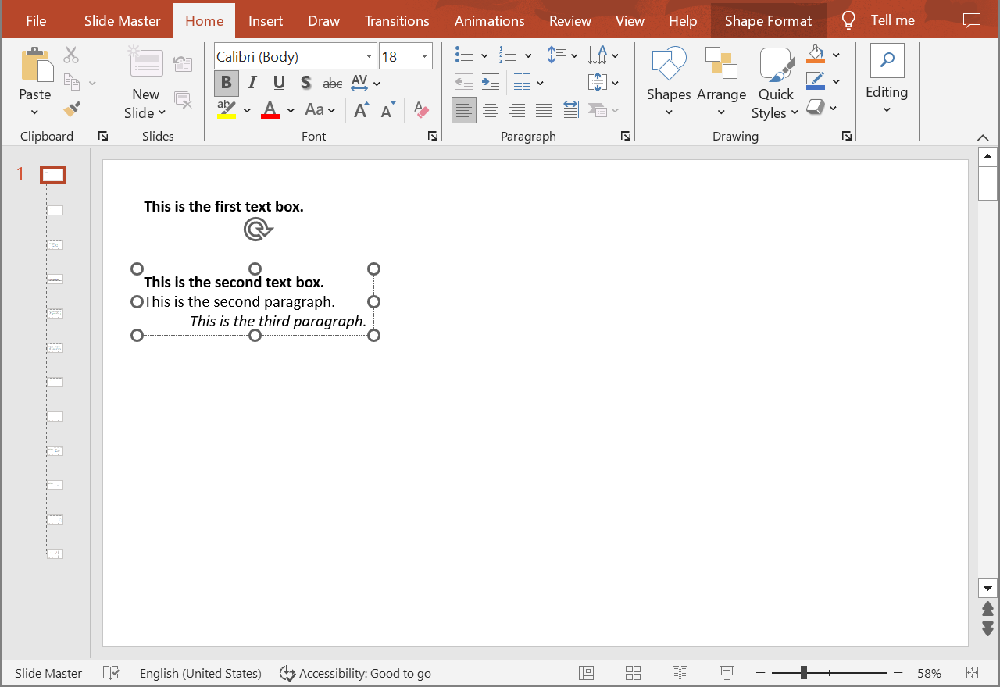

## **Introduction**

Aspose.Slides Cloud API allows you to read, add, modify and delete text paragraphs from shapes located on special slides (Master, Layout, Notes) in PowerPoint presentations. Use the following methods to get information about paragraphs.

## **GetSpecialSlideParagraphs**

### **API Information**

|**API**|**Type**|**Description**|**Resource**|
| :- | :- | :- | :- |
|/slides/{name}/slides/{slideIndex}/{slideType}/shapes/{shapeIndex}/paragraphs|GET|Returns information about a paragraph collection from a shape located on a special slide in a presentation saved in a storage.|[GetSpecialSlideParagraphs](https://reference.aspose.cloud/slides/#/SpecialSlideShapes/GetSpecialSlideParagraphs)|

**Request Parameters**

|**Name**|**Type**|**Location**|**Required**|**Description**|
| :- | :- | :- | :- | :- |
|name|string|path|true|The name of a presentation file.|
|slideIndex|integer|path|true|The 1-based index of a regular slide.|
|slideType|`SpecialSlideType`|path|true|The type of a special slide.|
|shapeIndex|integer|path|true|The 1-based index of a shape.|
|password|string|header|false|The password to open the presentation.|
|folder|string|query|false|The path to the folder containing the presentation file.|
|storage|string|query|false|The name of the storage contaning the folder.|
|subShape|string|query|false|The path to a child shape (e.g. "3", "3/shapes/2").|

### **Examples**

The document **MyPresentation.pptx** saved in the **default** storage contains two text boxes on the **Master** of the **first** slide. The **second** text box contains three paragraphs. Get information about the paragraphs.

**cURL Solution**





**Get an Access Token**

```sh
curl POST "https://api.aspose.cloud/connect/token" \
     -d "grant_type=client_credentials&client_id=MyClientId&client_secret=MyClientSecret" \
     -H "Content-Type: application/x-www-form-urlencoded"
```

**Get Information about the Paragraphs**

```sh
curl -X GET "https://api.aspose.cloud/v3.0/slides/MyPresentation.pptx/slides/1/MasterSlide/shapes/2/paragraphs" \
     -H "authorization: Bearer MyAccessToken"
```





**Response Example**

```json
{
  "paragraphLinks": [
    {
      "href": "https://api.aspose.cloud/v3.0/slides/MyPresentation.pptx/masterSlides/1/shapes/2/paragraphs/1",
      "relation": "self",
      "shapeIndex": 2
    },
    {
      "href": "https://api.aspose.cloud/v3.0/slides/MyPresentation.pptx/masterSlides/1/shapes/2/paragraphs/2",
      "relation": "self",
      "shapeIndex": 2
    },
    {
      "href": "https://api.aspose.cloud/v3.0/slides/MyPresentation.pptx/masterSlides/1/shapes/2/paragraphs/3",
      "relation": "self",
      "shapeIndex": 2
    }
  ],
  "selfUri": {
    "href": "https://api.aspose.cloud/v3.0/slides/MyPresentation.pptx/masterSlides/1/shapes/2/paragraphs",
    "relation": "self",
    "shapeIndex": 2
  }
}
```





**SDK Solutions**





```csharp
using System;

using Aspose.Slides.Cloud.Sdk;
using Aspose.Slides.Cloud.Sdk.Model;

class Application
{
    static void Main(string[] args)
    {
        SlidesApi slidesApi = new SlidesApi("MyClientId", "MyClientSecret");

        string fileName = "MyPresentation.pptx";
        int slideIndex = 1;
        SpecialSlideType slideType = SpecialSlideType.MasterSlide;
        int shapeIndex = 2;

        Paragraphs paragraphs = slidesApi.GetSpecialSlideParagraphs(fileName, slideIndex, slideType, shapeIndex);
        
        int paragraphCount = paragraphs.ParagraphLinks.Count;
        Console.WriteLine("Number of the paragraphs: " + paragraphCount);
    }
}
```





```java
import com.aspose.slides.ApiException;
import com.aspose.slides.api.SlidesApi;
import com.aspose.slides.model.SpecialSlideType;
import com.aspose.slides.model.Paragraphs;

public class Application {
    public static void main(String[] args) throws ApiException {
        SlidesApi slidesApi = new SlidesApi("MyClientId", "MyClientSecret");

        String fileName = "MyPresentation.pptx";
        int slideIndex = 1;
        SpecialSlideType slideType = SpecialSlideType.MASTERSLIDE;
        int shapeIndex = 2;

        Paragraphs paragraphs = slidesApi.getSpecialSlideParagraphs(fileName, slideIndex, slideType, shapeIndex, null, null, null, null);

        int paragraphCount = paragraphs.getParagraphLinks().size();
        System.out.println("Number of the paragraphs: " + paragraphCount);
    }
}
```





```php
use Aspose\Slides\Cloud\Sdk\Api\Configuration;
use Aspose\Slides\Cloud\Sdk\Api\SlidesApi;
use Aspose\Slides\Cloud\Sdk\Model\SpecialSlideType;

$configuration = new Configuration();
$configuration->setAppSid("MyClientId");
$configuration->setAppKey("MyClientSecret");

$slidesApi = new SlidesApi(null, $configuration);

$fileName = "MyPresentation.pptx";
$slideIndex = 1;
$slideType = SpecialSlideType::MASTER_SLIDE;
$shapeIndex = 2;

$paragraphs = $slidesApi->getSpecialSlideParagraphs($fileName, $slideIndex, $slideType, $shapeIndex);

$paragraphCount = count($paragraphs->getParagraphLinks());
echo "Number of the paragraphs: ", $paragraphCount;
```





```ruby
require "aspose_slides_cloud"

include AsposeSlidesCloud

configuration = Configuration.new
configuration.app_sid = "MyClientId"
configuration.app_key = "MyClientSecret"

slides_api = SlidesApi.new(configuration)

file_name = "MyPresentation.pptx"
slide_index = 1
slide_type = SpecialSlideType::MASTER_SLIDE
shape_index = 2

paragraphs = slides_api.get_special_slide_paragraphs(file_name, slide_index, slide_type, shape_index)

paragraph_count = paragraphs.paragraph_links.length()
print "Number of the paragraphs: ", paragraph_count
```





```python
from asposeslidescloud.apis import SlidesApi
from asposeslidescloud.models import SpecialSlideType

slides_api = SlidesApi(None, "MyClientId", "MyClientSecret")

file_name = "MyPresentation.pptx"
slide_index = 1
slide_type = SpecialSlideType.MASTERSLIDE
shape_index = 2

paragraphs = slides_api.get_special_slide_paragraphs(file_name, slide_index, slide_type, shape_index)

paragraph_count = len(paragraphs.paragraph_links)
print("Number of the paragraphs:", paragraph_count)
```





```js
const cloudSdk = require("asposeslidescloud");

const slidesApi = new cloudSdk.SlidesApi("MyClientId", "MyClientSecret");

fileName = "MyPresentation.pptx";
slideIndex = 1;
slideType = cloudSdk.SpecialSlideType.MasterSlide;
shapeIndex = 2;

slidesApi.getSpecialSlideParagraphs(fileName, slideIndex, slideType, shapeIndex).then(paragraphs => {
    paragraphCount = paragraphs.body.paragraphLinks.length;
    console.log("Number of the paragraphs:", paragraphCount);
});
```





```cpp
#include "asposeslidescloud/api/SlidesApi.h"

using namespace asposeslidescloud::api;

int main()
{
    std::shared_ptr<SlidesApi> slidesApi = std::make_shared<SlidesApi>(L"MyClientId", L"MyClientSecret");

    const wchar_t* fileName = L"MyPresentation.pptx";
    int slideIndex = 1;
    const wchar_t* slideType = L"MasterSlide";
    int shapeIndex = 2;

    std::shared_ptr<Paragraphs> paragraphs = slidesApi->getSpecialSlideParagraphs(fileName, slideIndex, slideType, shapeIndex).get();

    int paragraphCount = paragraphs->getParagraphLinks().size();
    std::wcout << "Number of the paragraphs: " << paragraphCount;
}
```





```perl
use AsposeSlidesCloud::Configuration;
use AsposeSlidesCloud::SlidesApi;

my $configuration = AsposeSlidesCloud::Configuration->new();
$configuration->{app_sid} = "MyClientId";
$configuration->{app_key} = "MyClientSecret";

my $slides_api = AsposeSlidesCloud::SlidesApi->new(config => $configuration);

my $file_name = "MyPresentation.pptx";
my $slide_index = 1;
my $slide_type = "MasterSlide";
my $shape_index = 2;

my $paragraphs = $slides_api->get_special_slide_paragraphs(
    name => $file_name, slide_index => $slide_index, slide_type => $slide_type, shape_index => $shape_index);

my $paragraph_count = @{$paragraphs->{paragraph_links}};
print("Number of the paragraphs: ", $paragraph_count);
```









```go
import (
	"fmt"

	asposeslidescloud "github.com/aspose-slides-cloud/aspose-slides-cloud-go/v24"
)

func main() {
	configuration := asposeslidescloud.NewConfiguration()
	configuration.AppSid = "MyClientId"
	configuration.AppKey = "MyClientSecret"

	slidesApi := asposeslidescloud.NewAPIClient(configuration).SlidesApi

	fileName := "MyPresentation.pptx"
	var slideIndex int32 = 1
	slideType := string(asposeslidescloud.SpecialSlideType_MasterSlide)
	var shapeIndex int32 = 2

	paragraphs, _, _ := slidesApi.GetSpecialSlideParagraphs(fileName, slideIndex, slideType, shapeIndex, "", "", "", "")

	paragraphCount := len(paragraphs.GetParagraphLinks())
	fmt.Println("Number of the paragraphs:", paragraphCount)
}
```





## **GetSpecialSlideParagraph**

### **API Information**

|**API**|**Type**|**Description**|**Resource**|
| :- | :- | :- | :- |
|/slides/{name}/slides/{slideIndex}/{slideType}/shapes/{shapeIndex}/paragraphs/{paragraphIndex}|GET|Returns properties of a paragraph from a shape located on a special slide in a presentation saved in a storage.|[GetSpecialSlideParagraph](https://reference.aspose.cloud/slides/#/SpecialSlideShapes/GetSpecialSlideParagraph)|

**Request Parameters**

|**Name**|**Type**|**Location**|**Required**|**Description**|
| :- | :- | :- | :- | :- |
|name|string|path|true|The name of a presentation file.|
|slideIndex|integer|path|true|The 1-based index of a regular slide.|
|slideType|`SpecialSlideType`|path|true|The type of a special slide.|
|shapeIndex|integer|path|true|The 1-based index of a shape.|
|paragraphIndex|integer|path|true|The 1-based index of a paragraph.|
|password|string|header|false|The password to open the presentation.|
|folder|string|query|false|The path to the folder containing the presentation file.|
|storage|string|query|false|The name of the storage contaning the folder.|
|subShape|string|query|false|The path to a child shape (e.g. "3", "3/shapes/2").|

### **Examples**

The document **MyPresentation.pptx** saved in the **default** storage contains two text boxes on the **Master** of the **first** slide. The **second** text box contains three paragraphs. Get properties of the **third** paragraph.



**cURL Solution**





**Get an Access Token**

```sh
curl POST "https://api.aspose.cloud/connect/token" \
     -d "grant_type=client_credentials&client_id=MyClientId&client_secret=MyClientSecret" \
     -H "Content-Type: application/x-www-form-urlencoded"
```

**Get the Paragraph Properties**

```sh
curl -X GET "https://api.aspose.cloud/v3.0/slides/MyPresentation.pptx/slides/1/MasterSlide/shapes/2/paragraphs/3" \
     -H "authorization: Bearer MyAccessToken"
```





**Response Example**

```json
{
  "alignment": "Right",
  "portionList": [
    {
      "text": "This is the third paragraph.",
      "fontItalic": "True",
      "highlightColor": "#0",
      "fontHeight": "NaN",
      "languageId": "en-US",
      "selfUri": {
        "href": "https://api.aspose.cloud/v3.0/slides/MyPresentation.pptx/masterSlides/1/shapes/2/paragraphs/3/portions/1",
        "relation": "self",
        "shapeIndex": 2
      }
    }
  ],
  "defaultPortionFormat": {
    "highlightColor": "#0",
    "fontHeight": "NaN"
  },
  "selfUri": {
    "href": "https://api.aspose.cloud/v3.0/slides/MyPresentation.pptx/masterSlides/1/shapes/2/paragraphs/3",
    "relation": "self",
    "shapeIndex": 2
  }
}
```





**SDK Solutions**





```csharp
using System;

using Aspose.Slides.Cloud.Sdk;
using Aspose.Slides.Cloud.Sdk.Model;

class Application
{
    static void Main(string[] args)
    {
        SlidesApi slidesApi = new SlidesApi("MyClientId", "MyClientSecret");

        string fileName = "MyPresentation.pptx";
        int slideIndex = 1;
        SpecialSlideType slideType = SpecialSlideType.MasterSlide;
        int shapeIndex = 2;
        int paragraphIndex = 3;

        Paragraph paragraph = slidesApi.GetSpecialSlideParagraph(fileName, slideIndex, slideType, shapeIndex, paragraphIndex);
        
        Console.WriteLine("Alignment: " + paragraph.Alignment); // Right
    }
}
```





```java
import com.aspose.slides.ApiException;
import com.aspose.slides.api.SlidesApi;
import com.aspose.slides.model.SpecialSlideType;
import com.aspose.slides.model.Paragraph;

public class Application {
    public static void main(String[] args) throws ApiException {
        SlidesApi slidesApi = new SlidesApi("MyClientId", "MyClientSecret");

        String fileName = "MyPresentation.pptx";
        int slideIndex = 1;
        SpecialSlideType slideType = SpecialSlideType.MASTERSLIDE;
        int shapeIndex = 2;
        int paragraphIndex = 3;

        Paragraph paragraph = slidesApi.getSpecialSlideParagraph(fileName, slideIndex, slideType, shapeIndex, paragraphIndex, null, null, null, null);

        System.out.println("Alignment: " + paragraph.getAlignment()); // Right
    }
}
```





```php
use Aspose\Slides\Cloud\Sdk\Api\Configuration;
use Aspose\Slides\Cloud\Sdk\Api\SlidesApi;
use Aspose\Slides\Cloud\Sdk\Model\SpecialSlideType;

$configuration = new Configuration();
$configuration->setAppSid("MyClientId");
$configuration->setAppKey("MyClientSecret");

$slidesApi = new SlidesApi(null, $configuration);

$fileName = "MyPresentation.pptx";
$slideIndex = 1;
$slideType = SpecialSlideType::MASTER_SLIDE;
$shapeIndex = 2;
$paragraphIndex = 3;

$paragraph = $slidesApi->getSpecialSlideParagraph($fileName, $slideIndex, $slideType, $shapeIndex, $paragraphIndex);

echo "Alignment: ", $paragraph->getAlignment(); // Right
```





```ruby
require "aspose_slides_cloud"

include AsposeSlidesCloud

configuration = Configuration.new
configuration.app_sid = "MyClientId"
configuration.app_key = "MyClientSecret"

slides_api = SlidesApi.new(configuration)

file_name = "MyPresentation.pptx"
slide_index = 1
slide_type = SpecialSlideType::MASTER_SLIDE
shape_index = 2
paragraph_index = 3

paragraph = slides_api.get_special_slide_paragraph(file_name, slide_index, slide_type, shape_index, paragraph_index)

print "Alignment: ", paragraph.alignment # Right
```





```python
from asposeslidescloud.apis import SlidesApi
from asposeslidescloud.models import SpecialSlideType

slides_api = SlidesApi(None, "MyClientId", "MyClientSecret")

file_name = "MyPresentation.pptx"
slide_index = 1
slide_type = SpecialSlideType.MASTERSLIDE
shape_index = 2
paragraph_index = 3

paragraph = slides_api.get_special_slide_paragraph(file_name, slide_index, slide_type, shape_index, paragraph_index)

print("Alignment:", paragraph.alignment)  # Right
```





```js
const cloudSdk = require("asposeslidescloud");

const slidesApi = new cloudSdk.SlidesApi("MyClientId", "MyClientSecret");

fileName = "MyPresentation.pptx";
slideIndex = 1;
slideType = cloudSdk.SpecialSlideType.MasterSlide;
shapeIndex = 2;
paragraphIndex = 3;

slidesApi.getSpecialSlideParagraph(fileName, slideIndex, slideType, shapeIndex, paragraphIndex).then(paragraph => {
    console.log("Alignment:", paragraph.body.alignment); // Right
});
```





```cpp
#include "asposeslidescloud/api/SlidesApi.h"

using namespace asposeslidescloud::api;

int main()
{
    std::shared_ptr<SlidesApi> slidesApi = std::make_shared<SlidesApi>(L"MyClientId", L"MyClientSecret");

    const wchar_t* fileName = L"MyPresentation.pptx";
    int slideIndex = 1;
    const wchar_t* slideType = L"MasterSlide";
    int shapeIndex = 2;
    int paragraphIndex = 3;

    std::shared_ptr<Paragraph> paragraph = slidesApi->getSpecialSlideParagraph(fileName, slideIndex, slideType, shapeIndex, paragraphIndex).get();

    std::wcout << L"Alignment: " << paragraph->getAlignment(); // Right
}
```





```perl
use AsposeSlidesCloud::Configuration;
use AsposeSlidesCloud::SlidesApi;

my $configuration = AsposeSlidesCloud::Configuration->new();
$configuration->{app_sid} = "MyClientId";
$configuration->{app_key} = "MyClientSecret";

my $slides_api = AsposeSlidesCloud::SlidesApi->new(config => $configuration);

my $file_name = "MyPresentation.pptx";
my $slide_index = 1;
my $slide_type = "MasterSlide";
my $shape_index = 2;
my $paragraph_index = 3;

my $paragraph = $slides_api->get_special_slide_paragraph(
    name => $file_name, slide_index => $slide_index, slide_type => $slide_type, shape_index => $shape_index, paragraph_index => $paragraph_index);

print("Alignment: ", $paragraph->{alignment}); # Right
```









```go
import (
	"fmt"

	asposeslidescloud "github.com/aspose-slides-cloud/aspose-slides-cloud-go/v24"
)

func main() {
	configuration := asposeslidescloud.NewConfiguration()
	configuration.AppSid = "MyClientId"
	configuration.AppKey = "MyClientSecret"

	slidesApi := asposeslidescloud.NewAPIClient(configuration).SlidesApi

	fileName := "MyPresentation.pptx"
	var slideIndex int32 = 1
	slideType := string(asposeslidescloud.SpecialSlideType_MasterSlide)
	var shapeIndex int32 = 2
	var paragraphIndex int32 = 3

	paragraph, _, _ := slidesApi.GetSpecialSlideParagraph(fileName, slideIndex, slideType, shapeIndex, paragraphIndex, "", "", "", "")

	fmt.Println("Alignment:", paragraph.GetAlignment())
}
```





## **SDKs**

Check [Available SDKs](/slides/available-sdks/) to learn how to add an SDK to your project.
