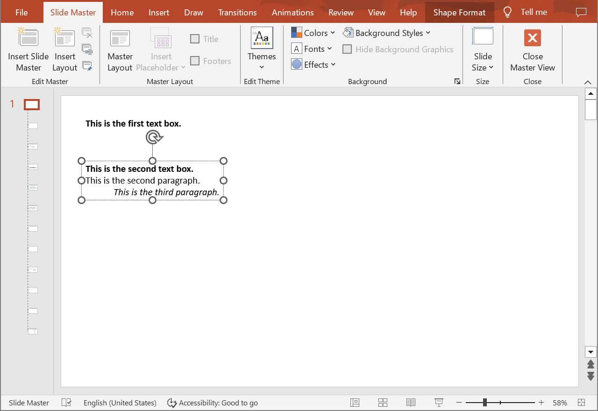
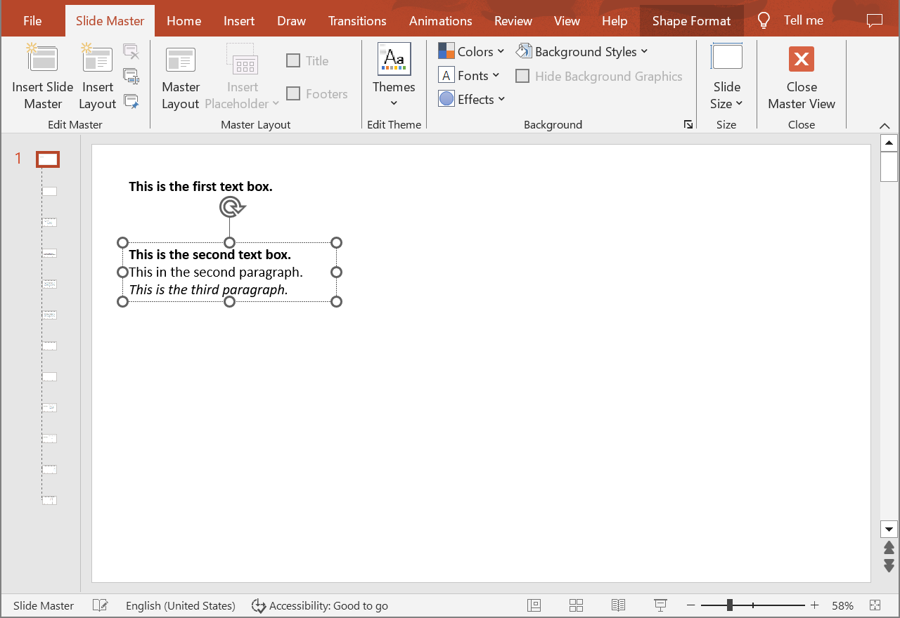

## **Introduction**

Aspose.Slides Cloud API allows you to read, add, modify and delete text paragraphs from shapes located on special slides (Master, Layout, Notes) in PowerPoint presentations. Use the following method to update paragraphs in presentation shapes.

## **UpdateSpecialSlideParagraph**

### **API Information**

|**API**|**Type**|**Description**|**Resource**|
| :- | :- | :- | :- |
|/slides/{name}/slides/{slideIndex}/{slideType}/shapes/{shapeIndex}/paragraphs/{paragraphIndex}|PUT|Updates a paragraph in a shape located on a special slide in a presentation saved in a storage.|[UpdateSpecialSlideParagraph](https://reference.aspose.cloud/slides/#/SpecialSlideShapes/UpdateSpecialSlideParagraph)|

**Request Parameters**

|**Name**|**Type**|**Location**|**Required**|**Description**|
| :- | :- | :- | :- | :- |
|name|string|path|true|The name of a presentation file.|
|slideIndex|integer|path|true|The 1-based index of a regular slide.|
|slideType|`SpecialSlideType`|path|true|The type of a special slide.|
|shapeIndex|integer|path|true|The 1-based index of a shape.|
|paragraphIndex|integer|path|true|The 1-based index of a paragraph.|
|dto|`Paragraph`|body|true|The data transfer object with parameters for the paragraph.|
|password|string|header|false|The password to open the presentation.|
|folder|string|query|false|The path to the folder containing the presentation file.|
|storage|string|query|false|The name of the storage contaning the folder.|
|subShape|string|query|false|The path to a child shape (e.g. "3", "3/shapes/2").|

### **Examples**

The document **MyPresentation.pptx** saved in the **default** storage contains two text boxes on the **Master** of the **first** slide. The **second** text box contains three paragraphs. Align the **third** paragraph to the **left**.



**cURL Solution**





**Get an Access Token**

```sh
curl POST "https://api.aspose.cloud/connect/token" \
     -d "grant_type=client_credentials&client_id=MyClientId&client_secret=MyClientSecret" \
     -H "Content-Type: application/x-www-form-urlencoded"
```

**Update the Paragraph**

```sh
curl -X PUT "https://api.aspose.cloud/v3.0/slides/MyPresentation.pptx/slides/1/MasterSlide/shapes/2/paragraphs/3" \
     -H "authorization: Bearer MyAccessToken" \
     -H "Content-Type: application/json" \
     -d @Paragraph.json
```

Paragraph.json content:
```json
{
  "Alignment": "Left"
}
```





**Response Example**

```json
{
  "alignment": "Left",
  "portionList": [
    {
      "text": "This is the third paragraph.",
      "highlightColor": "#0",
      "fontHeight": "NaN",
      "smartTagClean": false,
      "selfUri": {
        "href": "https://api.aspose.cloud/v3.0/slides/MyPresentation.pptx/masterSlides/1/shapes/2/paragraphs/3/portions/1",
        "relation": "self",
        "shapeIndex": 2
      }
    }
  ],
  "defaultPortionFormat": {
    "fontItalic": "True",
    "highlightColor": "#0",
    "fontHeight": "NaN",
    "smartTagClean": false
  },
  "selfUri": {
    "href": "https://api.aspose.cloud/v3.0/slides/MyPresentation.pptx/masterSlides/1/shapes/2/paragraphs/3",
    "relation": "self",
    "shapeIndex": 2
  }
}
```





**SDK Solutions**





```csharp
using System;

using Aspose.Slides.Cloud.Sdk;
using Aspose.Slides.Cloud.Sdk.Model;

class Application
{
    static void Main(string[] args)
    {
        SlidesApi slidesApi = new SlidesApi("MyClientId", "MyClientSecret");

        string fileName = "MyPresentation.pptx";
        int slideIndex = 1;
        SpecialSlideType slideType = SpecialSlideType.MasterSlide;
        int shapeIndex = 2;
        int paragraphIndex = 3;

        Paragraph paragraph = new Paragraph
        {
            Alignment = Paragraph.AlignmentEnum.Left
        };

        Paragraph updatedParagraph = slidesApi.UpdateSpecialSlideParagraph(fileName, slideIndex, slideType, shapeIndex, paragraphIndex, paragraph);

        Console.WriteLine("Alignment: " + updatedParagraph.Alignment); // Left
    }
}
```





```java
import com.aspose.slides.ApiException;
import com.aspose.slides.api.SlidesApi;
import com.aspose.slides.model.SpecialSlideType;
import com.aspose.slides.model.Paragraph;

public class Application {
    public static void main(String[] args) throws ApiException {
        SlidesApi slidesApi = new SlidesApi("MyClientId", "MyClientSecret");

        String fileName = "MyPresentation.pptx";
        int slideIndex = 1;
        SpecialSlideType slideType = SpecialSlideType.MASTERSLIDE;
        int shapeIndex = 2;
        int paragraphIndex = 3;

        Paragraph paragraph = new Paragraph();
        paragraph.setAlignment(Paragraph.AlignmentEnum.LEFT);

        Paragraph updatedParagraph = slidesApi.updateSpecialSlideParagraph(fileName, slideIndex, slideType, shapeIndex, paragraphIndex, paragraph, null, null, null, null);

        System.out.println("Alignment: " + updatedParagraph.getAlignment()); // Left
    }
}
```





```php
use Aspose\Slides\Cloud\Sdk\Api\Configuration;
use Aspose\Slides\Cloud\Sdk\Api\SlidesApi;
use Aspose\Slides\Cloud\Sdk\Model\SpecialSlideType;
use Aspose\Slides\Cloud\Sdk\Model\Paragraph;

$configuration = new Configuration();
$configuration->setAppSid("MyClientId");
$configuration->setAppKey("MyClientSecret");

$slidesApi = new SlidesApi(null, $configuration);

$fileName = "MyPresentation.pptx";
$slideIndex = 1;
$slideType = SpecialSlideType::MASTER_SLIDE;
$shapeIndex = 2;
$paragraphIndex = 3;

$paragraph = new Paragraph();
$paragraph->setAlignment(Paragraph::ALIGNMENT_LEFT);

$updatedParagraph = $slidesApi->updateSpecialSlideParagraph($fileName, $slideIndex, $slideType, $shapeIndex, $paragraphIndex, $paragraph);

echo "Alignment: ", $updatedParagraph->getAlignment(); // Left
```





```ruby
require "aspose_slides_cloud"

include AsposeSlidesCloud

configuration = Configuration.new
configuration.app_sid = "MyClientId"
configuration.app_key = "MyClientSecret"

slides_api = SlidesApi.new(configuration)

file_name = "MyPresentation.pptx"
slide_index = 1
slide_type = SpecialSlideType::MASTER_SLIDE
shape_index = 2
paragraph_index = 3

paragraph = Paragraph.new
paragraph.alignment = "Left"

updated_paragraph = slides_api.update_special_slide_paragraph(file_name, slide_index, slide_type, shape_index, paragraph_index, paragraph)

puts "Alignment: #{updated_paragraph.alignment}" # Left
```





```python
from asposeslidescloud.apis import SlidesApi
from asposeslidescloud.models import SpecialSlideType
from asposeslidescloud.models import Paragraph

slides_api = SlidesApi(None, "MyClientId", "MyClientSecret")

file_name = "MyPresentation.pptx"
slide_index = 1
slide_type = SpecialSlideType.MASTERSLIDE
shape_index = 2
paragraph_index = 3

paragraph = Paragraph()
paragraph.alignment = "Left"

updated_paragraph = slides_api.update_special_slide_paragraph(file_name, slide_index, slide_type, shape_index, paragraph_index, paragraph)

print(f"Alignment: {updated_paragraph.alignment}")  # Left
```





```js
const cloudSdk = require("asposeslidescloud");

const slidesApi = new cloudSdk.SlidesApi("MyClientId", "MyClientSecret");

fileName = "MyPresentation.pptx";
slideIndex = 1;
slideType = cloudSdk.SpecialSlideType.MasterSlide;
shapeIndex = 2;
paragraphIndex = 3;

paragraph = new cloudSdk.Paragraph();
paragraph.alignment = cloudSdk.Paragraph.AlignmentEnum.Left;

slidesApi.updateSpecialSlideParagraph(fileName, slideIndex, slideType, shapeIndex, paragraphIndex, paragraph).then(updatedParagraph => {
    console.log("Alignment:", updatedParagraph.body.alignment); // Left
});
```





```cpp
#include "asposeslidescloud/api/SlidesApi.h"

using namespace asposeslidescloud::api;

int main()
{
    std::shared_ptr<SlidesApi> slidesApi = std::make_shared<SlidesApi>(L"MyClientId", L"MyClientSecret");

    const wchar_t* fileName = L"MyPresentation.pptx";
    int slideIndex = 1;
    const wchar_t* slideType = L"MasterSlide";
    int shapeIndex = 2;
    int paragraphIndex = 3;

    std::shared_ptr<Paragraph> paragraph = std::make_shared<Paragraph>();
    paragraph->setAlignment(L"Left");

    std::shared_ptr<Paragraph> updatedParagraph = slidesApi->updateSpecialSlideParagraph(fileName, slideIndex, slideType, shapeIndex, paragraphIndex, paragraph).get();

    std::wcout << L"Alignment: " << updatedParagraph->getAlignment(); // Left
}
```





```perl
use AsposeSlidesCloud::Configuration;
use AsposeSlidesCloud::SlidesApi;
use AsposeSlidesCloud::Object::Paragraph;

my $configuration = AsposeSlidesCloud::Configuration->new();
$configuration->{app_sid} = "MyClientId";
$configuration->{app_key} = "MyClientSecret";

my $slides_api = AsposeSlidesCloud::SlidesApi->new(config => $configuration);

my $file_name = "MyPresentation.pptx";
my $slide_index = 1;
my $slide_type = "MasterSlide";
my $shape_index = 2;
my $paragraph_index = 3;

$paragraph = AsposeSlidesCloud::Object::Paragraph->new();
$paragraph->{alignment} = "Left";

$updated_paragraph = $slides_api->update_special_slide_paragraph(
    name => $file_name, slide_index => $slide_index, slide_type => $slide_type, shape_index => $shape_index, paragraph_index => $paragraph_index, dto => $paragraph);

print("Alignment: ", $updated_paragraph->{alignment}); # Left
```









```go
import (
	"fmt"

	asposeslidescloud "github.com/aspose-slides-cloud/aspose-slides-cloud-go/v24"
)

func main() {
	configuration := asposeslidescloud.NewConfiguration()
	configuration.AppSid = "MyClientId"
	configuration.AppKey = "MyClientSecret"

	slidesApi := asposeslidescloud.NewAPIClient(configuration).SlidesApi

	fileName := "MyPresentation.pptx"
	var slideIndex int32 = 1
	slideType := string(asposeslidescloud.SpecialSlideType_MasterSlide)
	var shapeIndex int32 = 2
	var paragraphIndex int32 = 3

	paragraph := asposeslidescloud.NewParagraph()
	paragraph.Alignment = "Left"

	updatedParagraph, _, _ := slidesApi.UpdateSpecialSlideParagraph(fileName, slideIndex, slideType, shapeIndex, paragraphIndex, paragraph, "", "", "", "")

	fmt.Println("Alignment:", updatedParagraph.GetAlignment()) // Left
}
```





The result:



## **SDKs**

Check [Available SDKs](/slides/available-sdks/) to learn how to add an SDK to your project.
