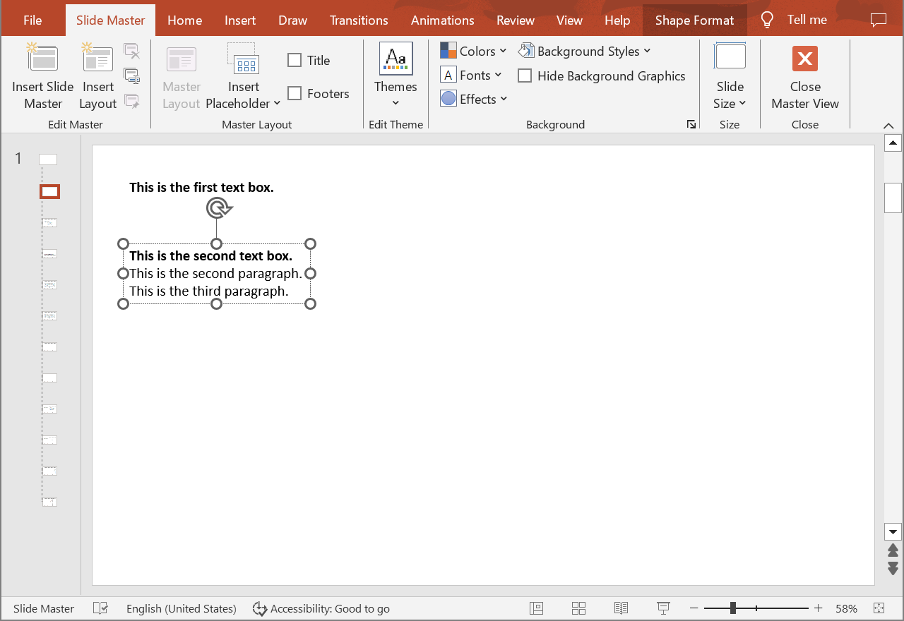
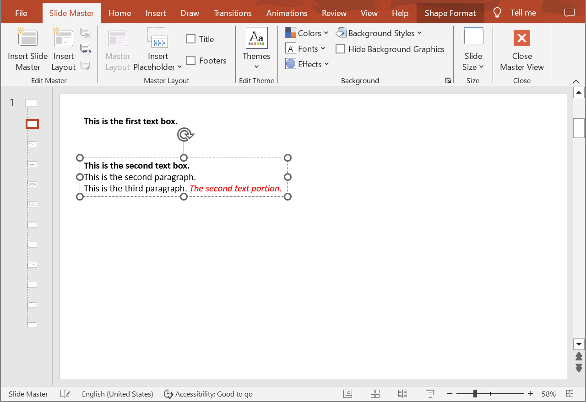

## **Introduction**

Aspose.Slides Cloud API allows you to read, add, modify and delete text portions from special slides (Master, Layout, Notes) in PowerPoint presentations. Use the following method to create a new text portion within a paragraph.

## **CreateSpecialSlidePortion**

### **API Information**

|**API**|**Type**|**Description**|**Resource**|
| :- | :- | :- | :- |
|/slides/{name}/slides/{slideIndex}/{slideType}/shapes/{shapeIndex}/paragraphs/{paragraphIndex}/portions|POST|Adds a new text portion to a paragraph in a shape located on a special slide in a presentation saved in a storage.|[CreateSpecialSlidePortion](https://reference.aspose.cloud/slides/#/SpecialSlideShapes/CreateSpecialSlidePortion)|

**Request Parameters**

|**Name**|**Type**|**Location**|**Required**|**Description**|
| :- | :- | :- | :- | :- |
|name|string|path|true|The name of a presentation file.|
|slideIndex|integer|path|true|The 1-based index of a regular slide.|
|slideType|`SpecialSlideType`|path|true|The type of a special slide.|
|shapeIndex|integer|path|true|The 1-based index of a shape.|
|paragraphIndex|integer|path|true|The 1-based index of a paragraph.|
|dto|`Portion`|body|true|The data transfer object with parameters for a new text portion.|
|position|integer|query|false|The position of the new text portion in the list. By default, the text portion is added to the end of the list.|
|password|string|header|false|The password to open the presentation.|
|folder|string|query|false|The path to the folder containing the presentation.|
|storage|string|query|false|The name of the storage contaning the folder.|
|subShape|string|query|false|The path to a child shape (e.g. "3", "3/shapes/2").|

### **Examples**

The document **MyPresentation.pptx** saved in the **default** storage contains two text boxes on the **Layout** of the **first** slide. The **second** text box contains three paragraphs. Add text to the **third** paragraph with the following options:
- text: " The second text portion."
- set font to italic
- set font color to #FF0000 (red)



**cURL Solution**





**Get an Access Token**

```sh
curl POST "https://api.aspose.cloud/connect/token" \
     -d "grant_type=client_credentials&client_id=MyClientId&client_secret=MyClientSecret" \
     -H "Content-Type: application/x-www-form-urlencoded"
```

**Add the New Text Portion**

```sh
curl -X POST "https://api.aspose.cloud/v3.0/slides/MyPresentation.pptx/slides/1/LayoutSlide/shapes/2/paragraphs/3/portions" \
     -H "authorization: Bearer MyAccessToken" \
     -H "Content-Type: application/json" \
     -d @TextPortion.json
```

TextPortion.json content:
```json
{
  "Text": " The second text portion.",
  "FontItalic": "True",
  "FontColor": "#FF0000"
}
```





**Response Example**

```json
{
  "text": " The second text portion.",
  "fontItalic": "True",
  "fontColor": "#FFFF0000",
  "highlightColor": "#0",
  "fontHeight": "NaN",
  "fillFormat": {
    "type": "Solid",
    "color": "#FFFF0000"
  },
  "selfUri": {
    "href": "https://api.aspose.cloud/v3.0/slides/MyPresentation.pptx/layoutSlides/1/shapes/2/paragraphs/3/portions/2",
    "relation": "self",
    "shapeIndex": 2
  }
}
```





**SDK Solutions**





```csharp
using System;

using Aspose.Slides.Cloud.Sdk;
using Aspose.Slides.Cloud.Sdk.Model;

class Application
{
    static void Main(string[] args)
    {
        SlidesApi slidesApi = new SlidesApi("MyClientId", "MyClientSecret");

        string fileName = "MyPresentation.pptx";
        int slideIndex = 1;
        SpecialSlideType slideType = SpecialSlideType.LayoutSlide;
        int shapeIndex = 2;
        int paragraphIndex = 3;

        Portion textPortion = new Portion
        {
            Text = " The second text portion.",
            FontItalic = Portion.FontItalicEnum.True,
            FontColor = "#FF0000"
        };

        Portion newPortion = slidesApi.CreateSpecialSlidePortion(fileName, slideIndex, slideType, shapeIndex, paragraphIndex, textPortion);

        Console.WriteLine("Italic font: " + newPortion.FontItalic); // True
        Console.WriteLine("Font color: " + newPortion.FontColor);   // #FFFF0000
    }
}
```





```java
import com.aspose.slides.ApiException;
import com.aspose.slides.api.SlidesApi;
import com.aspose.slides.model.Portion;
import com.aspose.slides.model.SpecialSlideType;

public class Application {
    public static void main(String[] args) throws ApiException {
        SlidesApi slidesApi = new SlidesApi("MyClientId", "MyClientSecret");

        String fileName = "MyPresentation.pptx";
        int slideIndex = 1;
        SpecialSlideType slideType = SpecialSlideType.LAYOUTSLIDE;
        int shapeIndex = 2;
        int paragraphIndex = 3;

        Portion textPortion = new Portion();
        textPortion.setText(" The second text portion.");
        textPortion.setFontItalic(Portion.FontItalicEnum.TRUE);
        textPortion.setFontColor("#FF0000");

        Portion newPortion = slidesApi.createSpecialSlidePortion(fileName, slideIndex, slideType, shapeIndex, paragraphIndex, textPortion, null, null, null, null, null);

        System.out.println("Italic font: " + newPortion.getFontItalic()); // True
        System.out.println("Font color: " + newPortion.getFontColor());   // #FFFF0000
    }
}
```





```php
use Aspose\Slides\Cloud\Sdk\Api\Configuration;
use Aspose\Slides\Cloud\Sdk\Api\SlidesApi;
use Aspose\Slides\Cloud\Sdk\Model\SpecialSlideType;
use Aspose\Slides\Cloud\Sdk\Model\Portion;

$configuration = new Configuration();
$configuration->setAppSid("MyClientId");
$configuration->setAppKey("MyClientSecret");

$slidesApi = new SlidesApi(null, $configuration);

$fileName = "MyPresentation.pptx";
$slideIndex = 1;
$slideType = SpecialSlideType::LAYOUT_SLIDE;
$shapeIndex = 2;
$paragraphIndex = 3;

$textPortion = new Portion();
$textPortion->setText(" The second text portion.");
$textPortion->setFontItalic(Portion::FONT_ITALIC_TRUE);
$textPortion->setFontColor("#FF0000");

$newPortion = $slidesApi->createSpecialSlidePortion($fileName, $slideIndex, $slideType, $shapeIndex, $paragraphIndex, $textPortion);

echo "Italic font: ", $newPortion->getFontItalic(), "\n"; // True
echo "Font color: ", $newPortion->getFontColor();         // #FFFF0000
```





```ruby
require "aspose_slides_cloud"

include AsposeSlidesCloud

configuration = Configuration.new
configuration.app_sid = "MyClientId"
configuration.app_key = "MyClientSecret"

slides_api = SlidesApi.new(configuration)

file_name = "MyPresentation.pptx"
slide_index = 1
slide_type = SpecialSlideType::LAYOUT_SLIDE
shape_index = 2
paragraph_index = 3

text_portion = Portion.new
text_portion.text = " The second text portion."
text_portion.font_italic = "True"
text_portion.font_color = "#FF0000"

new_portion = slides_api.create_special_slide_portion(file_name, slide_index, slide_type, shape_index, paragraph_index, text_portion)

puts "Italic font: #{new_portion.font_italic}" # True
puts "Font color: #{new_portion.font_color}"   # #FFFF0000
```





```python
from asposeslidescloud.apis import SlidesApi
from asposeslidescloud.models import SpecialSlideType
from asposeslidescloud.models import Portion

slides_api = SlidesApi(None, "MyClientId", "MyClientSecret")

file_name = "MyPresentation.pptx"
slide_index = 1
slide_type = SpecialSlideType.LAYOUTSLIDE
shape_index = 2
paragraph_index = 3

text_portion = Portion()
text_portion.text = " The second text portion."
text_portion.font_italic = "True"
text_portion.font_color = "#FF0000"

new_portion = slides_api.create_special_slide_portion(file_name, slide_index, slide_type, shape_index, paragraph_index, text_portion)

print("Italic font:", new_portion.font_italic)  # True
print("Font color:", new_portion.font_color)    # #FFFF0000
```





```js
const cloudSdk = require("asposeslidescloud");

const slidesApi = new cloudSdk.SlidesApi("MyClientId", "MyClientSecret");

fileName = "MyPresentation.pptx";
slideIndex = 1;
slideType = cloudSdk.SpecialSlideType.LayoutSlide;
shapeIndex = 2;
paragraphIndex = 3;

textPortion = new cloudSdk.Portion();
textPortion.text = " The second text portion.";
textPortion.fontItalic = cloudSdk.Portion.FontItalicEnum.True;
textPortion.fontColor = "#FF0000";

slidesApi.createSpecialSlidePortion(fileName, slideIndex, slideType, shapeIndex, paragraphIndex, textPortion).then(newPortion => {
    console.log("Italic font:", newPortion.body.fontItalic); // True
    console.log("Font color:", newPortion.body.fontColor);   // #FFFF0000
});
```





```cpp
#include "asposeslidescloud/api/SlidesApi.h"

using namespace asposeslidescloud::api;

int main()
{
    std::shared_ptr<SlidesApi> slidesApi = std::make_shared<SlidesApi>(L"MyClientId", L"MyClientSecret");

    const wchar_t* fileName = L"MyPresentation.pptx";
    int slideIndex = 1;
    const wchar_t* slideType = L"LayoutSlide";
    int shapeIndex = 2;
    int paragraphIndex = 3;

    std::shared_ptr<Portion> textPortion = std::make_shared<Portion>();
    textPortion->setText(L" The second text portion.");
    textPortion->setFontItalic(L"True");
    textPortion->setFontColor(L"#FF0000");

    std::shared_ptr<Portion> newPortion = slidesApi->createSpecialSlidePortion(fileName, slideIndex, slideType, shapeIndex, paragraphIndex, textPortion).get();

    std::wcout << L"Italic font: " << newPortion->getFontItalic() << L"\n"; // True
    std::wcout << L"Font color: " << newPortion->getFontColor();            // #FFFF0000
}
```





```perl
use AsposeSlidesCloud::Configuration;
use AsposeSlidesCloud::SlidesApi;
use AsposeSlidesCloud::Object::Portion;

my $configuration = AsposeSlidesCloud::Configuration->new();
$configuration->{app_sid} = "MyClientId";
$configuration->{app_key} = "MyClientSecret";

my $slides_api = AsposeSlidesCloud::SlidesApi->new(config => $configuration);

my $file_name = "MyPresentation.pptx";
my $slide_index = 1;
my $slide_type = "LayoutSlide";
my $shape_index = 2;
my $paragraph_index = 3;

my $text_portion = AsposeSlidesCloud::Object::Portion->new();
$text_portion->{text} = " The second text portion.";
$text_portion->{font_italic} = "True";
$text_portion->{font_color} = "#FF0000";

my $new_portion = $slides_api->create_special_slide_portion(
    name => $file_name, slide_index => $slide_index, slide_type => $slide_type, shape_index => $shape_index, paragraph_index => $paragraph_index, dto => $text_portion);

print("Italic font: ", $new_portion->{font_italic}, "\n"); # True
print("Font color: ", $new_portion->{font_color});         # #FFFF0000
```









```go
import (
	"fmt"

	asposeslidescloud "github.com/aspose-slides-cloud/aspose-slides-cloud-go/v24"
)

func main() {
	configuration := asposeslidescloud.NewConfiguration()
	configuration.AppSid = "MyClientId"
	configuration.AppKey = "MyClientSecret"

	slidesApi := asposeslidescloud.NewAPIClient(configuration).SlidesApi

	fileName := "MyPresentation.pptx"
	var slideIndex int32 = 1
	slideType := string(asposeslidescloud.SpecialSlideType_LayoutSlide)
	var shapeIndex int32 = 2
	var paragraphIndex int32 = 3

	textPortion := asposeslidescloud.NewPortion()
	textPortion.Text = " The second text portion."
	textPortion.FontItalic = "True"
	textPortion.FontColor = "#FF0000"

	newPortion, _, _ := slidesApi.CreateSpecialSlidePortion(fileName, slideIndex, slideType, shapeIndex, paragraphIndex, textPortion, nil, "", "", "", "")

	fmt.Println("Italic font:", newPortion.GetFontItalic()) // True
	fmt.Println("Font color:", newPortion.GetFontColor())   // #FFFF0000
}
```





The result:



## **SDKs**

Check [Available SDKs](/slides/available-sdks/) to learn how to add an SDK to your project.
