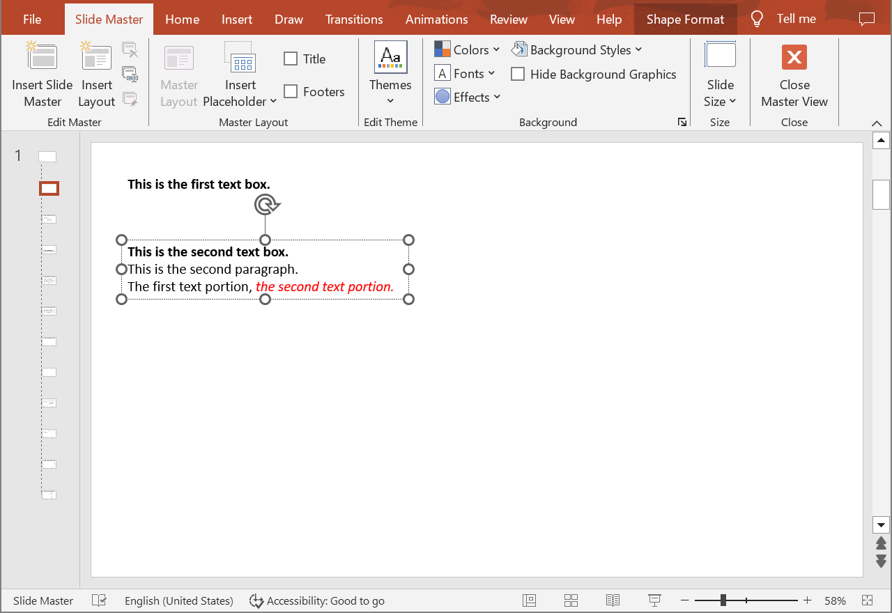

## **Introduction**

Aspose.Slides Cloud API allows you to read, add, modify and delete text portions from special slides (Master, Layout, Notes) in PowerPoint presentations. Use the following methods to get properties of text portions.

## **GetSpecialSlidePortions**

### **API Information**

|**API**|**Type**|**Description**|**Resource**|
| :- | :- | :- | :- |
|/slides/{name}/slides/{slideIndex}/{slideType}/shapes/{shapeIndex}/paragraphs/{paragraphIndex}/portions|GET|Returns information about text portions within a paragraph located in a shape located on a special slide in a presentation saved in a storage.|[GetSpecialSlidePortions](https://reference.aspose.cloud/slides/#/SpecialSlideShapes/GetSpecialSlidePortions)|

**Request Parameters**

|**Name**|**Type**|**Location**|**Required**|**Description**|
| :- | :- | :- | :- | :- |
|name|string|path|true|The name of a presentation file.|
|slideIndex|integer|path|true|The 1-based index of a regular slide.|
|slideType|`SpecialSlideType`|path|true|The type of a special slide.|
|shapeIndex|integer|path|true|The 1-based index of a shape.|
|paragraphIndex|integer|path|true|The 1-based index of a paragraph.|
|password|string|header|false|The password to open the presentation.|
|folder|string|query|false|The path to the folder containing the presentation file.|
|storage|string|query|false|The name of the storage contaning the folder.|
|subShape|string|query|false|The path to a child shape (e.g. "3", "3/shapes/2").|

## **GetSpecialSlidePortion**

### **API Information**

|**API**|**Type**|**Description**|**Resource**|
| :- | :- | :- | :- |
|/slides/{name}/slides/{slideIndex}/{slideType}/shapes/{shapeIndex}/paragraphs/{paragraphIndex}/portions/{portionIndex}|GET|Returns properties of a text portion within a paragraph located in a shape located on a special slide in a presentation saved in a storage.|[GetSpecialSlidePortion](https://reference.aspose.cloud/slides/#/SpecialSlideShapes/GetSpecialSlidePortion)|

**Request Parameters**

|**Name**|**Type**|**Location**|**Required**|**Description**|
| :- | :- | :- | :- | :- |
|name|string|path|true|The name of a presentation file.|
|slideIndex|integer|path|true|The 1-based index of a regular slide.|
|slideType|`SpecialSlideType`|path|true|The type of a special slide.|
|shapeIndex|integer|path|true|The 1-based index of a shape.|
|paragraphIndex|integer|path|true|The 1-based index of a paragraph.|
|portionIndex|integer|path|true|The 1-based index of a text portion.|
|password|string|header|false|The password to open the presentation.|
|folder|string|query|false|The path to the folder containing the presentation.|
|storage|string|query|false|The name of the storage contaning the folder.|
|subShape|string|query|false|The path to a child shape (e.g. "3", "3/shapes/2").|

### **Examples**

The document **MyPresentation.pptx** saved in the **default** storage contains two text boxes on the **Layout** of the **first** slide. The **second** text box contains three paragraphs. Get properties of the **second** text portion within the **third** paragraph.



**cURL Solution**





**Get an Access Token**

```sh
curl POST "https://api.aspose.cloud/connect/token" \
     -d "grant_type=client_credentials&client_id=MyClientId&client_secret=MyClientSecret" \
     -H "Content-Type: application/x-www-form-urlencoded"
```

**Get the Text Portion Properties**

```sh
curl -X GET "https://api.aspose.cloud/v3.0/slides/MyPresentation.pptx/slides/1/LayoutSlide/shapes/2/paragraphs/3/portions/2" \
     -H "authorization: Bearer MyAccessToken"
```





**Response Example**

```json
{
  "text": "the second text portion.",
  "fontItalic": "True",
  "fontColor": "#FFFF0000",
  "highlightColor": "#0",
  "fontHeight": "NaN",
  "languageId": "en-US",
  "fillFormat": {
    "type": "Solid",
    "color": "#FFFF0000"
  },
  "selfUri": {
    "href": "https://api.aspose.cloud/v3.0/slides/MyPresentation.pptx/layoutSlides/1/shapes/2/paragraphs/3/portions/2",
    "relation": "self",
    "shapeIndex": 2
  }
}
```





**SDK Solutions**





```csharp
using System;

using Aspose.Slides.Cloud.Sdk;
using Aspose.Slides.Cloud.Sdk.Model;

class Application
{
    static void Main(string[] args)
    {
        SlidesApi slidesApi = new SlidesApi("MyClientId", "MyClientSecret");

        string fileName = "MyPresentation.pptx";
        int slideIndex = 1;
        SpecialSlideType slideType = SpecialSlideType.LayoutSlide;
        int shapeIndex = 2;
        int paragraphIndex = 3;
        int portionIndex = 2;

        Portion portion = slidesApi.GetSpecialSlidePortion(fileName, slideIndex, slideType, shapeIndex, paragraphIndex, portionIndex);

        Console.WriteLine("Italic font: " + portion.FontItalic); // True
        Console.WriteLine("Font color: " + portion.FontColor);   // #FFFF0000
    }
}
```





```java
import com.aspose.slides.ApiException;
import com.aspose.slides.api.SlidesApi;
import com.aspose.slides.model.Portion;
import com.aspose.slides.model.SpecialSlideType;

public class Application {
    public static void main(String[] args) throws ApiException {
        SlidesApi slidesApi = new SlidesApi("MyClientId", "MyClientSecret");

        String fileName = "MyPresentation.pptx";
        int slideIndex = 1;
        SpecialSlideType slideType = SpecialSlideType.LAYOUTSLIDE;
        int shapeIndex = 2;
        int paragraphIndex = 3;
        int portionIndex = 2;

        Portion portion = slidesApi.getSpecialSlidePortion(fileName, slideIndex, slideType, shapeIndex, paragraphIndex, portionIndex, null, null, null, null);

        System.out.println("Italic font: " + portion.getFontItalic()); // True
        System.out.println("Font color: " + portion.getFontColor());   // #FFFF0000
    }
}
```





```php
use Aspose\Slides\Cloud\Sdk\Api\Configuration;
use Aspose\Slides\Cloud\Sdk\Api\SlidesApi;
use Aspose\Slides\Cloud\Sdk\Model\SpecialSlideType;

$configuration = new Configuration();
$configuration->setAppSid("MyClientId");
$configuration->setAppKey("MyClientSecret");

$slidesApi = new SlidesApi(null, $configuration);

$fileName = "MyPresentation.pptx";
$slideIndex = 1;
$slideType = SpecialSlideType::LAYOUT_SLIDE;
$shapeIndex = 2;
$paragraphIndex = 3;
$portionIndex = 2;

$portion = $slidesApi->getSpecialSlidePortion($fileName, $slideIndex, $slideType, $shapeIndex, $paragraphIndex, $portionIndex);

echo "Italic font: ", $portion->getFontItalic(), "\n"; // True
echo "Font color: ", $portion->getFontColor();         // #FFFF0000
```





```ruby
require "aspose_slides_cloud"

include AsposeSlidesCloud

configuration = Configuration.new
configuration.app_sid = "MyClientId"
configuration.app_key = "MyClientSecret"

slides_api = SlidesApi.new(configuration)

file_name = "MyPresentation.pptx"
slide_index = 1
slide_type = SpecialSlideType::LAYOUT_SLIDE
shape_index = 2
paragraph_index = 3
portion_index = 2

portion = slides_api.get_special_slide_portion(file_name, slide_index, slide_type, shape_index, paragraph_index, portion_index)

puts "Italic font: #{portion.font_italic}" # True
puts "Font color: #{portion.font_color}"   # #FFFF0000
```





```python
from asposeslidescloud.apis import SlidesApi
from asposeslidescloud.models import SpecialSlideType

slides_api = SlidesApi(None, "MyClientId", "MyClientSecret")

file_name = "MyPresentation.pptx"
slide_index = 1
slide_type = SpecialSlideType.LAYOUTSLIDE
shape_index = 2
paragraph_index = 3
portion_index = 2

portion = slides_api.get_special_slide_portion(file_name, slide_index, slide_type, shape_index, paragraph_index, portion_index)

print("Italic font:", portion.font_italic)  # True
print("Font color:", portion.font_color)    # #FFFF0000
```





```js
const cloudSdk = require("asposeslidescloud");

const slidesApi = new cloudSdk.SlidesApi("MyClientId", "MyClientSecret");

fileName = "MyPresentation.pptx";
slideIndex = 1;
slideType = cloudSdk.SpecialSlideType.LayoutSlide;
shapeIndex = 2;
paragraphIndex = 3;
portionIndex = 2;

slidesApi.getSpecialSlidePortion(fileName, slideIndex, slideType, shapeIndex, paragraphIndex, portionIndex).then(portion => {
    console.log("Italic font:", portion.body.fontItalic); // True
    console.log("Font color:", portion.body.fontColor);   // #FFFF0000
});
```





```cpp
#include "asposeslidescloud/api/SlidesApi.h"

using namespace asposeslidescloud::api;

int main()
{
    std::shared_ptr<SlidesApi> slidesApi = std::make_shared<SlidesApi>(L"MyClientId", L"MyClientSecret");

    const wchar_t* fileName = L"MyPresentation.pptx";
    int slideIndex = 1;
    const wchar_t* slideType = L"LayoutSlide";
    int shapeIndex = 2;
    int paragraphIndex = 3;
    int portionIndex = 2;

    std::shared_ptr<Portion> portion = slidesApi->getSpecialSlidePortion(fileName, slideIndex, slideType, shapeIndex, paragraphIndex, portionIndex).get();

    std::wcout << L"Italic font: " << portion->getFontItalic() << L"\n"; // True
    std::wcout << L"Font color: " << portion->getFontColor();            // #FFFF0000
}
```





```perl
use AsposeSlidesCloud::Configuration;
use AsposeSlidesCloud::SlidesApi;

my $configuration = AsposeSlidesCloud::Configuration->new();
$configuration->{app_sid} = "MyClientId";
$configuration->{app_key} = "MyClientSecret";

my $slides_api = AsposeSlidesCloud::SlidesApi->new(config => $configuration);

my $file_name = "MyPresentation.pptx";
my $slide_index = 1;
my $slide_type = "LayoutSlide";
my $shape_index = 2;
my $paragraph_index = 3;
my $portion_index = 2;

my $portion = $slides_api->get_special_slide_portion(
    name => $file_name, slide_index => $slide_index, slide_type => $slide_type, shape_index => $shape_index, paragraph_index => $paragraph_index, portion_index => $portion_index);

print("Italic font: ", $portion->{font_italic}, "\n"); # True
print("Font color: ", $portion->{font_color});         # #FFFF0000
```









```go
import (
	"fmt"

	asposeslidescloud "github.com/aspose-slides-cloud/aspose-slides-cloud-go/v24"
)

func main() {
	configuration := asposeslidescloud.NewConfiguration()
	configuration.AppSid = "MyClientId"
	configuration.AppKey = "MyClientSecret"

	slidesApi := asposeslidescloud.NewAPIClient(configuration).SlidesApi

	fileName := "MyPresentation.pptx"
	var slideIndex int32 = 1
	slideType := string(asposeslidescloud.SpecialSlideType_LayoutSlide)
	var shapeIndex int32 = 2
	var paragraphIndex int32 = 3
	var portionIndex int32 = 2

	portion, _, _ := slidesApi.GetSpecialSlidePortion(fileName, slideIndex, slideType, shapeIndex, paragraphIndex, portionIndex, "", "", "", "")

	fmt.Println("Italic font:", portion.GetFontItalic()) // True
	fmt.Println("Font color:", portion.GetFontColor())   // #FFFF0000
}
```





## **SDKs**

Check [Available SDKs](/slides/available-sdks/) to learn how to add an SDK to your project.
