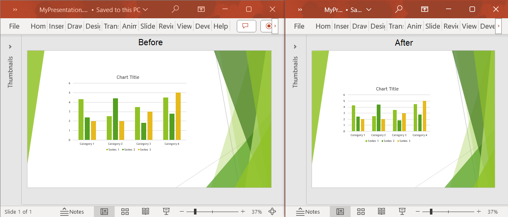

## **Introduction**

With Aspose.Slides Cloud API, you have the flexibility to customize various aspects of your slides to suit your presentation needs. Here are key properties that you can change:

- **Slide Numbers**: You can change the slide numbering if needed.

- **Slide Orientation**: You can choose between portrait and landscape orientations for your slides, which can be especially useful when designing different types of documents, such as reports or brochures.

- **Content Scaling**: When you resize a slide, you can choose whether to scale the content proportionally to fit the new dimensions. This ensures that your text and images remain legible and visually appealing.

- **Slide Size Options**: There is a variety of standard slide sizes, such as widescreen (16:9), standard (4:3), and many others, which are suitable for different display devices and resolutions. You can select the one that best fits your presentation requirements.

- **Custom Slide Sizes**: For more specialized needs, you can create custom slide sizes. This allows you to define precise dimensions for your slides, giving you full control over the layout and design.

Customizing these properties empowers you to create presentations that are tailored to your content and the specific requirements of your audience or distribution platform.

## **API Information**

|**API**|**Type**|**Description**|**Resource**|
| :- | :- | :- | :- |
|/slides/{name}/slideProperties|GET|Reads information about slide properties.|[GetSlideProperties](https://reference.aspose.cloud/slides/#/Document/GetSlideProperties)|
|/slides/{name}/slideProperties|PUT|Sets slide properties for a presentation.|[SetSlideProperties](https://reference.aspose.cloud/slides/#/Document/SetSlideProperties)|

**Request Parameters**


|**Name**|**Type**|**Location**|**Required**|**Description**|
| :- | :- | :- | :- | :- |
|name|string|path|true|The name of a presentation file.|
|password|string|header|false|The password to open the presentation.|
|folder|string|query|false|The path to the folder containing the presentation.|
|storage|string|query|false|The name of the storage contaning the `folder`.|



|**Name**|**Type**|**Location**|**Required**|**Description**|
| :- | :- | :- | :- | :- |
|name|string|path|true|The name of a presentation file.|
|dto|`SlideProperties`|body|true|The data transfer object with slide properties.|
|password|string|header|false|The password to open the presentation.|
|folder|string|query|false|The path to the folder containing the presentation.|
|storage|string|query|false|The name of the storage contaning the `folder`.|


**Parameter Types**


|**Name**|**Type**|**Description**|
| :- | :- | :- |
|FirstSlideNumber|integer|The number for the first slide.|
|Height|integer|The height of slides.|
|Orientation|`OrientationEnum`|The orientation of slides.|
|ScaleType|`ScaleTypeEnum`|The scale type for slide content.|
|SizeType|`SizeTypeEnum`|The standard type of the slide size.|
|Width|integer|The width of slides.|



|**Name**|**Description**|
| :- | :- |
|Landscape|The horizontal orientation of slides.|
|Portrait|The vertical orientation of slides.|



|**Name**|**Description**|
| :- | :- |
|DoNotScale|Do not scale slide content.|
|EnsureFit|Scale slide content to ensure fit.|
|Maximize|Maximize the size of slide content.|



|**Name**|**Description**|
| :- | :- |
|OnScreen|Standard (4:3 aspect ratio).|
|LetterPaper|Letter Paper (8.5 x 11 in).|
|A4Paper|A4 Paper (210 x 297 mm).|
|Slide35mm|35 mm Slides.|
|Overhead|Overhead (10 x 7.5 in).|
|Banner|Banner (8 x 1 in).|
|Custom|The size is specified by the `Height` and `Width` parameters in `SlideProperties`.|
|Ledger|Ledger Paper (11 x 17 in).|
|A3Paper|A3 Paper (297 x 420 mm).|
|B4IsoPaper|B4 (ISO) Paper (250 x 353mm).|
|B5IsoPaper|B5 (ISO) Paper (176 x 250mm).|
|B4JisPaper|B4 (Jis) Paper (257 x 364 mm).|
|B5JisPaper|B5 (Jis) Paper (182 x 257 mm).|
|HagakiCard|Hagaki (3.9 x 5.8 in).|
|OnScreen16x9|Standard (16:9 aspect ratio).|
|OnScreen16x10|Standard (16:10 aspect ratio).|
|Widescreen|Widescreen (16:9 aspect ratio).|


## **Examples**

A **MyPresentation.pptx** document contains slides with the **Widescreen** size. Set the slide size to **Standard (4:3)** and scale the content down to **ensure it will fit** on slides. Read slide properties from the presentation.

**cURL Solution**





**Get an Access Token**

```sh
curl -X POST "https://api.aspose.cloud/connect/token" \
     -d "grant_type=client_credentials&client_id=MyClientId&client_secret=MyClientSecret" \
     -H "Content-Type: application/x-www-form-urlencoded"
```

**Set the Slide Properties**

```sh
curl -X PUT "https://api.aspose.cloud/v3.0/slides/MyPresentation.pptx/slideProperties" \
     -H "authorization: Bearer MyAccessToken" \
     -H "accept: application/json" \
     -H "Content-Type: application/json" \
     -d @SlideProperties.json
```

SlideProperties.json content:

```json
{
    "SizeType": "OnScreen",
    "ScaleType": "EnsureFit"
}
```

**Read the Slide Properties**

```sh
curl -X GET "https://api.aspose.cloud/v3.0/slides/MyPresentation.pptx/slideProperties" \
     -H "authorization: Bearer MyAccessToken" \
     -H "accept: application/json"
```





**Set the Slide Properties**

```json
{
    "firstSlideNumber": 1,
    "orientation": "Landscape",
    "sizeType": "OnScreen",
    "width": 720,
    "height": 540,
    "selfUri": {
        "href": "https://api.aspose.cloud/v3.0/slides/MyPresentation.pptx/slideProperties",
        "relation": "self"
    }
}
```

**Read the Slide Properties**

```json
{
    "firstSlideNumber": 1,
    "orientation": "Landscape",
    "sizeType": "OnScreen",
    "width": 720,
    "height": 540,
    "selfUri": {
        "href": "https://api.aspose.cloud/v3.0/slides/MyPresentation.pptx/slideProperties",
        "relation": "self"
    }
}
```





**SDK Solutions**





```csharp
var slidesApi = new SlidesApi("MyClientId", "MyClientSecret");

var fileName = "MyPresentation.pptx";

var properties = new SlideProperties
{
    SizeType = SlideProperties.SizeTypeEnum.OnScreen,
    ScaleType = SlideProperties.ScaleTypeEnum.EnsureFit,
};

slidesApi.SetSlideProperties(fileName, properties);

var slideProperties = slidesApi.GetSlideProperties(fileName);

Console.WriteLine("Size type: " + slideProperties.SizeType); // OnScreen
Console.WriteLine("Width: " + slideProperties.Width); // 720
Console.WriteLine("Height: " + slideProperties.Height); // 540
```





```java
var slidesApi = new SlidesApi("MyClientId", "MyClientSecret");

var fileName = "MyPresentation.pptx";

var properties = new SlideProperties();
properties.setSizeType(SlideProperties.SizeTypeEnum.ONSCREEN);
properties.setScaleType(SlideProperties.ScaleTypeEnum.ENSUREFIT);

slidesApi.setSlideProperties(fileName, properties, null, null, null);

var slideProperties = slidesApi.getSlideProperties(fileName, null, null, null);

System.out.println("Size type: " + slideProperties.getSizeType()); // OnScreen
System.out.println("Width: " + slideProperties.getWidth()); // 720
System.out.println("Height: " + slideProperties.getHeight()); // 540
```





```php
use Aspose\Slides\Cloud\Sdk\Api\Configuration;
use Aspose\Slides\Cloud\Sdk\Api\SlidesApi;
use Aspose\Slides\Cloud\Sdk\Model\SlideProperties;

$configuration = new Configuration();
$configuration->setAppSid("MyClientId");
$configuration->setAppKey("MyClientSecret");

$slidesApi = new SlidesApi(null, $configuration);

$fileName = "MyPresentation.pptx";

$properties = new SlideProperties();
$properties->setSizeType("OnScreen");
$properties->setScaleType("EnsureFit");

$slidesApi->setSlideProperties($fileName, $properties);

$slideProperties = $slidesApi->getSlideProperties($fileName);

echo "Size type: ", $slideProperties->getSizeType(), "\r\n"; // OnScreen
echo "Width: ", $slideProperties->getWidth(), "\r\n"; // 720
echo "Height: ", $slideProperties->getHeight(), "\r\n"; // 540
```





```ruby
require "aspose_slides_cloud"

include AsposeSlidesCloud

configuration = Configuration.new
configuration.app_sid = "MyClientId"
configuration.app_key = "MyClientSecret"

slides_api = SlidesApi.new(configuration)

file_name = "MyPresentation.pptx"

properties = SlideProperties.new
properties.size_type = "OnScreen"
properties.scale_type = "EnsureFit"

slides_api.set_slide_properties(file_name, properties)

slide_properties = slides_api.get_slide_properties(file_name)

print "Size type: ", slide_properties.size_type, "\n" # OnScreen
print "Width: ", slide_properties.width, "\n" # 720
print "Height: ", slide_properties.height, "\n" # 540
```





```python
import asposeslidescloud

from asposeslidescloud.apis.slides_api import SlidesApi
from asposeslidescloud.models import SlideProperties

slides_api = SlidesApi(None, "MyClientId", "MyClientSecret")

file_name = "MyPresentation.pptx"

properties = SlideProperties()
properties.size_type = "OnScreen"
properties.scale_type = "EnsureFit"

slides_api.set_slide_properties(file_name, properties)

slide_properties = slides_api.get_slide_properties(file_name)

print("Size type:", slide_properties.size_type)  # OnScreen
print("Width:", slide_properties.width)  # 720
print("Height:", slide_properties.height)  # 540
```





```js
const cloud = require("asposeslidescloud");

const slidesApi = new cloud.SlidesApi("MyClientId", "MyClientSecret");

const fileName = "MyPresentation.pptx";

const properties = new cloud.SlideProperties();
properties.sizeType = "OnScreen";
properties.scaleType = "EnsureFit";

slidesApi.setSlideProperties(fileName, properties).then(() => {
    slidesApi.getSlideProperties(fileName).then(slideProperties => {
        console.log("Size type: ", slideProperties.body.sizeType); // OnScreen
        console.log("Width: ", slideProperties.body.width); // 720
        console.log("Height: ", slideProperties.body.height); // 540
    });
});
```





```cpp
#include "asposeslidescloud/api/SlidesApi.h"

using namespace asposeslidescloud::api;

int main()
{
    auto slidesApi = std::make_shared<SlidesApi>(L"MyClientId", L"MyClientSecret");

    auto fileName = L"MyPresentation.pptx";

    auto properties = std::make_shared<SlideProperties>();
    properties->setSizeType(L"OnScreen");
    properties->setScaleType(L"EnsureFit");

    slidesApi->setSlideProperties(fileName, properties).get();

    auto slideProperties = slidesApi->getSlideProperties(fileName).get();

    std::wcout << L"Size type: " << slideProperties->getSizeType() << "\r\n"; // OnScreen
    std::wcout << L"Width: " << slideProperties->getWidth() << "\r\n"; // 720
    std::wcout << L"Height: " << slideProperties->getHeight() << "\r\n"; // 540
}
```





```perl
use AsposeSlidesCloud::Configuration;
use AsposeSlidesCloud::SlidesApi;
use AsposeSlidesCloud::Object::SlideProperties;

my $config = AsposeSlidesCloud::Configuration->new();
$config->{app_sid} = "MyClientId";
$config->{app_key} = "MyClientSecret";

my $slides_api = AsposeSlidesCloud::SlidesApi->new(config => $config);

my $file_name = "MyPresentation.pptx";

my $properties = AsposeSlidesCloud::Object::SlideProperties->new();
$properties->{size_type} = "OnScreen";
$properties->{scale_type} = "EnsureFit";

my %set_parameters = (name => $file_name, dto => $properties);
$slides_api->set_slide_properties(%set_parameters);

my %get_parameters = (name => $file_name);
my $slide_properties = $slides_api->get_slide_properties(%get_parameters);

print("Size type: " . $slide_properties->{size_type} . "\n"); # OnScreen
print("Width: " . $slide_properties->{width} . "\n"); # 720
print("Height: " . $slide_properties->{height} . "\n"); # 540
```













**Result**



## **SDKs**

Check [Available SDKs](/slides/available-sdks/) to learn how to add an SDK to your project.
