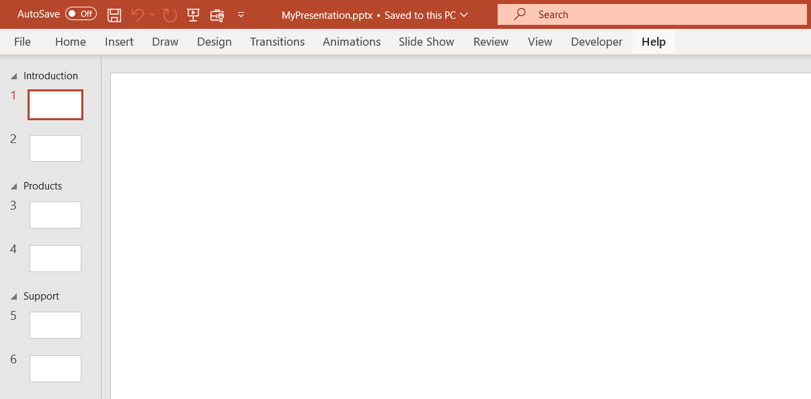

## **Introduction**

Slide sections in PowerPoint are a feature that allows you to organize and structure the content within your presentation. Sections help you group slides together based on specific subjects of your presentation. This feature is especially useful for larger presentations with numerous slides and diverse content. Aspose.Slides Cloud API allows you to read, create, rename, move, and delete sections of slides in presentations.

## **API Information**

|**API**|**Type**|**Description**|**Resource**|
| :- | :- | :- | :- |
|/slides/{name}/sections|GET|Reads information about sections.|[GetSections](https://reference.aspose.cloud/slides/#/Sections/GetSections)|
|/slides/{name}/sections|PUT|Replaces existing sections with those specified in the options.|[SetSections](https://reference.aspose.cloud/slides/#/Sections/SetSections)|
|/slides/{name}/sections|POST|Creates a new section.|[CreateSection](https://reference.aspose.cloud/slides/#/Sections/CreateSection)|
|/slides/{name}/sections|DELETE|Deletes sections.|[DeleteSections](https://reference.aspose.cloud/slides/#/Sections/DeleteSections)|
|/slides/{name}/sections/{sectionIndex}/move|POST|Moves the section to a specified position.|[MoveSection](https://reference.aspose.cloud/slides/#/Sections/MoveSection)|
|/slides/{name}/sections/{sectionIndex}|PUT|Updates the section.|[UpdateSection](https://reference.aspose.cloud/slides/#/Sections/UpdateSection)|
|/slides/{name}/sections/{sectionIndex}|DELETE|Deletes the section.|[DeleteSection](https://reference.aspose.cloud/slides/#/Sections/DeleteSection)|

**Request Parameters**


|**Name**|**Type**|**Location**|**Required**|**Description**|
| :- | :- | :- | :- | :- |
|name|string|path|true|The name of a presentation file.|
|password|string|header|false|The password to open the presentation.|
|folder|string|query|false|The path to the folder containing the presentation.|
|storage|string|query|false|The name of the storage contaning the `folder`.|



|**Name**|**Type**|**Location**|**Required**|**Description**|
| :- | :- | :- | :- | :- |
|name|string|path|true|The name of a presentation file.|
|sections|object|body|true|The parameters for the sections.|
|password|string|header|false|The password to open the presentation.|
|folder|string|query|false|The path to the folder containing the presentation.|
|storage|string|query|false|The name of the storage contaning the `folder`.|



|**Name**|**Type**|**Location**|**Required**|**Description**|
| :- | :- | :- | :- | :- |
|name|string|path|true|The name of a presentation file.|
|sectionName|string|query|true|The name of a section.|
|slideIndex|integer|query|true|The 1-based index of the first slide in the section.|
|password|string|header|false|The password to open the presentation.|
|folder|string|query|false|The path to the folder containing the presentation.|
|storage|string|query|false|The name of the storage contaning the `folder`.|



|**Name**|**Type**|**Location**|**Required**|**Description**|
| :- | :- | :- | :- | :- |
|name|string|path|true|The name of a presentation file.|
|sections|string|query|false|The indices of the sections to be deleted. Delete all by default.|
|withSlides|boolean|query|false|If `true`, delete the slides related to the deleted sections, otherwise move them to the remaining sections.|
|password|string|header|false|The password to open the presentation.|
|folder|string|query|false|The path to the folder containing the presentation.|
|storage|string|query|false|The name of the storage contaning the `folder`.|



|**Name**|**Type**|**Location**|**Required**|**Description**|
| :- | :- | :- | :- | :- |
|name|string|path|true|The name of a presentation file.|
|sectionIndex|integer|path|true|The 1-based index of the section to be moved.|
|newPosition|integer|query|true|The new position of the section.|
|password|string|header|false|The password to open the presentation.|
|folder|string|query|false|The path to the folder containing the presentation.|
|storage|string|query|false|The name of the storage contaning the `folder`.|



|**Name**|**Type**|**Location**|**Required**|**Description**|
| :- | :- | :- | :- | :- |
|name|string|path|true|The name of a presentation file.|
|sectionIndex|integer|path|true|The 1-based index of the section to be updated.|
|sectionName|string|query|true|The new name of the section.|
|password|string|header|false|The password to open the presentation.|
|folder|string|query|false|The path to the folder containing the presentation.|
|storage|string|query|false|The name of the storage contaning the `folder`.|



|**Name**|**Type**|**Location**|**Required**|**Description**|
| :- | :- | :- | :- | :- |
|name|string|path|true|The name of a presentation file.|
|sectionIndex|integer|path|true|The 1-based index of the section to be deleted.|
|withSlides|boolean|query|false|If `true`, delete the slides related to the deleted section, otherwise move them to the remaining sections.|
|password|string|header|false|The password to open the presentation.|
|folder|string|query|false|The path to the folder containing the presentation.|
|storage|string|query|false|The name of the storage contaning the `folder`.|


{} 
When a presentation doesn't contain any sections, and you add sections starting from a slide other than the first one, another section with the name **Default Section** will be also added, starting from the first slide.
{} 

## **Examples**

A **MyPresentation.pptx** document contains **six** slides. Set a **Products** section starting on the **3th** slide and a **Support** section starting on the **5th** slide. Rename the default section to **Introduction**. Read information about all sections.

**cURL Solution**





**Get an Access Token**

```sh
curl -X POST "https://api.aspose.cloud/connect/token" \
     -d "grant_type=client_credentials&client_id=MyClientId&client_secret=MyClientSecret" \
     -H "Content-Type: application/x-www-form-urlencoded"
```

**Set Two Sections**

```sh
curl -X PUT "https://api.aspose.cloud/v3.0/slides/MyPresentation.pptx/sections" \
     -H "authorization: Bearer MyAccessToken" \
     -H "accept: application/json" \
     -H "Content-Type: application/json" \
     -d @SlideSections.json
```

SlideSections.json content:

```json
{
    "SectionList": [
        {
            "Name": "Products",
            "FirstSlideIndex": 3
        },
        {
            "Name": "Support",
            "FirstSlideIndex": 5
        }
    ]
}
```

**Rename the First Section**

```sh
curl -X PUT "https://api.aspose.cloud/v3.0/slides/MyPresentation.pptx/sections/1?sectionName=Introduction" \
     -H "authorization: Bearer MyAccessToken" \
     -H "accept: application/json" \
     -H "Content-Length: 0"
```

**Read All Sections**

```sh
curl -X GET "https://api.aspose.cloud/v3.0/slides/MyPresentation.pptx/sections" \
     -H "authorization: Bearer MyAccessToken" \
     -H "accept: application/json"
```





**Set Two Sections**

```json
{
    "sectionList": [
        {
            "name": "Default Section",
            "firstSlideIndex": 1,
            "slideList": [
                {
                    "href": "https://api.aspose.cloud/v3.0/slides/MyPresentation.pptx/slides/1",
                    "relation": "self",
                    "slideIndex": 1
                },
                {
                    "href": "https://api.aspose.cloud/v3.0/slides/MyPresentation.pptx/slides/2",
                    "relation": "self",
                    "slideIndex": 2
                }
            ]
        },
        {
            "name": "Products",
            "firstSlideIndex": 3,
            "slideList": [
                {
                    "href": "https://api.aspose.cloud/v3.0/slides/MyPresentation.pptx/slides/3",
                    "relation": "self",
                    "slideIndex": 3
                },
                {
                    "href": "https://api.aspose.cloud/v3.0/slides/MyPresentation.pptx/slides/4",
                    "relation": "self",
                    "slideIndex": 4
                }
            ]
        },
        {
            "name": "Support",
            "firstSlideIndex": 5,
            "slideList": [
                {
                    "href": "https://api.aspose.cloud/v3.0/slides/MyPresentation.pptx/slides/5",
                    "relation": "self",
                    "slideIndex": 5
                },
                {
                    "href": "https://api.aspose.cloud/v3.0/slides/MyPresentation.pptx/slides/6",
                    "relation": "self",
                    "slideIndex": 6
                }
            ]
        }
    ],
    "selfUri": {
        "href": "https://api.aspose.cloud/v3.0/slides/MyPresentation.pptx/sections",
        "relation": "self"
    }
}
```

**Rename the First Section**

```json
{
    "sectionList": [
        {
            "name": "Introduction",
            "firstSlideIndex": 1,
            "slideList": [
                {
                    "href": "https://api.aspose.cloud/v3.0/slides/MyPresentation.pptx/slides/1",
                    "relation": "self",
                    "slideIndex": 1
                },
                {
                    "href": "https://api.aspose.cloud/v3.0/slides/MyPresentation.pptx/slides/2",
                    "relation": "self",
                    "slideIndex": 2
                }
            ]
        },
        {
            "name": "Products",
            "firstSlideIndex": 3,
            "slideList": [
                {
                    "href": "https://api.aspose.cloud/v3.0/slides/MyPresentation.pptx/slides/3",
                    "relation": "self",
                    "slideIndex": 3
                },
                {
                    "href": "https://api.aspose.cloud/v3.0/slides/MyPresentation.pptx/slides/4",
                    "relation": "self",
                    "slideIndex": 4
                }
            ]
        },
        {
            "name": "Support",
            "firstSlideIndex": 5,
            "slideList": [
                {
                    "href": "https://api.aspose.cloud/v3.0/slides/MyPresentation.pptx/slides/5",
                    "relation": "self",
                    "slideIndex": 5
                },
                {
                    "href": "https://api.aspose.cloud/v3.0/slides/MyPresentation.pptx/slides/6",
                    "relation": "self",
                    "slideIndex": 6
                }
            ]
        }
    ],
    "selfUri": {
        "href": "https://api.aspose.cloud/v3.0/slides/MyPresentation.pptx/sections",
        "relation": "self"
    }
}
```

**Read All Sections**

```json
{
    "sectionList": [
        {
            "name": "Introduction",
            "firstSlideIndex": 1,
            "slideList": [
                {
                    "href": "https://api.aspose.cloud/v3.0/slides/MyPresentation.pptx/slides/1",
                    "relation": "self",
                    "slideIndex": 1
                },
                {
                    "href": "https://api.aspose.cloud/v3.0/slides/MyPresentation.pptx/slides/2",
                    "relation": "self",
                    "slideIndex": 2
                }
            ]
        },
        {
            "name": "Products",
            "firstSlideIndex": 3,
            "slideList": [
                {
                    "href": "https://api.aspose.cloud/v3.0/slides/MyPresentation.pptx/slides/3",
                    "relation": "self",
                    "slideIndex": 3
                },
                {
                    "href": "https://api.aspose.cloud/v3.0/slides/MyPresentation.pptx/slides/4",
                    "relation": "self",
                    "slideIndex": 4
                }
            ]
        },
        {
            "name": "Support",
            "firstSlideIndex": 5,
            "slideList": [
                {
                    "href": "https://api.aspose.cloud/v3.0/slides/MyPresentation.pptx/slides/5",
                    "relation": "self",
                    "slideIndex": 5
                },
                {
                    "href": "https://api.aspose.cloud/v3.0/slides/MyPresentation.pptx/slides/6",
                    "relation": "self",
                    "slideIndex": 6
                }
            ]
        }
    ],
    "selfUri": {
        "href": "https://api.aspose.cloud/v3.0/slides/MyPresentation.pptx/sections",
        "relation": "self"
    }
}
```





**SDK Solutions**





```csharp
var slidesApi = new SlidesApi("MyClientId", "MyClientSecret");

var fileName = "MyPresentation.pptx";

// Prepare the sections for the presentation.
var sections = new Sections();
sections.SectionList = new List<Section>();

var section1 = new Section { FirstSlideIndex = 3, Name = "Products" };
sections.SectionList.Add(section1);

var section2 = new Section { FirstSlideIndex = 5, Name = "Support" };
sections.SectionList.Add(section2);

// Set the sections to the presentation.
// The presentation will contain the sections: "Default Section", "Products", and "Support".
slidesApi.SetSections(fileName, sections);

// Rename the "Default Section" to "Introduction".
slidesApi.UpdateSection(fileName, 1, "Introduction");

var allSections = slidesApi.GetSections(fileName);

foreach (var section in allSections.SectionList)
{ 
    Console.WriteLine(section.Name + " section starts on slide " + section.FirstSlideIndex);
}

// Output:
// Introduction section starts on slide 1
// Products section starts on slide 3
// Support section starts on slide 5
```





```java
SlidesApi slidesApi = new SlidesApi("MyClientId", "MyClientSecret");

String fileName = "MyPresentation.pptx";

// Prepare the sections for the presentation.
Sections sections = new Sections();
sections.setSectionList(new ArrayList<Section>());

Section section1 = new Section();
section1.setFirstSlideIndex(3);
section1.setName("Products");
sections.getSectionList().add(section1);

Section section2 = new Section();
section2.setFirstSlideIndex(5);
section2.setName("Support");
sections.getSectionList().add(section2);

// Set the sections to the presentation.
// The presentation will contain the sections: "Default Section", "Products", and "Support".
slidesApi.setSections(fileName, sections, null, null, null);

// Rename the "Default Section" to "Introduction".
slidesApi.updateSection(fileName, 1, "Introduction", null, null, null);

Sections allSections = slidesApi.getSections(fileName, null, null, null);

for (Section section : allSections.getSectionList()) {
    System.out.println(section.getName() + " section starts on slide " + section.getFirstSlideIndex());
}

// Output:
// Introduction section starts on slide 1
// Products section starts on slide 3
// Support section starts on slide 5
```





```php
use Aspose\Slides\Cloud\Sdk\Api\Configuration;
use Aspose\Slides\Cloud\Sdk\Api\SlidesApi;
use Aspose\Slides\Cloud\Sdk\Model\Sections;
use Aspose\Slides\Cloud\Sdk\Model\Section;

$configuration = new Configuration();
$configuration->setAppSid("MyClientId");
$configuration->setAppKey("MyClientSecret");

$slidesApi = new SlidesApi(null, $configuration);

$fileName = "MyPresentation.pptx";

// Prepare the sections for the presentation.
$sections = new Sections();

$section1 = new Section();
$section1->setFirstSlideIndex(3);
$section1->setName("Products");

$section2 = new Section();
$section2->setFirstSlideIndex(5);
$section2->setName("Support");

$sections->setSectionList([$section1, $section2]);

// Set the sections to the presentation.
// The presentation will contain the sections: "Default Section", "Products", and "Support".
$slidesApi->setSections($fileName, $sections);

// Rename the "Default Section" to "Introduction".
$slidesApi->updateSection($fileName, 1, "Introduction");

$allSections = $slidesApi->getSections($fileName);

foreach ($allSections->getSectionList() as $section) {
    echo $section->getName(), " section starts on slide ", $section->getFirstSlideIndex(), "\r\n";
}

// Output:
// Introduction section starts on slide 1
// Products section starts on slide 3
// Support section starts on slide 5
```





```ruby
require "aspose_slides_cloud"

include AsposeSlidesCloud

configuration = Configuration.new
configuration.app_sid = "MyClientId"
configuration.app_key = "MyClientSecret"

slides_api = SlidesApi.new(configuration)

file_name = "MyPresentation.pptx"

# Prepare the sections for the presentation.
sections = Sections.new

section1 = Section.new
section1.first_slide_index = 3
section1.name = "Products"

section2 = Section.new
section2.first_slide_index = 5
section2.name = "Support"

sections.section_list = [section1, section2]

# Set the sections to the presentation.
# The presentation will contain the sections: "Default Section", "Products", and "Support".
slides_api.set_sections(file_name, sections)

# Rename the "Default Section" to "Introduction".
slides_api.update_section(file_name, 1, "Introduction")

all_sections = slides_api.get_sections(file_name)

for section in all_sections.section_list 
    print section.name, " section starts on slide ", section.first_slide_index, "\n"
end

# Output:
# Introduction section starts on slide 1
# Products section starts on slide 3
# Support section starts on slide 5
```





```python
import asposeslidescloud

from asposeslidescloud.apis.slides_api import SlidesApi
from asposeslidescloud.models import Sections
from asposeslidescloud.models import Section

slides_api = SlidesApi(None, "MyClientId", "MyClientSecret")

file_name = "MyPresentation.pptx"

# Prepare the sections for the presentation.
sections = Sections()

section1 = Section()
section1.first_slide_index = 3
section1.name = "Products"

section2 = Section()
section2.first_slide_index = 5
section2.name = "Support"

sections.section_list = [section1, section2]

# Set the sections to the presentation.
# The presentation will contain the sections: "Default Section", "Products", and "Support".
slides_api.set_sections(file_name, sections)

# Rename the "Default Section" to "Introduction".
slides_api.update_section(file_name, 1, "Introduction")

all_sections = slides_api.get_sections(file_name)

for section in all_sections.section_list:
    print(section.name, "section starts on slide", section.first_slide_index)

# Output:
# Introduction section starts on slide 1
# Products section starts on slide 3
# Support section starts on slide 5
```





```js
const cloud = require("asposeslidescloud");

const slidesApi = new cloud.SlidesApi("MyClientId", "MyClientSecret");

const fileName = "MyPresentation.pptx";

// Prepare the sections for the presentation.
const sections = new cloud.Sections();

const section1 = new cloud.Section();
section1.firstSlideIndex = 3;
section1.name = "Products";

const section2 = new cloud.Section();
section2.firstSlideIndex = 5;
section2.name = "Support";

sections.sectionList = [section1, section2];

// Set the sections to the presentation.
// The presentation will contain the sections: "Default Section", "Products", and "Support".
slidesApi.setSections(fileName, sections).then(() => {

    // Rename the "Default Section" to "Introduction".
    slidesApi.updateSection(fileName, 1, "Introduction").then(() => {

        slidesApi.getSections(fileName).then(allSections => {

            allSections.body.sectionList.forEach(section => {
                console.log(section.name, "section starts on slide", section.firstSlideIndex);
            });
        });
    });
});

// Output:
// Introduction section starts on slide 1
// Products section starts on slide 3
// Support section starts on slide 5
```





```cpp
#include "asposeslidescloud/api/SlidesApi.h"

using namespace asposeslidescloud::api;

int main()
{
    auto slidesApi = std::make_shared<SlidesApi>(L"MyClientId", L"MyClientSecret");

    auto fileName = L"MyPresentation.pptx";

    // Prepare the sections for the presentation.
    auto sections = std::make_shared<Sections>();

    auto section1 = std::make_shared<Section>();
    section1->setFirstSlideIndex(3);
    section1->setName(L"Products");

    auto section2 = std::make_shared<Section>();
    section2->setFirstSlideIndex(5);
    section2->setName(L"Support");

    sections->setSectionList({ section1, section2 });

    // Set the sections to the presentation.
    // The presentation will contain the sections: "Default Section", "Products", and "Support".
    slidesApi->setSections(fileName, sections).get();

    // Rename the "Default Section" to "Introduction".
    slidesApi->updateSection(fileName, 1, L"Introduction").get();

    auto allSections = slidesApi->getSections(fileName).get();

    for (auto section : allSections->getSectionList()) {
        std::wcout << section->getName() << L" section starts on slide " << section->getFirstSlideIndex() << "\r\n";
    }
}

// Output:
// Introduction section starts on slide 1
// Products section starts on slide 3
// Support section starts on slide 5
```





```perl
use AsposeSlidesCloud::Configuration;
use AsposeSlidesCloud::SlidesApi;
use AsposeSlidesCloud::Object::Sections;
use AsposeSlidesCloud::Object::Section;

my $config = AsposeSlidesCloud::Configuration->new();
$config->{app_sid} = "MyClientId";
$config->{app_key} = "MyClientSecret";

my $slides_api = AsposeSlidesCloud::SlidesApi->new(config => $config);

my $file_name = "MyPresentation.pptx";

# Prepare the sections for the presentation.
my $sections = AsposeSlidesCloud::Object::Sections->new();

my $section1 = AsposeSlidesCloud::Object::Section->new();
$section1->{first_slide_index} = 3;
$section1->{name} = "Products";

my $section2 = AsposeSlidesCloud::Object::Section->new();
$section2->{first_slide_index} = 5;
$section2->{name} = "Support";

$sections->{section_list} = [$section1, $section2];

# Set the sections to the presentation.
# The presentation will contain the sections: "Default Section", "Products", and "Support".
my %sections_params = (name => $file_name, sections => $sections);
$slides_api->set_sections(%sections_params);

# Rename the "Default Section" to "Introduction".
my %section_params = (name => $file_name, section_index => 1, section_name => "Introduction");
$slides_api->update_section(%section_params);

my %all_params = (name => $file_name);
my $all_sections = $slides_api->get_sections(%all_params);

for my $section (@{$all_sections->{section_list}}) {
    print($section->{name} . " section starts on slide " . $section->{first_slide_index} . "\n");
}

# Output:
# Introduction section starts on slide 1
# Products section starts on slide 3
# Support section starts on slide 5
```













**Result**



## **SDKs**

Check [Available SDKs](/slides/available-sdks/) to learn how to add an SDK to your project.
