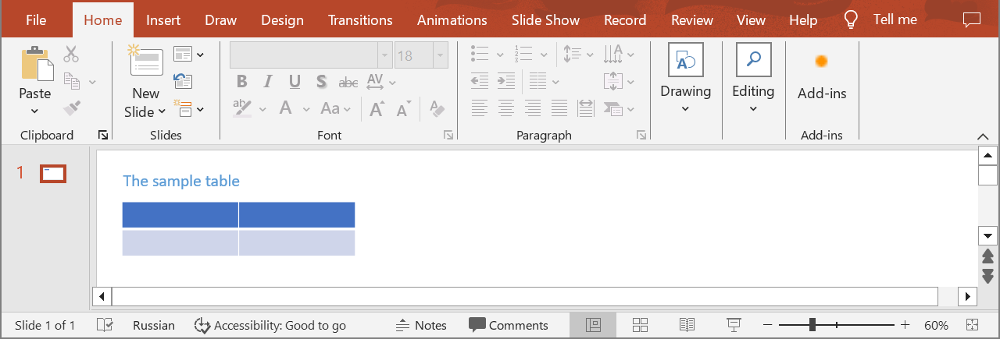
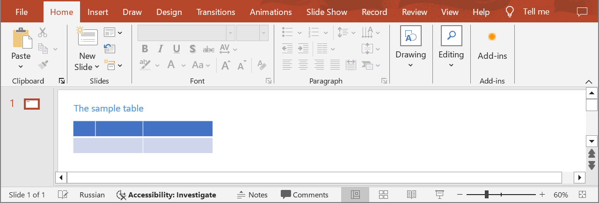

## **Introduction**

Aspose.Slides Cloud API provides different options for splitting table cells. There are four of them: by width, by height, by column span, and by row span. The last two options can be applied to merged cells. The methods take a required `value` argument. In the case of splitting by width or height, you have to specify the desired cell width or height accordingly. In the case of splitting by span, the column span or row span value has to be provided.

## **SplitTableCell**

### **API Information**

|**API**|**Type**|**Description**|**Resource**|
| :- | :- | :- | :- |
|/slides/{name}/slides/{slideIndex}/shapes/{shapeIndex}/rows/{rowIndex}/cells/{cellIndex}/{splitType}/{value}|POST|Splits a table cell in a presentation saved in a storage.|[SplitTableCell](https://reference.aspose.cloud/slides/#/Table/SplitTableCell)|

**Request Parameters**

|**Name**|**Type**|**Location**|**Required**|**Description**|
| :- | :- | :- | :- | :- |
|name|string|path|true|The name of a presentation file.|
|slideIndex|integer|path|true|The 1-based index of a slide.|
|shapeIndex|integer|path|true|The 1-based index of a shape (must be a table).|
|rowIndex|integer|path|true|The 1-based index of a row.|
|cellIndex|integer|path|true|The 1-based index of the cell in the row.|
|splitType|`TableCellSplitType`|path|true|The type of splitting.|
|value|number|path|true|The width, height, column span, or row span (depending on the split type).|
|password|string|header|false|The password to open the presentation.|
|folder|string|query|false|The path to the folder containing the presentation file.|
|storage|string|query|false|The name of the storage contaning the folder.|

### **Examples**

In the **default** storage, the document **MyPresentation.pptx** contains a table (the **second** shape) with two columns and two rows on the **first** slide. Split the cell **(1,1)** by **width**. The width of the new cell must be **40** pt.



**cURL Solution**





**Get an Access Token**

```sh
curl -X POST "https://api.aspose.cloud/connect/token" \
     -d "grant_type=client_credentials&client_id=MyClientId&client_secret=MyClientSecret" \
     -H "Content-Type: application/x-www-form-urlencoded"
```

**Split the Cell**

```sh
curl -X POST "https://api.aspose.cloud/v3.0/slides/MyPresentation.pptx/slides/1/shapes/2/rows/1/cells/1/SplitByWidth/40" \
     -H "authorization: Bearer MyAccessToken"
```





```text
Code: 200
Returns table info.
```





**cURL Solution**





```csharp
using System;
using Aspose.Slides.Cloud.Sdk;
using Aspose.Slides.Cloud.Sdk.Model;

class Application
{
    static void Main(string[] args)
    {
        SlidesApi slidesApi = new SlidesApi("MyClientId", "MyClientSecret");

        string fileName = "MyPresentation.pptx";
        int slideIndex = 1;
        int shapeIndex = 2;
        int rowIndex = 1;
        int cellIndex = 1;
        TableCellSplitType splitType = TableCellSplitType.SplitByWidth;
        int cellWidth = 40;

        Table table = slidesApi.SplitTableCell(fileName, slideIndex, shapeIndex, rowIndex, cellIndex, splitType, cellWidth);

        int cellCount = table.Rows[rowIndex - 1].Cells.Count;
        Console.WriteLine("Number of cells in the row: " + cellCount); // 3
    }
}
```





```java
import com.aspose.slides.ApiException;
import com.aspose.slides.api.SlidesApi;
import com.aspose.slides.model.TableCellSplitType;
import com.aspose.slides.model.Table;

public class Application {
    public static void main(String[] args) throws ApiException {
        SlidesApi slidesApi = new SlidesApi("MyClientId", "MyClientSecret");

        String fileName = "MyPresentation.pptx";
        int slideIndex = 1;
        int shapeIndex = 2;
        int rowIndex = 1;
        int cellIndex = 1;
        TableCellSplitType splitType = TableCellSplitType.SPLITBYWIDTH;
        double cellWidth = 40.0;

        Table table = slidesApi.splitTableCell(fileName, slideIndex, shapeIndex, rowIndex, cellIndex, splitType, cellWidth, null, null, null);

        int cellCount = table.getRows().get(rowIndex - 1).getCells().size();
        System.out.println("Number of cells in the row: " + cellCount); // 3
    }
}
```





```php
use Aspose\Slides\Cloud\Sdk\Api\Configuration;
use Aspose\Slides\Cloud\Sdk\Api\SlidesApi;
use Aspose\Slides\Cloud\Sdk\Model\TableCellSplitType;

$configuration = new Configuration();
$configuration->setAppSid("MyClientId");
$configuration->setAppKey("MyClientSecret");

$slidesApi = new SlidesApi(null, $configuration);

$fileName = "MyPresentation.pptx";
$slideIndex = 1;
$shapeIndex = 2;
$rowIndex = 1;
$cellIndex = 1;
$cellType = TableCellSplitType::SPLIT_BY_WIDTH;
$cellWidth = 40;

$table = $slidesApi->splitTableCell($fileName, $slideIndex, $shapeIndex, $rowIndex, $cellIndex, $cellType, $cellWidth);

$cellCount = count($table->getRows()[$rowIndex - 1]->getCells());
echo "Number of cells in the row: ", $cellCount; // 3
```





```ruby
require "aspose_slides_cloud"

include AsposeSlidesCloud

configuration = Configuration.new
configuration.app_sid = "MyClientId"
configuration.app_key = "MyClientSecret"

slides_api = SlidesApi.new(configuration)

file_name = "MyPresentation.pptx"
slide_index = 1
shape_index = 2        
row_index = 1
cell_index = 1
cell_type = TableCellSplitType::SPLIT_BY_WIDTH
cell_width = 40

table = slides_api.split_table_cell(file_name, slide_index, shape_index, row_index, cell_index, cell_type, cell_width)

cell_count = table.rows[row_index - 1].cells.length
puts "Number of cells in the row: #{cell_count}" # 3
```





```python
from asposeslidescloud.apis import SlidesApi
from asposeslidescloud.models import TableCellSplitType

slides_api = SlidesApi(None, "MyClientId", "MyClientSecret")

file_name = "MyPresentation.pptx"
slide_index = 1
shape_index = 2
row_index = 1
cell_index = 1
cell_type = TableCellSplitType.SPLITBYWIDTH
cell_width = 40

table = slides_api.split_table_cell(file_name, slide_index, shape_index, row_index, cell_index, cell_type, cell_width)

cell_count = len(table.rows[row_index - 1].cells)
print("Cells count in the row:", cell_count)  # 3
```





```js
const cloudSdk = require("asposeslidescloud");

const slidesApi = new cloudSdk.SlidesApi("MyClientId", "MyClientSecret");

fileName = "MyPresentation.pptx";
slideIndex = 1;
shapeIndex = 2;
rowIndex = 1;
cellIndex = 1;
cellType = cloudSdk.TableCellSplitType.SplitByWidth;
cellWidth = 40;

slidesApi.splitTableCell(fileName, slideIndex, shapeIndex, rowIndex, cellIndex, cellType, cellWidth).then(table => {
    cellCount = table.body.rows[rowIndex - 1].cells.length;
    console.log("Number of cells in the row:", cellCount); // 3
});
```





```go
import (
	"fmt"

	asposeslidescloud "github.com/aspose-slides-cloud/aspose-slides-cloud-go/v24"
)

func main() {
	configuration := asposeslidescloud.NewConfiguration()
	configuration.AppSid = "MyClientId"
	configuration.AppKey = "MyClientSecret"

	slidesApi := asposeslidescloud.NewAPIClient(configuration).SlidesApi

	fileName := "MyPresentation.pptx"
	var slideIndex int32 = 1
	var shapeIndex int32 = 2
	var rowIndex int32 = 1
	var cellIndex int32 = 1
	cellType := string(asposeslidescloud.TableCellSplitType_SplitByWidth)
	var cellWidth float64 = 40

	table, _, _ := slidesApi.SplitTableCell(fileName, slideIndex, shapeIndex, rowIndex, cellIndex, cellType, cellWidth, "", "", "")

	cellCount := len(table.GetRows()[rowIndex-1].GetCells())
	fmt.Println("Number of cells in the row:", cellCount) // 3
}
```





```cpp
#include "asposeslidescloud/api/SlidesApi.h"

using namespace asposeslidescloud::api;

int main()
{
    std::shared_ptr<SlidesApi> slidesApi = std::make_shared<SlidesApi>(L"MyClientId", L"MyClientSecret");

    const wchar_t* fileName = L"MyPresentation.pptx";
    int slideIndex = 1;
    int shapeIndex = 2;
    int rowIndex = 1;
    int cellIndex = 1;
    const wchar_t* splitType = L"SplitByWidth";
    double cellWidth = 40;

    std::shared_ptr<Table> table = slidesApi->splitTableCell(fileName, slideIndex, shapeIndex, rowIndex, cellIndex, splitType, cellWidth).get();

    int cellCount = table->getRows()[rowIndex - 1]->getCells().size();
    std::wcout << L"Number of cells in the row: " << cellCount; // 3
}
```





```perl
use AsposeSlidesCloud::Configuration;
use AsposeSlidesCloud::SlidesApi;

my $configuration = AsposeSlidesCloud::Configuration->new();
$configuration->{app_sid} = "MyClientId";
$configuration->{app_key} = "MyClientSecret";

my $slides_api = AsposeSlidesCloud::SlidesApi->new(config => $configuration);

my $file_name = "MyPresentation.pptx";
my $slide_index = 1;
my $shape_index = 2;
my $row_index = 1;
my $cell_index = 1;
my $split_type = "SplitByWidth";
my $cell_width = 40;

my $table = $slides_api->split_table_cell(
    name => $file_name, slide_index => $slide_index, shape_index => $shape_index, row_index => $row_index, cell_index => $cell_index, split_type => $split_type, value => $cell_width);

my $cell_count = @{$table->{rows}[$row_index - 1]{cells}};
print "Number of cells in the row: ", $cell_count; # 3
```





The result:



## **SDK Source**

The Aspose for Cloud SDKs can be downloaded from the following page: [Available SDKs](/slides/available-sdks/)
