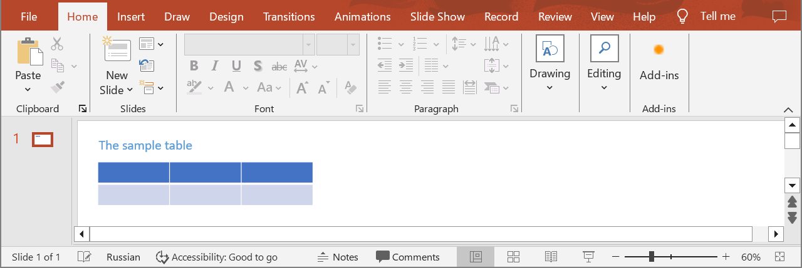
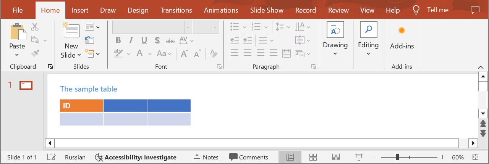

## **Introduction**

Aspose.Slides Cloud API provides a wide range of features for formatting table cells. You can change the background color of cells. Additionally, cell borders can be formatted: you can change their color, thickness, and style, such as using solid, dashed, or dotted lines. Moreover, you can align text within cells to the left, right, center, or justify it. You can change the font, its size, color, and style (for example, making the text bold, italic, or underlined). The API also supports setting internal padding for text within cells. Additionally, you can apply various styles and effects, such as shadows, 3D effects, and gradients, to visually highlight specific elements of the table. Use the following method to format table cells.

## **UpdateTableCell**

### **API Information**

|**API**|**Type**|**Description**|**Resource**|
| :- | :- | :- | :- |
|/slides/{name}/slides/{slideIndex}/shapes/{shapeIndex}/rows/{rowIndex}/cells/{cellIndex}|PUT|Updates a table cell in a presentation saved in a storage.|[UpdateTableCell](https://reference.aspose.cloud/slides/#/Table/UpdateTableCell)|

**Request Parameters**

|**Name**|**Type**|**Location**|**Required**|**Description**|
| :- | :- | :- | :- | :- |
|name|string|path|true|The name of a presentation file.|
|slideIndex|integer|path|true|The 1-based index of a slide.|
|shapeIndex|integer|path|true|The 1-based index of a shape (must be a table).|
|rowIndex|integer|path|true|The 1-based index of a row.|
|cellIndex|integer|path|true|The 1-based index of the cell in the row.|
|dto|`TableCell`|body|true|The data transfer object with cell parameters.|
|password|string|header|false|The password to open the presentation.|
|folder|string|query|false|The path to the folder containing the presentation file.|
|storage|string|query|false|The name of the storage contaning the folder.|

### **Examples**

In the **default** storage, the document **MyPresentation.pptx** contains a table (the **second** shape) on the **first** slide. For cell **(1,1)** set the **text** to **"ID"** and the **fill color** to **#ED7D31**.



**cURL Solution**





**Get an Access Token**

```sh
curl -X POST "https://api.aspose.cloud/connect/token" \
     -d "grant_type=client_credentials&client_id=MyClientId&client_secret=MyClientSecret" \
     -H "Content-Type: application/x-www-form-urlencoded"
```

**Update the Cell**

```sh
curl -X PUT "https://api.aspose.cloud/v3.0/slides/MyPresentation.pptx/slides/1/shapes/2/rows/1/cells/1" \
     -H "authorization: Bearer MyAccessToken" \
     -H "Content-Type: application/json" \
     -d @TableCell.json
```

TableCell.json content:
```json
{
  "Text": "ID",
  "FillFormat": {
    "Type": "Solid",
    "Color": "#ED7D31"
  }
}
```





**Response Example**

```json
{
  "text": "ID",
  "marginTop": 3.6,
  "marginRight": 7.2,
  "marginLeft": 7.2,
  "marginBottom": 3.6,
  "fillFormat": {
    "type": "Solid",
    "color": "#FFED7D31"
  },
  "columnIndex": 0,
  "rowIndex": 0,
  "textFrameFormat": {
    "threeDFormat": {
      "contourWidth": 0,
      "depth": 0,
      "extrusionHeight": 0
    },
    "transform": "NotDefined",
    "wrapText": "True",
    "textVerticalType": "Horizontal",
    "defaultParagraphFormat": {
      "defaultPortionFormat": {
        "highlightColor": "#0",
        "fontHeight": "NaN"
      }
    }
  },
  "paragraphs": {
    "href": "https://api.aspose.cloud/v3.0/slides/MyPresentation.pptx/slides/1/shapes/2/rows/2/cells/2/paragraphs",
    "relation": "self",
    "slideIndex": 1,
    "shapeIndex": 2
  }
}
```




**SDK Solutions**





```csharp
using System;
using Aspose.Slides.Cloud.Sdk;
using Aspose.Slides.Cloud.Sdk.Model;

class Application
{
    static void Main(string[] args)
    {
        SlidesApi slidesApi = new SlidesApi("MyClientId", "MyClientSecret");

        string fileName = "MyPresentation.pptx";
        int slideIndex = 1;
        int shapeIndex = 2;
        int rowIndex = 1;
        int cellIndex = 1;

        TableCell tableCell = new TableCell
        { 
            Text = "ID",
            FillFormat = new SolidFill
            { 
                Color = "#ED7D31"
            }
        };

        TableCell updatedCell = slidesApi.UpdateTableCell(fileName, slideIndex, shapeIndex, rowIndex, cellIndex, tableCell);

        Console.WriteLine("Cell text: " + updatedCell.Text);                           // "ID"
        Console.WriteLine("Fill color: " + ((SolidFill)updatedCell.FillFormat).Color); // #FFED7D31
    }
}
```





```java
import com.aspose.slides.ApiException;
import com.aspose.slides.api.SlidesApi;
import com.aspose.slides.model.SolidFill;
import com.aspose.slides.model.TableCell;

public class Application {
    public static void main(String[] args) throws ApiException {
        SlidesApi slidesApi = new SlidesApi("MyClientId", "MyClientSecret");

        String fileName = "MyPresentation.pptx";
        int slideIndex = 1;
        int shapeIndex = 2;
        int rowIndex = 1;
        int cellIndex = 1;

        SolidFill fillFormat = new SolidFill();
        fillFormat.setColor("#ED7D31");

        TableCell tableCell = new TableCell();
        tableCell.setText("ID");
        tableCell.setFillFormat(fillFormat);

        TableCell updatedCell = slidesApi.updateTableCell(fileName, slideIndex, shapeIndex, rowIndex, cellIndex, tableCell, null, null, null);

        System.out.println("Cell text: " + updatedCell.getText());                                // "ID"
        System.out.println("Fill color: " + ((SolidFill)updatedCell.getFillFormat()).getColor()); // #FFED7D31
    }
}
```





```php
use Aspose\Slides\Cloud\Sdk\Api\Configuration;
use Aspose\Slides\Cloud\Sdk\Api\SlidesApi;
use Aspose\Slides\Cloud\Sdk\Model\TableCell;
use Aspose\Slides\Cloud\Sdk\Model\SolidFill;

$configuration = new Configuration();
$configuration->setAppSid("MyClientId");
$configuration->setAppKey("MyClientSecret");

$slidesApi = new SlidesApi(null, $configuration);

$fileName = "MyPresentation.pptx";
$slideIndex = 1;
$shapeIndex = 2;
$rowIndex = 1;
$cellIndex = 1;

$tableCell = new TableCell();
$tableCell->setText("ID");
$tableCell->setFillFormat(new SolidFill());
$tableCell->getFillFormat()->setColor("#ED7D31");

$updatedCell = $slidesApi->updateTableCell($fileName, $slideIndex, $shapeIndex, $rowIndex, $cellIndex, $tableCell);

echo "Cell text: ", $updatedCell->getText(), "\n";                    // "ID"
echo "Fill color: ", $updatedCell->getFillFormat()->getColor(), "\n"; // #FFED7D31
```





```ruby
require "aspose_slides_cloud"

include AsposeSlidesCloud

configuration = Configuration.new
configuration.app_sid = "MyClientId"
configuration.app_key = "MyClientSecret"

slides_api = SlidesApi.new(configuration)

file_name = "MyPresentation.pptx"
slide_index = 1
shape_index = 2        
row_index = 1
cell_index = 1

table_cell = TableCell.new
table_cell.text = "ID"
table_cell.fill_format = SolidFill.new
table_cell.fill_format.color = "#ED7D31"

updated_cell = slides_api.update_table_cell(file_name, slide_index, shape_index, row_index, cell_index, table_cell)

puts "Cell text: #{updated_cell.text}"               # "ID"
puts "Fill color: #{updated_cell.fill_format.color}" # #FFED7D31
```





```python
from asposeslidescloud.apis import SlidesApi
from asposeslidescloud.models import TableCell
from asposeslidescloud.models import SolidFill

slides_api = SlidesApi(None, "MyClientId", "MyClientSecret")

file_name = "MyPresentation.pptx"
slide_index = 1
shape_index = 2
row_index = 1
cell_index = 1

table_cell = TableCell()
table_cell.text = "ID"
table_cell.fill_format = SolidFill()
table_cell.fill_format.color = "#ED7D31"

updated_cell = slides_api.update_table_cell(file_name, slide_index, shape_index, row_index, cell_index, table_cell)

print("Cell text:", updated_cell.text)                # "ID"
print("Fill color:", updated_cell.fill_format.color)  # #FFED7D31
```





```js
const cloudSdk = require("asposeslidescloud");

const slidesApi = new cloudSdk.SlidesApi("MyClientId", "MyClientSecret");

fileName = "MyPresentation.pptx";
slideIndex = 1;
shapeIndex = 2;
rowIndex = 1;
cellIndex = 1;

tableCell = new cloudSdk.TableCell();
tableCell.text = "ID";
tableCell.fillFormat = new cloudSdk.SolidFill();
tableCell.fillFormat.color = "#ED7D31";

slidesApi.updateTableCell(fileName, slideIndex, shapeIndex, rowIndex, cellIndex, tableCell).then(updatedCell => {
    console.log("Cell text:", updatedCell.body.text);              // "ID"
    console.log("Fill color:", updatedCell.body.fillFormat.color); // #FFED7D31
});
```





```go
import (
	"fmt"

	asposeslidescloud "github.com/aspose-slides-cloud/aspose-slides-cloud-go/v24"
)

func main() {
	configuration := asposeslidescloud.NewConfiguration()
	configuration.AppSid = "MyClientId"
	configuration.AppKey = "MyClientSecret"

	slidesApi := asposeslidescloud.NewAPIClient(configuration).SlidesApi

	fileName := "MyPresentation.pptx"
	var slideIndex int32 = 1
	var shapeIndex int32 = 2
	var rowIndex int32 = 1
	var cellIndex int32 = 1

	fillFormat := asposeslidescloud.NewSolidFill()
	fillFormat.Color = "#ED7D31"

	tableCell := asposeslidescloud.NewTableCell()
	tableCell.Text = "ID"
	tableCell.FillFormat = fillFormat

	updatedCell, _, _ := slidesApi.UpdateTableCell(fileName, slideIndex, shapeIndex, rowIndex, cellIndex, tableCell, "", "", "")

	fmt.Println("Cell text:", updatedCell.GetText())                                                  // "ID"
	fmt.Println("Fill color:", updatedCell.GetFillFormat().(asposeslidescloud.ISolidFill).GetColor()) // #FFED7D31
}
```





```cpp
#include "asposeslidescloud/api/SlidesApi.h"
#include "asposeslidescloud/model/SolidFill.h"

using namespace asposeslidescloud::api;

int main()
{
    std::shared_ptr<SlidesApi> slidesApi = std::make_shared<SlidesApi>(L"MyClientId", L"MyClientSecret");

    const wchar_t* fileName = L"MyPresentation.pptx";
    int slideIndex = 1;
    int shapeIndex = 2;
    int rowIndex = 1;
    int cellIndex = 1;

    std::shared_ptr<SolidFill> fillFormat = std::make_shared<SolidFill>();
    fillFormat->setColor(L"#ED7D31");

    std::shared_ptr<TableCell> tableCell = std::make_shared<TableCell>();
    tableCell->setText(L"ID");
    tableCell->setFillFormat(fillFormat);

    std::shared_ptr<TableCell> updatedCell = slidesApi->updateTableCell(fileName, slideIndex, shapeIndex, rowIndex, cellIndex, tableCell).get();

    std::wcout << L"Cell text: " << updatedCell->getText() << std::endl;                                                         // "ID"
    std::wcout << L"Fill color: " << std::static_pointer_cast<SolidFill>(updatedCell->getFillFormat())->getColor() << std::endl; // #FFED7D31
}
```





```perl
use AsposeSlidesCloud::Configuration;
use AsposeSlidesCloud::SlidesApi;
use AsposeSlidesCloud::Object::TableCell;
use AsposeSlidesCloud::Object::SolidFill;

my $configuration = AsposeSlidesCloud::Configuration->new();
$configuration->{app_sid} = "MyClientId";
$configuration->{app_key} = "MyClientSecret";

my $slides_api = AsposeSlidesCloud::SlidesApi->new(config => $configuration);

my $file_name = "MyPresentation.pptx";
my $slide_index = 1;
my $shape_index = 2;
my $row_index = 1;
my $cell_index = 1;

my $table_cell = AsposeSlidesCloud::Object::TableCell->new();
$table_cell->{text} = "ID";
$table_cell->{fill_format} = AsposeSlidesCloud::Object::SolidFill->new();
$table_cell->{fill_format}{color} = "#ED7D31";

my $updated_cell = $slides_api->update_table_cell(
    name => $file_name, slide_index => $slide_index, shape_index => $shape_index, row_index => $row_index, cell_index => $cell_index, dto => $table_cell);

print "Cell text: $updated_cell->{text}\n";               # "ID"
print "Fill color: $updated_cell->{fill_format}{color}\n" # #FFED7D31
```





The result:



## **SDKs**

Check [Available SDKs](/slides/available-sdks/) to learn how to add an SDK to your project.
