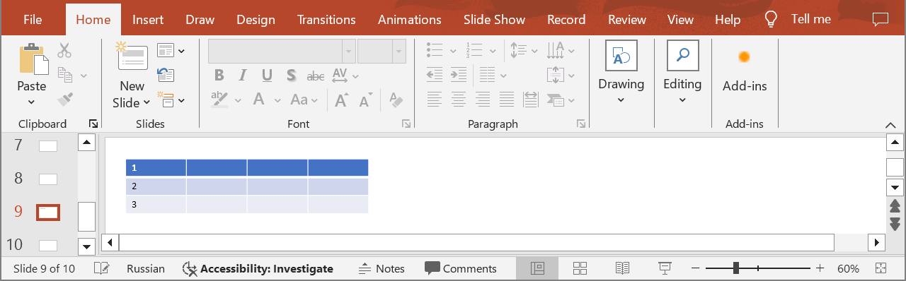
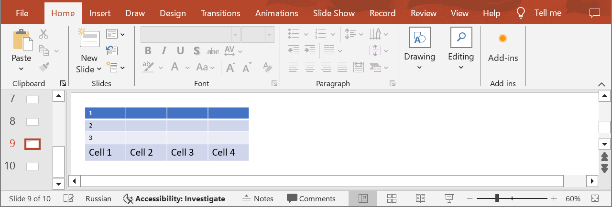

## **Introduction**

Aspose.Slides Cloud API provides you with the ability to efficiently manage table content in PowerPoint presentations, including creating new rows. Use the following method to insert a row at the specified position or append it to the end of the table. 

## **CreateTableRow**

### **API Information**

|**API**|**Type**|**Description**|**Resource**|
| :- | :- | :- | :- |
|/slides/{name}/slides/{slideIndex}/shapes/{shapeIndex}/rows|POST|Adds a row to a table in a presentation saved in a storage.|[CreateTableRow](https://reference.aspose.cloud/slides/#/Table/CreateTableRow)|

**Request Parameters**

|**Name**|**Type**|**Location**|**Required**|**Description**|
| :- | :- | :- | :- | :- |
|name|string|path|true|The name of a presentation file.|
|slideIndex|integer|path|true|The 1-based index of a slide.|
|shapeIndex|integer|path|true|The 1-based index of a shape (must be a table).|
|dto|`TableRow`|body|true|The data transfer object with row parameters.|
|position|integer|query|false|The 1-based index of the new row.|
|password|string|header|false|The password to open the presentation.|
|folder|string|query|false|The path to the folder containing the presentation file.|
|storage|string|query|false|The name of the storage contaning the folder.|

### **Examples**

In the **default** storage, the document **MyPresentation.pptx** contains a table (the **first** shape) with four columns and three rows on the **ninth** slide. Add a new row to the end of the table. Set the text for row cells: **Cell 1**, **Cell 2**, **Cell 3**, **Cell 4**. Set the minimum row height to **30**.



**cURL Solution**





**Get an Access Token**

```sh
curl -X POST "https://api.aspose.cloud/connect/token" \
     -d "grant_type=client_credentials&client_id=MyClientId&client_secret=MyClientSecret" \
     -H "Content-Type: application/x-www-form-urlencoded"
```

**Add the Row**

```sh
curl -X POST "https://api.aspose.cloud/v3.0/slides/MyPresentation.pptx/slides/9/shapes/1/rows" \
     -H "authorization: Bearer MyAccessToken" \
     -H "Content-Type: application/json" \
     -d @TableRow.json
```

TableRow.json content:
```json
{
    "minimalHeight": 30,
    "cells":[
        {
            "text": "Cell 1"
        },
        {
            "text": "Cell 2"
        },
        {
            "text": "Cell 3",
        },
        {
            "text": "Cell 4"
        }
    ]
}
```





```text
Code: 200
Returns table row info.
```




**SDK Solutions**




```csharp
using System;
using System.Collections.Generic;
using Aspose.Slides.Cloud.Sdk;
using Aspose.Slides.Cloud.Sdk.Model;

class Application
{
    static void Main(string[] args)
    {
        SlidesApi slidesApi = new SlidesApi("MyClientId", "MyClientSecret");

        string fileName = "MyPresentation.pptx";
        int slideIndex = 9;
        int shapeIndex = 1;

        TableRow tableRow = new TableRow
        {
            MinimalHeight = 30,
            Cells = new List<TableCell>
            {
                new TableCell {Text = "Cell 1"},
                new TableCell {Text = "Cell 2"},
                new TableCell {Text = "Cell 3"},
                new TableCell {Text = "Cell 4"}
            }
        };

        TableRow createdRow = slidesApi.CreateTableRow(fileName, slideIndex, shapeIndex, tableRow);

        Console.WriteLine("The row has been added.");
    }
}
```



```java
import com.aspose.slides.ApiException;
import com.aspose.slides.api.SlidesApi;
import com.aspose.slides.model.TableCell;
import com.aspose.slides.model.TableRow;

import java.util.Arrays;

public class Application {
    public static void main(String[] args) throws ApiException {
        SlidesApi slidesApi = new SlidesApi("MyClientId", "MyClientSecret");

        String fileName = "MyPresentation.pptx";
        int slideIndex = 9;
        int shapeIndex = 1;

        TableCell cell1 = new TableCell();
        cell1.setText("Cell 1");
        TableCell cell2 = new TableCell();
        cell2.setText("Cell 2");
        TableCell cell3 = new TableCell();
        cell3.setText("Cell 3");
        TableCell cell4 = new TableCell();
        cell4.setText("Cell 4");

        TableRow tableRow = new TableRow();
        tableRow.setMinimalHeight(30.0);
        tableRow.setCells(Arrays.asList(cell1, cell2, cell3, cell4));

        TableRow createdRow = slidesApi.createTableRow(fileName, slideIndex, shapeIndex, tableRow, null, null, null, null);

        System.out.println("The row has been added.");
    }
}
```



```php
use Aspose\Slides\Cloud\Sdk\Api\Configuration;
use Aspose\Slides\Cloud\Sdk\Api\SlidesApi;
use Aspose\Slides\Cloud\Sdk\Model\TableRow;
use Aspose\Slides\Cloud\Sdk\Model\TableCell;

$configuration = new Configuration();
$configuration->setAppSid("MyClientId");
$configuration->setAppKey("MyClientSecret");

$slidesApi = new SlidesApi(null, $configuration);

$fileName = "MyPresentation.pptx";
$slideIndex = 9;
$shapeIndex = 1;

$cell1 = new TableCell();
$cell1->setText("Cell 1");
$cell2 = new TableCell();
$cell2->setText("Cell 2");
$cell3 = new TableCell();
$cell3->setText("Cell 3");
$cell4 = new TableCell();
$cell4->setText("Cell 4");

$tableRow = new TableRow();
$tableRow->setMinimalHeight(30);
$tableRow->setCells([$cell1, $cell2, $cell3, $cell4]);

$createdRow = $slidesApi->createTableRow($fileName, $slideIndex, $shapeIndex, $tableRow);

print("The row has been added.");
```



```ruby
require "aspose_slides_cloud"

include AsposeSlidesCloud

configuration = Configuration.new
configuration.app_sid = "MyClientId"
configuration.app_key = "MyClientSecret"

slides_api = SlidesApi.new(configuration)

file_name = "MyPresentation.pptx"
slide_index = 9
shape_index = 1

cell1 = TableCell.new
cell1.text = "Cell 1"
cell2 = TableCell.new
cell2.text = "Cell 2"
cell3 = TableCell.new
cell3.text = "Cell 2"
cell4 = TableCell.new
cell4.text = "Cell 3"

table_row = TableRow.new
table_row.minimal_height = 30
table_row.cells = [cell1, cell2, cell3, cell4]

created_row = slides_api.create_table_row(file_name, slide_index, shape_index, table_row)

puts "The row has been added."
```



```python
from asposeslidescloud.apis import SlidesApi
from asposeslidescloud.models import TableRow
from asposeslidescloud.models import TableCell

slides_api = SlidesApi(None, "MyClientId", "MyClientSecret")

file_name = "MyPresentation.pptx"
slide_index = 9
shape_index = 1

cell1 = TableCell()
cell1.text = "Cell 1"
cell2 = TableCell()
cell2.text = "Cell 2"
cell3 = TableCell()
cell3.text = "Cell 3"
cell4 = TableCell()
cell4.text = "Cell 4"

table_row = TableRow()
table_row.minimal_height = 30
table_row.cells = [cell1, cell2, cell3, cell4]

created_row = slides_api.create_table_row(file_name, slide_index, shape_index, table_row)

print("The row has been added.")
```



```javascript
const cloudSdk = require("asposeslidescloud");

const slidesApi = new cloudSdk.SlidesApi("MyClientId", "MyClientSecret");

fileName = "MyPresentation.pptx";
slideIndex = 9;
shapeIndex = 1;

cell1 = new cloudSdk.TableCell();
cell1.text = "Cell 1";
cell2 = new cloudSdk.TableCell();
cell2.text = "Cell 2";
cell3 = new cloudSdk.TableCell();
cell3.text = "Cell 3";
cell4 = new cloudSdk.TableCell();
cell4.text = "Cell 4";
            
tableRow = new cloudSdk.TableRow();
tableRow.minimalHeight = 30;
tableRow.cells = [cell1, cell2, cell3, cell4];

slidesApi.createTableRow(fileName, slideIndex, shapeIndex, tableRow).then(createdRow => {
    console.log("The row has been added.");  
})
```



```go
import (
	"fmt"

	asposeslidescloud "github.com/aspose-slides-cloud/aspose-slides-cloud-go/v24"
)

func main() {
	configuration := asposeslidescloud.NewConfiguration()
	configuration.AppSid = "MyClientId"
	configuration.AppKey = "MyClientSecret"

	slidesApi := asposeslidescloud.NewAPIClient(configuration).SlidesApi

	fileName := "MyPresentation.pptx"
	var slideIndex int32 = 9
	var shapeIndex int32 = 1

	cell1 := asposeslidescloud.NewTableCell()
	cell1.Text = "Cell 1"
	cell2 := asposeslidescloud.NewTableCell()
	cell2.Text = "Cell 2"
	cell3 := asposeslidescloud.NewTableCell()
	cell3.Text = "Cell 3"
	cell4 := asposeslidescloud.NewTableCell()
	cell4.Text = "Cell 4"

	tableRow := asposeslidescloud.NewTableRow()
	tableRow.MinimalHeight = 30
	tableRow.Cells = []asposeslidescloud.ITableCell{cell1, cell2, cell3, cell4}

	slidesApi.CreateTableRow(fileName, slideIndex, shapeIndex, tableRow, nil, "", "", "")

	fmt.Println("The row has been added.")
}
```



```cpp
#include "asposeslidescloud/api/SlidesApi.h"

using namespace asposeslidescloud::api;

int main()
{
    std::shared_ptr<SlidesApi> slidesApi = std::make_shared<SlidesApi>(L"MyClientId", L"MyClientSecret");

    const wchar_t* fileName = L"MyPresentation.pptx";
    int slideIndex = 9;
    int shapeIndex = 1;

    std::shared_ptr<TableCell> cell1 = std::make_shared<TableCell>();
    cell1->setText(L"Cell 1");
    std::shared_ptr<TableCell> cell2 = std::make_shared<TableCell>();
    cell2->setText(L"Cell 2");
    std::shared_ptr<TableCell> cell3 = std::make_shared<TableCell>();
    cell3->setText(L"Cell 3");
    std::shared_ptr<TableCell> cell4 = std::make_shared<TableCell>();
    cell4->setText(L"Cell 4");

    std::shared_ptr<TableRow> tableRow = std::make_shared<TableRow>();
    tableRow->setMinimalHeight(30);
    tableRow->setCells({ cell1, cell2, cell3, cell4 });

    std::shared_ptr<TableRow> createdRow = slidesApi->createTableRow(fileName, slideIndex, shapeIndex, tableRow).get();

    std::wcout << L"The row has been added.";
}
```



```perl
use AsposeSlidesCloud::Configuration;
use AsposeSlidesCloud::SlidesApi;
use AsposeSlidesCloud::Object::TableCell;
use AsposeSlidesCloud::Object::TableRow;

my $configuration = AsposeSlidesCloud::Configuration->new();
$configuration->{app_sid} = "MyClientId";
$configuration->{app_key} = "MyClientSecret";

my $slides_api = AsposeSlidesCloud::SlidesApi->new(config => $configuration);

my $file_name = "MyPresentation.pptx";
my $slide_index = 9;
my $shape_index = 1;

my $cell1 = AsposeSlidesCloud::Object::TableCell->new();
$cell1->{text} = "Cell 1";
my $cell2 = AsposeSlidesCloud::Object::TableCell->new();
$cell2->{text} = "Cell 2";
my $cell3 = AsposeSlidesCloud::Object::TableCell->new();
$cell3->{text} = "Cell 3";
my $cell4 = AsposeSlidesCloud::Object::TableCell->new();
$cell4->{text} = "Cell 4";

my $table_row = AsposeSlidesCloud::Object::TableRow->new();
$table_row->{minimal_height} = 30;
$table_row->{cells} = [$cell1, $cell2, $cell3, $cell4];

my $created_row = $slides_api->create_table_row(
    name => $file_name, slide_index => $slide_index, shape_index => $shape_index, dto => $table_row);

print "The row has been added.";
```




The result:



## **SDKs**

Check [Available SDKs](/slides/available-sdks/) to learn how to add an SDK to your project.
