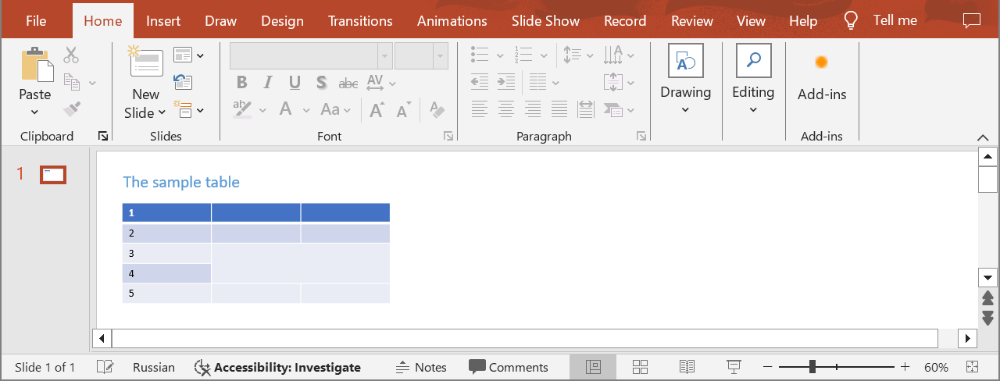
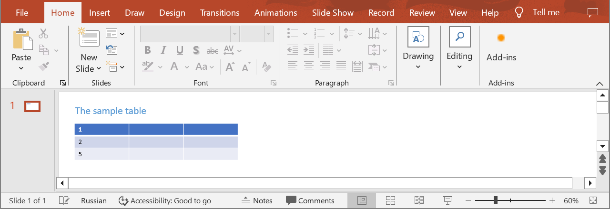

## **Introduction**

Aspose.Slides Cloud API provides you with the ability to efficiently manage table content in PowerPoint presentations, including deleting rows. This functionality allows you to simplify the process of updating and editing data directly within the slides. Use the following method to delete rows from a table.

## **DeleteTableRow**

### **API Information**

|**API**|**Type**|**Description**|**Resource**|
| :- | :- | :- | :- |
|/slides/{name}/slides/{slideIndex}/shapes/{shapeIndex}/rows/{rowIndex}|DELETE|Deletes a table row in a presentation saved in a storage.|[DeleteTableRow](https://reference.aspose.cloud/slides/#/Table/DeleteTableRow)|

**Request Parameters**

|**Name**|**Type**|**Location**|**Required**|**Description**|
| :- | :- | :- | :- | :- |
|name|string|path|true|The name of a presentation file.|
|slideIndex|integer|path|true|The 1-based index of a slide.|
|shapeIndex|integer|path|true|The 1-based index of a shape (must be a table).|
|rowIndex|integer|path|true|The 1-based index of a row.|
|withAttachedRows|boolean|query|false|Specifies whether rows that share merged cells with the target row should be deleted.|
|password|string|header|false|The password to open the presentation.|
|folder|string|query|false|The path to the folder containing the presentation file.|
|storage|string|query|false|The name of the storage contaning the folder.|

### **Examples**

In the **default** storage, the document **MyPresentation.pptx** contains a table (the **second** shape) with five rows on the **first** slide. Delete the **third** row and **rows that share merged cells** with the target row.



**cURL Solution**





**Get an Access Token**

```sh
curl -X POST "https://api.aspose.cloud/connect/token" \
     -d "grant_type=client_credentials&client_id=MyClientId&client_secret=MyClientSecret" \
     -H "Content-Type: application/x-www-form-urlencoded"
```

**Delete the Row***

```sh
curl -X DELETE "https://api.aspose.cloud/v3.0/slides/MyPresentation.pptx/slides/1/shapes/2/rows/3?withAttachedRows=true" \
     -H "authorization: Bearer MyAccessToken"
```





```text
Code: 200
Returns table info.
```




**SDK Solutions**




```csharp
using System;
using Aspose.Slides.Cloud.Sdk;
using Aspose.Slides.Cloud.Sdk.Model;

class Application
{
    static void Main(string[] args)
    {
        SlidesApi slidesApi = new SlidesApi("MyClientId", "MyClientSecret");

        string fileName = "MyPresentation.pptx";
        int slideIndex = 1;
        int shapeIndex = 2;
        int rowIndex = 3;
        bool withAttachedRows = true;

        Table table = slidesApi.DeleteTableRow(fileName, slideIndex, shapeIndex, rowIndex, withAttachedRows);

        int rowCount = table.Rows.Count;
        Console.WriteLine("Number of rows: " + rowCount); // 3
    }
}
```



```java
import com.aspose.slides.ApiException;
import com.aspose.slides.api.SlidesApi;
import com.aspose.slides.model.Table;

public class Application {
    public static void main(String[] args) throws ApiException {
        SlidesApi slidesApi = new SlidesApi("MyClientId", "MyClientSecret");

        String fileName = "MyPresentation.pptx";
        int slideIndex = 1;
        int shapeIndex = 2;
        int rowIndex = 3;
        Boolean withAttachedRows = true;

        Table table = slidesApi.deleteTableRow(fileName, slideIndex, shapeIndex, rowIndex, withAttachedRows, null, null, null);

        int rowCount = table.getRows().size();
        System.out.println("Number of rows: " + rowCount); // 3
    }
}
```



```php
use Aspose\Slides\Cloud\Sdk\Api\Configuration;
use Aspose\Slides\Cloud\Sdk\Api\SlidesApi;

$configuration = new Configuration();
$configuration->setAppSid("MyClientId");
$configuration->setAppKey("MyClientSecret");

$slidesApi = new SlidesApi(null, $configuration);

$fileName = "MyPresentation.pptx";
$slideIndex = 1;
$shapeIndex = 2;
$rowIndex = 3;
$withAttachedRows = true;

$table = $slidesApi->deleteTableRow($fileName, $slideIndex, $shapeIndex, $rowIndex, $withAttachedRows);

$rowCount = count($table->getRows());
echo "Number of rows: ", $rowCount; // 3
```



```ruby
require "aspose_slides_cloud"

include AsposeSlidesCloud

configuration = Configuration.new
configuration.app_sid = "MyClientId"
configuration.app_key = "MyClientSecret"

slides_api = SlidesApi.new(configuration)

file_name = "MyPresentation.pptx"
slide_index = 1
shape_index = 2
row_index = 3
with_attached_rows = true

table = slides_api.delete_table_row(file_name, slide_index, shape_index, row_index, with_attached_rows)

row_count = table.rows.length
puts "Number of rows: #{row_count}" # 3
```



```python
from asposeslidescloud.apis import SlidesApi

slides_api = SlidesApi(None, "MyClientId", "MyClientSecret")

file_name = "MyPresentation.pptx"
slide_index = 1
shape_index = 2
row_index = 3
with_attached_rows = True

table = slides_api.delete_table_row(file_name, slide_index, shape_index, row_index, with_attached_rows)

row_count = len(table.rows)
print("Number of rows:", row_count)  # 3
```



```js
const cloudSdk = require("asposeslidescloud");

const slidesApi = new cloudSdk.SlidesApi("MyClientId", "MyClientSecret");

fileName = "MyPresentation.pptx";
slideIndex = 1;
shapeIndex = 2;
rowIndex = 3;
withAttachedRows = true;

slidesApi.deleteTableRow(fileName, slideIndex, shapeIndex, rowIndex, withAttachedRows).then(table => {
    rowCount = table.body.rows.length;
    console.log("Number of rows:", rowCount); // 3
}); 
```



```go
import (
	"fmt"

	asposeslidescloud "github.com/aspose-slides-cloud/aspose-slides-cloud-go/v24"
)

func main() {
	configuration := asposeslidescloud.NewConfiguration()
	configuration.AppSid = "MyClientId"
	configuration.AppKey = "MyClientSecret"

	slidesApi := asposeslidescloud.NewAPIClient(configuration).SlidesApi

	fileName := "MyPresentation.pptx"
	var slideIndex int32 = 1
	var shapeIndex int32 = 2
	var rowIndex int32 = 3
	withAttachedRows := true

	table, _, _ := slidesApi.DeleteTableRow(fileName, slideIndex, shapeIndex, rowIndex, &withAttachedRows, "", "", "")

	rowCount := len(table.GetRows())
	fmt.Println("Number of rows:", rowCount) // 3
}
```



```cpp
#include "asposeslidescloud/api/SlidesApi.h"

using namespace asposeslidescloud::api;

int main()
{
    std::shared_ptr<SlidesApi> slidesApi = std::make_shared<SlidesApi>(L"MyClientId", L"MyClientSecret");

    const wchar_t* fileName = L"MyPresentation.pptx";
    int slideIndex = 1;
    int shapeIndex = 2;
    int rowIndex = 3;
    bool withAttachedRows = true;

    std::shared_ptr<Table> table = slidesApi->deleteTableRow(fileName, slideIndex, shapeIndex, rowIndex, withAttachedRows).get();

    int rowCount = table->getRows().size();
    std::wcout << L"Number of rows: " << rowCount; // 3
}
```



```perl
use AsposeSlidesCloud::Configuration;
use AsposeSlidesCloud::SlidesApi;

my $configuration = AsposeSlidesCloud::Configuration->new();
$configuration->{app_sid} = "MyClientId";
$configuration->{app_key} = "MyClientSecret";

my $slides_api = AsposeSlidesCloud::SlidesApi->new(config => $configuration);

my $file_name = "MyPresentation.pptx";
my $slide_index = 1;
my $shape_index = 2;
my $row_index = 3;
my $with_attached_rows = "True";

my $table = $slides_api->delete_table_row(
    name => $file_name, slide_index => $slide_index, shape_index => $shape_index, row_index => $row_index, with_attached_rows => $with_attached_rows);

my $row_count = @{$table->{rows}};
print "Number of rows: $row_count"; # 3
```




The result:



## **SDKs**

Check [Available SDKs](/slides/available-sdks/) to learn how to add an SDK to your project.
