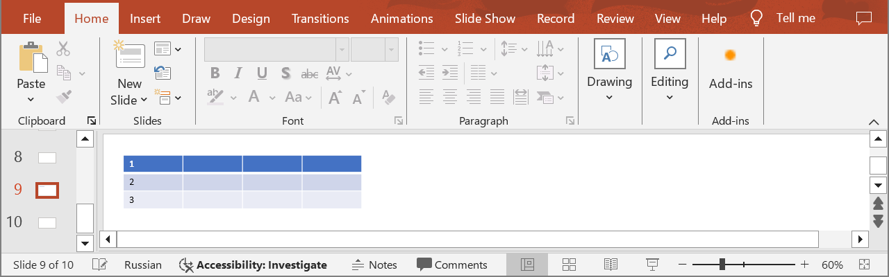
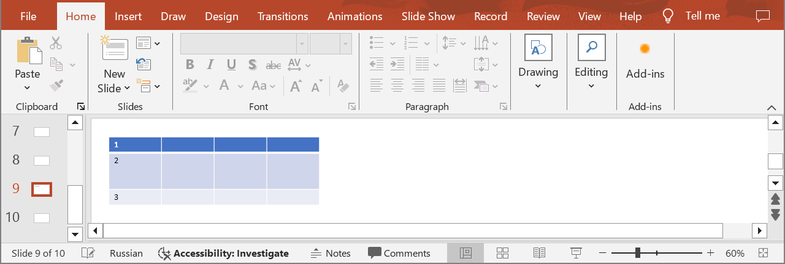

## **Introduction**

Aspose.Slides Cloud API provides you with the ability to efficiently manage table content in PowerPoint presentations, including updating rows. Using the following method, you can update row and cell properties such as row height, cell text, cell border style, text style, etc.

## **UpdateTableRow**

### **API Information**

|**API**|**Type**|**Description**|**Resource**|
| :- | :- | :- | :- |
|/slides/{name}/slides/{slideIndex}/shapes/{shapeIndex}/rows/{rowIndex}|PUT|Updates a table row in a presentation saved in a storage.|[UpdateTableRow](https://reference.aspose.cloud/slides/#/Table/UpdateTableRow)|

**Request Parameters**

|**Name**|**Type**|**Location**|**Required**|**Description**|
| :- | :- | :- | :- | :- |
|name|string|path|true|The name of a presentation file.|
|slideIndex|integer|path|true|The 1-based index of a slide.|
|shapeIndex|integer|path|true|The 1-based index of a shape (must be a table).|
|rowIndex|integer|path|true|The 1-based index of a row.|
|dto|`TableRow`|body|true|The data transfer object with row parameters.|
|password|string|header|false|The password to open the presentation.|
|folder|string|query|false|The path to the folder containing the presentation file.|
|storage|string|query|false|The name of the storage contaning the folder.|

### **Examples**

In the **default** storage, the document **MyPresentation.pptx** contains a table (the **first** shape) with three rows on the **ninth** slide. Set the minimum height for the **second** row to **50**.



**cURL Solution**





**Get an Access Token**

```sh
curl -X POST "https://api.aspose.cloud/connect/token" \
     -d "grant_type=client_credentials&client_id=MyClientId&client_secret=MyClientSecret" \
     -H "Content-Type: application/x-www-form-urlencoded"
```

**Update the Row**

```sh
curl -X PUT "https://api.aspose.cloud/v3.0/slides/MyPresentation.pptx/slides/9/shapes/1/rows/2" \
     -H "authorization: Bearer MyAccessToken" \
     -H "Content-Type: application/json" \
     -d @TableRow.json
```

TableRow.json content:
```json
{
    "minimalHeight": 50
}
```



```text
Code: 200
Returns table row info.
```




**SDK Solutions**




```csharp
using System;
using Aspose.Slides.Cloud.Sdk;
using Aspose.Slides.Cloud.Sdk.Model;

class Application
{
    static void Main(string[] args)
    {
        SlidesApi slidesApi = new SlidesApi("MyClientId", "MyClientSecret");

        string fileName = "MyPresentation.pptx";
        int slideIndex = 9;
        int shapeIndex = 1;
        int rowIndex = 2;

        TableRow tableRow = new TableRow
        {
            MinimalHeight = 50
        };

        TableRow updatedRow = slidesApi.UpdateTableRow(fileName, slideIndex, shapeIndex, rowIndex, tableRow);

        Console.WriteLine("Minimum row height: " + updatedRow.MinimalHeight); // 50
    }
}
```



```java
import com.aspose.slides.ApiException;
import com.aspose.slides.api.SlidesApi;
import com.aspose.slides.model.TableRow;

public class Application {
    public static void main(String[] args) throws ApiException {
        SlidesApi slidesApi = new SlidesApi("MyClientId", "MyClientSecret");

        String fileName = "MyPresentation.pptx";
        int slideIndex = 9;
        int shapeIndex = 1;
        int rowIndex = 2;

        TableRow tableRow = new TableRow();
        tableRow.setMinimalHeight(50.0);

        TableRow updatedRow = slidesApi.updateTableRow(fileName, slideIndex, shapeIndex, rowIndex, tableRow, null, null, null);

        System.out.println("Minimum row height: " + updatedRow.getMinimalHeight()); // 50
    }
}
```



```php
use Aspose\Slides\Cloud\Sdk\Api\Configuration;
use Aspose\Slides\Cloud\Sdk\Api\SlidesApi;
use Aspose\Slides\Cloud\Sdk\Model\TableRow;

$configuration = new Configuration();
$configuration->setAppSid("MyClientId");
$configuration->setAppKey("MyClientSecret");

$slidesApi = new SlidesApi(null, $configuration);

$fileName = "MyPresentation.pptx";
$slideIndex = 9;
$shapeIndex = 1;
$rowIndex = 2;

$tableRow = new TableRow();
$tableRow->setMinimalHeight(50);

$updatedRow = $slidesApi->updateTableRow($fileName, $slideIndex, $shapeIndex, $rowIndex, $tableRow);

print("Minimum row height: " . $updatedRow->getMinimalHeight()); // 50
```



```ruby
require "aspose_slides_cloud"

include AsposeSlidesCloud

configuration = Configuration.new
configuration.app_sid = "MyClientId"
configuration.app_key = "MyClientSecret"

slides_api = SlidesApi.new(configuration)

file_name = "MyPresentation.pptx"
slide_index = 9
shape_index = 1
row_index = 2

table_row = TableRow.new
table_row.minimal_height = 50

updated_row = slides_api.update_table_row(file_name, slide_index, shape_index, row_index, table_row)

puts "Minimum row height: #{updated_row.minimal_height}" # 50
```



```python
from asposeslidescloud.apis import SlidesApi
from asposeslidescloud.models import TableRow

slides_api = SlidesApi(None, "MyClientId", "MyClientSecret")

file_name = "MyPresentation.pptx"
slide_index = 9
shape_index = 1
row_index = 2

table_row = TableRow()
table_row.minimal_height = 50

updated_row = slides_api.update_table_row(file_name, slide_index, shape_index, row_index, table_row)

print("Minimum row height:", updated_row.minimal_height)  # 50
```



```javascript
const cloudSdk = require("asposeslidescloud");

const slidesApi = new cloudSdk.SlidesApi("MyClientId", "MyClientSecret");

fileName = "MyPresentation.pptx";
slideIndex = 9;
shapeIndex = 1;
rowIndex = 2;
            
tableRow = new cloudSdk.TableRow();
tableRow.minimalHeight = 50;

slidesApi.updateTableRow(fileName, slideIndex, shapeIndex, rowIndex, tableRow).then(updatedRow => {
    console.log("Minimum row height:", updatedRow.body.minimalHeight); // 50
});
```



```go
import (
	"fmt"

	asposeslidescloud "github.com/aspose-slides-cloud/aspose-slides-cloud-go/v24"
)

func main() {
	configuration := asposeslidescloud.NewConfiguration()
	configuration.AppSid = "MyClientId"
	configuration.AppKey = "MyClientSecret"

	slidesApi := asposeslidescloud.NewAPIClient(configuration).SlidesApi

	fileName := "MyPresentation.pptx"
	var slideIndex int32 = 9
	var shapeIndex int32 = 1
	var rowIndex int32 = 2

	tableRow := asposeslidescloud.NewTableRow()
	tableRow.MinimalHeight = 50

	updatedRow, _, _ := slidesApi.UpdateTableRow(fileName, slideIndex, shapeIndex, rowIndex, tableRow, "", "", "")

	fmt.Println("Minimum row height:", updatedRow.GetMinimalHeight()) // 50
}
```



```cpp
#include "asposeslidescloud/api/SlidesApi.h"

using namespace asposeslidescloud::api;

int main()
{
    std::shared_ptr<SlidesApi> slidesApi = std::make_shared<SlidesApi>(L"MyClientId", L"MyClientSecret");

    const wchar_t* fileName = L"MyPresentation.pptx";
    int slideIndex = 9;
    int shapeIndex = 1;
    int rowIndex = 2;

    std::shared_ptr<TableRow> tableRow = std::make_shared<TableRow>();
    tableRow->setMinimalHeight(50);

    std::shared_ptr<TableRow> updatedRow = slidesApi->updateTableRow(fileName, slideIndex, shapeIndex, rowIndex, tableRow).get();

    std::wcout << L"Minimum row height: " << updatedRow->getMinimalHeight(); // 50
}
```



```perl
use AsposeSlidesCloud::Configuration;
use AsposeSlidesCloud::SlidesApi;
use AsposeSlidesCloud::Object::TableRow;

my $configuration = AsposeSlidesCloud::Configuration->new();
$configuration->{app_sid} = "MyClientId";
$configuration->{app_key} = "MyClientSecret";

my $slides_api = AsposeSlidesCloud::SlidesApi->new(config => $configuration);

my $file_name = "MyPresentation.pptx";
my $slide_index = 9;
my $shape_index = 1;
my $row_index = 2;

my $table_row = AsposeSlidesCloud::Object::TableRow->new();
$table_row->{minimal_height} = 50;

my $updated_row = $slides_api->update_table_row(
    name => $file_name, slide_index => $slide_index, shape_index => $shape_index, row_index => $row_index, dto => $table_row);

print "Minimum row height: ", $updated_row->{minimal_height}; # 50
```




The result:



## **SDKs**

Check [Available SDKs](/slides/available-sdks/) to learn how to add an SDK to your project.
