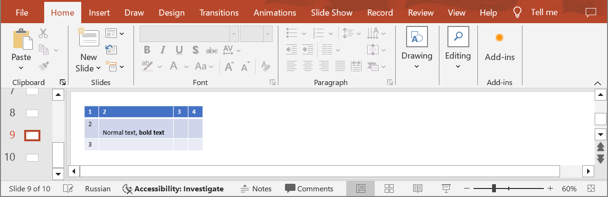

## **Introduction**

In PowerPoint table cells, you can add and change text, change the font, size, color, and style of the text, as well as adjust the alignment within the cells. Use the following method to add text to table cells.

## **CreateTableCellParagraph**

### **API Information**

|**API**|**Type**|**Description**|**Resource**|
| :- | :- | :- | :- |
|/slides/{name}/slides/{slideIndex}/shapes/{shapeIndex}/rows/{rowIndex}/cells/{cellIndex}/paragraphs|POST|Adds a new paragraph to a table cell in a presentation saved in a storage.|[CreateTableCellParagraph](https://reference.aspose.cloud/slides/#/Table/CreateTableCellParagraph)|

**Request Parameters**

|**Name**|**Type**|**Location**|**Required**|**Description**|
| :- | :- | :- | :- | :- |
|name|string|path|true|The name of a presentation file.|
|slideIndex|integer|path|true|The 1-based index of a slide.|
|shapeIndex|integer|path|true|The 1-based index of a shape (must be a table).|
|rowIndex|integer|path|true|The 1-based index of a row.|
|cellIndex|integer|path|true|The 1-based index of a cell.|
|dto|`Paragraph`|body|true|The data transfer object with paragraph properties.|
|password|string|header|false|The password to open the presentation.|
|folder|string|query|false|The path to the folder containing the presentation file.|
|storage|string|query|false|The name of the storage contaning the folder.|

### **Examples**

In the **default** storage, the document **MyPresentation.pptx** contains a table (the **first** shape) with four columns and three rows on the **ninth** slide. Add **normal and bold text** to the cell **(2, 2)**. Set the **default font height** for cell text to **12**.


**cURL Solution**




**Get an Access Token**

```sh
curl -X POST "https://api.aspose.cloud/connect/token" \
     -d "grant_type=client_credentials&client_id=MyClientId&client_secret=MyClientSecret" \
     -H "Content-Type: application/x-www-form-urlencoded"
```

**Add the Paragraph**

```sh
curl -X POST "https://api.aspose.cloud/v3.0/slides/MyPresentation.pptx/slides/9/shapes/1/rows/2/cells/2/paragraphs" \
     -H "authorization: Bearer MyAccessToken" \
     -H "Content-Type: application/json" \
     -d @Paragraph.json
```

Paragraph.json content:
```json
{
  "DefaultPortionFormat": {
    "FontHeight": 12
  },
  "PortionList": [
    {
      "Text": "Normal text, "
    },
    {
      "Text": "bold text",
      "FontBold": "True"
    }
  ]
}
```




**Response Example**
```json
{
  "portionList": [
    {
      "text": "Normal text, ",
      "highlightColor": "#0",
      "fontHeight": "NaN",
      "selfUri": {
        "href": "https://api.aspose.cloud/v3.0/slides/MyPresentation.pptx/slides/9/shapes/1/rows/3/cells/3/paragraphs/2/portions/1",
        "relation": "self",
        "slideIndex": 9,
        "shapeIndex": 1
      }
    },
    {
      "text": "bold text",
      "fontBold": "True",
      "highlightColor": "#0",
      "fontHeight": "NaN",
      "selfUri": {
        "href": "https://api.aspose.cloud/v3.0/slides/MyPresentation.pptx/slides/9/shapes/1/rows/3/cells/3/paragraphs/2/portions/2",
        "relation": "self",
        "slideIndex": 9,
        "shapeIndex": 1
      }
    }
  ],
  "defaultPortionFormat": {
    "highlightColor": "#0",
    "fontHeight": 12
  },
  "selfUri": {
    "href": "https://api.aspose.cloud/v3.0/slides/MyPresentation.pptx/slides/9/shapes/1/rows/3/cells/3/paragraphs/2",
    "relation": "self",
    "slideIndex": 9,
    "shapeIndex": 1
  }
}
```




**SDK Solutions**




```csharp
using System;
using System.Collections.Generic;
using Aspose.Slides.Cloud.Sdk;
using Aspose.Slides.Cloud.Sdk.Model;

class Application
{
    static void Main(string[] args)
    {
        SlidesApi slidesApi = new SlidesApi("MyClientId", "MyClientSecret");

        string fileName = "MyPresentation.pptx";
        int slideIndex = 9;
        int shapeIndex = 1;
        int rowIndex = 2;
        int cellIndex = 2;

        Paragraph paragraph = new Paragraph
        {
            DefaultPortionFormat = new PortionFormat
            { 
                FontHeight = 12
            },
            PortionList = new List<Portion>
            {
                new Portion 
                {
                    Text = "Normal text, "
                },
                new Portion
                {
                    Text = "bold text",
                    FontBold = Portion.FontBoldEnum.True
                }
            }
        };

        Paragraph response = slidesApi.CreateTableCellParagraph(fileName, slideIndex, shapeIndex, rowIndex, cellIndex, paragraph);

        Console.WriteLine("The paragraph has been created.");
    }
}
```



```java
import com.aspose.slides.ApiException;
import com.aspose.slides.api.SlidesApi;
import com.aspose.slides.model.Paragraph;
import com.aspose.slides.model.Portion;
import com.aspose.slides.model.PortionFormat;

import java.util.Arrays;

public class Application {
    public static void main(String[] args) throws ApiException {
        SlidesApi slidesApi = new SlidesApi("MyClientId", "MyClientSecret");

        String fileName = "MyPresentation.pptx";
        int slideIndex = 9;
        int shapeIndex = 1;
        int rowIndex = 2;
        int cellIndex = 2;

        PortionFormat portionFormat = new PortionFormat();
        portionFormat.setFontHeight(12.0);

        Portion portion1 = new Portion();
        portion1.setText("Normal text, ");

        Portion portion2 = new Portion();
        portion2.setText("bold text");
        portion2.setFontBold(Portion.FontBoldEnum.TRUE);

        Paragraph paragraph = new Paragraph();
        paragraph.setDefaultPortionFormat(portionFormat);
        paragraph.setPortionList(Arrays.asList(portion1, portion2));

        Paragraph response = slidesApi.createTableCellParagraph(fileName, slideIndex, shapeIndex, rowIndex, cellIndex, paragraph, null, null, null);

        System.out.println("The paragraph has been created.");
    }
}
```



```php
use Aspose\Slides\Cloud\Sdk\Api\Configuration;
use Aspose\Slides\Cloud\Sdk\Api\SlidesApi;
use Aspose\Slides\Cloud\Sdk\Model\PortionFormat;
use Aspose\Slides\Cloud\Sdk\Model\Portion;
use Aspose\Slides\Cloud\Sdk\Model\Paragraph;

$configuration = new Configuration();
$configuration->setAppSid("MyClientId");
$configuration->setAppKey("MyClientSecret");

$slidesApi = new SlidesApi(null, $configuration);

$fileName = "MyPresentation.pptx";
$slideIndex = 9;
$shapeIndex = 1;
$rowIndex = 2;
$cellIndex = 2;

$portionFormat = new PortionFormat();
$portionFormat->setFontHeight(12);

$portion1 = new Portion();
$portion1->setText("Normal text, ");

$portion2 = new Portion();
$portion2->setText("bold text");
$portion2->setFontBold(PortionFormat::FONT_BOLD_TRUE);

$paragraph = new Paragraph();
$paragraph->setDefaultPortionFormat($portionFormat);
$paragraph->setPortionList([$portion1, $portion2]);

$response = $slidesApi->createTableCellParagraph($fileName, $slideIndex, $shapeIndex, $rowIndex, $cellIndex, $paragraph);

print("The paragraph has been created.");
```



```ruby
require "aspose_slides_cloud"

include AsposeSlidesCloud

configuration = Configuration.new
configuration.app_sid = "MyClientId"
configuration.app_key = "MyClientSecret"

slides_api = SlidesApi.new(configuration)

file_name = "MyPresentation.pptx"
slide_index = 9
shape_index = 1
row_index = 2
cell_index = 2

portion_format = PortionFormat.new
portion_format.font_height = 12

portion1 = AsposeSlidesCloud::Portion.new
portion1.text = "Normal text, "

portion2 = AsposeSlidesCloud::Portion.new
portion2.text = "bold text"
portion2.font_bold = "True"

paragraph = AsposeSlidesCloud::Paragraph.new
paragraph.default_portion_format = portion_format
paragraph.portion_list = [portion1, portion2]

response = slides_api.create_table_cell_paragraph(file_name, slide_index, shape_index, row_index, cell_index, paragraph)
print "The paragraph has been created."
```



```python
from asposeslidescloud.apis import SlidesApi
from asposeslidescloud.models import PortionFormat
from asposeslidescloud.models import Portion
from asposeslidescloud.models import Paragraph

slides_api = SlidesApi(None, "MyClientId", "MyClientSecret")

file_name = "MyPresentation.pptx"
slide_index = 9
shape_index = 1
row_index = 2
cell_index = 2

portion_format = PortionFormat()
portion_format.font_height = 12

portion1 = Portion()
portion1.text = "Normal text, "

portion2 = Portion()
portion2.text = "bold text"
portion2.font_bold = "True"

paragraph = Paragraph()
paragraph.default_portion_format = portion_format
paragraph.portion_list = [portion1, portion2]

response = slides_api.create_table_cell_paragraph(file_name, slide_index, shape_index, row_index, cell_index, paragraph)

print("The paragraph has been created.")
```



```js
const cloudSdk = require("asposeslidescloud");

const slidesApi = new cloudSdk.SlidesApi("MyClientId", "MyClientSecret");

fileName = "MyPresentation.pptx";
slideIndex = 9;
shapeIndex = 1;
rowIndex = 2;
cellIndex = 2;
           
portionFormat = new cloudSdk.PortionFormat();
portionFormat.fontHeight = 12;

portion1 = new cloudSdk.Portion();
portion1.text = "Normal text, ";

portion2 = new cloudSdk.Portion();
portion2.text = "bold text";
portion2.fontBold = cloudSdk.Portion.FontBoldEnum.True;            

paragraph = new cloudSdk.Paragraph();
paragraph.defaultPortionFormat = portionFormat;
paragraph.portionList = [portion1, portion2];

slidesApi.createTableCellParagraph(fileName, slideIndex, shapeIndex, rowIndex, cellIndex, paragraph).then(response => {
    console.log("The paragraph has been created.");
});
```



```go
import (
	"fmt"

	asposeslidescloud "github.com/aspose-slides-cloud/aspose-slides-cloud-go/v24"
)

func main() {
	configuration := asposeslidescloud.NewConfiguration()
	configuration.AppSid = "MyClientId"
	configuration.AppKey = "MyClientSecret"

	slidesApi := asposeslidescloud.NewAPIClient(configuration).SlidesApi

	fileName := "MyPresentation.pptx"
	var slideIndex int32 = 9
	var shapeIndex int32 = 1
	var rowIndex int32 = 2
	var cellIndex int32 = 2

	portionFormat := asposeslidescloud.NewPortionFormat()
	portionFormat.FontHeight = 12

	portion1 := asposeslidescloud.NewPortion()
	portion1.Text = "Normal text, "

	portion2 := asposeslidescloud.NewPortion()
	portion2.Text = "bold text"
	portion2.FontBold = "True"

	paragraph := asposeslidescloud.NewParagraph()
	paragraph.DefaultPortionFormat = portionFormat
	paragraph.PortionList = []asposeslidescloud.IPortion{portion1, portion2}

	slidesApi.CreateTableCellParagraph(fileName, slideIndex, shapeIndex, rowIndex, cellIndex, paragraph, "", "", "")

	fmt.Println("The paragraph has been created.")
}
```



```cpp
#include "asposeslidescloud/api/SlidesApi.h"

using namespace asposeslidescloud::api;

int main()
{
    std::shared_ptr<SlidesApi> slidesApi = std::make_shared<SlidesApi>(L"MyClientId", L"MyClientSecret");

    const wchar_t* fileName = L"MyPresentation.pptx";
    int slideIndex = 9;
    int shapeIndex = 1;
    int rowIndex = 2;
    int cellIndex = 2;

    std::shared_ptr<PortionFormat> portionFormat = std::make_shared<PortionFormat>();
    portionFormat->setFontHeight(12);

    std::shared_ptr<Portion> portion1 = std::make_shared<Portion>();
    portion1->setText(L"Normal text, ");

    std::shared_ptr<Portion> portion2 = std::make_shared<Portion>();
    portion2->setText(L"bold text");
    portion2->setFontBold(L"True");

    std::shared_ptr<Paragraph> paragraph = std::make_shared<Paragraph>();
    paragraph->setDefaultPortionFormat(portionFormat);
    paragraph->setPortionList({ portion1, portion2 });

    std::shared_ptr<Paragraph> response = slidesApi->createTableCellParagraph(fileName, slideIndex, shapeIndex, rowIndex, cellIndex, paragraph).get();

    std::wcout << L"The paragraph has been created.";
}
```



```perl
use AsposeSlidesCloud::Configuration;
use AsposeSlidesCloud::SlidesApi;
use AsposeSlidesCloud::Object::PortionFormat;
use AsposeSlidesCloud::Object::Portion;
use AsposeSlidesCloud::Object::Paragraph;

my $configuration = AsposeSlidesCloud::Configuration->new();
$configuration->{app_sid} = "MyClientId";
$configuration->{app_key} = "MyClientSecret";

my $slides_api = AsposeSlidesCloud::SlidesApi->new(config => $configuration);

my $file_name = "MyPresentation.pptx";
my $slide_index = 9;
my $shape_index = 1;
my $row_index = 2;
my $cell_index = 2;

my $portion_format = AsposeSlidesCloud::Object::PortionFormat->new();
$portion_format->{font_height} = 12;

my $portion1 = AsposeSlidesCloud::Object::Portion->new();
$portion1->{text} = "Normal text, ";

my $portion2 = AsposeSlidesCloud::Object::Portion->new();
$portion2->{text} = "bold text";
$portion2->{font_bold} = "True";

my $paragraph = AsposeSlidesCloud::Object::Paragraph->new();
$paragraph->{default_portion_format} = $portion_format;
$paragraph->{portion_list} = [$portion1, $portion2];

my $response = $slides_api->create_table_cell_paragraph(
    name => $file_name, slide_index => $slide_index, shape_index => $shape_index, row_index => $row_index, cell_index => $cell_index, dto => $paragraph); 

print "The paragraph has been created.";
```




The result:



{} 
Note that by default table cells have a blank paragraph.
{}

## **SDKs**

Check [Available SDKs](/slides/available-sdks/) to learn how to add an SDK to your project.
