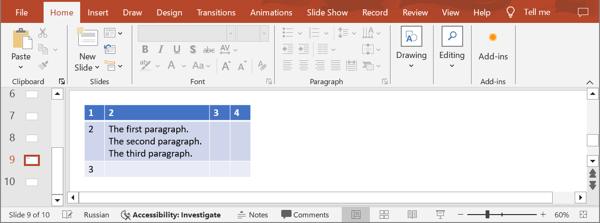

## **Introduction**

In PowerPoint table cells, you can add and change text, change the font, size, color, and style of the text, as well as adjust the alignment within the cells. Use the following methods to get information about paragraphs from table cells.

## **GetTableCellParagraphs**

### **API Information**

|**API**|**Type**|**Description**|**Resource**|
| :- | :- | :- | :- |
|/slides/{name}/slides/{slideIndex}/shapes/{shapeIndex}/rows/{rowIndex}/cells/{cellIndex}/paragraphs|GET|Returns information about paragraphs from a table cell in a presentation saved in a storage.|[GetTableCellParagraphs](https://reference.aspose.cloud/slides/#/Table/GetTableCellParagraphs)|

**Request Parameters**

|**Name**|**Type**|**Location**|**Required**|**Description**|
| :- | :- | :- | :- | :- |
|name|string|path|true|The name of a presentation file.|
|slideIndex|integer|path|true|The 1-based index of a slide.|
|shapeIndex|integer|path|true|The 1-based index of a shape (must be a table).|
|rowIndex|integer|path|true|The 1-based index of a row.|
|cellIndex|integer|path|true|The 1-based index of a cell.|
|password|string|header|false|The password to open the presentation.|
|folder|string|query|false|The path to the folder containing the presentation file.|
|storage|string|query|false|The name of the storage contaning the folder.|

### **Examples**

In the **default** storage, the document **MyPresentation.pptx** contains a table (the **first** shape) with four columns and three rows on the **ninth** slide. Get information about paragraphs from the cell **(2, 2)**.



**cURL Solution**




**Get an Access Token**
```sh
curl -X POST "https://api.aspose.cloud/connect/token" \
     -d "grant_type=client_credentials&client_id=MyClientId&client_secret=MyClientSecret" \
     -H "Content-Type: application/x-www-form-urlencoded"
```

**Get Information about Paragraphs**
```sh
curl -X GET "https://api.aspose.cloud/v3.0/slides/MyPresentation.pptx/slides/9/shapes/1/rows/2/cells/2/paragraphs" \
     -H "authorization: Bearer MyAccessToken"
```



**Response Example**
```json
{
  "paragraphLinks": [
    {
      "href": "https://api.aspose.cloud/v3.0/slides/MyPresentation.pptx/slides/9/shapes/1/rows/3/cells/3/paragraphs/1",
      "relation": "self",
      "slideIndex": 9,
      "shapeIndex": 1
    },
    {
      "href": "https://api.aspose.cloud/v3.0/slides/MyPresentation.pptx/slides/9/shapes/1/rows/3/cells/3/paragraphs/2",
      "relation": "self",
      "slideIndex": 9,
      "shapeIndex": 1
    },
    {
      "href": "https://api.aspose.cloud/v3.0/slides/MyPresentation.pptx/slides/9/shapes/1/rows/3/cells/3/paragraphs/3",
      "relation": "self",
      "slideIndex": 9,
      "shapeIndex": 1
    }
  ],
  "selfUri": {
    "href": "https://api.aspose.cloud/v3.0/slides/MyPresentation.pptx/slides/9/shapes/1/rows/3/cells/3/paragraphs",
    "relation": "self",
    "slideIndex": 9,
    "shapeIndex": 1
  }
}
```




**SDK Solutions**




```cs
using System;
using Aspose.Slides.Cloud.Sdk;
using Aspose.Slides.Cloud.Sdk.Model;

class Application
{
    static void Main(string[] args)
    {
        SlidesApi slidesApi = new SlidesApi("MyClientId", "MyClientSecret");

        string fileName = "MyPresentation.pptx";
        int slideIndex = 9;
        int shapeIndex = 1;
        int rowIndex = 2;
        int cellIndex = 2;

        Paragraphs paragraphs = slidesApi.GetTableCellParagraphs(fileName, slideIndex, shapeIndex, rowIndex, cellIndex);

        int paragraphCount = paragraphs.ParagraphLinks.Count;
        Console.WriteLine("Number of paragraphs: " + paragraphCount); // 3
    }
}
```



```java
import com.aspose.slides.ApiException;
import com.aspose.slides.api.SlidesApi;
import com.aspose.slides.model.Paragraphs;

public class Application {
    public static void main(String[] args) throws ApiException {
        SlidesApi slidesApi = new SlidesApi("MyClientId", "MyClientSecret");

        String fileName = "MyPresentation.pptx";
        int slideIndex = 9;
        int shapeIndex = 1;
        int rowIndex = 2;
        int cellIndex = 2;

        Paragraphs paragraphs = slidesApi.getTableCellParagraphs(fileName, slideIndex, shapeIndex, rowIndex, cellIndex, null, null, null);

        int paragraphCount = paragraphs.getParagraphLinks().size();
        System.out.println("Number of paragraphs: " + paragraphCount); // 3
    }
}
```



```php
use Aspose\Slides\Cloud\Sdk\Api\Configuration;
use Aspose\Slides\Cloud\Sdk\Api\SlidesApi;

$configuration = new Configuration();
$configuration->setAppSid("MyClientId");
$configuration->setAppKey("MyClientSecret");

$slidesApi = new SlidesApi(null, $configuration);

$fileName = "MyPresentation.pptx";
$slideIndex = 9;
$shapeIndex = 1;
$rowIndex = 2;
$cellIndex = 2;

$paragraphs = $slidesApi->getTableCellParagraphs($fileName, $slideIndex, $shapeIndex, $rowIndex, $cellIndex);

$paragraphCount = count($paragraphs->getParagraphLinks());
print("Number of paragraphs: " . $paragraphCount); // 3
```



```rb
require "aspose_slides_cloud"

include AsposeSlidesCloud

configuration = Configuration.new
configuration.app_sid = "MyClientId"
configuration.app_key = "MyClientSecret"

slides_api = SlidesApi.new(configuration)

file_name = "MyPresentation.pptx"
slide_index = 9
shape_index = 1
row_index = 2
cell_index = 2

paragraphs = slides_api.get_table_cell_paragraphs(file_name, slide_index, shape_index, row_index, cell_index)

paragraph_count = paragraphs.paragraph_links.length
puts "Number of paragraphs: #{paragraph_count}" # 3
```



```py
from asposeslidescloud.apis import SlidesApi

slides_api = SlidesApi(None, "MyClientId", "MyClientSecret")

file_name = "MyPresentation.pptx"
slide_index = 9
shape_index = 1
row_index = 2
cell_index = 2

paragraphs = slides_api.get_table_cell_paragraphs(file_name, slide_index, shape_index, row_index, cell_index)

paragraph_count = len(paragraphs.paragraph_links)
print("Number of paragraphs:", paragraph_count)  # 3
```



```js
const cloudSdk = require("asposeslidescloud");

const slidesApi = new cloudSdk.SlidesApi("MyClientId", "MyClientSecret");

fileName = "MyPresentation.pptx";
slideIndex = 9;
shapeIndex = 1;
rowIndex = 2;
cellIndex = 2;

slidesApi.getTableCellParagraphs(fileName, slideIndex, shapeIndex, rowIndex, cellIndex).then(paragraphs => {
    paragraph_count = paragraphs.body.paragraphLinks.length;
    console.log("Number of paragraphs:", paragraph_count); // 3
});
```



```go
import (
	"fmt"

	asposeslidescloud "github.com/aspose-slides-cloud/aspose-slides-cloud-go/v24"
)

func main() {
	configuration := asposeslidescloud.NewConfiguration()
	configuration.AppSid = "MyClientId"
	configuration.AppKey = "MyClientSecret"

	slidesApi := asposeslidescloud.NewAPIClient(configuration).SlidesApi

	fileName := "MyPresentation.pptx"
	var slideIndex int32 = 9
	var shapeIndex int32 = 1
	var rowIndex int32 = 2
	var cellIndex int32 = 2

	paragraphs, _, _ := slidesApi.GetTableCellParagraphs(fileName, slideIndex, shapeIndex, rowIndex, cellIndex, "", "", "")

	paragraphCount := len(paragraphs.GetParagraphLinks())
	fmt.Println("Number of paragraphs:", paragraphCount) // 3
}
```



```cpp
#include "asposeslidescloud/api/SlidesApi.h"

using namespace asposeslidescloud::api;

int main()
{
    std::shared_ptr<SlidesApi> slidesApi = std::make_shared<SlidesApi>(L"MyClientId", L"MyClientSecret");

    const wchar_t* fileName = L"MyPresentation.pptx";
    int slideIndex = 9;
    int shapeIndex = 1;
    int rowIndex = 2;
    int cellIndex = 2;

    std::shared_ptr<Paragraphs> paragraphs = slidesApi->getTableCellParagraphs(fileName, slideIndex, shapeIndex, rowIndex, cellIndex).get();

    int paragraphCount = paragraphs->getParagraphLinks().size();
    std::wcout << L"Number of paragraphs: " << paragraphCount; // 3
}
```



```perl
use AsposeSlidesCloud::Configuration;
use AsposeSlidesCloud::SlidesApi;

my $configuration = AsposeSlidesCloud::Configuration->new();
$configuration->{app_sid} = "MyClientId";
$configuration->{app_key} = "MyClientSecret";

my $slides_api = AsposeSlidesCloud::SlidesApi->new(config => $configuration);

my $file_name = "MyPresentation.pptx";
my $slide_index = 9;
my $shape_index = 1;
my $row_index = 2;
my $cell_index = 2;

my $paragraphs = $slides_api->get_table_cell_paragraphs(
    name => $file_name, slide_index => $slide_index, shape_index => $shape_index, row_index => $row_index, cell_index => $cell_index);

my $paragraph_count = @{$paragraphs->{paragraph_links}};
print "Number of paragraphs: $paragraph_count"; # 3
```




## **GetTableCellParagraph**

### **API Information**

|**API**|**Type**|**Description**|**Resource**|
| :- | :- | :- | :- |
|/slides/{name}/slides/{slideIndex}/shapes/{shapeIndex}/rows/{rowIndex}/cells/{cellIndex}/paragraphs/{paragraphIndex}|GET|Returns paragraph properties from a table cell in a presentation saved in a storage.|[GetTableCellParagraph](https://reference.aspose.cloud/slides/#/Table/GetTableCellParagraph)|

**Request Parameters**

|**Name**|**Type**|**Location**|**Required**|**Description**|
| :- | :- | :- | :- | :- |
|name|string|path|true|The name of a presentation file.|
|slideIndex|integer|path|true|The 1-based index of a slide.|
|shapeIndex|integer|path|true|The 1-based index of a shape (must be a table).|
|rowIndex|integer|path|true|The 1-based index of a row.|
|cellIndex|integer|path|true|The 1-based index of a cell.|
|paragraphIndex|integer|path|true|The 1-based index of a paragraph.|
|password|string|header|false|The password to open the presentation.|
|folder|string|query|false|The path to the folder containing the presentation file.|
|storage|string|query|false|The name of the storage contaning the folder.|

### **Examples**

In the **default** storage, the document **MyPresentation.pptx** contains a table (the **first** shape) with four columns and three rows on the **ninth** slide (see the picture above). Get properties of the **third** paragraph from the cell **(2, 2)**.

**cURL Solution**




**Get an Access Token**
```sh
curl -X POST "https://api.aspose.cloud/connect/token" \
     -d "grant_type=client_credentials&client_id=MyClientId&client_secret=MyClientSecret" \
     -H "Content-Type: application/x-www-form-urlencoded"
```

**Get the Paragraph Properties**
```sh
curl -X GET "https://api.aspose.cloud/v3.0/slides/MyPresentation.pptx/slides/9/shapes/1/rows/2/cells/2/paragraphs/3" \
     -H "authorization: Bearer MyAccessToken"
```



**Response Example**
```json
{
  "portionList": [
    {
      "text": "The third paragraph.",
      "fontBold": "False",
      "highlightColor": "#0",
      "fontHeight": 18,
      "languageId": "en-US",
      "selfUri": {
        "href": "https://api.aspose.cloud/v3.0/slides/MyPresentation.pptx/slides/9/shapes/1/rows/3/cells/3/paragraphs/3/portions/1",
        "relation": "self",
        "slideIndex": 9,
        "shapeIndex": 1
      }
    }
  ],
  "defaultPortionFormat": {
    "highlightColor": "#0",
    "fontHeight": "NaN"
  },
  "selfUri": {
    "href": "https://api.aspose.cloud/v3.0/slides/MyPresentation.pptx/slides/9/shapes/1/rows/3/cells/3/paragraphs/3",
    "relation": "self",
    "slideIndex": 9,
    "shapeIndex": 1
  }
}
```




**SDK Solutions**




```cs
using System;
using Aspose.Slides.Cloud.Sdk;
using Aspose.Slides.Cloud.Sdk.Model;

class Application
{
    static void Main(string[] args)
    {
        SlidesApi slidesApi = new SlidesApi("MyClientId", "MyClientSecret");

        string fileName = "MyPresentation.pptx";
        int slideIndex = 9;
        int shapeIndex = 1;
        int rowIndex = 2;
        int cellIndex = 2;
        int paragraphIndex = 3;

        Paragraph paragraph = slidesApi.GetTableCellParagraph(fileName, slideIndex, shapeIndex, rowIndex, cellIndex, paragraphIndex);

        int textPortionCount = paragraph.PortionList.Count;
        Console.WriteLine("Number of text portions: " + textPortionCount); // 1
    }
}
```



```java
import com.aspose.slides.ApiException;
import com.aspose.slides.api.SlidesApi;
import com.aspose.slides.model.Paragraph;

public class Application {
    public static void main(String[] args) throws ApiException {
        SlidesApi slidesApi = new SlidesApi("MyClientId", "MyClientSecret");

        String fileName = "MyPresentation.pptx";
        int slideIndex = 9;
        int shapeIndex = 1;
        int rowIndex = 2;
        int cellIndex = 2;
        int paragraphIndex = 3;

        Paragraph paragraph = slidesApi.getTableCellParagraph(fileName, slideIndex, shapeIndex, rowIndex, cellIndex, paragraphIndex, null, null, null);

        int textPortionCount = paragraph.getPortionList().size();
        System.out.println("Number of text portions: " + textPortionCount); // 1
    }
}
```



```php
use Aspose\Slides\Cloud\Sdk\Api\Configuration;
use Aspose\Slides\Cloud\Sdk\Api\SlidesApi;

$configuration = new Configuration();
$configuration->setAppSid("MyClientId");
$configuration->setAppKey("MyClientSecret");

$slidesApi = new SlidesApi(null, $configuration);

$fileName = "MyPresentation.pptx";
$slideIndex = 9;
$shapeIndex = 1;
$rowIndex = 2;
$cellIndex = 2;
$paragraphIndex = 3;

$paragraph = $slidesApi->getTableCellParagraph($fileName, $slideIndex, $shapeIndex, $rowIndex, $cellIndex, $paragraphIndex);

$textPortionCount = count($paragraph->getPortionList());
print("Number of text portions: " . $textPortionCount); // 1
```



```rb
require "aspose_slides_cloud"

include AsposeSlidesCloud

configuration = Configuration.new
configuration.app_sid = "MyClientId"
configuration.app_key = "MyClientSecret"

slides_api = SlidesApi.new(configuration)

file_name = "MyPresentation.pptx"
slide_index = 9
shape_index = 1
row_index = 2
cell_index = 2
paragraph_index = 3

paragraph = slides_api.get_table_cell_paragraph(file_name, slide_index, shape_index, row_index, cell_index, paragraph_index)

text_portion_count = paragraph.portion_list.length
puts "Number of text portions: #{text_portion_count}" # 1
```



```py
from asposeslidescloud.apis import SlidesApi

slides_api = SlidesApi(None, "MyClientId", "MyClientSecret")

file_name = "MyPresentation.pptx"
slide_index = 9
shape_index = 1
row_index = 2
cell_index = 2
paragraph_index = 3

paragraph = slides_api.get_table_cell_paragraph(file_name, slide_index, shape_index, row_index, cell_index, paragraph_index)

text_portion_count = len(paragraph.portion_list)
print("Number of text portions:", text_portion_count)  # 1
```



```js
const cloudSdk = require("asposeslidescloud");

const slidesApi = new cloudSdk.SlidesApi("MyClientId", "MyClientSecret");

fileName = "MyPresentation.pptx";
slideIndex = 9;
shapeIndex = 1;
rowIndex = 2;
cellIndex = 2;
paragraphIndex = 3;

slidesApi.getTableCellParagraph(fileName, slideIndex, shapeIndex, rowIndex, cellIndex, paragraphIndex).then(paragraph => {
    textPortionCount = paragraph.body.portionList.length;
    console.log("Number of text portions:", textPortionCount); // 1
});
```



```go
import (
	"fmt"

	asposeslidescloud "github.com/aspose-slides-cloud/aspose-slides-cloud-go/v24"
)

func main() {
	configuration := asposeslidescloud.NewConfiguration()
	configuration.AppSid = "MyClientId"
	configuration.AppKey = "MyClientSecret"

	slidesApi := asposeslidescloud.NewAPIClient(configuration).SlidesApi

	fileName := "MyPresentation.pptx"
	var slideIndex int32 = 9
	var shapeIndex int32 = 1
	var rowIndex int32 = 2
	var cellIndex int32 = 2
	var paragraphIndex int32 = 3

	paragraph, _, _ := slidesApi.GetTableCellParagraph(fileName, slideIndex, shapeIndex, rowIndex, cellIndex, paragraphIndex, "", "", "")

	textPortionCount := len(paragraph.GetPortionList())
	fmt.Println("Number of text portions:", textPortionCount) // 1
}
```



```cpp
#include "asposeslidescloud/api/SlidesApi.h"

using namespace asposeslidescloud::api;

int main()
{
    std::shared_ptr<SlidesApi> slidesApi = std::make_shared<SlidesApi>(L"MyClientId", L"MyClientSecret");

    const wchar_t* fileName = L"MyPresentation.pptx";
    int slideIndex = 9;
    int shapeIndex = 1;
    int rowIndex = 2;
    int cellIndex = 2;
    int paragraphIndex = 3;

    std::shared_ptr<Paragraph> paragraph = slidesApi->getTableCellParagraph(fileName, slideIndex, shapeIndex, rowIndex, cellIndex, paragraphIndex).get();

    int textPortionCount = paragraph->getPortionList().size();
    std::wcout << L"Number of text portions: " << textPortionCount; // 1
}
```



```perl
use AsposeSlidesCloud::Configuration;
use AsposeSlidesCloud::SlidesApi;

my $configuration = AsposeSlidesCloud::Configuration->new();
$configuration->{app_sid} = "MyClientId";
$configuration->{app_key} = "MyClientSecret";

my $slides_api = AsposeSlidesCloud::SlidesApi->new(config => $configuration);

my $file_name = "MyPresentation.pptx";
my $slide_index = 9;
my $shape_index = 1;
my $row_index = 2;
my $cell_index = 2;
my $paragraph_index = 3;

my $paragraph = $slides_api->get_table_cell_paragraph(
    name => $file_name, slide_index => $slide_index, shape_index => $shape_index, row_index => $row_index, cell_index => $cell_index, paragraph_index => $paragraph_index);

my $text_portion_count = @{$paragraph->{portion_list}};
print "Number of text portions: $text_portion_count"; # 1
```




## **SDKs**

Check [Available SDKs](/slides/available-sdks/) to learn how to add an SDK to your project.
