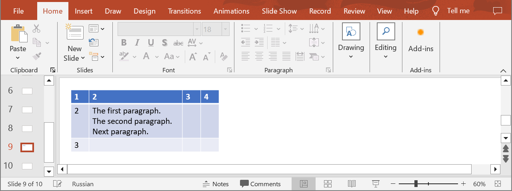
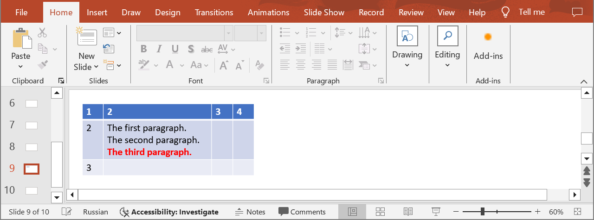

## **Introduction**

In PowerPoint table cells, you can add and change text, change the font, size, color, and style of the text, as well as adjust the alignment within the cells. Use the following method to update paragraphs in table cells.

## **UpdateTableCellParagraph**

### **API Information**

|**API**|**Type**|**Description**|**Resource**|
| :- | :- | :- | :- |
|/slides/{name}/slides/{slideIndex}/shapes/{shapeIndex}/rows/{rowIndex}/cells/{cellIndex}/paragraphs/{paragraphIndex}|PUT|Updates a paragraph in a table cell in a presentation saved in a storage.|[UpdateTableCellParagraph](https://reference.aspose.cloud/slides/#/Table/UpdateTableCellParagraph)|

**Request Parameters**

|**Name**|**Type**|**Location**|**Required**|**Description**|
| :- | :- | :- | :- | :- |
|name|string|path|true|The name of a presentation file.|
|slideIndex|integer|path|true|The 1-based index of a slide.|
|shapeIndex|integer|path|true|The 1-based index of a shape (must be a table).|
|rowIndex|integer|path|true|The 1-based index of a row.|
|cellIndex|integer|path|true|The 1-based index of a cell.|
|paragraphIndex|integer|path|true|The 1-based index of a paragraph.|
|dto|`Paragraph`|body|true|The data transfer object with paragraph properties.|
|password|string|header|false|The password to open the presentation.|
|folder|string|query|false|The path to the folder containing the presentation file.|
|storage|string|query|false|The name of the storage contaning the folder.|

### **Examples**

In the **default** storage, the document **MyPresentation.pptx** contains a table (the **first** shape) with four columns and three rows on the **ninth** slide. The cell **(2, 2)** contains three paragraphs. Update the **third** paragraph in the cell with the following properties:
- set text to "The third paragraph."
- set the font to bold
- set the font color to red



**cURL Solution**




**Get an Access Token**
```sh
curl -X POST "https://api.aspose.cloud/connect/token" \
     -d "grant_type=client_credentials&client_id=MyClientId&client_secret=MyClientSecret" \
     -H "Content-Type: application/x-www-form-urlencoded"
```

**Update the Paragraph**
```sh
curl -X PUT "https://api.aspose.cloud/v3.0/slides/MyPresentation.pptx/slides/9/shapes/1/rows/2/cells/2/paragraphs/3" \
     -H "authorization: Bearer MyAccessToken" \
     -H "Content-Type: application/json" \
     -d @Paragraph.json
```

Paragraph.json content:
```json
{
  "PortionList": [
    {
      "Text": "The third paragraph."
    }
  ],
  "DefaultPortionFormat": {
    "FontBold": "True",
    "FontColor": "#FF0000"
  }
}
```



**Response Example**
```json
{
  "portionList": [
    {
      "text": "The third paragraph.",
      "highlightColor": "#0",
      "fontHeight": "NaN",
      "selfUri": {
        "href": "https://api.aspose.cloud/v3.0/slides/MyPresentation.pptx/slides/9/shapes/1/rows/3/cells/3/paragraphs/3/portions/1",
        "relation": "self",
        "slideIndex": 9,
        "shapeIndex": 1
      }
    }
  ],
  "defaultPortionFormat": {
    "fontBold": "True",
    "fontColor": "#FFFF0000",
    "highlightColor": "#0",
    "fontHeight": "NaN",
    "fillFormat": {
      "type": "Solid",
      "color": "#FFFF0000"
    }
  },
  "selfUri": {
    "href": "https://api.aspose.cloud/v3.0/slides/MyPresentation.pptx/slides/9/shapes/1/rows/3/cells/3/paragraphs/3",
    "relation": "self",
    "slideIndex": 9,
    "shapeIndex": 1
  }
}
```




**SDK Solutions**




```cs
using System;
using System.Collections.Generic;
using Aspose.Slides.Cloud.Sdk;
using Aspose.Slides.Cloud.Sdk.Model;

class Application
{
    static void Main(string[] args)
    {
        SlidesApi slidesApi = new SlidesApi("MyClientId", "MyClientSecret");

        string fileName = "MyPresentation.pptx";
        int slideIndex = 9;
        int shapeIndex = 1;
        int rowIndex = 2;
        int cellIndex = 2;
        int paragraphIndex = 3;

        Paragraph paragraph = new Paragraph
        {
            PortionList = new List<Portion>
            {
                new Portion {Text = "The third paragraph."}
            },
            DefaultPortionFormat = new PortionFormat
            {
                FontBold = PortionFormat.FontBoldEnum.True,
                FontColor = "#FF0000"
            }
        };

        Paragraph updatedParagraph = slidesApi.UpdateTableCellParagraph(fileName, slideIndex, shapeIndex, rowIndex, cellIndex, paragraphIndex, paragraph);

        Console.WriteLine("The paragraph has been updated.");
    }
}
```



```java
import com.aspose.slides.ApiException;
import com.aspose.slides.api.SlidesApi;
import com.aspose.slides.model.Paragraph;
import com.aspose.slides.model.Portion;
import com.aspose.slides.model.PortionFormat;

import java.util.Arrays;

public class Application {
    public static void main(String[] args) throws ApiException {
        SlidesApi slidesApi = new SlidesApi("MyClientId", "MyClientSecret");

        String fileName = "MyPresentation.pptx";
        int slideIndex = 9;
        int shapeIndex = 1;
        int rowIndex = 2;
        int cellIndex = 2;
        int paragraphIndex = 3;

        Portion textPortion = new Portion();
        textPortion.setText("The third paragraph.");

        PortionFormat portionFormat = new PortionFormat();
        portionFormat.setFontBold(PortionFormat.FontBoldEnum.TRUE);
        portionFormat.setFontColor("#FF0000");

        Paragraph paragraph = new Paragraph();
        paragraph.setPortionList(Arrays.asList(textPortion));
        paragraph.setDefaultPortionFormat(portionFormat);
        
        Paragraph updatedParagraph = slidesApi.updateTableCellParagraph(fileName, slideIndex, shapeIndex, rowIndex, cellIndex, paragraphIndex, paragraph, null, null, null);

        System.out.println("The paragraph has been updated.");
    }
}
```



```php
use Aspose\Slides\Cloud\Sdk\Api\Configuration;
use Aspose\Slides\Cloud\Sdk\Api\SlidesApi;
use Aspose\Slides\Cloud\Sdk\Model\Paragraph;
use Aspose\Slides\Cloud\Sdk\Model\Portion;
use Aspose\Slides\Cloud\Sdk\Model\PortionFormat;

$configuration = new Configuration();
$configuration->setAppSid("MyClientId");
$configuration->setAppKey("MyClientSecret");

$slidesApi = new SlidesApi(null, $configuration);

$fileName = "MyPresentation.pptx";
$slideIndex = 9;
$shapeIndex = 1;
$rowIndex = 2;
$cellIndex = 2;
$paragraphIndex = 3;

$textPortion = new Portion();
$textPortion->setText("The third paragraph.");

$portionFormat = new PortionFormat();
$portionFormat->setFontBold(PortionFormat::FONT_BOLD_TRUE);
$portionFormat->setFontColor("#FF0000");

$paragraph = new Paragraph();
$paragraph->setPortionList([$textPortion]);
$paragraph->setDefaultPortionFormat($portionFormat);

$updatedParagraph = $slidesApi->updateTableCellParagraph($fileName, $slideIndex, $shapeIndex, $rowIndex, $cellIndex, $paragraphIndex, $paragraph);

print("The paragraph has been updated.");
```



```rb
require "aspose_slides_cloud"

include AsposeSlidesCloud

configuration = Configuration.new
configuration.app_sid = "MyClientId"
configuration.app_key = "MyClientSecret"

slides_api = SlidesApi.new(configuration)

file_name = "MyPresentation.pptx"
slide_index = 9
shape_index = 1
row_index = 2
cell_index = 2
paragraph_index = 3

text_portion = Portion.new
text_portion.text = "The third paragraph."

portion_format = PortionFormat.new
portion_format.font_bold = "True"
portion_format.font_color = "#FF0000"

paragraph = Paragraph.new
paragraph.portion_list = [text_portion]
paragraph.default_portion_format = portion_format

updated_paragraph = slides_api.update_table_cell_paragraph(file_name, slide_index, shape_index, row_index, cell_index, paragraph_index, paragraph)

print "The paragraph has been updated."
```



```py
from asposeslidescloud.apis import SlidesApi
from asposeslidescloud.models import Paragraph
from asposeslidescloud.models import Portion
from asposeslidescloud.models import PortionFormat

slides_api = SlidesApi(None, "MyClientId", "MyClientSecret")

file_name = "MyPresentation.pptx"
slide_index = 9
shape_index = 1
row_index = 2
cell_index = 2
paragraph_index = 3

text_portion = Portion()
text_portion.text = "The third paragraph."

portion_format = PortionFormat()
portion_format.font_bold = "True"
portion_format.font_color = "#FF0000"

paragraph = Paragraph()
paragraph.portion_list = [text_portion]
paragraph.default_portion_format = portion_format

updated_paragraph = slides_api.update_table_cell_paragraph(file_name, slide_index, shape_index, row_index, cell_index, paragraph_index, paragraph)

print("The paragraph has been updated.")
```



```js
const cloudSdk = require("asposeslidescloud");

const slidesApi = new cloudSdk.SlidesApi("MyClientId", "MyClientSecret");

fileName = "MyPresentation.pptx";
slideIndex = 9;
shapeIndex = 1;
rowIndex = 2;
cellIndex = 2;
paragraphIndex = 3;

textPortion = new cloudSdk.Portion();
textPortion.text = "The third paragraph.";

portionFormat = new cloudSdk.PortionFormat();
portionFormat.fontBold = cloudSdk.PortionFormat.FontBoldEnum.True;
portionFormat.fontColor = "#FF0000";

paragraph = new cloudSdk.Paragraph();
paragraph.portionList = [textPortion];
paragraph.defaultPortionFormat = portionFormat;

slidesApi.updateTableCellParagraph(fileName, slideIndex, shapeIndex, rowIndex, cellIndex, paragraphIndex, paragraph).then(updatedParagraph => {
    console.log("The paragraph has been updated.");
});
```



```go
import (
	"fmt"

	asposeslidescloud "github.com/aspose-slides-cloud/aspose-slides-cloud-go/v24"
)

func main() {
	configuration := asposeslidescloud.NewConfiguration()
	configuration.AppSid = "MyClientId"
	configuration.AppKey = "MyClientSecret"

	slidesApi := asposeslidescloud.NewAPIClient(configuration).SlidesApi

	fileName := "MyPresentation.pptx"
	var slideIndex int32 = 9
	var shapeIndex int32 = 1
	var rowIndex int32 = 2
	var cellIndex int32 = 2
	var paragraphIndex int32 = 3

	textPortion := asposeslidescloud.NewPortion()
	textPortion.Text = "The third paragraph."

	portionFormat := asposeslidescloud.NewPortionFormat()
	portionFormat.FontBold = "True"
	portionFormat.FontColor = "#FF0000"

	paragraph := asposeslidescloud.NewParagraph()
	paragraph.PortionList = []asposeslidescloud.IPortion{textPortion}
	paragraph.DefaultPortionFormat = portionFormat

	slidesApi.UpdateTableCellParagraph(fileName, slideIndex, shapeIndex, rowIndex, cellIndex, paragraphIndex, paragraph, "", "", "")

	fmt.Printf("The paragraph has been updated.")
}
```



```cpp
include "asposeslidescloud/api/SlidesApi.h"

using namespace asposeslidescloud::api;

int main()
{
    std::shared_ptr<SlidesApi> slidesApi = std::make_shared<SlidesApi>(L"MyClientId", L"MyClientSecret");

    const wchar_t* fileName = L"MyPresentation.pptx";
    int slideIndex = 9;
    int shapeIndex = 1;
    int rowIndex = 2;
    int cellIndex = 2;
    int paragraphIndex = 3;

    std::shared_ptr<Portion> textPortion = std::make_shared<Portion>();
    textPortion->setText(L"The third paragraph.");

    std::shared_ptr<PortionFormat> portionFormat = std::make_shared<PortionFormat>();
    portionFormat->setFontBold(L"True");
    portionFormat->setFontColor(L"#FF0000");

    std::shared_ptr<Paragraph> paragraph = std::make_shared<Paragraph>();
    paragraph->setPortionList({ textPortion });
    paragraph->setDefaultPortionFormat(portionFormat);

    std::shared_ptr<Paragraph> updatedParagraph = slidesApi->updateTableCellParagraph(fileName, slideIndex, shapeIndex, rowIndex, cellIndex, paragraphIndex, paragraph).get();

    std::wcout << L"The paragraph has been updated.";
}
```



```perl
use AsposeSlidesCloud::Configuration;
use AsposeSlidesCloud::SlidesApi;
use AsposeSlidesCloud::Object::Portion;
use AsposeSlidesCloud::Object::PortionFormat;
use AsposeSlidesCloud::Object::Paragraph;

my $configuration = AsposeSlidesCloud::Configuration->new();
$configuration->{app_sid} = "MyClientId";
$configuration->{app_key} = "MyClientSecret";

my $slides_api = AsposeSlidesCloud::SlidesApi->new(config => $configuration);

my $file_name = "MyPresentation.pptx";
my $slide_index = 9;
my $shape_index = 1;
my $row_index = 2;
my $cell_index = 2;
my $paragraph_index = 3;

my $text_portion = AsposeSlidesCloud::Object::Portion->new();
$text_portion->{text} = "The third paragraph.";

my $portion_format = AsposeSlidesCloud::Object::PortionFormat->new();
$portion_format->{font_bold} = "True";
$portion_format->{font_color} = "#FF0000";

my $paragraph = AsposeSlidesCloud::Object::Paragraph->new();
$paragraph->{portion_list} = [$text_portion];
$paragraph->{default_portion_format} = $portion_format;

my $updated_paragraph = $slides_api->update_table_cell_paragraph(
    name => $file_name, slide_index => $slide_index, shape_index => $shape_index, row_index => $row_index, cell_index => $cell_index, paragraph_index => $paragraph_index, dto => $paragraph);

print "The paragraph has been updated.";
```




The result:



## **SDKs**

Check [Available SDKs](/slides/available-sdks/) to learn how to add an SDK to your project.
