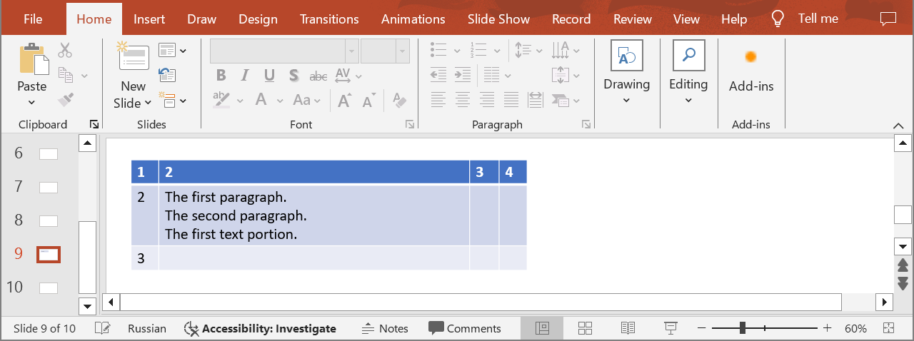
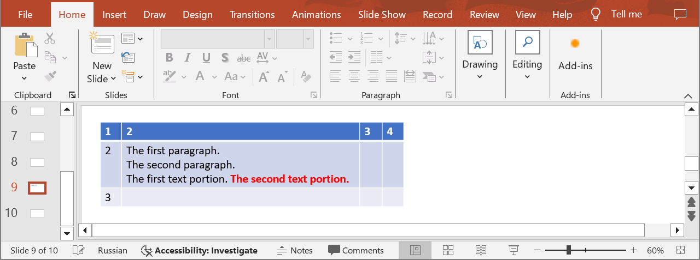

## **Introduction**

In PowerPoint table cells, you can work with individual parts of text by changing their formatting independently. For example, you can select a portion of text and change its font, size, color, or style (bold, italic, underline) without affecting the rest of the text. Use the following method to create text portions in table cells.

## **CreateTableCellPortion**

### **API Information**

|**API**|**Type**|**Description**|**Resource**|
| :- | :- | :- | :- |
|/slides/{name}/slides/{slideIndex}/shapes/{shapeIndex}/rows/{rowIndex}/cells/{cellIndex}/paragraphs/{paragraphIndex}/portions|POST|Adds a new text portion to a paragraph in a table cell in a presentation saved in a storage.|[CreateTableCellPortion](https://reference.aspose.cloud/slides/#/Table/CreateTableCellPortion)|

**Request Parameters**

|**Name**|**Type**|**Location**|**Required**|**Description**|
| :- | :- | :- | :- | :- |
|name|string|path|true|The name of a presentation file.|
|slideIndex|integer|path|true|The 1-based index of a slide.|
|shapeIndex|integer|path|true|The 1-based index of a shape (must be a table).|
|rowIndex|integer|path|true|The 1-based index of a row.|
|cellIndex|integer|path|true|The 1-based index of a cell.|
|paragraphIndex|integer|path|true|The 1-based index of a paragraph.|
|dto|`Portion`|body|true|The data transfer object with text portion properties.|
|password|string|header|false|The password to open the presentation.|
|folder|string|query|false|The path to the folder containing the presentation file.|
|storage|string|query|false|The name of the storage contaning the folder.|

### **Examples**

In the **default** storage, the document **MyPresentation.pptx** contains a table (the **first** shape) with four columns and three rows on the **ninth** slide. The cell **(2, 2)** contains three paragraphs. Add a text portion to the **third** paragraph with the following properties:
- text: " The second text portion."
- bold font
- red font color



**cURL Solution**




**Get an Access Token**
```sh
curl -X POST "https://api.aspose.cloud/connect/token" \
     -d "grant_type=client_credentials&client_id=MyClientId&client_secret=MyClientSecret" \
     -H "Content-Type: application/x-www-form-urlencoded"
```

**Add the Text Portion**
```sh
curl -X POST "https://api.aspose.cloud/v3.0/slides/MyPresentation.pptx/slides/9/shapes/1/rows/2/cells/2/paragraphs/3/portions" \
     -H "authorization: Bearer MyAccessToken" \
     -H "Content-Type: application/json" \
     -d @TextPortion.json
```

TextPortion.json content:
```json
{
  "Text": " The second text portion.",
  "FontBold": "True",
  "FontColor": "#FF0000"
}
```



```json
{
  "text": " The second text portion.",
  "fontBold": "True",
  "fontColor": "#FFFF0000",
  "highlightColor": "#0",
  "fontHeight": "NaN",
  "fillFormat": {
    "type": "Solid",
    "color": "#FFFF0000"
  },
  "selfUri": {
    "href": "https://api.aspose.cloud/v3.0/slides/MyPresentation.pptx/slides/9/shapes/1/rows/3/cells/3/paragraphs/3/portions/3",
    "relation": "self",
    "slideIndex": 9,
    "shapeIndex": 1
  }
}
```




**SDK Solutions**




```cs
using System;
using Aspose.Slides.Cloud.Sdk;
using Aspose.Slides.Cloud.Sdk.Model;

class Application
{
    static void Main(string[] args)
    {
        SlidesApi slidesApi = new SlidesApi("MyClientId", "MyClientSecret");

        string fileName = "MyPresentation.pptx";
        int slideIndex = 9;
        int shapeIndex = 1;
        int rowIndex = 2;
        int cellIndex = 2;
        int paragraphIndex = 3;

        Portion textPortion = new Portion
        { 
            Text = " The second text portion.",
            FontBold = Portion.FontBoldEnum.True,
            FontColor = "#FF0000"
        };

        Portion newPortion = slidesApi.CreateTableCellPortion(fileName, slideIndex, shapeIndex, rowIndex, cellIndex, paragraphIndex, textPortion);
        
        Console.WriteLine("The text portion has been added.");
    }
}
```



```java
import com.aspose.slides.ApiException;
import com.aspose.slides.api.SlidesApi;
import com.aspose.slides.model.Portion;

public class Application {
    public static void main(String[] args) throws ApiException {
        SlidesApi slidesApi = new SlidesApi("MyClientId", "MyClientSecret");

        String fileName = "MyPresentation.pptx";
        int slideIndex = 9;
        int shapeIndex = 1;
        int rowIndex = 2;
        int cellIndex = 2;
        int paragraphIndex = 3;

        Portion textPortion = new Portion();
        textPortion.setText(" The second text portion.");
        textPortion.setFontBold(Portion.FontBoldEnum.TRUE);
        textPortion.setFontColor("#FF0000");

        Portion newPortion = slidesApi.createTableCellPortion(fileName, slideIndex, shapeIndex, rowIndex, cellIndex, paragraphIndex, textPortion, null, null, null);

        System.out.println("The text portion has been added.");
    }
}
```



```php
use Aspose\Slides\Cloud\Sdk\Api\Configuration;
use Aspose\Slides\Cloud\Sdk\Api\SlidesApi;
use Aspose\Slides\Cloud\Sdk\Model\Portion;

$configuration = new Configuration();
$configuration->setAppSid("MyClientId");
$configuration->setAppKey("MyClientSecret");

$slidesApi = new SlidesApi(null, $configuration);

$fileName = "MyPresentation.pptx";
$slideIndex = 9;
$shapeIndex = 1;
$rowIndex = 2;
$cellIndex = 2;
$paragraphIndex = 3;

$textPortion = new Portion();
$textPortion->setText(" The second text portion.");
$textPortion->setFontBold(Portion::FONT_BOLD_TRUE);
$textPortion->setFontColor("#FF0000");

$newPortion = $slidesApi->createTableCellPortion($fileName, $slideIndex, $shapeIndex, $rowIndex, $cellIndex, $paragraphIndex, $textPortion);

print("The text portion has been added.");
```



```rb
require "aspose_slides_cloud"

include AsposeSlidesCloud

configuration = Configuration.new
configuration.app_sid = "MyClientId"
configuration.app_key = "MyClientSecret"

slides_api = SlidesApi.new(configuration)

file_name = "MyPresentation.pptx"
slide_index = 9
shape_index = 1
row_index = 2
cell_index = 2
paragraph_index = 3

text_portion = Portion.new
text_portion.text = " The second text portion."
text_portion.font_bold = "True"
text_portion.font_color = "#FF0000"

new_portion = slides_api.create_table_cell_portion(file_name, slide_index, shape_index, row_index, cell_index, paragraph_index, text_portion)

print "The text portion has been added."
```



```py
from asposeslidescloud.apis import SlidesApi
from asposeslidescloud.models import Portion

slides_api = SlidesApi(None, "MyClientId", "MyClientSecret")

file_name = "MyPresentation.pptx"
slide_index = 9
shape_index = 1
row_index = 2
cell_index = 2
paragraph_index = 3

text_portion = Portion()
text_portion.text = " The second text portion."
text_portion.font_bold = "True"
text_portion.font_color = "#FF0000"

new_portion = slides_api.create_table_cell_portion(file_name, slide_index, shape_index, row_index, cell_index, paragraph_index, text_portion)

print("The text portion has been added.")
```



```js
const cloudSdk = require("asposeslidescloud");

const slidesApi = new cloudSdk.SlidesApi("MyClientId", "MyClientSecret");

fileName = "MyPresentation.pptx";
slideIndex = 9;
shapeIndex = 1;
rowIndex = 2;
cellIndex = 2;
paragraphIndex = 3;

textPortion = new cloudSdk.Portion();
textPortion.text = " The second text portion.";
textPortion.fontBold = cloudSdk.Portion.FontBoldEnum.True;
textPortion.fontColor = "#FF0000";

slidesApi.createTableCellPortion(fileName, slideIndex, shapeIndex, rowIndex, cellIndex, paragraphIndex, textPortion).then(newPortion => {
    console.log("The text portion has been added.");
});
```



```go
import (
	"fmt"

	asposeslidescloud "github.com/aspose-slides-cloud/aspose-slides-cloud-go/v24"
)

func main() {
	configuration := asposeslidescloud.NewConfiguration()
	configuration.AppSid = "MyClientId"
	configuration.AppKey = "MyClientSecret"

	slidesApi := asposeslidescloud.NewAPIClient(configuration).SlidesApi

	fileName := "MyPresentation.pptx"
	var slideIndex int32 = 9
	var shapeIndex int32 = 1
	var rowIndex int32 = 2
	var cellIndex int32 = 2
	var paragraphIndex int32 = 3

	textPortion := asposeslidescloud.NewPortion()
	textPortion.Text = " The second text portion."
	textPortion.FontBold = "True"
	textPortion.FontColor = "#FF0000"

	slidesApi.CreateTableCellPortion(fileName, slideIndex, shapeIndex, rowIndex, cellIndex, paragraphIndex, textPortion, "", "", "")

	fmt.Println("The text portion has been added.")
}
```



```cpp
#include "asposeslidescloud/api/SlidesApi.h"

using namespace asposeslidescloud::api;

int main()
{
    std::shared_ptr<SlidesApi> slidesApi = std::make_shared<SlidesApi>(L"MyClientId", L"MyClientSecret");

    const wchar_t* fileName = L"MyPresentation.pptx";
    int slideIndex = 9;
    int shapeIndex = 1;
    int rowIndex = 2;
    int cellIndex = 2;
    int paragraphIndex = 3;

    std::shared_ptr<Portion> textPortion = std::make_shared<Portion>();
    textPortion->setText(L" The second text portion.");
    textPortion->setFontBold(L"True");
    textPortion->setFontColor(L"#FF0000");

    std::shared_ptr<Portion> newPortion = slidesApi->createTableCellPortion(fileName, slideIndex, shapeIndex, rowIndex, cellIndex, paragraphIndex, textPortion).get();

    std::wcout << L"The text portion has been added.";
}
```



```perl
use AsposeSlidesCloud::Configuration;
use AsposeSlidesCloud::SlidesApi;
use AsposeSlidesCloud::Object::Portion;

my $configuration = AsposeSlidesCloud::Configuration->new();
$configuration->{app_sid} = "MyClientId";
$configuration->{app_key} = "MyClientSecret";

my $slides_api = AsposeSlidesCloud::SlidesApi->new(config => $configuration);

my $file_name = "MyPresentation.pptx";
my $slide_index = 9;
my $shape_index = 1;
my $row_index = 2;
my $cell_index = 2;
my $paragraph_index = 3;

my $text_portion = AsposeSlidesCloud::Object::Portion->new();
$text_portion->{text} = " The second text portion.";
$text_portion->{font_bold} = "True";
$text_portion->{font_color} = "#FF0000";

my $new_portion = $slides_api->create_table_cell_portion(
    name => $file_name, slide_index => $slide_index, shape_index => $shape_index, row_index => $row_index, cell_index => $cell_index, paragraph_index => $paragraph_index, dto => $text_portion);

print "The text portion has been added.";
```




The result:



## **SDKs**

Check [Available SDKs](/slides/available-sdks/) to learn how to add an SDK to your project.
