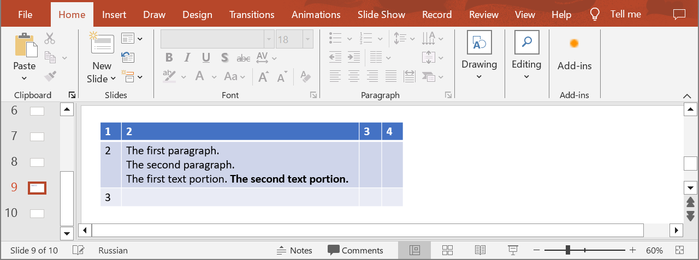
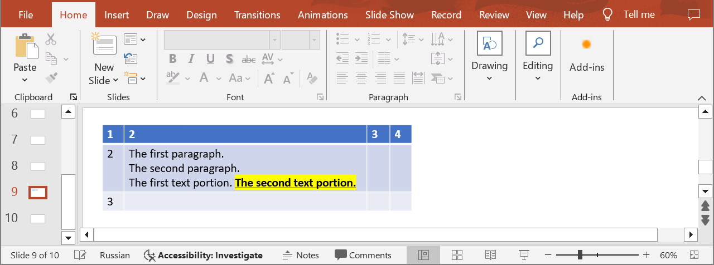

## **Introduction**

In PowerPoint table cells, you can work with individual parts of text by changing their formatting independently. For example, you can select a portion of text and change its font, size, color, or style (bold, italic, underline) without affecting the rest of the text. Use the following method to update the properties of a text portion in a table cell.

## **UpdateTableCellPortion**

### **API Information**

|**API**|**Type**|**Description**|**Resource**|
| :- | :- | :- | :- |
|/slides/{name}/slides/{slideIndex}/shapes/{shapeIndex}/rows/{rowIndex}/cells/{cellIndex}/paragraphs/{paragraphIndex}/portions/{portionIndex}|PUT|Updates a text portion of a paragraph in a table cell in a presentation saved in a storage.|[UpdateTableCellPortion](https://reference.aspose.cloud/slides/#/Table/UpdateTableCellPortion)|

**Request Parameters**

|**Name**|**Type**|**Location**|**Required**|**Description**|
| :- | :- | :- | :- | :- |
|name|string|path|true|The name of a presentation file.|
|slideIndex|integer|path|true|The 1-based index of a slide.|
|shapeIndex|integer|path|true|The 1-based index of a shape (must be a table).|
|rowIndex|integer|path|true|The 1-based index of a row.|
|cellIndex|integer|path|true|The 1-based index of a cell.|
|paragraphIndex|integer|path|true|The 1-based index of a paragraph.|
|portionIndex|integer|path|true|The 1-based index of a text portion.|
|dto|`Portion`|body|true|The data transfer object with text portion properties.|
|password|string|header|false|The password to open the presentation.|
|folder|string|query|false|The path to the folder containing the presentation file.|
|storage|string|query|false|The name of the storage contaning the folder.|

### **Examples**

In the **default** storage, the document **MyPresentation.pptx** contains a table (the **first** shape) with four columns and three rows on the **ninth** slide. The cell **(2, 2)** contains three paragraphs. Set the following properties for the **second** text portion in the **third** paragraph:
- underline the text
- highlight the text in yellow



**cURL Solution**




**Get an Access Token**
```sh
curl -X POST "https://api.aspose.cloud/connect/token" \
     -d "grant_type=client_credentials&client_id=MyClientId&client_secret=MyClientSecret" \
     -H "Content-Type: application/x-www-form-urlencoded"
```

**Update the Text Portion**
```sh
curl -X PUT "https://api.aspose.cloud/v3.0/slides/MyPresentation.pptx/slides/9/shapes/1/rows/2/cells/2/paragraphs/3/portions/2" \
     -H "authorization: Bearer MyAccessToken" \
     -H "Content-Type: application/json" \
     -d @TextPortion.json
```

TextPortion.json content:
```json
{
  "FontUnderline": "Single",
  "HighlightColor": "#FFFF00"
}
```




```json
{
  "text": "The second text portion.",
  "fontBold": "True",
  "fontUnderline": "Single",
  "highlightColor": "#FFFFFF00",
  "fontHeight": 18,
  "languageId": "en-US",
  "selfUri": {
    "href": "https://api.aspose.cloud/v3.0/slides/MyPresentation.pptx/slides/9/shapes/1/rows/3/cells/3/paragraphs/3/portions/2",
    "relation": "self",
    "slideIndex": 9,
    "shapeIndex": 1
  }
}
```




**SDK Solutions**




```cs
using System;
using Aspose.Slides.Cloud.Sdk;
using Aspose.Slides.Cloud.Sdk.Model;

class Application
{
    static void Main(string[] args)
    {
        SlidesApi slidesApi = new SlidesApi("MyClientId", "MyClientSecret");

        string fileName = "MyPresentation.pptx";
        int slideIndex = 9;
        int shapeIndex = 1;
        int rowIndex = 2;
        int cellIndex = 2;
        int paragraphIndex = 3;
        int portionIndex = 2;

        Portion textPortion = new Portion
        {
            FontUnderline = Portion.FontUnderlineEnum.Single,
            HighlightColor = "#FFFF00"
        };

        Portion updatedPortion = slidesApi.UpdateTableCellPortion(fileName, slideIndex, shapeIndex, rowIndex, cellIndex, paragraphIndex, portionIndex, textPortion);

        Console.WriteLine("Font underline: " + updatedPortion.FontUnderline);   // Single
        Console.WriteLine("Highlight color: " + updatedPortion.HighlightColor); // #FFFFFF00
    }
}
```



```java
import com.aspose.slides.ApiException;
import com.aspose.slides.api.SlidesApi;
import com.aspose.slides.model.Portion;

public class Application {
    public static void main(String[] args) throws ApiException {
        SlidesApi slidesApi = new SlidesApi("MyClientId", "MyClientSecret");

        String fileName = "MyPresentation.pptx";
        int slideIndex = 9;
        int shapeIndex = 1;
        int rowIndex = 2;
        int cellIndex = 2;
        int paragraphIndex = 3;
        int portionIndex = 2;

        Portion textPortion = new Portion();
        textPortion.setFontUnderline(Portion.FontUnderlineEnum.SINGLE);
        textPortion.setHighlightColor("#FFFF00");

        Portion updatedPortion = slidesApi.updateTableCellPortion(fileName, slideIndex, shapeIndex, rowIndex, cellIndex, paragraphIndex, portionIndex, textPortion, null, null, null);

        System.out.println("Font underline: " + updatedPortion.getFontUnderline());   // Single
        System.out.println("Highlight color: " + updatedPortion.getHighlightColor()); // #FFFFFF00
    }
}
```



```php
use Aspose\Slides\Cloud\Sdk\Api\Configuration;
use Aspose\Slides\Cloud\Sdk\Api\SlidesApi;
use Aspose\Slides\Cloud\Sdk\Model\Portion;

$configuration = new Configuration();
$configuration->setAppSid("MyClientId");
$configuration->setAppKey("MyClientSecret");

$slidesApi = new SlidesApi(null, $configuration);

$fileName = "MyPresentation.pptx";
$slideIndex = 9;
$shapeIndex = 1;
$rowIndex = 2;
$cellIndex = 2;
$paragraphIndex = 3;
$portionIndex = 2;

$textPortion = new Portion();
$textPortion->setFontUnderline(Portion::FONT_UNDERLINE_SINGLE);
$textPortion->setHighlightColor("#FFFF00");

$updatedPortion = $slidesApi->updateTableCellPortion($fileName, $slideIndex, $shapeIndex, $rowIndex, $cellIndex, $paragraphIndex, $portionIndex, $textPortion);

print("Font underline: " . $updatedPortion->getFontUnderline() . "\n"); // Single
print("Highlight color: " . $updatedPortion->getHighlightColor());      // #FFFFFF00
```



```rb
require "aspose_slides_cloud"

include AsposeSlidesCloud

configuration = Configuration.new
configuration.app_sid = "MyClientId"
configuration.app_key = "MyClientSecret"

slides_api = SlidesApi.new(configuration)

file_name = "MyPresentation.pptx"
slide_index = 9
shape_index = 1
row_index = 2
cell_index = 2
paragraph_index = 3
portion_index = 2

text_portion = Portion.new
text_portion.font_underline = "Single"
text_portion.highlight_color = "#FFFF00"

updated_portion = slides_api.update_table_cell_portion(file_name, slide_index, shape_index, row_index, cell_index, paragraph_index, portion_index, text_portion)

puts "Font underline: #{updated_portion.font_underline}"   # Single
puts "Highlight color: #{updated_portion.highlight_color}" # #FFFFFF00
```



```py
from asposeslidescloud.apis import SlidesApi
from asposeslidescloud.models import Portion

slides_api = SlidesApi(None, "MyClientId", "MyClientSecret")

file_name = "MyPresentation.pptx"
slide_index = 9
shape_index = 1
row_index = 2
cell_index = 2
paragraph_index = 3
portion_index = 2

text_portion = Portion()
text_portion.font_underline = "Single"
text_portion.highlight_color = "#FFFF00"

updated_portion = slides_api.update_table_cell_portion(file_name, slide_index, shape_index, row_index, cell_index, paragraph_index, portion_index, text_portion)

print("Font underline:", updated_portion.font_underline)    # Single
print("Highlight color:", updated_portion.highlight_color)  # #FFFFFF00
```



```js
const cloudSdk = require("asposeslidescloud");

const slidesApi = new cloudSdk.SlidesApi("MyClientId", "MyClientSecret");

fileName = "MyPresentation.pptx";
slideIndex = 9;
shapeIndex = 1;
rowIndex = 2;
cellIndex = 2;
paragraphIndex = 3;
portionIndex = 2;

textPortion = new cloudSdk.Portion();
textPortion.fontUnderline = cloudSdk.Portion.FontUnderlineEnum.Single;
textPortion.highlightColor = "#FFFF00";

slidesApi.updateTableCellPortion(fileName, slideIndex, shapeIndex, rowIndex, cellIndex, paragraphIndex, portionIndex, textPortion).then(updatedPortion => {
    console.log("Font underline:", updatedPortion.body.fontUnderline);   // Single
    console.log("Highlight color:", updatedPortion.body.highlightColor); // #FFFFFF00
});
```



```go
import (
	"fmt"

	asposeslidescloud "github.com/aspose-slides-cloud/aspose-slides-cloud-go/v24"
)

func main() {
	configuration := asposeslidescloud.NewConfiguration()
	configuration.AppSid = "MyClientId"
	configuration.AppKey = "MyClientSecret"

	slidesApi := asposeslidescloud.NewAPIClient(configuration).SlidesApi

	fileName := "MyPresentation.pptx"
	var slideIndex int32 = 9
	var shapeIndex int32 = 1
	var rowIndex int32 = 2
	var cellIndex int32 = 2
	var paragraphIndex int32 = 3
	var portionIndex int32 = 2

	textPortion := asposeslidescloud.NewPortion()
	textPortion.Text = " The second text portion."
	textPortion.FontUnderline = "Single"
	textPortion.HighlightColor = "#FFFF00"

	updatedPortion, _, _ := slidesApi.UpdateTableCellPortion(fileName, slideIndex, shapeIndex, rowIndex, cellIndex, paragraphIndex, portionIndex, textPortion, "", "", "")

	fmt.Println("Font underline: " + updatedPortion.GetFontUnderline())   // Single
	fmt.Println("Highlight color: " + updatedPortion.GetHighlightColor()) // #FFFFFF00
}
```



```cpp
#include "asposeslidescloud/api/SlidesApi.h"

using namespace asposeslidescloud::api;

int main()
{
    std::shared_ptr<SlidesApi> slidesApi = std::make_shared<SlidesApi>(L"MyClientId", L"MyClientSecret");

    const wchar_t* fileName = L"MyPresentation.pptx";
    int slideIndex = 9;
    int shapeIndex = 1;
    int rowIndex = 2;
    int cellIndex = 2;
    int paragraphIndex = 3;
    int portionIndex = 2;

    std::shared_ptr<Portion> textPortion = std::make_shared<Portion>();
    textPortion->setFontUnderline(L"Single");
    textPortion->setHighlightColor(L"#FFFF00");

    std::shared_ptr<Portion> updatedPortion = slidesApi->updateTableCellPortion(fileName, slideIndex, shapeIndex, rowIndex, cellIndex, paragraphIndex, portionIndex, textPortion).get();

    std::wcout << L"Font underline: " << updatedPortion->getFontUnderline() << std::endl; // Single
    std::wcout << L"Highlight color: " << updatedPortion->getHighlightColor();            // #FFFFFF00
}
```



```pl
use AsposeSlidesCloud::Configuration;
use AsposeSlidesCloud::SlidesApi;
use AsposeSlidesCloud::Object::Portion;

my $configuration = AsposeSlidesCloud::Configuration->new();
$configuration->{app_sid} = "MyClientId";
$configuration->{app_key} = "MyClientSecret";

my $slides_api = AsposeSlidesCloud::SlidesApi->new(config => $configuration);

my $file_name = "MyPresentation.pptx";
my $slide_index = 9;
my $shape_index = 1;
my $row_index = 2;
my $cell_index = 2;
my $paragraph_index = 3;
my $portion_index = 2;

my $text_portion = AsposeSlidesCloud::Object::Portion->new();
$text_portion->{font_underline} = "Single";
$text_portion->{highlight_color} = "#FFFF00";

my $updated_portion = $slides_api->update_table_cell_portion(
    name => $file_name, slide_index => $slide_index, shape_index => $shape_index, row_index => $row_index, cell_index => $cell_index, paragraph_index => $paragraph_index, portion_index => $portion_index, dto => $text_portion);

print "Font underline: ", $updated_portion->{font_underline}, "\n"; # Single
print "Highlight color: ", $updated_portion->{highlight_color};     # #FFFFFF00
```




The result:



## **SDKs**

Check [Available SDKs](/slides/available-sdks/) to learn how to add an SDK to your project.
