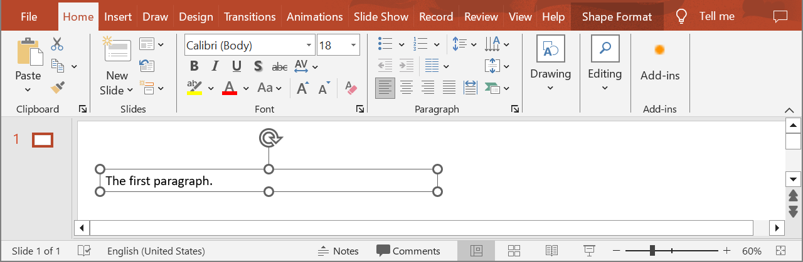
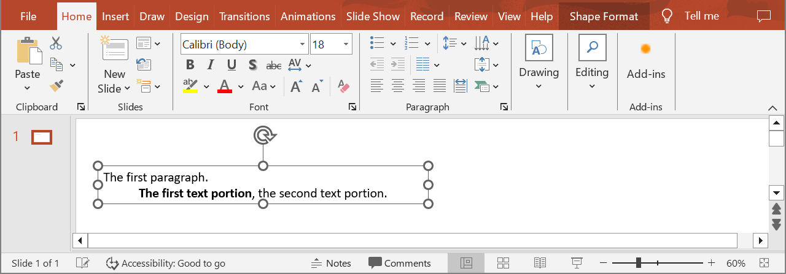

## **Introduction**

Dividing text into paragraphs makes it easier to make changes and additions. Using the following method, you can add new paragraphs, specifying formatting properties such as indents, alignment, styles, color, font size, effects, and many others.

## **CreateParagraph**

### **API Information**

|**API**|**Type**|**Description**|**Resource**|
| :- | :- | :- | :- |
|/slides/{name}/slides/{slideIndex}/shapes/{shapeIndex}/paragraphs|POST|Adds a new paragraph to a shape in a presentation saved in a storage.|[CreateParagraph](https://reference.aspose.cloud/slides/#/Shapes/CreateParagraph)|

**Request Parameters**

|**Name**|**Type**|**Location**|**Required**|**Description**|
| :- | :- | :- | :- | :- |
|name|string|path|true|The name of a presentation file.|
|slideIndex|integer|path|true|The 1-based index of a slide.|
|shapeIndex|integer|path|true|The 1-based index of a shape.|
|dto|`Paragraph`|body|true|The data transfer object with paragraph properties.|
|position|integer|query|false|The position of the new paragraph in the list. Default is at the end of the list.|
|password|string|header|false|The password to open the presentation.|
|folder|string|query|false|The path to the folder containing the presentation file.|
|storage|string|query|false|The name of the storage contaning the folder.|
|subShape|string|query|false|The path to a child shape (e.g. "3", "3/shapes/2").|

### **Examples**

In the **default** storage, the document **MyPresentation.pptx** contains a text box (the **first** shape) on the **first** slide. Add a new paragraph with two text portions. Make the **first** text portion **bold**. Align the paragraph to the **center**.



**cURL Solution**




**Get an Access Token**
```sh
curl -X POST "https://api.aspose.cloud/connect/token" \
     -d "grant_type=client_credentials&client_id=MyClientId&client_secret=MyClientSecret" \
     -H "Content-Type: application/x-www-form-urlencoded"
```

**Add the Paragraph**
```sh
curl -X POST "https://api.aspose.cloud/v3.0/slides/MyPresentation.pptx/slides/1/shapes/1/paragraphs" \
     -H "authorization: Bearer MyAccessToken" \
     -H "Content-Type: application/json" \
     -d @Paragraph.json
```

Paragraph.json content:
```json
{
  "alignment": "center",
  "portionList": [
    {
      "text": "The first text portion",
      "fontBold": "true"
    },
    {
      "text": ", the second text portion."
    }
  ]
}
```



```json
{
  "alignment": "Center",
  "portionList": [
    {
      "text": "The first text portion",
      "fontBold": "True",
      "highlightColor": "#0",
      "fontHeight": "NaN",
      "selfUri": {
        "href": "https://api.aspose.cloud/v3.0/slides/MyPresentation.pptx/slides/1/shapes/1/paragraphs/3/portions/1",
        "relation": "self",
        "slideIndex": 1,
        "shapeIndex": 1
      }
    },
    {
      "text": ", the second text portion.",
      "highlightColor": "#0",
      "fontHeight": "NaN",
      "selfUri": {
        "href": "https://api.aspose.cloud/v3.0/slides/MyPresentation.pptx/slides/1/shapes/1/paragraphs/3/portions/2",
        "relation": "self",
        "slideIndex": 1,
        "shapeIndex": 1
      }
    }
  ],
  "defaultPortionFormat": {
    "highlightColor": "#0",
    "fontHeight": "NaN"
  },
  "selfUri": {
    "href": "https://api.aspose.cloud/v3.0/slides/MyPresentation.pptx/slides/1/shapes/1/paragraphs/3",
    "relation": "self",
    "slideIndex": 1,
    "shapeIndex": 1
  }
}
```




**SDK Solutions**




```cs
using System;
using System.Collections.Generic;
using Aspose.Slides.Cloud.Sdk;
using Aspose.Slides.Cloud.Sdk.Model;

class Application
{
    static void Main(string[] args)
    {
        SlidesApi slidesApi = new SlidesApi("MyClientId", "MyClientSecret");

        string fileName = "MyPresentation.pptx";
        int slideIndex = 1;
        int shapeIndex = 1;

        Paragraph paragraph = new Paragraph
        {
            Alignment = Paragraph.AlignmentEnum.Center,
            PortionList = new List<Portion>
            {
                new Portion
                {
                    Text = "The first text portion",
                    FontBold = Portion.FontBoldEnum.True
                },
                new Portion
                {
                    Text = ", the second text portion."
                }
            }
        };

        Paragraph addedParagraph = slidesApi.CreateParagraph(fileName, slideIndex, shapeIndex, paragraph);

        int portionCount = addedParagraph.PortionList.Count;
        Console.WriteLine("Number of text portions: " + portionCount);
    }
}
```



```java
import com.aspose.slides.ApiException;
import com.aspose.slides.api.SlidesApi;
import com.aspose.slides.model.Paragraph;
import com.aspose.slides.model.Portion;

import java.util.Arrays;

public class Application {
    public static void main(String[] args) throws ApiException {
        SlidesApi slidesApi = new SlidesApi("MyClientId", "MyClientSecret");

        String fileName = "MyPresentation.pptx";
        int slideIndex = 1;
        int shapeIndex = 1;

        Portion firstPortion = new Portion();
        firstPortion.setText("The first text portion");
        firstPortion.setFontBold(Portion.FontBoldEnum.TRUE);

        Portion secondPortion = new Portion();
        secondPortion.setText(", the second text portion.");

        Paragraph paragraph = new Paragraph();
        paragraph.setAlignment(Paragraph.AlignmentEnum.CENTER);
        paragraph.setPortionList(Arrays.asList(firstPortion, secondPortion));

        Paragraph addedParagraph = slidesApi.createParagraph(fileName, slideIndex, shapeIndex, paragraph, null, null, null, null, null);

        int portionCount = addedParagraph.getPortionList().size();
        System.out.println("Number of text portions: " + portionCount);
    }
}
```



```php
use Aspose\Slides\Cloud\Sdk\Api\Configuration;
use Aspose\Slides\Cloud\Sdk\Api\SlidesApi;
use Aspose\Slides\Cloud\Sdk\Model\Portion;
use Aspose\Slides\Cloud\Sdk\Model\Paragraph;

$configuration = new Configuration();
$configuration->setAppSid("MyClientId");
$configuration->setAppKey("MyClientSecret");

$slidesApi = new SlidesApi(null, $configuration);

$fileName = "MyPresentation.pptx";
$slideIndex = 1;
$shapeIndex = 1;

$firstPortion = new Portion();
$firstPortion->setText("The first text portion");
$firstPortion->setFontBold(Portion::FONT_BOLD_TRUE);

$secondPortion = new Portion();
$secondPortion->setText(", the second text portion.");

$paragraph = new Paragraph();
$paragraph->setAlignment(Paragraph::ALIGNMENT_CENTER);
$paragraph->setPortionList([$firstPortion, $secondPortion]);

$addedParagraph = $slidesApi->createParagraph($fileName, $slideIndex, $shapeIndex, $paragraph);

$portionCount = count($addedParagraph->getPortionList());
print("Number of text portions: " . $portionCount);
```



```rb
require "aspose_slides_cloud"

include AsposeSlidesCloud

configuration = Configuration.new
configuration.app_sid = "MyClientId"
configuration.app_key = "MyClientSecret"

slides_api = SlidesApi.new(configuration)

file_name = "MyPresentation.pptx"
slide_index = 1
shape_index = 1

first_portion = Portion.new
first_portion.text = "The first text portion"
first_portion.font_bold = "True"

second_portion = Portion.new
second_portion.text = ", the second text portion."

paragraph = Paragraph.new
paragraph.alignment = "Center"
paragraph.portion_list = [first_portion, second_portion]

added_paragraph = slides_api.create_paragraph(file_name, slide_index, shape_index, paragraph)

portion_count = added_paragraph.portion_list.length()
puts "Number of text portions: #{portion_count}"
```



```py
from asposeslidescloud.apis import SlidesApi
from asposeslidescloud.models import Portion
from asposeslidescloud.models import Paragraph

slides_api = SlidesApi(None, "MyClientId", "MyClientSecret")

file_name = "MyPresentation.pptx"
slide_index = 1
shape_index = 1

first_portion = Portion()
first_portion.text = "The first text portion"
first_portion.font_bold = "True"

second_portion = Portion()
second_portion.text = ", the second text portion."

paragraph = Paragraph()
paragraph.alignment = "Center"
paragraph.portion_list = [first_portion, second_portion]

added_paragraph = slides_api.create_paragraph(file_name, slide_index, shape_index, paragraph)

portion_count = len(added_paragraph.portion_list)
print("Number of text portions:", portion_count)
```



```js
const cloudSdk = require("asposeslidescloud");

const slidesApi = new cloudSdk.SlidesApi("MyClientId", "MyClientSecret");

fileName = "MyPresentation.pptx";
slideIndex = 1;
shapeIndex = 1;

firstPortion = new cloudSdk.Portion();
firstPortion.text = "The first text portion";
firstPortion.fontBold = cloudSdk.Portion.FontBoldEnum.True;

secondPortion = new cloudSdk.Portion();
secondPortion.text = ", the second text portion.";

paragraph = new cloudSdk.Paragraph();
paragraph.alignment = cloudSdk.Paragraph.AlignmentEnum.Center;
paragraph.portionList = [firstPortion, secondPortion];

slidesApi.createParagraph(fileName, slideIndex, shapeIndex, paragraph).then(addedParagraph => {
    portionCount = addedParagraph.body.portionList.length;
    console.log("Number of text portions:", portionCount);
});
```



```cpp
#include "asposeslidescloud/api/SlidesApi.h"

using namespace asposeslidescloud::api;

int main()
{
    std::shared_ptr<SlidesApi> slidesApi = std::make_shared<SlidesApi>(L"MyClientId", L"MyClientSecret");

    const wchar_t* fileName = L"MyPresentation.pptx";
    int slideIndex = 1;
    int shapeIndex = 1;

    std::shared_ptr<Portion> firstPortion = std::make_shared<Portion>();
    firstPortion->setText(L"The first text portion");
    firstPortion->setFontBold(L"True");

    std::shared_ptr<Portion> secondPortion = std::make_shared<Portion>();
    secondPortion->setText(L", the second text portion.");

    std::shared_ptr<Paragraph> paragraph = std::make_shared<Paragraph>();
    paragraph->setAlignment(L"Center");
    paragraph->setPortionList({ firstPortion, secondPortion });

    std::shared_ptr<Paragraph> addedParagraph = slidesApi->createParagraph(fileName, slideIndex, shapeIndex, paragraph).get();

    int portionCount = addedParagraph->getPortionList().size();
    std::wcout << L"Number of text portions: " << portionCount;
}
```



```pl
use AsposeSlidesCloud::Configuration;
use AsposeSlidesCloud::SlidesApi;
use AsposeSlidesCloud::Object::Portion;
use AsposeSlidesCloud::Object::Paragraph;

my $configuration = AsposeSlidesCloud::Configuration->new();
$configuration->{app_sid} = "MyClientId";
$configuration->{app_key} = "MyClientSecret";

my $slides_api = AsposeSlidesCloud::SlidesApi->new(config => $configuration);

my $first_portion = AsposeSlidesCloud::Object::Portion->new();
$first_portion->{text} = "The first text portion";
$first_portion->{font_bold} = "True";

my $second_portion = AsposeSlidesCloud::Object::Portion->new();
$second_portion->{text} = ", the second text portion.";

my $paragraph = AsposeSlidesCloud::Object::Paragraph->new();
$paragraph->{alignment} = "Center";
$paragraph->{portion_list} = [$first_portion, $second_portion];

my $added_paragraph = $slides_api->create_paragraph(
    name => "MyPresentation.pptx",
    slide_index => 1,
    shape_index => 1,
    dto => $paragraph);

my $portion_count = @{$added_paragraph->{portion_list}};
print("Number of text portions: ", $portion_count);
```



```go
import (
	"fmt"

	asposeslidescloud "github.com/aspose-slides-cloud/aspose-slides-cloud-go/v24"
)

func main() {
	configuration := asposeslidescloud.NewConfiguration()
	configuration.AppSid = "MyClientId"
	configuration.AppKey = "MyClientSecret"

	slidesApi := asposeslidescloud.NewAPIClient(configuration).SlidesApi

	fileName := "MyPresentation.pptx"
	var slideIndex int32 = 1
	var shapeIndex int32 = 1

	firstPortion := asposeslidescloud.NewPortion()
	firstPortion.Text = "The first text portion"
	firstPortion.FontBold = "True"

	secondPortion := asposeslidescloud.NewPortion()
	secondPortion.Text = ", the second text portion."

	paragraph := asposeslidescloud.NewParagraph()
	paragraph.Alignment = "Center"
	paragraph.PortionList = []asposeslidescloud.IPortion{firstPortion, secondPortion}

	addedParagraph, _, _ := slidesApi.CreateParagraph(fileName, slideIndex, shapeIndex, paragraph, nil, "", "", "", "")

	portionCount := len(addedParagraph.GetPortionList())
	fmt.Println("Number of text portions:", portionCount)
}
```




The result:



## **SDKs**

Check [Available SDKs](/slides/available-sdks/) to learn how to add an SDK to your project.
