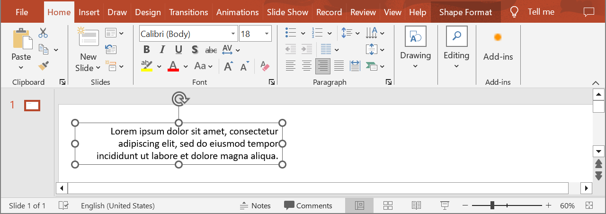

## **Introduction**

Effective values are format values that are actually applied to the paragraph. They are either explicitly set in the paragraph or implicitly returned as a result of inheritance. They represent the final result of formatting that might be seen in the PowerPoint or in an exported document. For example, if the font height value is not defined for the specific portion of text, the value from the default portion format of the parent paragraph will be taken, if available. If not, the value is taken from the presentation theme. Use the following method to get the properties applied to a paragraph.

{} 
You can also get effective values of [text portions](/slides/get-effective-values-of-a-text-portion/).
{}

## **GetParagraphEffective**

### **API Information**

|**API**|**Type**|**Description**|**Resource**|
| :- | :- | :- | :- |
|/slides/{name}/slides/{slideIndex}/shapes/{shapeIndex}/paragraphs/{paragraphIndex}/effective|GET|Returns the effective format values of a paragraph from a presentation saved in a storage.|[GetParagraphEffective](https://reference.aspose.cloud/slides/#/Shapes/GetParagraphEffective)|

**Request Parameters**

|**Name**|**Type**|**Location**|**Required**|**Description**|
| :- | :- | :- | :- | :- |
|name|string|path|true|The name of a presentation file.|
|slideIndex|integer|path|true|The 1-based index of a slide.|
|shapeIndex|integer|path|true|The 1-based index of a shape.|
|paragraphIndex|integer|path|true|The 1-based index of a paragraph.|
|password|string|header|false|The password to open the presentation.|
|folder|string|query|false|The path to the folder containing the presentation file.|
|storage|string|query|false|The name of the storage contaning the folder.|
|subShape|string|query|false|The path to a child shape (e.g. "3", "3/shapes/2").|

### **Examples**

In the **default** storage, the document **MyPresentation.pptx** contains a text box (the **first** shape) on the **first** slide. The text box contains a paragraph. Get alignment of the paragraph.



**cURL Solution**




**Get an Access Token**
```sh
curl -X POST "https://api.aspose.cloud/connect/token" \
     -d "grant_type=client_credentials&client_id=MyClientId&client_secret=MyClientSecret" \
     -H "Content-Type: application/x-www-form-urlencoded"
```

**Get Effective Values**
```sh
curl -X GET "https://api.aspose.cloud/v3.0/slides/MyPresentation.pptx/slides/1/shapes/1/paragraphs/1/effective" \
     -H "authorization: Bearer MyAccessToken"
```



```json
{
  "marginLeft": 0,
  "marginRight": 0,
  "spaceBefore": 0,
  "spaceAfter": 0,
  "spaceWithin": 100,
  "indent": 0,
  "alignment": "Right",
  "fontAlignment": "Automatic",
  "defaultTabSize": 72,
  "hangingPunctuation": "True",
  "eastAsianLineBreak": "True",
  "latinLineBreak": "False",
  "rightToLeft": "False",
  "portionList": [
    {
      "text": "Lorem ipsum dolor sit amet, consectetur adipiscing elit, sed do eiusmod tempor incididunt ut labore et dolore magna aliqua.",
      "fontBold": "False",
      "fontItalic": "False",
      "fontUnderline": "None",
      "strikethroughType": "None",
      "textCapType": "None",
      "escapement": 0,
      "spacing": 0,
      "fontColor": "#FF000000",
      "fontHeight": 18,
      "normaliseHeight": "False",
      "proofDisabled": "False",
      "kerningMinimalSize": 12,
      "kumimoji": "False",
      "languageId": "en-US",
      "isHardUnderlineFill": "False",
      "isHardUnderlineLine": "False",
      "fillFormat": {
        "type": "Solid",
        "color": "#FF000000"
      },
      "effectFormat": {},
      "lineFormat": {
        "alignment": "Center",
        "capStyle": "Flat",
        "dashStyle": "Solid",
        "joinStyle": "Round",
        "style": "Single",
        "beginArrowHead": {
          "length": "Medium",
          "style": "None",
          "width": "Medium"
        },
        "endArrowHead": {
          "length": "Medium",
          "style": "None",
          "width": "Medium"
        },
        "fillFormat": {
          "type": "NoFill"
        },
        "miterLimit": 10,
        "width": 0.75
      },
      "underlineFillFormat": {
        "type": "Solid",
        "color": "#FF000000"
      },
      "underlineLineFormat": {
        "alignment": "Center",
        "capStyle": "Flat",
        "dashStyle": "Solid",
        "joinStyle": "Round",
        "style": "Single",
        "beginArrowHead": {
          "length": "Medium",
          "style": "None",
          "width": "Medium"
        },
        "endArrowHead": {
          "length": "Medium",
          "style": "None",
          "width": "Medium"
        },
        "fillFormat": {
          "type": "NoFill"
        },
        "miterLimit": 10,
        "width": 0.75
      },
      "latinFont": "Calibri",
      "eastAsianFont": "Calibri",
      "complexScriptFont": "Arial"
    }
  ],
  "defaultPortionFormat": {
    "highlightColor": "#0",
    "fontHeight": "NaN"
  },
  "bulletChar": "•",
  "bulletHeight": 100,
  "bulletType": "None",
  "numberedBulletStartWith": 1,
  "numberedBulletStyle": "BulletArabicPeriod",
  "bulletFillFormat": {
    "type": "Solid",
    "color": "#FF000000"
  }
}
```




**SDK Solutions**




```cs
using System;
using Aspose.Slides.Cloud.Sdk;
using Aspose.Slides.Cloud.Sdk.Model;

class Application
{
    static void Main(string[] args)
    {
        SlidesApi slidesApi = new SlidesApi("MyClientId", "MyClientSecret");

        string fileName = "MyPresentation.pptx";
        int slideIndex = 1;
        int shapeIndex = 1;
        int paragraphIndex = 1;

        Paragraph paragraph = slidesApi.GetParagraphEffective(fileName, slideIndex, shapeIndex, paragraphIndex);

        Console.WriteLine($"Alignment: " + paragraph.Alignment); // Right
    }
}
```



```java
import com.aspose.slides.ApiException;
import com.aspose.slides.api.SlidesApi;
import com.aspose.slides.model.Paragraph;

public class Application {
    public static void main(String[] args) throws ApiException {
        SlidesApi slidesApi = new SlidesApi("MyClientId", "MyClientSecret");

        String fileName = "MyPresentation.pptx";
        int slideIndex = 1;
        int shapeIndex = 1;
        int paragraphIndex = 1;

        Paragraph paragraph = slidesApi.getParagraphEffective(fileName, slideIndex, shapeIndex, paragraphIndex, null, null, null, null);

        System.out.println("Alignment: " + paragraph.getAlignment()); // Right
    }
}
```



```php
use Aspose\Slides\Cloud\Sdk\Api\Configuration;
use Aspose\Slides\Cloud\Sdk\Api\SlidesApi;

$configuration = new Configuration();
$configuration->setAppSid("MyClientId");
$configuration->setAppKey("MyClientSecret");

$slidesApi = new SlidesApi(null, $configuration);

$fileName = "MyPresentation.pptx";
$slideIndex = 1;
$shapeIndex = 1;
$paragraphIndex = 1;

$paragraph = $slidesApi->getParagraphEffective($fileName, $slideIndex, $shapeIndex, $paragraphIndex);

print("Alignment: " . $paragraph->getAlignment()); // Right
```



```rb
require "aspose_slides_cloud"

include AsposeSlidesCloud

configuration = Configuration.new
configuration.app_sid = "MyClientId"
configuration.app_key = "MyClientSecret"

slides_api = SlidesApi.new(configuration)

file_name = "MyPresentation.pptx"
slide_index = 1
shape_index = 1
paragraph_index = 1

paragraph = slides_api.get_paragraph_effective(file_name, slide_index, shape_index, paragraph_index)

puts "Alignment: #{paragraph.alignment}" # Right
```



```py
from asposeslidescloud.apis import SlidesApi

slides_api = SlidesApi(None, "MyClientId", "MyClientSecret")

file_name = "MyPresentation.pptx"
slide_index = 1
shape_index = 1
paragraph_index = 1

paragraph = slides_api.get_paragraph_effective(file_name, slide_index, shape_index, paragraph_index)

print("Alignment:", paragraph.alignment)  # Right
```



```js
const cloudSdk = require("asposeslidescloud");

const slidesApi = new cloudSdk.SlidesApi("MyClientId", "MyClientSecret");

fileName = "MyPresentation.pptx";
slideIndex = 1;
shapeIndex = 1;
paragraphIndex = 1;

slidesApi.getParagraphEffective(fileName, slideIndex, shapeIndex, paragraphIndex).then(paragraph => {
    console.log("Alignment: " + paragraph.body.alignment); // Right
});
```



```go
import (
	"fmt"

	asposeslidescloud "github.com/aspose-slides-cloud/aspose-slides-cloud-go/v24"
)

func main() {
	configuration := asposeslidescloud.NewConfiguration()
	configuration.AppSid = "MyClientId"
	configuration.AppKey = "MyClientSecret"

	slidesApi := asposeslidescloud.NewAPIClient(configuration).SlidesApi

	fileName := "MyPresentation.pptx"
	var slideIndex int32 = 1
	var shapeIndex int32 = 1
	var paragraphIndex int32 = 1

	paragraph, _, _ := slidesApi.GetParagraphEffective(fileName, slideIndex, shapeIndex, paragraphIndex, "", "", "", "")

	fmt.Println("Alignment:", paragraph.GetAlignment()) // Right
}
```



```cpp
#include "asposeslidescloud/api/SlidesApi.h"

using namespace asposeslidescloud::api;

int main()
{
    std::shared_ptr<SlidesApi> slidesApi = std::make_shared<SlidesApi>(L"MyClientId", L"MyClientSecret");

    const wchar_t* fileName = L"MyPresentation.pptx";
    int slideIndex = 1;
    int shapeIndex = 1;
    int paragraphIndex = 1;

    std::shared_ptr<Paragraph> paragraph = slidesApi->getParagraphEffective(fileName, slideIndex, shapeIndex, paragraphIndex).get();

    std::wcout << L"Alignment: " << paragraph->getAlignment(); // Right
}
```



```pl
use AsposeSlidesCloud::Configuration;
use AsposeSlidesCloud::SlidesApi;

my $configuration = AsposeSlidesCloud::Configuration->new();
$configuration->{app_sid} = "MyClientId";
$configuration->{app_key} = "MyClientSecret";

my $slides_api = AsposeSlidesCloud::SlidesApi->new(config => $configuration);

my $paragraph = $slides_api->get_paragraph_effective(
    name => "MyPresentation.pptx",
    slide_index => 1,
    shape_index => 1,
    paragraph_index => 1);

print("Alignment: ", $paragraph->{alignment}); # Right
```




## **SDKs**

Check [Available SDKs](/slides/available-sdks/) to learn how to add an SDK to your project.
