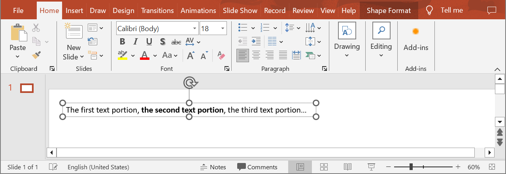

## **Introduction**

This article shows how to get the coordinates and dimensions of a text portion using Aspose.Slides Cloud.

{} 
There is [a similar method](/slides/get-a-paragraph-rectangle/) for getting the coordinates and dimensions of a paragraph.
{}

## **GetPortionRectangle**

### **API Information**

|**API**|**Type**|**Description**|**Resource**|
| :- | :- | :- | :- |
|/slides/{name}/slides/{slideIndex}/shapes/{shapeIndex}/paragraphs/{paragraphIndex}/portions/{portionIndex}/bounds|GET|Returns coordinates and dimensions of a text portion from a presentation saved in a storage.|[GetPortionRectangle](https://reference.aspose.cloud/slides/#/Shapes/GetPortionRectangle)|

**Request Parameters**

|**Name**|**Type**|**Location**|**Required**|**Description**|
| :- | :- | :- | :- | :- |
|name|string|path|true|The name of a presentation file.|
|slideIndex|integer|path|true|The 1-based index of a slide.|
|shapeIndex|integer|path|true|The 1-based index of a shape.|
|paragraphIndex|integer|path|true|The 1-based index of a paragraph.|
|portionIndex|integer|path|true|The 1-based index of a text portion.|
|password|string|header|false|The password to open the presentation.|
|folder|string|query|false|The path to the folder containing the presentation file.|
|storage|string|query|false|The name of the storage contaning the folder.|

### **Examples**

In the **default** storage, the document **MyPresentation.pptx** contains a text box (the **first** shape) on the **first** slide. The text box contains a paragraph with three text portions. Get the coordinates and dimensions of the **second** text portion.



**cURL Solution**




**Get an Access Token**
```sh
curl -X POST "https://api.aspose.cloud/connect/token" \
     -d "grant_type=client_credentials&client_id=MyClientId&client_secret=MyClientSecret" \
     -H "Content-Type: application/x-www-form-urlencoded"
```

**Get the Text Bounds**
```sh
curl -X GET "https://api.aspose.cloud/v3.0/slides/MyPresentation.pptx/slides/1/shapes/1/paragraphs/1/portions/2/bounds" \
     -H "authorization: Bearer MyAccessToken"
```



```json
{
  "x": 166.52715,
  "y": 3.599999,
  "width": 174.41113,
  "height": 21.6
}
```




**SDK Solutions**




```cs
using System;
using Aspose.Slides.Cloud.Sdk;
using Aspose.Slides.Cloud.Sdk.Model;

class Application
{
    static void Main(string[] args)
    {
        SlidesApi slidesApi = new SlidesApi("MyClientId", "MyClientSecret");

        string fileName = "MyPresentation.pptx";
        int slideIndex = 1;
        int shapeIndex = 1;
        int paragraphIndex = 1;
        int portionIndex = 2;

        TextBounds textBounds = slidesApi.GetPortionRectangle(fileName, slideIndex, shapeIndex, paragraphIndex, portionIndex);

        Console.WriteLine($"X: {textBounds.X}");
        Console.WriteLine($"Y: {textBounds.Y}");
        Console.WriteLine($"Width: {textBounds.Width}");
        Console.WriteLine($"Height: {textBounds.Height}");
    }
}

// Example output:
//
// X: 166.52715
// Y: 3.599999
// Width: 174.41113
// Height: 21.6
```



```java
import com.aspose.slides.ApiException;
import com.aspose.slides.api.SlidesApi;
import com.aspose.slides.model.TextBounds;

public class Application {
    public static void main(String[] args) throws ApiException {
        SlidesApi slidesApi = new SlidesApi("MyClientId", "MyClientSecret");

        String fileName = "MyPresentation.pptx";
        int slideIndex = 1;
        int shapeIndex = 1;
        int paragraphIndex = 1;
        int portionIndex = 2;

        TextBounds textBounds = slidesApi.getPortionRectangle(fileName, slideIndex, shapeIndex, paragraphIndex, portionIndex, null, null, null);

        System.out.println("X: " + textBounds.getX());
        System.out.println("Y: " + textBounds.getY());
        System.out.println("Width: " + textBounds.getWidth());
        System.out.println("Height: " + textBounds.getHeight());
    }
}

// Example output:
//
// X: 166.52715
// Y: 3.599999
// Width: 174.41113
// Height: 21.6
```



```php
use Aspose\Slides\Cloud\Sdk\Api\Configuration;
use Aspose\Slides\Cloud\Sdk\Api\SlidesApi;

$configuration = new Configuration();
$configuration->setAppSid("MyClientId");
$configuration->setAppKey("MyClientSecret");

$slidesApi = new SlidesApi(null, $configuration);

$fileName = "MyPresentation.pptx";
$slideIndex = 1;
$shapeIndex = 1;
$paragraphIndex = 1;
$portionIndex = 2;

$textBounds = $slidesApi->GetPortionRectangle($fileName, $slideIndex, $shapeIndex, $paragraphIndex, $portionIndex);

print("X: " . $textBounds->getX() . "\n");
print("Y: " . $textBounds->getY() . "\n");
print("Width: " . $textBounds->getWidth() . "\n");
print("Height: " . $textBounds->getHeight() . "\n");

// Example output:
//
// X: 166.52715
// Y: 3.599999
// Width: 174.41113
// Height: 21.6
```



```rb
require "aspose_slides_cloud"

include AsposeSlidesCloud

configuration = Configuration.new
configuration.app_sid = "MyClientId"
configuration.app_key = "MyClientSecret"

slides_api = SlidesApi.new(configuration)

file_name = "MyPresentation.pptx"
slide_index = 1
shape_index = 1
paragraph_index = 1
portion_index = 2

text_bounds = slides_api.get_portion_rectangle(file_name, slide_index, shape_index, paragraph_index, portion_index)

puts("X: #{ text_bounds.x }")
puts("Y: #{ text_bounds.y }")
puts("Width: #{ text_bounds.width }")
puts("Height: #{ text_bounds.height }")

# Example output:
#  
# X: 166.52715
# Y: 3.599999
# Width: 174.41113
# Height: 21.6
```



```py
from asposeslidescloud.apis import SlidesApi

slides_api = SlidesApi(None, "MyClientId", "MyClientSecret")

file_name = "MyPresentation.pptx"
slide_index = 1
shape_index = 1
paragraph_index = 1
portion_index = 2

text_bounds = slides_api.get_portion_rectangle(file_name, slide_index, shape_index, paragraph_index, portion_index)

print("X:", text_bounds.x)
print("Y:", text_bounds.y)
print("Width:", text_bounds.width)
print("Height:", text_bounds.height)

# Example output:
#
# X: 166.52715
# Y: 3.599999
# Width: 174.41113
# Height: 21.6
```



```js
const cloudSdk = require("asposeslidescloud");

const slidesApi = new cloudSdk.SlidesApi("MyClientId", "MyClientSecret");

fileName = "MyPresentation.pptx";
slideIndex = 1;
shapeIndex = 1;
paragraphIndex = 1;
portionIndex = 2;

slidesApi.getPortionRectangle(fileName, slideIndex, shapeIndex, paragraphIndex, portionIndex).then(textBounds => {
    console.log("X: " + textBounds.body.x);
    console.log("Y: " + textBounds.body.y);
    console.log("Width: " + textBounds.body.width);
    console.log("Height: " + textBounds.body.height);
});

// Example output:
//
// X: 166.52715
// Y: 3.599999
// Width: 174.41113
// Height: 21.6
```



```go
import (
	"fmt"

	asposeslidescloud "github.com/aspose-slides-cloud/aspose-slides-cloud-go/v24"
)

func main() {
	configuration := asposeslidescloud.NewConfiguration()
	configuration.AppSid = "MyClientId"
	configuration.AppKey = "MyClientSecret"

	slidesApi := asposeslidescloud.NewAPIClient(configuration).SlidesApi

	fileName := "MyPresentation.pptx"
	var slideIndex int32 = 1
	var shapeIndex int32 = 1
	var paragraphIndex int32 = 1
	var portionIndex int32 = 2

	textBounds, _, _ := slidesApi.GetPortionRectangle(fileName, slideIndex, shapeIndex, paragraphIndex, portionIndex, "", "", "")

	fmt.Println("X:", textBounds.GetX())
	fmt.Println("Y:", textBounds.GetY())
	fmt.Println("Width:", textBounds.GetWidth())
	fmt.Println("Height:", textBounds.GetHeight())
}

// Example output:
//
// X: 166.52715
// Y: 3.599999
// Width: 174.41113
// Height: 21.6
```



```cpp
#include "asposeslidescloud/api/SlidesApi.h"

using namespace asposeslidescloud::api;

int main()
{
    std::shared_ptr<SlidesApi> slidesApi = std::make_shared<SlidesApi>(L"MyClientId", L"MyClientSecret");

    const wchar_t* fileName = L"MyPresentation.pptx";
    int slideIndex = 1;
    int shapeIndex = 1;
    int paragraphIndex = 1;
    int portionIndex = 2;

    std::shared_ptr<TextBounds> textBounds = slidesApi->getPortionRectangle(fileName, slideIndex, shapeIndex, paragraphIndex, portionIndex).get();

    std::wcout << L"X: " << textBounds->getX() << std::endl;
    std::wcout << L"Y: " << textBounds->getY() << std::endl;
    std::wcout << L"Width: " << textBounds->getWidth() << std::endl;
    std::wcout << L"Height: " << textBounds->getHeight() << std::endl;
}

// Example output:
//
// X: 166.527
// Y : 3.6
// Width : 174.411
// Height : 21.6
```



```pl
use AsposeSlidesCloud::Configuration;
use AsposeSlidesCloud::SlidesApi;

my $configuration = AsposeSlidesCloud::Configuration->new();
$configuration->{app_sid} = "MyClientId";
$configuration->{app_key} = "MyClientSecret";

my $slides_api = AsposeSlidesCloud::SlidesApi->new(config => $configuration);

my $text_bounds = $slides_api->get_portion_rectangle(
    name => "MyPresentation.pptx",
    slide_index => 1,
    shape_index => 1,
    paragraph_index => 1,
    portion_index => 2);

print "X: ", $text_bounds->{x}, "\n";
print "Y: ", $text_bounds->{y}, "\n";
print "Width: ", $text_bounds->{width}, "\n";
print "Height: ", $text_bounds->{height}, "\n";

# Example output:
#
# X: 166.52715
# Y: 3.599999
# Width: 174.41113
# Height: 21.6
```




## **SDKs**

Check [Available SDKs](/slides/available-sdks/) to learn how to add an SDK to your project.
