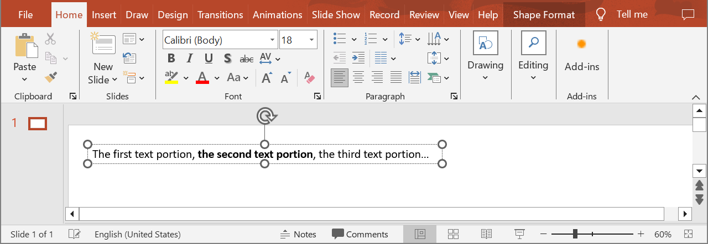

## **Introduction**

Effective values are format values that are actually applied to the text portion. They are either explicitly set in the text portion or implicitly returned as a result of inheritance. They represent the final result of formatting that might be seen in the PowerPoint or in an exported document. For example, if the font height value is not defined for a specific text portion, the value from the default text portion format of the parent paragraph will be taken, if available. If not, the value is taken from the presentation theme.

{} 
You can also get effective values of [Paragraphs](/slides/get-paragraph-effective-values/).
{}

### **API Information**

|**API**|**Type**|**Description**|**Resource**|
| :- | :- | :- | :- |
|/slides/{name}/slides/{slideIndex}/shapes/{shapeIndex}/paragraphs/{paragraphIndex}/portions/{portionIndex}/effective|GET|Returns the effective format values of a text portion from a presentation saved in a storage.|[GetPortionEffective](https://reference.aspose.cloud/slides/#/Shapes/GetPortionEffective)|

**Request Parameters**

|**Name**|**Type**|**Location**|**Required**|**Description**|
| :- | :- | :- | :- | :- |
|name|string|path|true|The name of a presentation file.|
|slideIndex|integer|path|true|The 1-based index of a slide.|
|shapeIndex|integer|path|true|The 1-based index of a shape.|
|paragraphIndex|integer|path|true|The 1-based index of a paragraph.|
|portionIndex|integer|path|true|The 1-based index of a text portion.|
|password|string|header|false|The password to open the presentation.|
|folder|string|query|false|The path to the folder containing the presentation file.|
|storage|string|query|false|The name of the storage contaning the folder.|
|subShape|string|query|false|The path to a child shape (e.g. "3", "3/shapes/2").|

### **Examples**

In the **default** storage, the document **MyPresentation.pptx** contains a text box (the **first** shape) on the **first** slide. The text box contains a paragraph with three text portions. Get effective format values of the **second** text portion.



**cURL Solution**




**Get an Access Token**
```sh
curl -X POST "https://api.aspose.cloud/connect/token" \
     -d "grant_type=client_credentials&client_id=MyClientId&client_secret=MyClientSecret" \
     -H "Content-Type: application/x-www-form-urlencoded"
```

**Get Effective Format Values**
```sh
curl -X GET "https://api.aspose.cloud/v3.0/slides/MyPresentation.pptx/slides/1/shapes/1/paragraphs/1/portions/1/effective" \
     -H "authorization: Bearer MyAccessToken"
```



```json
{
  "text": "the second text portion",
  "fontBold": "True",
  "fontItalic": "False",
  "fontUnderline": "None",
  "strikethroughType": "None",
  "textCapType": "None",
  "escapement": 0,
  "spacing": 0,
  "fontColor": "#FF000000",
  "fontHeight": 18,
  "normaliseHeight": "False",
  "proofDisabled": "False",
  "kerningMinimalSize": 12,
  "kumimoji": "False",
  "languageId": "en-US",
  "isHardUnderlineFill": "False",
  "isHardUnderlineLine": "False",
  "fillFormat": {
    "type": "Solid",
    "color": "#FF000000"
  },
  "effectFormat": {},
  "lineFormat": {
    "alignment": "Center",
    "capStyle": "Flat",
    "dashStyle": "Solid",
    "joinStyle": "Round",
    "style": "Single",
    "beginArrowHead": {
      "length": "Medium",
      "style": "None",
      "width": "Medium"
    },
    "endArrowHead": {
      "length": "Medium",
      "style": "None",
      "width": "Medium"
    },
    "fillFormat": {
      "type": "NoFill"
    },
    "miterLimit": 10,
    "width": 0.75
  },
  "underlineFillFormat": {
    "type": "Solid",
    "color": "#FF000000"
  },
  "underlineLineFormat": {
    "alignment": "Center",
    "capStyle": "Flat",
    "dashStyle": "Solid",
    "joinStyle": "Round",
    "style": "Single",
    "beginArrowHead": {
      "length": "Medium",
      "style": "None",
      "width": "Medium"
    },
    "endArrowHead": {
      "length": "Medium",
      "style": "None",
      "width": "Medium"
    },
    "fillFormat": {
      "type": "NoFill"
    },
    "miterLimit": 10,
    "width": 0.75
  },
  "latinFont": "Calibri",
  "eastAsianFont": "Calibri",
  "complexScriptFont": "Arial"
}
```




**SDK Solutions**




```cs
using System;
using Aspose.Slides.Cloud.Sdk;
using Aspose.Slides.Cloud.Sdk.Model;

class Application
{
    static void Main(string[] args)
    {
        SlidesApi slidesApi = new SlidesApi("MyClientId", "MyClientSecret");

        string fileName = "MyPresentation.pptx";
        int slideIndex = 1;
        int shapeIndex = 1;
        int paragraphIndex = 1;
        int portionIndex = 2;

        Portion textPortion = slidesApi.GetPortionEffective(fileName, slideIndex, shapeIndex, paragraphIndex, portionIndex);

        Console.WriteLine("Font height: " + textPortion.FontHeight);
    }
}
```



```java
import com.aspose.slides.ApiException;
import com.aspose.slides.api.SlidesApi;
import com.aspose.slides.model.Portion;

public class Application {
    public static void main(String[] args) throws ApiException {
        SlidesApi slidesApi = new SlidesApi("MyClientId", "MyClientSecret");

        String fileName = "MyPresentation.pptx";
        int slideIndex = 1;
        int shapeIndex = 1;
        int paragraphIndex = 1;
        int portionIndex = 2;

        Portion textPortion = slidesApi.getPortionEffective(fileName, slideIndex, shapeIndex, paragraphIndex, portionIndex, null, null, null, null);

        System.out.println("Font height: " + textPortion.getFontHeight());
    }
}
```



```php
use Aspose\Slides\Cloud\Sdk\Api\Configuration;
use Aspose\Slides\Cloud\Sdk\Api\SlidesApi;

$configuration = new Configuration();
$configuration->setAppSid("MyClientId");
$configuration->setAppKey("MyClientSecret");

$slidesApi = new SlidesApi(null, $configuration);

$fileName = "MyPresentation.pptx";
$slideIndex = 1;
$shapeIndex = 1;
$paragraphIndex = 1;
$portionIndex = 2;

$textPortion = $slidesApi->getPortionEffective($fileName, $slideIndex, $shapeIndex, $paragraphIndex, $portionIndex);

print("Font height: " . $textPortion->getFontHeight());
```



```rb
require "aspose_slides_cloud"

include AsposeSlidesCloud

configuration = Configuration.new
configuration.app_sid = "MyClientId"
configuration.app_key = "MyClientSecret"

slides_api = SlidesApi.new(configuration)

file_name = "MyPresentation.pptx"
slide_index = 1
shape_index = 1
paragraph_index = 1
portion_index = 2

text_portion = slides_api.get_portion_effective(file_name, slide_index, shape_index, paragraph_index, portion_index)

puts "Font height: #{text_portion.font_height}"
```



```py
from asposeslidescloud.apis import SlidesApi

slides_api = SlidesApi(None, "MyClientId", "MyClientSecret")

file_name = "MyPresentation.pptx"
slide_index = 1
shape_index = 1
paragraph_index = 1
portion_index = 2

text_portion = slides_api.get_portion_effective(file_name, slide_index, shape_index, paragraph_index, portion_index)

print("Font height:", text_portion.font_height)
```



```js
const cloudSdk = require("asposeslidescloud");

const slidesApi = new cloudSdk.SlidesApi("MyClientId", "MyClientSecret");

fileName = "MyPresentation.pptx";
slideIndex = 1;
shapeIndex = 1;
paragraphIndex = 1;
portionIndex = 2;

slidesApi.getPortionEffective(fileName, slideIndex, shapeIndex, paragraphIndex, portionIndex).then(textPortion => {
    console.log("Font height:", textPortion.body.fontHeight);
});
```



```go
import (
	"fmt"

	asposeslidescloud "github.com/aspose-slides-cloud/aspose-slides-cloud-go/v24"
)

func main() {
	configuration := asposeslidescloud.NewConfiguration()
	configuration.AppSid = "MyClientId"
	configuration.AppKey = "MyClientSecret"

	slidesApi := asposeslidescloud.NewAPIClient(configuration).SlidesApi

	fileName := "MyPresentation.pptx"
	var slideIndex int32 = 1
	var shapeIndex int32 = 1
	var paragraphIndex int32 = 1
	var portionIndex int32 = 2

	textPortion, _, _ := slidesApi.GetPortionEffective(fileName, slideIndex, shapeIndex, paragraphIndex, portionIndex, "", "", "", "")

	fmt.Println("Font height:", textPortion.GetFontHeight())
}
```



```cpp
#include "asposeslidescloud/api/SlidesApi.h"

using namespace asposeslidescloud::api;

int main()
{
    std::shared_ptr<SlidesApi> slidesApi = std::make_shared<SlidesApi>(L"MyClientId", L"MyClientSecret");

    const wchar_t* fileName = L"MyPresentation.pptx";
    int slideIndex = 1;
    int shapeIndex = 1;
    int paragraphIndex = 1;
    int portionIndex = 2;

    std::shared_ptr<Portion> textPortion = slidesApi->getPortionEffective(fileName, slideIndex, shapeIndex, paragraphIndex, portionIndex).get();

    std::wcout << L"Font height: " << textPortion->getFontHeight();
}
```



```pl
use AsposeSlidesCloud::Configuration;
use AsposeSlidesCloud::SlidesApi;

my $configuration = AsposeSlidesCloud::Configuration->new();
$configuration->{app_sid} = "MyClientId";
$configuration->{app_key} = "MyClientSecret";

my $slides_api = AsposeSlidesCloud::SlidesApi->new(config => $configuration);

my $text_portion = $slides_api->get_portion_effective(
    name => "MyPresentation.pptx",
    slide_index => 1,
    shape_index => 1,
    paragraph_index => 1,
    portion_index => 2);

print "Font height: ", $text_portion->{font_height};
```




## **SDKs**

Check [Available SDKs](/slides/available-sdks/) to learn how to add an SDK to your project.\
