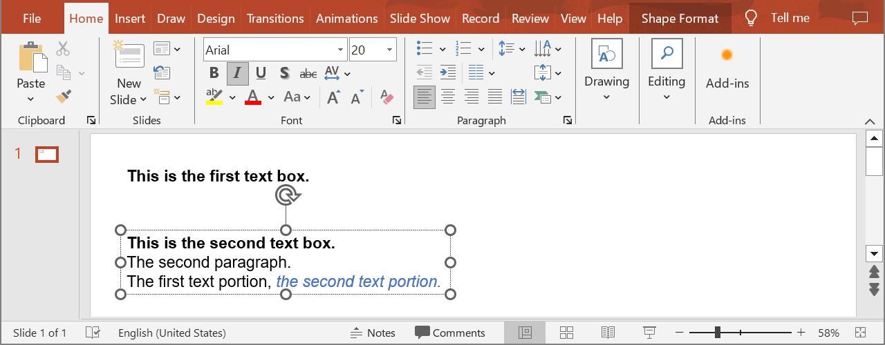

## **Introduction**

Aspose.Slides Cloud API allows you to read, add, modify and delete text portions from PowerPoint presentation slides. Use the following methods to get properties of text portions.

## **GetPortions**

### **API Information**

|**API**|**Type**|**Description**|**Resource**|
| :- | :- | :- | :- |
|/slides/{name}/slides/{slideIndex}/shapes/{shapeIndex}/paragraphs/{paragraphIndex}/portions|GET|Returns information about text portions within a paragraph in a shape located in a presentation saved in a storage.|[GetPortions](https://reference.aspose.cloud/slides/#/Shapes/GetPortions)|

**Request Parameters**

|**Name**|**Type**|**Location**|**Required**|**Description**|
| :- | :- | :- | :- | :- |
|name|string|path|true|The name of a presentation file.|
|slideIndex|integer|path|true|The 1-based index of a slide.|
|shapeIndex|integer|path|true|The 1-based index of a shape.|
|paragraphIndex|integer|path|true|The 1-based index of a paragraph.|
|password|string|header|false|The password to open the presentation.|
|folder|string|query|false|The path to the folder containing the presentation file.|
|storage|string|query|false|The name of the storage contaning the folder.|
|subShape|string|query|false|The path to a child shape (e.g. "3", "3/shapes/2").|

## **GetPortion**

### **API Information**

|**API**|**Type**|**Description**|**Resource**|
| :- | :- | :- | :- |
|/slides/{name}/slides/{slideIndex}/shapes/{shapeIndex}/paragraphs/{paragraphIndex}/portions/{portionIndex}|GET|Returns information about a text portion within a paragraph in a shape located in a presentation saved in a storage.|[GetPortion](https://reference.aspose.cloud/slides/#/Shapes/GetPortion)|

**Request Parameters**

|**Name**|**Type**|**Location**|**Required**|**Description**|
| :- | :- | :- | :- | :- |
|name|string|path|true|The name of a presentation file.|
|slideIndex|integer|path|true|The 1-based index of a slide.|
|shapeIndex|integer|path|true|The 1-based index of a shape.|
|paragraphIndex|integer|path|true|The 1-based index of a paragraph.|
|portionIndex|integer|path|true|The 1-based index of a text portion.|
|password|string|header|false|The password to open the presentation.|
|folder|string|query|false|The path to the folder containing the presentation.|
|storage|string|query|false|The name of the storage contaning the folder.|
|subShape|string|query|false|The path to a child shape (e.g. "3", "3/shapes/2").|

### **Examples**

The document **MyPresentation.pptx** saved in the **default** storage contains two text boxes on the **first** slide. The **second** text box contains three paragraphs. Get properties of the **second** text portion within the **third** paragraph.



**cURL Solution**





**Get an Access Token**

```sh
curl POST "https://api.aspose.cloud/connect/token" \
     -d "grant_type=client_credentials&client_id=MyClientId&client_secret=MyClientSecret" \
     -H "Content-Type: application/x-www-form-urlencoded"
```

**Get the Text Portion Properties**

```sh
curl -X GET "https://api.aspose.cloud/v3.0/slides/MyPresentation.pptx/slides/1/shapes/2/paragraphs/3/portions/2" \
     -H "authorization: Bearer MyAccessToken"
```





**Response Example**

```json
{
  "text": "the second text portion.",
  "fontItalic": "True",
  "fontColor": "#FF4472C4",
  "highlightColor": "#0",
  "fontHeight": 20,
  "languageId": "en-US",
  "fillFormat": {
    "type": "Solid",
    "color": "#FF4472C4"
  },
  "latinFont": "Arial",
  "complexScriptFont": "Arial",
  "selfUri": {
    "href": "https://api.aspose.cloud/v3.0/slides/MyPresentation.pptx/slides/1/shapes/2/paragraphs/3/portions/2",
    "relation": "self",
    "slideIndex": 1,
    "shapeIndex": 2
  }
}
```





**SDK Solutions**





```cs
using System;

using Aspose.Slides.Cloud.Sdk;
using Aspose.Slides.Cloud.Sdk.Model;

class Application
{
    static void Main(string[] args)
    {
        SlidesApi slidesApi = new SlidesApi("MyClientId", "MyClientSecret");

        string fileName = "MyPresentation.pptx";
        int slideIndex = 1;
        int shapeIndex = 2;
        int paragraphIndex = 3;
        int portionIndex = 2;

        Portion portion = slidesApi.GetPortion(fileName, slideIndex, shapeIndex, paragraphIndex, portionIndex);

        Console.WriteLine("Font name: " + portion.LatinFont);       // Arial
        Console.WriteLine("Font height: " + portion.FontHeight);    // 20
        Console.WriteLine("Italic font: " + portion.FontItalic);    // True
        Console.WriteLine("Font color: " + portion.FontColor);      // #FF4472C4
    }
}
```





```java
import com.aspose.slides.ApiException;
import com.aspose.slides.api.SlidesApi;
import com.aspose.slides.model.Portion;

public class Application {
    public static void main(String[] args) throws ApiException {
        SlidesApi slidesApi = new SlidesApi("MyClientId", "MyClientSecret");

        String fileName = "MyPresentation.pptx";
        int slideIndex = 1;
        int shapeIndex = 2;
        int paragraphIndex = 3;
        int portionIndex = 2;

        Portion portion = slidesApi.getPortion(fileName, slideIndex, shapeIndex, paragraphIndex, portionIndex, null, null, null, null);

        System.out.println("Font name: " + portion.getLatinFont());     // Arial
        System.out.println("Font height: " + portion.getFontHeight());  // 20
        System.out.println("Italic font: " + portion.getFontItalic());  // True
        System.out.println("Font color: " + portion.getFontColor());    // #FF4472C4
    }
}
```





```php
use Aspose\Slides\Cloud\Sdk\Api\Configuration;
use Aspose\Slides\Cloud\Sdk\Api\SlidesApi;

$configuration = new Configuration();
$configuration->setAppSid("MyClientId");
$configuration->setAppKey("MyClientSecret");

$slidesApi = new SlidesApi(null, $configuration);

$fileName = "MyPresentation.pptx";
$slideIndex = 1;
$shapeIndex = 2;
$paragraphIndex = 3;
$portionIndex = 2;

$portion = $slidesApi->getPortion($fileName, $slideIndex, $shapeIndex, $paragraphIndex, $portionIndex);

echo "Font name: ", $portion->getLatinFont(), "\n";     // Arial
echo "Font height: ", $portion->getFontHeight(), "\n";  // 20
echo "Italic font: ", $portion->getFontItalic(), "\n";  // True
echo "Font color: ", $portion->getFontColor();          // #FF4472C4
```





```rb
require "aspose_slides_cloud"

include AsposeSlidesCloud

configuration = Configuration.new
configuration.app_sid = "MyClientId"
configuration.app_key = "MyClientSecret"

slides_api = SlidesApi.new(configuration)

file_name = "MyPresentation.pptx"
slide_index = 1
shape_index = 2
paragraph_index = 3
portion_index = 2

portion = slides_api.get_portion(file_name, slide_index, shape_index, paragraph_index, portion_index)

puts "Font name: #{portion.latin_font}"     # Arial
puts "Font height: #{portion.font_height}"  # 20
puts "Italic font: #{portion.font_italic}"  # True
puts "Font color: #{portion.font_color}"    # #FF4472C4
```





```py
from asposeslidescloud.apis import SlidesApi

slides_api = SlidesApi(None, "MyClientId", "MyClientSecret")

file_name = "MyPresentation.pptx"
slide_index = 1
shape_index = 2
paragraph_index = 3
portion_index = 2

portion = slides_api.get_portion(file_name, slide_index, shape_index, paragraph_index, portion_index)

print("Font name:", portion.latin_font)     # Arial
print("Font height:", portion.font_height)  # 20
print("Italic font:", portion.font_italic)  # True
print("Font color:", portion.font_color)    # #FF4472C4
```





```js
const cloudSdk = require("asposeslidescloud");

const slidesApi = new cloudSdk.SlidesApi("MyClientId", "MyClientSecret");

fileName = "MyPresentation.pptx";
slideIndex = 1;
shapeIndex = 2;
paragraphIndex = 3;
portionIndex = 2;

slidesApi.getPortion(fileName, slideIndex, shapeIndex, paragraphIndex, portionIndex).then(portion => {
    console.log("Font name: " + portion.body.latinFont);     // Arial
    console.log("Font height: " + portion.body.fontHeight);  // 20
    console.log("Italic font: " + portion.body.fontItalic);  // True
    console.log("Font color: " + portion.body.fontColor);    // #FF4472C4
});
```





```cpp
#include "asposeslidescloud/api/SlidesApi.h"

using namespace asposeslidescloud::api;

int main()
{
    std::shared_ptr<SlidesApi> slidesApi = std::make_shared<SlidesApi>(L"MyClientId", L"MyClientSecret");

    const wchar_t* fileName = L"MyPresentation.pptx";
    int slideIndex = 1;
    int shapeIndex = 2;
    int paragraphIndex = 3;
    int portionIndex = 2;

    std::shared_ptr<Portion> portion = slidesApi->getPortion(fileName, slideIndex, shapeIndex, paragraphIndex, portionIndex).get();

    std::wcout << L"Font name: " << portion->getLatinFont() << L"\r\n";     // Arial
    std::wcout << L"Font height: " << portion->getFontHeight() << L"\r\n";  // 20
    std::wcout << L"Italic font: " << portion->getFontItalic() << L"\r\n";  // True
    std::wcout << L"Font color: " << portion->getFontColor();               // #FF4472C4
}
```





```pl
use AsposeSlidesCloud::Configuration;
use AsposeSlidesCloud::SlidesApi;

my $configuration = AsposeSlidesCloud::Configuration->new();
$configuration->{app_sid} = "MyClientId";
$configuration->{app_key} = "MyClientSecret";

my $slides_api = AsposeSlidesCloud::SlidesApi->new(config => $configuration);

my $file_name = "MyPresentation.pptx";
my $slide_index = 1;
my $shape_index = 2;
my $paragraph_index = 3;
my $portion_index = 2;

my $portion = $slides_api->get_portion(
    name => $file_name, slide_index => $slide_index, shape_index => $shape_index, paragraph_index => $paragraph_index, portion_index => $portion_index);

print("Font name: ", $portion->{latin_font}, "\n");     # Arial
print("Font height: ", $portion->{font_height}, "\n");  # 20
print("Italic font: ", $portion->{font_italic}, "\n");  # True
print("Font color: ", $portion->{font_color});          # #FF4472C4
```









```go
import (
	"fmt"

	asposeslidescloud "github.com/aspose-slides-cloud/aspose-slides-cloud-go/v24"
)

func main() {
	configuration := asposeslidescloud.NewConfiguration()
	configuration.AppSid = "MyClientId"
	configuration.AppKey = "MyClientSecret"

	slidesApi := asposeslidescloud.NewAPIClient(configuration).SlidesApi

	fileName := "MyPresentation.pptx"
	var slideIndex int32 = 1
	var shapeIndex int32 = 2
	var paragraphIndex int32 = 3
	var portionIndex int32 = 2

	portion, _, _ := slidesApi.GetPortion(fileName, slideIndex, shapeIndex, paragraphIndex, portionIndex, "", "", "", "")

	fmt.Println("Font name:", portion.GetLatinFont())    // Arial
	fmt.Println("Font height:", portion.GetFontHeight()) // 20
	fmt.Println("Italic font:", portion.GetFontItalic()) // True
	fmt.Println("Font color:", portion.GetFontColor())   // #FF4472C4
}
```





## **SDKs**

Check [Available SDKs](/slides/available-sdks/) to learn how to add an SDK to your project.
