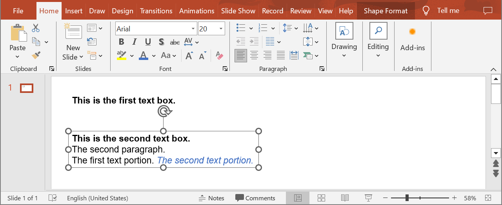
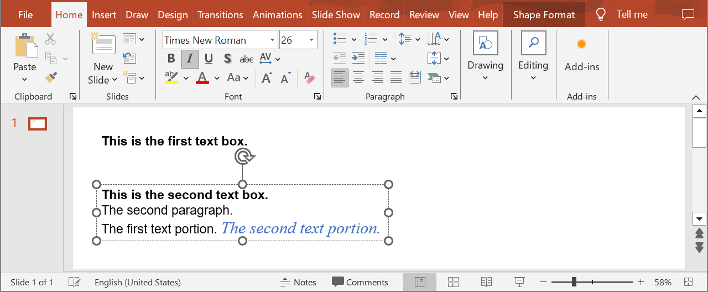

## **Introduction**

Aspose.Slides Cloud API allows you to read, add, modify and delete text portions from PowerPoint presentation slides. Use the following method to update text portions within paragraphs.

## **UpdatePortion**

### **API Information**

|**API**|**Type**|**Description**|**Resource**|
| :- | :- | :- | :- |
|/slides/{name}/slides/{slideIndex}/shapes/{shapeIndex}/paragraphs/{paragraphIndex}/portions/{portionIndex}|PUT|Updates a text portion within a paragraph in a shape located in a presentation saved in a storage.|[UpdatePortion](https://reference.aspose.cloud/slides/#/Shapes/UpdatePortion)|

**Request Parameters**

|**Name**|**Type**|**Location**|**Required**|**Description**|
| :- | :- | :- | :- | :- |
|name|string|path|true|The name of a presentation file.|
|slideIndex|integer|path|true|The 1-based index of a slide.|
|shapeIndex|integer|path|true|The 1-based index of a shape.|
|paragraphIndex|integer|path|true|The 1-based index of a paragraph.|
|portionIndex|integer|path|true|The 1-based index of a text portion.|
|dto|`Portion`|body|true|The data transfer object with parameters for the text portion.|
|password|string|header|false|The password to open the presentation.|
|folder|string|query|false|The path to the folder containing the presentation file.|
|storage|string|query|false|The name of the storage contaning the folder.|
|subShape|string|query|false|The path to a child shape (e.g. "3", "3/shapes/2").|

### **Examples**

The document **MyPresentation.pptx** saved in the **default** storage contains two text boxes on the **first** slide. The **second** text box contains three paragraphs. Set the following options for the **second** text portion in the **third** paragraph:
- font: Times New Roman
- font size: 26



**cURL Solution**





**Get an Access Token**

```sh
curl POST "https://api.aspose.cloud/connect/token" \
     -d "grant_type=client_credentials&client_id=MyClientId&client_secret=MyClientSecret" \
     -H "Content-Type: application/x-www-form-urlencoded"
```

**Update the Text Portion**

```sh
curl -X PUT "https://api.aspose.cloud/v3.0/slides/MyPresentation.pptx/slides/1/shapes/2/paragraphs/3/portions/2" \
     -H "authorization: Bearer MyAccessToken" \
     -H "Content-Type: application/json" \
     -d @TextPortion.json
```

TextPortion.json content:
```json
{
  "LatinFont": "Times New Roman",
  "FontHeight": 26
}
```





**Response Example**

```json
{
  "text": "The second text portion.",
  "fontItalic": "True",
  "fontColor": "#FF4472C4",
  "highlightColor": "#0",
  "fontHeight": 26,
  "languageId": "en-US",
  "fillFormat": {
    "type": "Solid",
    "color": "#FF4472C4"
  },
  "latinFont": "Times New Roman",
  "complexScriptFont": "Arial",
  "selfUri": {
    "href": "https://api.aspose.cloud/v3.0/slides/MyPresentation.pptx/slides/1/shapes/2/paragraphs/3/portions/2",
    "relation": "self",
    "slideIndex": 1,
    "shapeIndex": 2
  }
}
```





**SDK Solutions**





```cs
using System;

using Aspose.Slides.Cloud.Sdk;
using Aspose.Slides.Cloud.Sdk.Model;

class Application
{
    static void Main(string[] args)
    {
        SlidesApi slidesApi = new SlidesApi("MyClientId", "MyClientSecret");

        string fileName = "MyPresentation.pptx";
        int slideIndex = 1;
        int shapeIndex = 2;
        int paragraphIndex = 3;
        int portionIndex = 2;

        Portion textPortion = new Portion
        {
            LatinFont = "Times New Roman",
            FontHeight = 26
        };

        Portion updatedPortion = slidesApi.UpdatePortion(fileName, slideIndex, shapeIndex, paragraphIndex, portionIndex, textPortion);

        Console.WriteLine("Font name: " + updatedPortion.LatinFont);  // Times New Roman
        Console.WriteLine("Font size: " + updatedPortion.FontHeight); // 26
    }
}
```





```java
import com.aspose.slides.ApiException;
import com.aspose.slides.api.SlidesApi;
import com.aspose.slides.model.Portion;

public class Application {
    public static void main(String[] args) throws ApiException {
        SlidesApi slidesApi = new SlidesApi("MyClientId", "MyClientSecret");

        String fileName = "MyPresentation.pptx";
        int slideIndex = 1;
        int shapeIndex = 2;
        int paragraphIndex = 3;
        int portionIndex = 2;

        Portion textPortion = new Portion();
        textPortion.setLatinFont("Times New Roman");
        textPortion.setFontHeight(26d);

        Portion updatedPortion = slidesApi.updatePortion(fileName, slideIndex, shapeIndex, paragraphIndex, portionIndex, textPortion, null, null, null, null);

        System.out.println("Font name: " + updatedPortion.getLatinFont());  // Times New Roman
        System.out.println("Font size: " + updatedPortion.getFontHeight()); // 26
    }
}
```





```php
use Aspose\Slides\Cloud\Sdk\Api\Configuration;
use Aspose\Slides\Cloud\Sdk\Api\SlidesApi;
use Aspose\Slides\Cloud\Sdk\Model\Portion;

$configuration = new Configuration();
$configuration->setAppSid("MyClientId");
$configuration->setAppKey("MyClientSecret");

$slidesApi = new SlidesApi(null, $configuration);

$fileName = "MyPresentation.pptx";
$slideIndex = 1;
$shapeIndex = 2;
$paragraphIndex = 3;
$portionIndex = 2;

$textPortion = new Portion();
$textPortion->setLatinFont("Times New Roman");
$textPortion->setFontHeight(26);

$updatedPortion = $slidesApi->updatePortion($fileName, $slideIndex, $shapeIndex, $paragraphIndex, $portionIndex, $textPortion);

echo "Font name: ", $updatedPortion->getLatinFont(), "\n"; // Times New Roman
echo "Font size: ", $updatedPortion->getFontHeight();      // 26
```





```rb
require "aspose_slides_cloud"

include AsposeSlidesCloud

configuration = Configuration.new
configuration.app_sid = "MyClientId"
configuration.app_key = "MyClientSecret"

slides_api = SlidesApi.new(configuration)

file_name = "MyPresentation.pptx"
slide_index = 1
shape_index = 2
paragraph_index = 3
portion_index = 2

text_portion = Portion.new
text_portion.latin_font = "Times New Roman"
text_portion.font_height = 26

updated_portion = slides_api.update_portion(file_name, slide_index, shape_index, paragraph_index, portion_index, text_portion)

puts "Font name: #{updated_portion.latin_font}"  # Times New Roman
puts "Font size: #{updated_portion.font_height}" # 26
```





```py
from asposeslidescloud.apis import SlidesApi
from asposeslidescloud.models import Portion

slides_api = SlidesApi(None, "MyClientId", "MyClientSecret")

file_name = "MyPresentation.pptx"
slide_index = 1
shape_index = 2
paragraph_index = 3
portion_index = 2

text_portion = Portion()
text_portion.latin_font = "Times New Roman"
text_portion.font_height = 26

updated_portion = slides_api.update_portion(file_name, slide_index, shape_index, paragraph_index, portion_index, text_portion)

print("Font name:", updated_portion.latin_font)   # Times New Roman
print("Font size:", updated_portion.font_height)  # 26
```





```js
const cloudSdk = require("asposeslidescloud");

const slidesApi = new cloudSdk.SlidesApi("MyClientId", "MyClientSecret");

fileName = "MyPresentation.pptx";
slideIndex = 1;
shapeIndex = 2;
paragraphIndex = 3;
portionIndex = 2;

textPortion = new cloudSdk.Portion();
textPortion.latinFont = "Times New Roman";
textPortion.fontHeight = 26;

slidesApi.updatePortion(fileName, slideIndex, shapeIndex, paragraphIndex, portionIndex, textPortion).then(updatedPortion => {
    console.log("Font name:", updatedPortion.body.latinFont);  // Times New Roman
    console.log("Font size:", updatedPortion.body.fontHeight); // 26
});
```





```cpp
#include "asposeslidescloud/api/SlidesApi.h"

using namespace asposeslidescloud::api;

int main()
{
    std::shared_ptr<SlidesApi> slidesApi = std::make_shared<SlidesApi>(L"MyClientId", L"MyClientSecret");

    const wchar_t* fileName = L"MyPresentation.pptx";
    int slideIndex = 1;
    int shapeIndex = 2;
    int paragraphIndex = 3;
    int portionIndex = 2;

    std::shared_ptr<Portion> textPortion = std::make_shared<Portion>();
    textPortion->setLatinFont(L"Times New Roman");
    textPortion->setFontHeight(26);

    std::shared_ptr<Portion> updatedPortion = slidesApi->updatePortion(fileName, slideIndex, shapeIndex, paragraphIndex, portionIndex, textPortion).get();

    std::wcout << L"Font name: " << updatedPortion->getLatinFont() << L"\n"; // Times New Roman
    std::wcout << L"Font size: " << updatedPortion->getFontHeight();         // 26
}
```





```pl
use AsposeSlidesCloud::Configuration;
use AsposeSlidesCloud::SlidesApi;
use AsposeSlidesCloud::Object::Portion;

my $configuration = AsposeSlidesCloud::Configuration->new();
$configuration->{app_sid} = "MyClientId";
$configuration->{app_key} = "MyClientSecret";

my $slides_api = AsposeSlidesCloud::SlidesApi->new(config => $configuration);

my $file_name = "MyPresentation.pptx";
my $slide_index = 1;
my $shape_index = 2;
my $paragraph_index = 3;
my $portion_index = 2;

my $text_portion = AsposeSlidesCloud::Object::Portion->new();
$text_portion->{latin_font} = "Times New Roman";
$text_portion->{font_height} = 26;

my $updated_portion = $slides_api->update_portion(
    name => $file_name, slide_index => $slide_index, shape_index => $shape_index, paragraph_index => $paragraph_index, portion_index => $portion_index, dto => $text_portion);

print("Font name: ", $updated_portion->{latin_font}, "\n"); # Times New Roman
print("Font size: ", $updated_portion->{font_height});      # 26
```









```go
import (
	"fmt"

	asposeslidescloud "github.com/aspose-slides-cloud/aspose-slides-cloud-go/v24"
)

func main() {
	configuration := asposeslidescloud.NewConfiguration()
	configuration.AppSid = "MyClientId"
	configuration.AppKey = "MyClientSecret"

	slidesApi := asposeslidescloud.NewAPIClient(configuration).SlidesApi

	fileName := "MyPresentation.pptx"
	var slideIndex int32 = 1
	var shapeIndex int32 = 2
	var paragraphIndex int32 = 3
	var portionIndex int32 = 2

	textPortion := asposeslidescloud.NewPortion()
	textPortion.LatinFont = "Times New Roman"
	textPortion.FontHeight = 26

	updatedPortion, _, _ := slidesApi.UpdatePortion(fileName, slideIndex, shapeIndex, paragraphIndex, portionIndex, textPortion, "", "", "", "")

	fmt.Println("Font name:", updatedPortion.GetLatinFont())  // Times New Roman
	fmt.Println("Font size:", updatedPortion.GetFontHeight()) // 26
}
```





The result:



## **SDKs**

Check [Available SDKs](/slides/available-sdks/) to learn how to add an SDK to your project.
