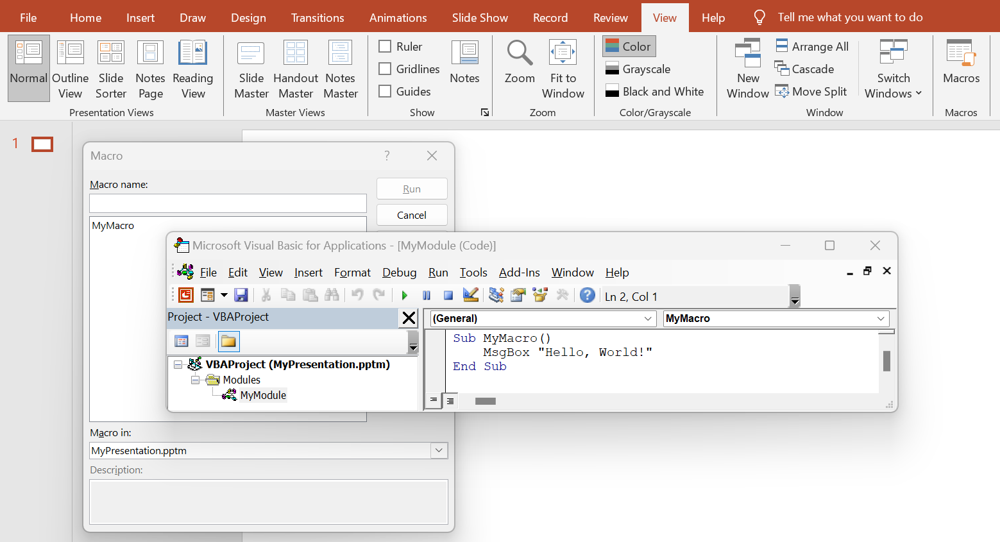

## **Introduction**

VBA modules in PowerPoint are used to automate tasks and add functionality that is not supported by the standard PowerPoint features. VBA allows you to write macros and create custom functions that can perform various operations, such as modifying slides, working with objects on a slide, managing animations, and much more. Use the folowing method to add modules to VBA projects.

## **CreateVbaModule**

### **API Information**

|**API**|**Type**|**Description**|**Resource**|
| :- | :- | :- | :- |
|/slides/{name}/vbaProject/modules|POST|Adds a module to a VBA project in a presentation saved in a storage.|[CreateVbaModule](https://reference.aspose.cloud/slides/#/Vba/CreateVbaModule)|

**Request Parameters**

|**Name**|**Type**|**Location**|**Required**|**Description**|
| :- | :- | :- | :- | :- |
|name|string|path|true|The name of a presentation file.|
|moduleDto|`VbaModule`|body|true|The data transfer object with module parameters.|
|password|string|header|false|The password to open the presentation.|
|folder|string|query|false|The path to the folder containing the presentation file.|
|storage|string|query|false|The name of the storage contaning the folder.|

### **Examples**

The **default** storage contains the document **MyPresentation.pptm**. Add a module **MyModule** for a macro **MyMacro** with the following code:
```vb
Sub MyMacro()
    MsgBox "Hello, World!"
End Sub
```

**cURL Solution**




**Get an Access Token**
```sh
curl -X POST "https://api.aspose.cloud/connect/token" \
     -d "grant_type=client_credentials&client_id=MyClientId&client_secret=MyClientSecret" \
     -H "Content-Type: application/x-www-form-urlencoded"
```

**Add the VBA Module**
```sh
curl -X POST "https://api.aspose.cloud/v3.0/slides/MyPresentation.pptm/vbaProject/modules" \
     -H "authorization: Bearer MyAccessToken" \
     -H "Content-Type: application/json" \
     -d @vbaModule.json
```

vbaModule.json content:
```json
{
    "name": "MyModule",
    "sourceCode": "Sub MyMacro()\r\n    MsgBox \"Hello, World!\"\r\nEnd Sub\r\n"
}
```



```json
{
  "name": "MyModule",
  "sourceCode": "Sub MyMacro()\r\n    MsgBox \"Hello, World!\"\r\nEnd Sub\r\n",
  "references": [],
  "selfUri": {
    "href": "https://api.aspose.cloud/v3.0/slides/MyPresentation.pptm/vbaProject/modules/1",
    "relation": "self"
  }
}
```




**SDK Solutions**




```cs
using Aspose.Slides.Cloud.Sdk;
using Aspose.Slides.Cloud.Sdk.Model;
using System;

class Application
{
    static void Main(string[] args)
    {
        SlidesApi slidesApi = new SlidesApi("MyClientId", "MyClientSecret");

        string fileName = "MyPresentation.pptm";

        VbaModule vbaModule = new VbaModule
        {
            Name = "MyModule",
            SourceCode = "Sub MyMacro()\r\n    MsgBox \"Hello, World!\"\r\nEnd Sub\r\n"
        };

        VbaModule addedModule = slidesApi.CreateVbaModule(fileName, vbaModule);

        Console.WriteLine("Module name: " + addedModule.Name); // MyModule
    }
}
```



```java
import com.aspose.slides.ApiException;
import com.aspose.slides.api.SlidesApi;
import com.aspose.slides.model.VbaModule;

public class Application {
    public static void main(String[] args) throws ApiException {
        SlidesApi slidesApi = new SlidesApi("MyClientId", "MyClientSecret");

        String fileName = "MyPresentation.pptm";

        VbaModule vbaModule = new VbaModule();
        vbaModule.setName("MyModule");
        vbaModule.setSourceCode("Sub MyMacro()\r\n    MsgBox \"Hello, World!\"\r\nEnd Sub\r\n");

        VbaModule addedModule = slidesApi.createVbaModule(fileName, vbaModule, null, null, null);

        System.out.println("Module name: " + addedModule.getName()); // MyModule
    }
}
```



```php
use Aspose\Slides\Cloud\Sdk\Api\Configuration;
use Aspose\Slides\Cloud\Sdk\Api\SlidesApi;
use Aspose\Slides\Cloud\Sdk\Model\VbaModule;

$configuration = new Configuration();
$configuration->setAppSid("MyClientId");
$configuration->setAppKey("MyClientSecret");

$slidesApi = new SlidesApi(null, $configuration);

$fileName = "MyPresentation.pptm";

$vbaModule = new VbaModule();
$vbaModule->setName("MyModule");
$vbaModule->setSourceCode("Sub MyMacro()\r\n    MsgBox \"Hello, World!\"\r\nEnd Sub\r\n");

$addedModule = $slidesApi->createVbaModule($fileName, $vbaModule);

print("Module name: " . $addedModule->getName()); // MyModule
```



```rb
require "aspose_slides_cloud"

include AsposeSlidesCloud

configuration = Configuration.new
configuration.app_sid = "MyClientId"
configuration.app_key = "MyClientSecret"

slides_api = SlidesApi.new(configuration)

file_name = "MyPresentation.pptm"

vba_module = VbaModule.new
vba_module.name = "MyModule"
vba_module.source_code = "Sub MyMacro()\r\n    MsgBox \"Hello, World!\"\r\nEnd Sub\r\n"

added_module = slides_api.create_vba_module(file_name, vba_module)

puts "Module name: #{added_module.name}" # MyModule
```



```py
from asposeslidescloud.apis import SlidesApi
from asposeslidescloud.models import VbaModule

slides_api = SlidesApi(None, "MyClientId", "MyClientSecret")

file_name = "MyPresentation.pptm"

vba_module = VbaModule()
vba_module.name = "MyModule"
vba_module.source_code = "Sub MyMacro()\r\n    MsgBox \"Hello, World!\"\r\nEnd Sub\r\n"

added_module = slides_api.create_vba_module(file_name, vba_module)

print("Module name:", added_module.name)  # MyModule
```



```js
const cloudSdk = require("asposeslidescloud");

const slidesApi = new cloudSdk.SlidesApi("MyClientId", "MyClientSecret");

fileName = "MyPresentation.pptm";

vbaModule = new cloudSdk.VbaModule();
vbaModule.name = "MyModule";
vbaModule.sourceCode = "Sub MyMacro()\r\n    MsgBox \"Hello, World!\"\r\nEnd Sub\r\n";

slidesApi.createVbaModule(fileName, vbaModule).then(addedModule => {
    console.log("Module name:", addedModule.body.name); // MyModule
});
```



```go
import (
	"fmt"

	asposeslidescloud "github.com/aspose-slides-cloud/aspose-slides-cloud-go/v24"
)

func main() {
	configuration := asposeslidescloud.NewConfiguration()
	configuration.AppSid = "MyClientId"
	configuration.AppKey = "MyClientSecret"

	slidesApi := asposeslidescloud.NewAPIClient(configuration).SlidesApi

	fileName := "MyPresentation.pptm"

	vbaModule := asposeslidescloud.NewVbaModule()
	vbaModule.Name = "MyModule"
	vbaModule.SourceCode = "Sub MyMacro()\r\n    MsgBox \"Hello, World!\"\r\nEnd Sub\r\n"

	addedModule, _, _ := slidesApi.CreateVbaModule(fileName, vbaModule, "", "", "")

	fmt.Println("Module name:", addedModule.GetName()) // MyModule
}
```



```cpp
#include "asposeslidescloud/api/SlidesApi.h"

using namespace asposeslidescloud::api;

int main()
{
    std::shared_ptr<SlidesApi> slidesApi = std::make_shared<SlidesApi>(L"MyClientId", L"MyClientSecret");

    const wchar_t* fileName = L"MyPresentation.pptm";

    std::shared_ptr<VbaModule> vbaModule = std::make_shared<VbaModule>();
    vbaModule->setName(L"MyModule");
    vbaModule->setSourceCode(L"Sub MyMacro()\r\n    MsgBox \"Hello, World!\"\r\nEnd Sub\r\n");

    std::shared_ptr<VbaModule> addedModule = slidesApi->createVbaModule(fileName, vbaModule).get();

    std::wcout << L"Module name: " << addedModule->getName(); // MyModule
}
```



```pl
use AsposeSlidesCloud::Configuration;
use AsposeSlidesCloud::SlidesApi;
use AsposeSlidesCloud::Object::VbaModule;

my $configuration = AsposeSlidesCloud::Configuration->new();
$configuration->{app_sid} = "MyClientId";
$configuration->{app_key} = "MyClientSecret";

my $slides_api = AsposeSlidesCloud::SlidesApi->new(config => $configuration);

my $vba_module = AsposeSlidesCloud::Object::VbaModule->new();
$vba_module->{name} = "MyModule";
$vba_module->{source_code} = "Sub MyMacro()\r\n    MsgBox \"Hello, World!\"\r\nEnd Sub\r\n";

my $added_module = $slides_api->create_vba_module(
    name => "MyPresentation.pptm",
    module_dto => $vba_module);

print("Module name: ", $added_module->{name}); # MyModule
```




The result:



## **SDKs**

Check [Available SDKs](/slides/available-sdks/) to learn how to add an SDK to your project.
