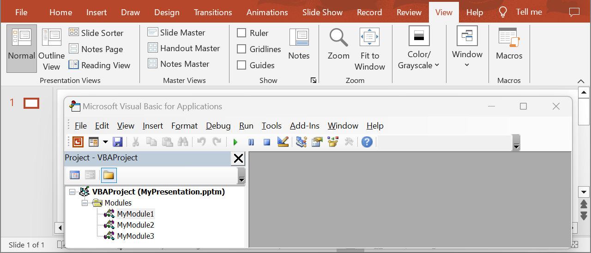

## **Introduction**

VBA modules in PowerPoint are used to automate tasks and add functionality that is not supported by the standard PowerPoint features. VBA allows you to write macros and create custom functions that can perform various operations, such as modifying slides, working with objects on a slide, managing animations, and much more. Use the folowing method to delete VBA modules.

## **DeleteVbaModule**

### **API Information**

|**API**|**Type**|**Description**|**Resource**|
| :- | :- | :- | :- |
|/slides/{name}/vbaProject/modules/{moduleIndex}|DELETE|Deletes a VBA module from a presentation saved in a storage.|[DeleteVbaModule](https://reference.aspose.cloud/slides/#/Vba/DeleteVbaModule)|

**Request Parameters**

|**Name**|**Type**|**Location**|**Required**|**Description**|
| :- | :- | :- | :- | :- |
|name|string|path|true|The name of a presentation file.|
|moduleIndex|integer|path|true|The 1-based index of a VBA module.|
|password|string|header|false|The password to open the presentation.|
|folder|string|query|false|The path to the folder containing the presentation file.|
|storage|string|query|false|The name of the storage contaning the folder.|

### **Examples**

In the **default** storage, the document **MyPresentation.pptm** contains a VBA project with three modules. Delete the **second** module.



**cURL Solution**




**Get an Access Token**
```sh
curl -X POST "https://api.aspose.cloud/connect/token" \
     -d "grant_type=client_credentials&client_id=MyClientId&client_secret=MyClientSecret" \
     -H "Content-Type: application/x-www-form-urlencoded"
```

**Delete the VBA Module**
```sh
curl -X DELETE "https://api.aspose.cloud/v3.0/slides/MyPresentation.pptm/vbaProject/modules/2" \
     -H "authorization: Bearer MyAccessToken"
```




```json
{
  "modules": [
    {
      "href": "https://api.aspose.cloud/v3.0/slides/MyPresentation.pptm/vbaProject/modules/1",
      "relation": "self"
    },
    {
      "href": "https://api.aspose.cloud/v3.0/slides/MyPresentation.pptm/vbaProject/modules/2",
      "relation": "self"
    }
  ],
  "references": [
    {
      "name": "stdole"
    },
    {
      "name": "Office"
    }
  ],
  "selfUri": {
    "href": "https://api.aspose.cloud/v3.0/slides/MyPresentation.pptm/vbaProject",
    "relation": "self"
  }
}
```




**SDK Solutions**




```cs
using System;
using Aspose.Slides.Cloud.Sdk;
using Aspose.Slides.Cloud.Sdk.Model;

class Application
{
    static void Main(string[] args)
    {
        SlidesApi slidesApi = new SlidesApi("MyClientId", "MyClientSecret");

        string fileName = "MyPresentation.pptm";
        int moduleIndex = 2;

        VbaProject vbaProject = slidesApi.DeleteVbaModule(fileName, moduleIndex);

        int moduleCount = vbaProject.Modules.Count;
        Console.WriteLine("Number of modules: " + moduleCount); // 2
    }
}
```



```java
import com.aspose.slides.ApiException;
import com.aspose.slides.api.SlidesApi;
import com.aspose.slides.model.VbaProject;

public class Application {
    public static void main(String[] args) throws ApiException {
        SlidesApi slidesApi = new SlidesApi("MyClientId", "MyClientSecret");

        String fileName = "MyPresentation.pptm";
        int moduleIndex = 2;

        VbaProject vbaProject = slidesApi.deleteVbaModule(fileName, moduleIndex, null, null, null);

        int moduleCount = vbaProject.getModules().size();
        System.out.println("Number of modules: " + moduleCount); // 2
    }
}
```



```php
use Aspose\Slides\Cloud\Sdk\Api\Configuration;
use Aspose\Slides\Cloud\Sdk\Api\SlidesApi;

$configuration = new Configuration();
$configuration->setAppSid("MyClientId");
$configuration->setAppKey("MyClientSecret");

$slidesApi = new SlidesApi(null, $configuration);

$fileName = "MyPresentation.pptm";
$moduleIndex = 2;

$vbaProject = $slidesApi->deleteVbaModule($fileName, $moduleIndex);

$moduleCount = count($vbaProject->getModules());
print("Number of modules: " . $moduleCount); // 2
```



```rb
require "aspose_slides_cloud"

include AsposeSlidesCloud

configuration = Configuration.new
configuration.app_sid = "MyClientId"
configuration.app_key = "MyClientSecret"

slides_api = SlidesApi.new(configuration)

file_name = "MyPresentation.pptm"
module_index = 2

vba_project = slides_api.delete_vba_module(file_name, module_index)

module_count = vba_project.modules.length()
puts("Number of modules: #{module_count}") # 2
```




```py
from asposeslidescloud.apis import SlidesApi

slides_api = SlidesApi(None, "MyClientId", "MyClientSecret")

file_name = "MyPresentation.pptm"
module_index = 2

vba_project = slides_api.delete_vba_module(file_name, module_index)

module_count = len(vba_project.modules)
print("Number of modules:", module_count)  # 2
```



```js
const cloudSdk = require("asposeslidescloud");

const slidesApi = new cloudSdk.SlidesApi("MyClientId", "MyClientSecret");

fileName = "MyPresentation.pptm";
moduleIndex = 2;

slidesApi.deleteVbaModule(fileName, moduleIndex).then(vbaProject => {
    moduleCount = vbaProject.body.modules.length;
    console.log("Number of modules:", moduleCount); // 2
});
```



```go
import (
	"fmt"

	asposeslidescloud "github.com/aspose-slides-cloud/aspose-slides-cloud-go/v24"
)

func main() {
	configuration := asposeslidescloud.NewConfiguration()
	configuration.AppSid = "MyClientId"
	configuration.AppKey = "MyClientSecret"

	slidesApi := asposeslidescloud.NewAPIClient(configuration).SlidesApi

	fileName := "MyPresentation.pptm"
	var moduleIndex int32 = 2

	vbaProject, _, _ := slidesApi.DeleteVbaModule(fileName, moduleIndex, "", "", "")

	moduleCount := len(vbaProject.GetModules())
	fmt.Println("Number of modules:", moduleCount) // 2
}
```



```cpp
#include "asposeslidescloud/api/SlidesApi.h"

using namespace asposeslidescloud::api;

int main()
{
    std::shared_ptr<SlidesApi> slidesApi = std::make_shared<SlidesApi>(L"MyClientId", L"MyClientSecret");

    const wchar_t* fileName = L"MyPresentation.pptm";
    int moduleIndex = 2;

    std::shared_ptr<VbaProject> vbaProject = slidesApi->deleteVbaModule(fileName, moduleIndex).get();

    int moduleCount = vbaProject->getModules().size();
    std::wcout << L"Number of modules: " << moduleCount; // 2
}
```



```pl
use AsposeSlidesCloud::Configuration;
use AsposeSlidesCloud::SlidesApi;

my $configuration = AsposeSlidesCloud::Configuration->new();
$configuration->{app_sid} = "MyClientId";
$configuration->{app_key} = "MyClientSecret";

my $slides_api = AsposeSlidesCloud::SlidesApi->new(config => $configuration);


my $vba_project = $slides_api->delete_vba_module(
    name => "MyPresentation.pptm",
    module_index => 2);

my $module_count = @{$vba_project->{modules}};
print "Number of modules: ", $module_count; # 2
```




The result:


## **SDKs**

Check [Available SDKs](/slides/available-sdks/) to learn how to add an SDK to your project.
