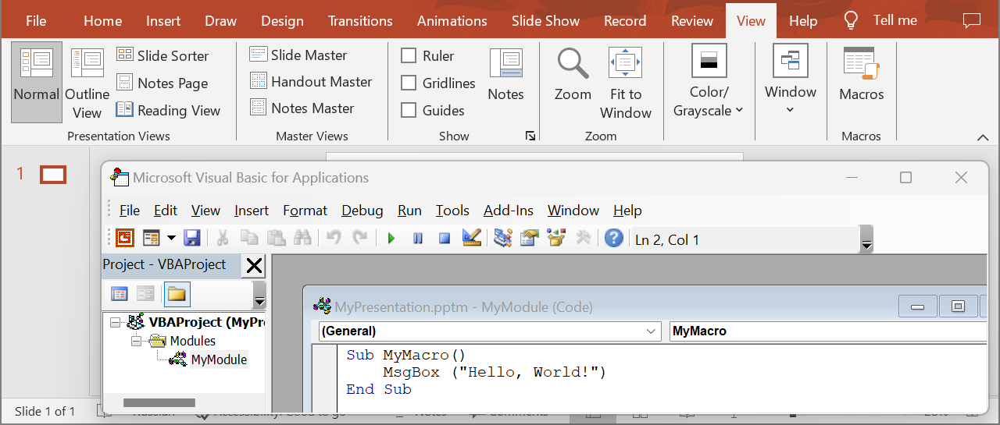

## **Introduction**

VBA (Visual Basic for Applications) modules in PowerPoint are used to automate tasks and add functionality that is not supported by the standard PowerPoint features. VBA allows you to write macros and create custom functions that can perform various operations, such as modifying slides, working with objects on a slide, managing animations, and much more. Use the following method to get modules from VBA projects.

## **GetVbaModule**

### **API Information**

|**API**|**Type**|**Description**|**Resource**|
| :- | :- | :- | :- |
|/slides/{name}/vbaProject/modules/{moduleIndex}|GET|Returns a VBA module from a presentation saved in a storage.|[GetVbaModule](https://reference.aspose.cloud/slides/#/Vba/GetVbaModule)|

**Request Parameters**

|**Name**|**Type**|**Location**|**Required**|**Description**|
| :- | :- | :- | :- | :- |
|name|string|path|true|The name of a presentation file.|
|moduleIndex|integer|path|true|The 1-based index of a VBA module.|
|password|string|header|false|The password to open the presentation.|
|folder|string|query|false|The path to the folder containing the presentation file.|
|storage|string|query|false|The name of the storage contaning the folder.|

### **Examples**

In the **default** storage, the document **MyPresentation.pptm** contains a VBA project with one module. Get the source code from the module.



**cURL Solution**




**Get an Access Token**
```sh
curl -X POST "https://api.aspose.cloud/connect/token" \
     -d "grant_type=client_credentials&client_id=MyClientId&client_secret=MyClientSecret" \
     -H "Content-Type: application/x-www-form-urlencoded"
```

**Get the VBA Module**
```sh
curl -X GET "https://api.aspose.cloud/v3.0/slides/MyPresentation.pptm/vbaProject/modules/1" \
     -H "authorization: Bearer MyAccessToken"
```



```json
{
  "name": "MyModule",
  "sourceCode": "Attribute VB_Name = \"MyModule\"\r\nSub MyMacro()\r\n    MsgBox (\"Hello, World!\")\r\nEnd Sub\r\n",
  "references": [],
  "selfUri": {
    "href": "https://api.aspose.cloud/v3.0/slides/MyPresentation.pptm/vbaProject/modules/1",
    "relation": "self"
  }
}
```




**SDK Solutions**




```cs
using System;
using Aspose.Slides.Cloud.Sdk;
using Aspose.Slides.Cloud.Sdk.Model;

class Application
{
    static void Main(string[] args)
    {
        SlidesApi slidesApi = new SlidesApi("MyClientId", "MyClientSecret");

        string fileName = "MyPresentation.pptm";
        int moduleIndex = 1;

        VbaModule vbaModule = slidesApi.GetVbaModule(fileName, moduleIndex);

        Console.WriteLine(vbaModule.SourceCode);
    }
}

// Example output:
//
// Attribute VB_Name = "MyModule"
// Sub MyMacro()
//     MsgBox ("Hello, World!")
// End Sub
```



```java
import com.aspose.slides.ApiException;
import com.aspose.slides.api.SlidesApi;
import com.aspose.slides.model.VbaModule;

public class Application {
    public static void main(String[] args) throws ApiException {
        SlidesApi slidesApi = new SlidesApi("MyClientId", "MyClientSecret");

        String fileName = "MyPresentation.pptm";
        int moduleIndex = 1;

        VbaModule vbaModule = slidesApi.getVbaModule(fileName, moduleIndex, null, null, null);

        System.out.println(vbaModule.getSourceCode());
    }
}

// Example output:
//
// Attribute VB_Name = "MyModule"
// Sub MyMacro()
//     MsgBox ("Hello, World!")
// End Sub
```



```php
use Aspose\Slides\Cloud\Sdk\Api\Configuration;
use Aspose\Slides\Cloud\Sdk\Api\SlidesApi;

$configuration = new Configuration();
$configuration->setAppSid("MyClientId");
$configuration->setAppKey("MyClientSecret");

$slidesApi = new SlidesApi(null, $configuration);

$fileName = "MyPresentation.pptm";
$moduleIndex = 1;

$vbaModule = $slidesApi->getVbaModule($fileName, $moduleIndex);

print($vbaModule->getSourceCode());

// Example output:
//
// Attribute VB_Name = "MyModule"
// Sub MyMacro()
//     MsgBox ("Hello, World!")
// End Sub
```



```rb
require "aspose_slides_cloud"

include AsposeSlidesCloud

configuration = Configuration.new
configuration.app_sid = "MyClientId"
configuration.app_key = "MyClientSecret"

slides_api = SlidesApi.new(configuration)

file_name = "MyPresentation.pptm"
module_index = 1

vba_module = slides_api.get_vba_module(file_name, module_index)

puts vba_module.source_code

# Example output:
#
# Attribute VB_Name = "MyModule"
# Sub MyMacro()
#     MsgBox ("Hello, World!")
# End Sub
```



```py
from asposeslidescloud.apis import SlidesApi

slides_api = SlidesApi(None, "MyClientId", "MyClientSecret")

file_name = "MyPresentation.pptm"
module_index = 1

vba_module = slides_api.get_vba_module(file_name, module_index)

print(vba_module.source_code)

# Example output:
#
# Attribute VB_Name = "MyModule"
# Sub MyMacro()
#     MsgBox ("Hello, World!")
# End Sub
```



```js
const cloudSdk = require("asposeslidescloud");

const slidesApi = new cloudSdk.SlidesApi("MyClientId", "MyClientSecret");

fileName = "MyPresentation.pptm";
moduleIndex = 1;

slidesApi.getVbaModule(fileName, moduleIndex).then(vbaModule => {
    console.log(vbaModule.body.sourceCode);
});

// Example output:
//
// Attribute VB_Name = "MyModule"
// Sub MyMacro()
//     MsgBox ("Hello, World!")
// End Sub
```



```go
import (
	"fmt"

	asposeslidescloud "github.com/aspose-slides-cloud/aspose-slides-cloud-go/v24"
)

func main() {
	configuration := asposeslidescloud.NewConfiguration()
	configuration.AppSid = "MyClientId"
	configuration.AppKey = "MyClientSecret"

	slidesApi := asposeslidescloud.NewAPIClient(configuration).SlidesApi

	fileName := "MyPresentation.pptm"
	var moduleIndex int32 = 1

	vbaModule, _, _ := slidesApi.GetVbaModule(fileName, moduleIndex, "", "", "")

	fmt.Println(vbaModule.GetSourceCode())
}

// Example output:
//
// Attribute VB_Name = "MyModule"
// Sub MyMacro()
//     MsgBox ("Hello, World!")
// End Sub
```



```cpp
#include "asposeslidescloud/api/SlidesApi.h"

using namespace asposeslidescloud::api;

int main()
{
    std::shared_ptr<SlidesApi> slidesApi = std::make_shared<SlidesApi>(L"MyClientId", L"MyClientSecret");

    const wchar_t* fileName = L"MyPresentation.pptm";
    int moduleIndex = 1;

    std::shared_ptr<VbaModule> vbaModule = slidesApi->getVbaModule(fileName, moduleIndex).get();

    std::wcout << vbaModule->getSourceCode();
}

// Example output:
//
// Attribute VB_Name = "MyModule"
// Sub MyMacro()
//     MsgBox ("Hello, World!")
// End Sub
```



```pl
use AsposeSlidesCloud::Configuration;
use AsposeSlidesCloud::SlidesApi;

my $configuration = AsposeSlidesCloud::Configuration->new();
$configuration->{app_sid} = "MyClientId";
$configuration->{app_key} = "MyClientSecret";

my $slides_api = AsposeSlidesCloud::SlidesApi->new(config => $configuration);

my $vbaModule = $slides_api->get_vba_module(
    name => "MyPresentation.pptm",
    module_index => 1);

print $vbaModule->{source_code};

# Example output:
#
# Attribute VB_Name = "MyModule"
# Sub MyMacro()
#     MsgBox ("Hello, World!")
# End Sub
```




## **SDKs**

Check [Available SDKs](/slides/available-sdks/) to learn how to add an SDK to your project.
