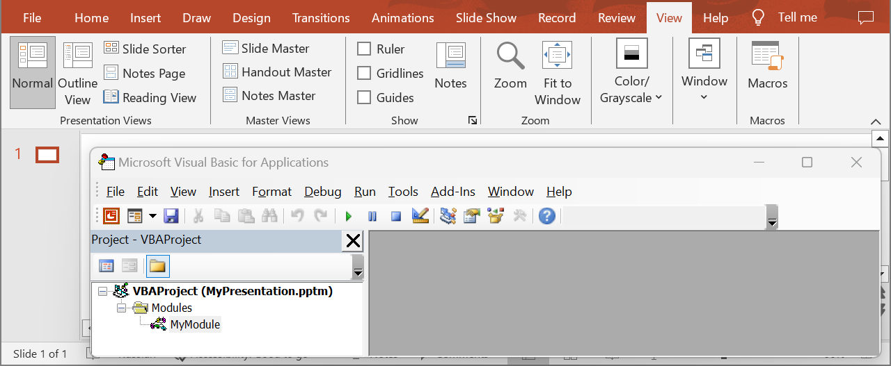

## **Introduction**

VBA projects in PowerPoint allow users to create complex automations and customizations for presentations. These projects can include various modules, forms, and classes that work together to perform specific tasks. Use the following method to get a VBA project from a presentation.

## **GetVbaProject**

### **API Information**

|**API**|**Type**|**Description**|**Resource**|
| :- | :- | :- | :- |
|/slides/{name}/vbaProject|GET|Returns a VBA project from a presentation saved in a storage.|[GetVbaProject](https://reference.aspose.cloud/slides/#/Vba/GetVbaProject)|

**Request Parameters**

|**Name**|**Type**|**Location**|**Required**|**Description**|
| :- | :- | :- | :- | :- |
|name|string|path|true|The name of a presentation file.|
|password|string|header|false|The password to open the presentation.|
|folder|string|query|false|The path to the folder containing the presentation file.|
|storage|string|query|false|The name of the storage contaning the folder.|

### **Examples**

In the **default** storage, the document **MyPresentation.pptm** contains a VBA project. Get the number of modules in the project.



**cURL Solution**




**Get an Access Token**
```sh
curl -X POST "https://api.aspose.cloud/connect/token" \
     -d "grant_type=client_credentials&client_id=MyClientId&client_secret=MyClientSecret" \
     -H "Content-Type: application/x-www-form-urlencoded"
```

**Get the VBA Project**
```sh
curl -X GET "https://api.aspose.cloud/v3.0/slides/MyPresentation.pptm/vbaProject" \
     -H "authorization: Bearer MyAccessToken"
```




```json
{
  "modules": [
    {
      "href": "https://api.aspose.cloud/v3.0/slides/MyPresentation.pptm/vbaProject/modules/1",
      "relation": "self"
    }
  ],
  "references": [
    {
      "name": "stdole"
    },
    {
      "name": "Office"
    }
  ],
  "selfUri": {
    "href": "https://api.aspose.cloud/v3.0/slides/MyPresentation.pptm/vbaProject",
    "relation": "self"
  }
}
```




**SDK Solutions**




```cs
using System;
using Aspose.Slides.Cloud.Sdk;
using Aspose.Slides.Cloud.Sdk.Model;

class Application
{
    static void Main(string[] args)
    {
        SlidesApi slidesApi = new SlidesApi("MyClientId", "MyClientSecret");

        string fileName = "MyPresentation.pptm";

        VbaProject vbaProject = slidesApi.GetVbaProject(fileName);

        int moduleCount = vbaProject.Modules.Count;
        Console.WriteLine("Number of modules: " + moduleCount); // 1
    }
}
```



```java
import com.aspose.slides.ApiException;
import com.aspose.slides.api.SlidesApi;
import com.aspose.slides.model.VbaProject;

public class Application {
    public static void main(String[] args) throws ApiException {
        SlidesApi slidesApi = new SlidesApi("MyClientId", "MyClientSecret");

        String fileName = "MyPresentation.pptm";

        VbaProject vbaProject = slidesApi.getVbaProject(fileName, null, null, null);

        int moduleCount = vbaProject.getModules().size();
        System.out.println("Number of modules: " + moduleCount); // 1
    }
}
```



```php
use Aspose\Slides\Cloud\Sdk\Api\Configuration;
use Aspose\Slides\Cloud\Sdk\Api\SlidesApi;

$configuration = new Configuration();
$configuration->setAppSid("MyClientId");
$configuration->setAppKey("MyClientSecret");

$slidesApi = new SlidesApi(null, $configuration);

$fileName = "MyPresentation.pptm";

$vbaProject = $slidesApi->getVbaProject($fileName);

$moduleCount = count($vbaProject->getModules());
print("Number of modules: " . $moduleCount); // 1
```



```rb
require "aspose_slides_cloud"

include AsposeSlidesCloud

configuration = Configuration.new
configuration.app_sid = "MyClientId"
configuration.app_key = "MyClientSecret"

slides_api = SlidesApi.new(configuration)

file_name = "MyPresentation.pptm"

vba_project = slides_api.get_vba_project(file_name)

module_count = vba_project.modules.length()
puts("Number of modules: #{module_count}") # 1
```



```py
from asposeslidescloud.apis import SlidesApi

slides_api = SlidesApi(None, "MyClientId", "MyClientSecret")

file_name = "MyPresentation.pptm"

vba_project = slides_api.get_vba_project(file_name)

module_count = len(vba_project.modules)
print("Number of modules:", module_count)  # 1
```



```js
const cloudSdk = require("asposeslidescloud");

const slidesApi = new cloudSdk.SlidesApi("MyClientId", "MyClientSecret");

fileName = "MyPresentation.pptm";

slidesApi.getVbaProject(fileName).then(vbaProject => {
    moduleCount = vbaProject.body.modules.length;
    console.log("Number of modules:", moduleCount); // 1
});
```



```go
import (
	"fmt"

	asposeslidescloud "github.com/aspose-slides-cloud/aspose-slides-cloud-go/v24"
)

func main() {
	configuration := asposeslidescloud.NewConfiguration()
	configuration.AppSid = "MyClientId"
	configuration.AppKey = "MyClientSecret"

	slidesApi := asposeslidescloud.NewAPIClient(configuration).SlidesApi

	fileName := "MyPresentation.pptm"

	vbaProject, _, _ := slidesApi.GetVbaProject(fileName, "", "", "")

	moduleCount := len(vbaProject.GetModules())
	fmt.Println("Number of modules:", moduleCount) // 1
}
```



```cpp
#include "asposeslidescloud/api/SlidesApi.h"

using namespace asposeslidescloud::api;

int main()
{
    std::shared_ptr<SlidesApi> slidesApi = std::make_shared<SlidesApi>(L"MyClientId", L"MyClientSecret");

    const wchar_t* fileName = L"MyPresentation.pptm";

    std::shared_ptr<VbaProject> vbaProject = slidesApi->getVbaProject(fileName).get();

    int moduleCount = vbaProject->getModules().size();
    std::wcout << L"Number of modules: " << moduleCount; // 1
}
```



```pl
use AsposeSlidesCloud::Configuration;
use AsposeSlidesCloud::SlidesApi;

my $configuration = AsposeSlidesCloud::Configuration->new();
$configuration->{app_sid} = "MyClientId";
$configuration->{app_key} = "MyClientSecret";

my $slides_api = AsposeSlidesCloud::SlidesApi->new(config => $configuration);

my $vba_project = $slides_api->get_vba_project(
    name => "MyPresentation.pptm");

my $module_count = @{$vba_project->{modules}};
print "Number of modules: ", $module_count; # 1
```




## **SDKs**

Check [Available SDKs](/slides/available-sdks/) to learn how to add an SDK to your project.
