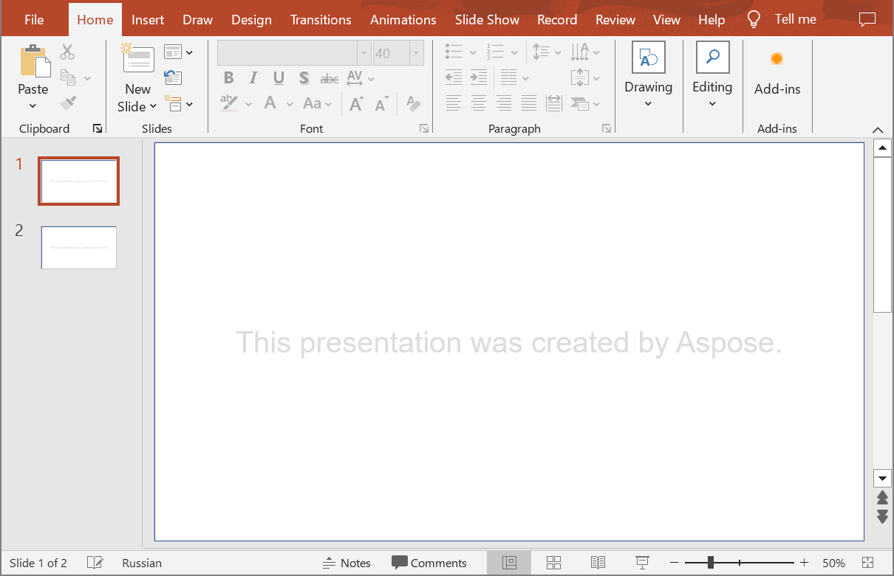
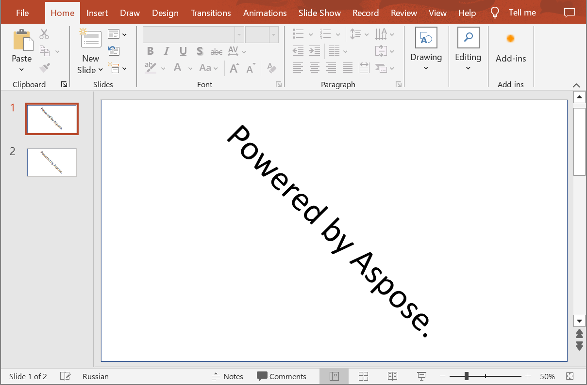

## **Introduction**

Using Aspose.Slides Cloud API, you have the capability to incorporate a text watermark into your slides within a PowerPoint presentation to serve a multitude of purposes. These purposes may include asserting authorship, developing a distinctive corporate presentation style, or designating the confidential nature of information. The watermark, in most cases, is a composition of either text or an image strategically positioned either in the background or foreground of the slide, and often has low transparency.

The following methods are for adding text watermarks to your presentation slides. You can specify many options for a watermark such as font height, font name, font color, text rotation, 3D effects, and many more.

{} 
The watermark shapes added to PowerPoint presentations are automatically named "watermark".
{} 

## **CreateWatermark**

### **API Information**

|**API**|**Type**|**Description**|**Resource**|
| :- | :- | :- | :- |
|/slides/{name}/watermark|POST|Adds a text watermark to each slide of the presentation saved to storage.|[CreateWatermark](https://reference.aspose.cloud/slides/#/Watermark/CreateWatermark)|

**Request Parameters**

|**Name**|**Type**|**Location**|**Required**|**Description**|
| :- | :- | :- | :- | :- |
|name|string|path|true|The presentation file name.|
|shape|`Shape`|body|false|The data transfer object with shape properties.|
|fontHeight|double|query|false|The font size for the text.|
|text|string|query|false|The watermark text.|
|fontName|string|query|false|The font name for the text.|
|fontColor|string|query|false|The font color for the text.|
|password|string|header|false|The password to open the presentation.|
|folder|string|query|false|The folder where the presentation file is located.|
|storage|string|query|false|The storage where the presentation file is located.|

*In case of Amazon S3 storage folder path starts with Amazon S3 bucket name.*

### **Examples**

Add a text watermark with the following options to slides in the **MyPresentation.pptx** document saved to the storage:
- text: "This presentation was created by Aspose."
- font name: Arial
- font height: 40 pt
- font color: #dddddd

**SDK Solutions**





```csharp
using Aspose.Slides.Cloud.Sdk;

class Application
{
    static void Main(string[] args)
    {
        var slidesApi = new SlidesApi("MyClientId", "MyClientSecret");

        var fileName = "MyPresentation.pptx";
        var watermarkText = "This presentation was created by Aspose.";
        var fontName = "Arial";
        var fontHeight = 40;
        var fontColor = "#dddddd";

        slidesApi.CreateWatermark(fileName, null, fontHeight, watermarkText, fontName, fontColor);
    }
}
```





```java
import com.aspose.slides.api.SlidesApi;
import com.aspose.slides.ApiException;

public class Application {
    public static void main(String[] args) throws ApiException {
        SlidesApi slidesApi = new SlidesApi("MyClientId", "MyClientSecret");

        String fileName = "MyPresentation.pptx";
        String watermarkText = "This presentation was created by Aspose.";
        String fontName = "Arial";
        double fontHeight = 40d;
        String fontColor = "#dddddd";

        slidesApi.createWatermark(fileName, null, fontHeight, watermarkText, fontName, fontColor, null, null, null);
    }
}
```





```php
use Aspose\Slides\Cloud\Sdk\Api\Configuration;
use Aspose\Slides\Cloud\Sdk\Api\SlidesApi;

$configuration = new Configuration();
$configuration->setAppSid("MyClientId");
$configuration->setAppKey("MyClientSecret");

$slidesApi = new SlidesApi(null, $configuration);

$fileName = "MyPresentation.pptx";
$watermarkText = "This presentation was created by Aspose.";
$fontName = "Arial";
$fontHeight = 40;
$fontColor = "#dddddd";

$slidesApi->createWatermark($fileName, null, $fontHeight, $watermarkText, $fontName, $fontColor);
```





```ruby
require "aspose_slides_cloud"

include AsposeSlidesCloud

configuration = Configuration.new
configuration.app_sid = "MyClientId"
configuration.app_key = "MyClientSecret"

slides_api = SlidesApi.new(configuration)

file_name = "MyPresentation.pptx"
watermark_text = "This presentation was created by Aspose."
font_name = "Arial"
font_height = 40
font_color = "#dddddd"

slides_api.create_watermark(file_name, nil, font_height, watermark_text, font_name, font_color)
```





```python
import asposeslidescloud

from asposeslidescloud.apis.slides_api import SlidesApi

slides_api = SlidesApi(None, "MyClientId", "MyClientSecret")

file_name = "MyPresentation.pptx"
watermark_text = "This presentation was created by Aspose."
font_name = "Arial"
font_height = 40
font_color = "#dddddd"

slides_api.create_watermark(file_name, None, font_height, watermark_text, font_name, font_color)
```





```js
const cloud = require("asposeslidescloud");

const slidesApi = new cloud.SlidesApi("MyClientId", "MyClientSecret");

const fileName = "MyPresentation.pptx";
const watermarkText = "This presentation was created by Aspose.";
const fontName = "Arial";
const fontHeight = 40;
const fontColor = "#dddddd";

slidesApi.createWatermark(fileName, null, fontHeight, watermarkText, fontName, fontColor);
```





```cpp
#include "asposeslidescloud/api/SlidesApi.h"

using namespace asposeslidescloud::api;

int main()
{
    auto slidesApi = std::make_shared<SlidesApi>(L"MyClientId", L"MyClientSecret");

    auto fileName = L"MyPresentation.pptx";
    auto watermarkText = L"This presentation was created by Aspose.";
    auto fontName = L"Arial";
    auto fontHeight = 40;
    auto fontColor = L"#dddddd";

    slidesApi->createWatermark(fileName, NULL, fontHeight, watermarkText, fontName, fontColor).get();
}
```





```perl
use AsposeSlidesCloud::Configuration;
use AsposeSlidesCloud::SlidesApi;

my $config = AsposeSlidesCloud::Configuration->new();
$config->{app_sid} = "MyClientId";
$config->{app_key} = "MyClientSecret";

my $slides_api = AsposeSlidesCloud::SlidesApi->new(config => $config);

my $file_name = "MyPresentation.pptx";
my $watermark_text = "This presentation was created by Aspose.";
my $font_name = "Arial";
my $font_height = 40;
my $font_color = "#dddddd";

my %parameters = (name => $file_name, text => $watermark_text, font_name => $font_name, font_height => $font_height, font_color => $font_color);
$slides_api->create_watermark(%parameters);
```













**Result:**



## **CreateWatermarkOnline**

### **API Information**

|**API**|**Type**|**Description**|**Resource**|
| :- | :- | :- | :- |
|/slides/watermark|POST|Adds a text watermark to each slide of the presentation saved to a local file.|[CreateWatermarkOnline](https://reference.aspose.cloud/slides/#/Watermark/CreateWatermarkOnline)|

**Request Parameters**

|**Name**|**Type**|**Location**|**Required**|**Description**|
| :- | :- | :- | :- | :- |
|document|file|form data|true|The presentation file.|
|shape|`Shape`|body|false|The data transfer object with shape properties.|
|fontHeight|double|query|false|The font size for the text.|
|text|string|query|false|The watermark text.|
|fontName|string|query|false|The font name for the text.|
|fontColor|string|query|false|The font color for the text.|
|password|string|header|false|The password to open the presentation.|

*In case of Amazon S3 storage folder path starts with Amazon S3 bucket name.*

### **Examples**

Add a text watermark with the following options to slides in the **input.pptx** document saved to a local file:
- text: "Powered by Aspose."
- text rotation: 45°

**SDK Solutions**





```csharp
using System.IO;
using Aspose.Slides.Cloud.Sdk;
using Aspose.Slides.Cloud.Sdk.Model;

class Application
{
    static void Main(string[] args)
    {
        var slidesApi = new SlidesApi("MyClientId", "MyClientSecret");

        var inputFilePath = "input.pptx";
        var outputFilePath = "output.pptx";

        var shape = new Shape
        {
            Text = "Powered by Aspose.",
            TextFrameFormat = new TextFrameFormat
            {
                RotationAngle = 45
            }
        };

        using var inputStream = File.OpenRead(inputFilePath);
        using var outputStream = slidesApi.CreateWatermarkOnline(inputStream, shape);

        using var fileStream = File.OpenWrite(outputFilePath);
        outputStream.CopyTo(fileStream);
    }
}
```





```java
import java.io.IOException;
import java.nio.file.Files;
import java.nio.file.Paths;

import com.aspose.slides.ApiException;
import com.aspose.slides.api.SlidesApi;
import com.aspose.slides.model.*;

public class Application {
    public static void main(String[] args) throws ApiException, IOException {
        SlidesApi slidesApi = new SlidesApi("MyClientId", "MyClientSecret");

        String inputFilePath = "input.pptx";

        Shape shape = new Shape();
        shape.setText("Powered by Aspose.");
        shape.setTextFrameFormat(new TextFrameFormat());
        shape.getTextFrameFormat().setRotationAngle(45d);

        byte[] inputData = Files.readAllBytes(Paths.get(inputFilePath));
        File outputFile = slidesApi.createWatermarkOnline(inputData, shape, null, null, null, null, null);

        System.out.println("The output file was saved to " + outputFile.getPath());
    }
}
```





```php
use Aspose\Slides\Cloud\Sdk\Api\Configuration;
use Aspose\Slides\Cloud\Sdk\Api\SlidesApi;
use Aspose\Slides\Cloud\Sdk\Model\Shape;
use Aspose\Slides\Cloud\Sdk\Model\TextFrameFormat;

$configuration = new Configuration();
$configuration->setAppSid("MyClientId");
$configuration->setAppKey("MyClientSecret");

$slidesApi = new SlidesApi(null, $configuration);

$inputFilePath = "input.pptx";

$shape = new Shape();
$shape->setText("Powered by Aspose.");
$shape->setTextFrameFormat(new TextFrameFormat());
$shape->getTextFrameFormat()->setRotationAngle(45);

$inputStream = fopen($inputFilePath, "r");
$outputFile = $slidesApi->createWatermarkOnline($inputStream, $shape);

print("The output file was saved to " . $outputFile->getPathname());
```





```ruby
require "aspose_slides_cloud"

include AsposeSlidesCloud

configuration = Configuration.new
configuration.app_sid = "MyClientId"
configuration.app_key = "MyClientSecret"

slides_api = SlidesApi.new(configuration)

input_file_path = "input.pptx"
output_file_path = "output.pptx"

shape = Shape.new
shape.text = "Powered by Aspose."
shape.text_frame_format = TextFrameFormat.new
shape.text_frame_format.rotation_angle = 45

input_data = File.binread(input_file_path)
output_data = slides_api.create_watermark_online(input_data, shape)

File.binwrite(output_file_path, output_data)
```





```python
import asposeslidescloud

from asposeslidescloud.apis.slides_api import SlidesApi
from asposeslidescloud.models import Shape, TextFrameFormat

slides_api = SlidesApi(None, "MyClientId", "MyClientSecret")

input_file_path = "input.pptx"

shape = Shape()
shape.text = "Powered by Aspose."
shape.text_frame_format = TextFrameFormat()
shape.text_frame_format.rotation_angle = 45

with open(input_file_path, "rb") as input_stream:
    output_file_path = slides_api.create_watermark_online(input_stream, shape)

print("The output file was saved to " + output_file_path)
```





```js
const cloud = require("asposeslidescloud");
const fs = require("fs");

const slidesApi = new cloud.SlidesApi("MyClientId", "MyClientSecret");

const inputFilePath = "input.pptx";
const outputFilePath = "output.pptx";

const shape = new cloud.Shape();
shape.text = "Powered by Aspose.";
shape.textFrameFormat = new cloud.TextFrameFormat();
shape.textFrameFormat.rotationAngle = 45;

const inputStream = fs.createReadStream(inputFilePath);
slidesApi.createWatermarkOnline(inputStream, shape).then(response => {
    fs.writeFile(outputFilePath, response.body, error => {
        if (error) throw error
    });
});
```





```cpp
#include "asposeslidescloud/api/SlidesApi.h"

using namespace asposeslidescloud::api;

int main()
{
    auto slidesApi = std::make_shared<SlidesApi>(L"MyClientId", L"MyClientSecret");

    auto inputFilePath = L"input.pptx";
    auto outputFilePath = L"output.pptx";

    auto shape = std::make_shared<Shape>();
    shape->setText(L"Powered by Aspose.");
    shape->setTextFrameFormat(std::make_shared<TextFrameFormat>());
    shape->getTextFrameFormat()->setRotationAngle(45);

    auto inputStream = std::make_shared<std::ifstream>(inputFilePath, std::ios::binary);
    auto inputContent = std::make_shared<HttpContent>();
    inputContent->setData(inputStream);

    auto outputContent = slidesApi->createWatermarkOnline(inputContent, shape).get();

    std::ofstream outputStream(outputFilePath, std::ofstream::binary);
    outputContent.writeTo(outputStream);
}
```





```perl
use File::Slurp;

use AsposeSlidesCloud::Configuration;
use AsposeSlidesCloud::SlidesApi;
use AsposeSlidesCloud::Object::Shape;
use AsposeSlidesCloud::Object::TextFrameFormat;

my $config = AsposeSlidesCloud::Configuration->new();
$config->{app_sid} = "MyClientId";
$config->{app_key} = "MyClientSecret";

my $slides_api = AsposeSlidesCloud::SlidesApi->new(config => $config);

my $input_file_path = "input.pptx";
my $output_file_path = "output.pptx";

my $shape = AsposeSlidesCloud::Object::Shape->new();
$shape->{text} = "Powered by Aspose.";
$shape->{text_frame_format} = AsposeSlidesCloud::Object::TextFrameFormat->new();
$shape->{text_frame_format}->{rotation_angle} = 45;

my $input_data = read_file($input_file_path, { binmode => ":raw" });
my %parameters = (document => $input_data, shape => $shape);
my $output_data = $slides_api->create_watermark_online(%parameters);

write_file($output_file_path, {binmode => ":raw"}, $output_data);
```













**Result:**



## **SDKs**

Check [Available SDKs](/slides/available-sdks/) to learn how to add an SDK to your project.
