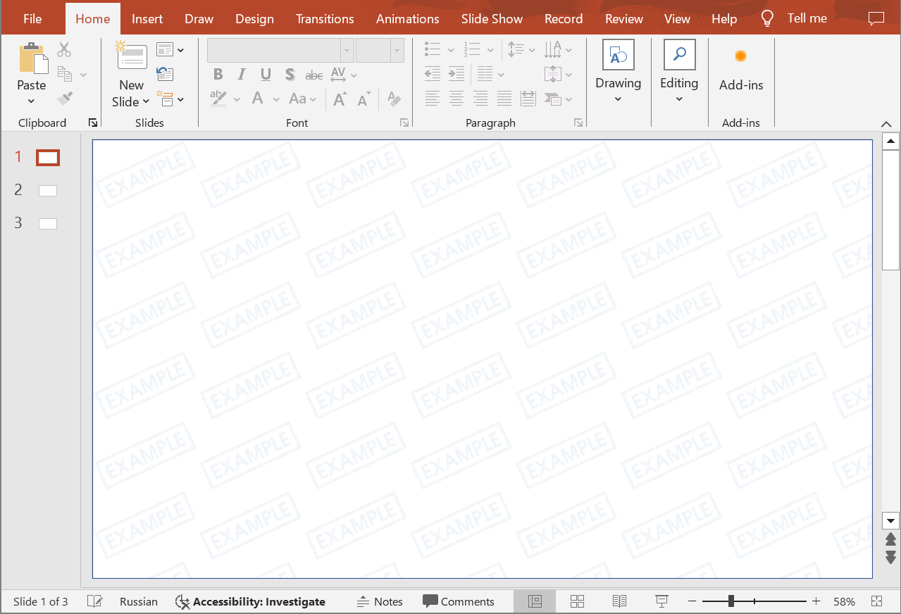

## **Introduction**

A watermark in the form of an image is a special graphical element added to PowerPoint slides for various purposes, such as protecting copyright, establishing a corporate identity, or giving a document a unique character. This element is typically transparent and positioned on top of the slide content, allowing it to be visible without completely obstructing the underlying content. Use the following methods to add image watermarks to presentation slides.

{} 
The watermark shapes added to PowerPoint presentations are automatically named "watermark".
{} 

## **CreateImageWatermark**

### **API Information**

|**API**|**Type**|**Description**|**Resource**|
| :- | :- | :- | :- |
|/slides/{name}/watermark/image|POST|Adds an image watermark to each slide of a presentation saved in a storage.|[CreateImageWatermark](https://reference.aspose.cloud/slides/#/Watermark/CreateImageWatermark)|

**Request Parameters**

|**Name**|**Type**|**Location**|**Required**|**Description**|
| :- | :- | :- | :- | :- |
|name|string|path|true|The name of a presentation file saved in a storage.|
|image|file|formData|false|The image file.|
|pictureFrame|`PictureFrame`|body|false|The data transfer object with image properties.|
|password|string|header|false|The password to open the presentation.|
|folder|string|query|false|The folder where the presentation file is located.|
|storage|string|query|false|The storage where the folder is located.|

### **Examples**

Use the **MyWatermark.jpg** file to add a watermark image to slides in the **MyPresentation.pptx** document saved in the **default** storage. Use the **Tile** mode to fill entire slides with the watermarks.

**SDK Solutions**





```csharp
using System;
using System.IO;

using Aspose.Slides.Cloud.Sdk;
using Aspose.Slides.Cloud.Sdk.Model;

class Application
{
    static void Main(string[] args)
    {
        SlidesApi slidesApi = new SlidesApi("MyClientId", "MyClientSecret");

        string documentName = "MyPresentation.pptx";
        string imageFilePath = "MyImage.png"; // the path to a local file

        byte[] imageData = File.ReadAllBytes(imageFilePath);

        PictureFrame pictureFrame = new PictureFrame
        {
            X = 0,
            Y = 0,
            Width = 960,
            Height = 540,
            PictureFillFormat = new PictureFill
            {
                Base64Data = Convert.ToBase64String(imageData),
                PictureFillMode = PictureFill.PictureFillModeEnum.Tile,
            }
        };

        slidesApi.CreateImageWatermark(documentName, null, pictureFrame);
    }
}
```





```java
import com.aspose.slides.ApiException;
import com.aspose.slides.api.SlidesApi;
import com.aspose.slides.model.PictureFrame;
import com.aspose.slides.model.PictureFill;

import java.io.IOException;
import java.nio.file.Files;
import java.nio.file.Paths;
import java.util.Base64;

public class Application {
    public static void main(String[] args) throws ApiException, IOException {
        SlidesApi slidesApi = new SlidesApi("MyClientId", "MyClientSecret");

        String documentName = "MyPresentation.pptx";
        String imageFilePath = "MyImage.png"; // the path to a local file

        byte[] imageData = Files.readAllBytes(Paths.get(imageFilePath));

        PictureFrame pictureFrame = new PictureFrame();
        pictureFrame.setX(0d);
        pictureFrame.setY(0d);
        pictureFrame.setWidth(960d);
        pictureFrame.setHeight(540d);
        pictureFrame.setPictureFillFormat(new PictureFill());
        pictureFrame.getPictureFillFormat().setBase64Data(Base64.getEncoder().encodeToString(imageData));
        pictureFrame.getPictureFillFormat().setPictureFillMode(PictureFill.PictureFillModeEnum.TILE);

        slidesApi.createImageWatermark(documentName, null, pictureFrame, null, null, null);
    }
}
```





```php
use Aspose\Slides\Cloud\Sdk\Api\Configuration;
use Aspose\Slides\Cloud\Sdk\Api\SlidesApi;
use Aspose\Slides\Cloud\Sdk\Model\PictureFrame;
use Aspose\Slides\Cloud\Sdk\Model\PictureFill;

$configuration = new Configuration();
$configuration->setAppSid("MyClientId");
$configuration->setAppKey("MyClientSecret");

$slidesApi = new SlidesApi(null, $configuration);

$documentName = "MyPresentation.pptx";
$imageFilePath = "MyImage.png"; // the path to a local file

$imageData = file_get_contents($imageFilePath);

$pictureFrame = new PictureFrame();
$pictureFrame->setX(0);
$pictureFrame->setY(0);
$pictureFrame->setWidth(960);
$pictureFrame->setHeight(540);
$pictureFrame->setPictureFillFormat(new PictureFill());
$pictureFrame->getPictureFillFormat()->setBase64Data(base64_encode($imageData));
$pictureFrame->getPictureFillFormat()->setPictureFillMode("Tile");

$slidesApi->createImageWatermark($documentName, null, $pictureFrame);
```





```ruby
require "base64"
require "aspose_slides_cloud"

include AsposeSlidesCloud

configuration = Configuration.new
configuration.app_sid = "MyClientId"
configuration.app_key = "MyClientSecret"

slides_api = SlidesApi.new(configuration)

document_name = "MyPresentation.pptx"
image_file_path = "MyImage.png" # the path to a local file

image_data = File.binread(image_file_path)

picture_frame = PictureFrame.new
picture_frame.x = 0
picture_frame.y = 0
picture_frame.width = 960
picture_frame.height = 540
picture_frame.picture_fill_format = PictureFill.new
picture_frame.picture_fill_format.base64_data = Base64.encode64(image_data)
picture_frame.picture_fill_format.picture_fill_mode = "Tile"

slides_api.create_image_watermark(document_name, nil, picture_frame)
```





```python
import base64

from asposeslidescloud.apis.slides_api import SlidesApi
from asposeslidescloud.models.picture_frame import PictureFrame
from asposeslidescloud.models.picture_fill import PictureFill

slides_api = SlidesApi(None, "MyClientId", "MyClientSecret")

document_name = "MyPresentation.pptx"
image_file_path = "MyImage.png"  # the path to a local file

with open(image_file_path, "rb") as image_stream:
    image_base64_data = str(base64.b64encode(image_stream.read()), "utf-8")

picture_frame = PictureFrame()
picture_frame.x = 0
picture_frame.y = 0
picture_frame.width = 960
picture_frame.height = 540
picture_frame.picture_fill_format = PictureFill()
picture_frame.picture_fill_format.base64_data = image_base64_data
picture_frame.picture_fill_format.picture_fill_mode = "Tile"

slides_api.create_image_watermark(document_name, None, picture_frame)
```





```js
const fs = require("fs");
const cloudSdk = require("asposeslidescloud");

const slidesApi = new cloudSdk.SlidesApi("MyClientId", "MyClientSecret");

documentName = "MyPresentation.pptx";
imageFilePath = "MyImage.png"; // the path to a local file

imageBase64Data = fs.readFileSync(imageFilePath, { encoding: "base64" });

pictureFrame = new cloudSdk.PictureFrame();
pictureFrame.x = 0;
pictureFrame.y = 0;
pictureFrame.width = 960;
pictureFrame.height = 540;
pictureFrame.pictureFillFormat = new cloudSdk.PictureFill();
pictureFrame.pictureFillFormat.base64Data = imageBase64Data;
pictureFrame.pictureFillFormat.pictureFillMode = cloudSdk.PictureFill.PictureFillModeEnum.Tile;

slidesApi.createImageWatermark(documentName, null, pictureFrame).then(() => {
    console.log("Done.");
});
```









```perl
use File::Slurp;
use MIME::Base64;

use AsposeSlidesCloud::Configuration;
use AsposeSlidesCloud::SlidesApi;
use AsposeSlidesCloud::Object::PictureFrame;
use AsposeSlidesCloud::Object::PictureFill;

my $config = AsposeSlidesCloud::Configuration->new();
$config->{app_sid} = "MyClientId";
$config->{app_key} = "MyClientSecret";

my $slides_api = AsposeSlidesCloud::SlidesApi->new(config => $config);

my $document_name = "MyPresentation.pptx";
my $image_file_path = "MyImage.png"; # the path to a local file

my $image_data = read_file($image_file_path, { binmode => ":raw" });

my $picture_frame = AsposeSlidesCloud::Object::PictureFrame->new();
$picture_frame->{x} = 0;
$picture_frame->{y} = 0;
$picture_frame->{width} = 960;
$picture_frame->{height} = 540;
$picture_frame->{picture_fill_format} = AsposeSlidesCloud::Object::PictureFill->new();
$picture_frame->{picture_fill_format}->{base64_data} = encode_base64($image_data);
$picture_frame->{picture_fill_format}->{picture_fill_mode} = "Tile";

$slides_api->create_image_watermark(name => $document_name, picture_frame => $picture_frame);
```













The result:



## **CreateImageWatermarkOnline**

### **API Information**

|**API**|**Type**|**Description**|**Resource**|
| :- | :- | :- | :- |
|/slides/watermark/image|POST|Adds an image watermark to each slide of a presentation saved in a local file.|[CreateImageWatermarkOnline](https://reference.aspose.cloud/slides/#/Watermark/CreateImageWatermarkOnline)|

**Request Parameters**

|**Name**|**Type**|**Location**|**Required**|**Description**|
| :- | :- | :- | :- | :- |
|document|file|formData|true|The presentation file.|
|image|file|formData|false|The image file.|
|pictureFrame|`PictureFrame`|body|false|The data transfer object with image properties.|
|password|string|header|false|The password to open the presentation.|

## **SDKs**

Check [Available SDKs](/slides/available-sdks/) to learn how to add an SDK to your project.
